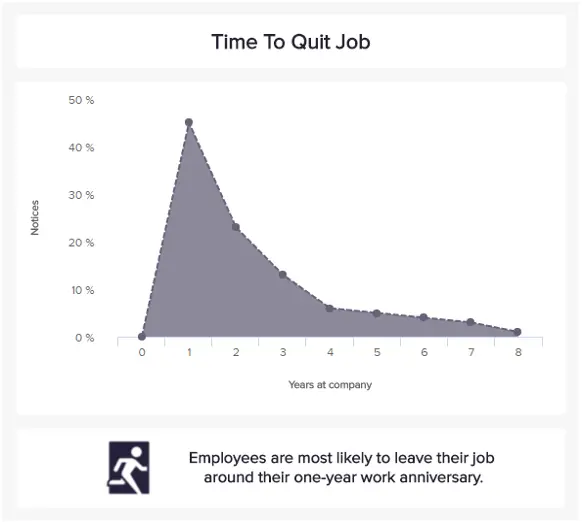
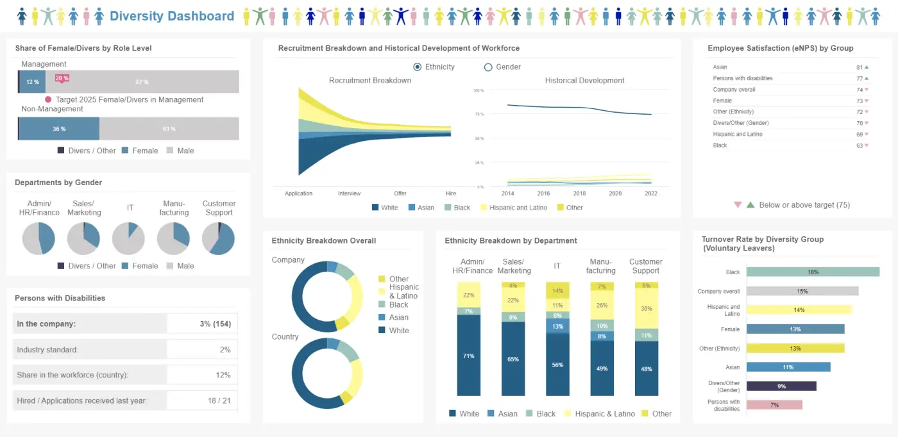
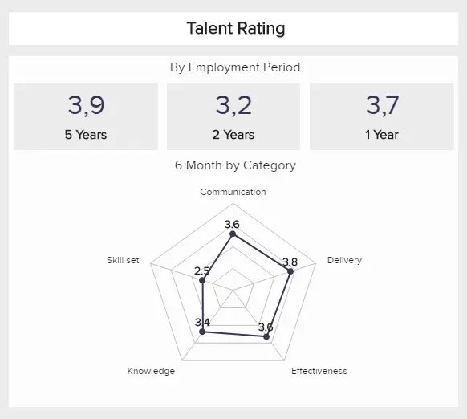
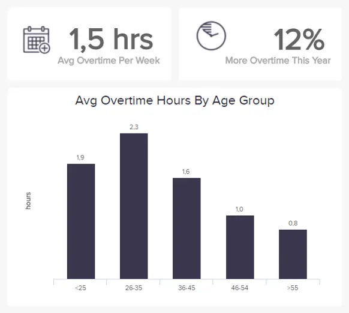

目录

[1） 什么是人力资源报告？](https://www.datafocus.ai/infos/weekly-monthly-annual-hr-report-templates-to-empower-your-management#definition)

[2） 人力资源报告的类型](https://www.datafocus.ai/infos/weekly-monthly-annual-hr-report-templates-to-empower-your-management#types)

[3） 人力资源报告示例和模板](https://www.datafocus.ai/infos/weekly-monthly-annual-hr-report-templates-to-empower-your-management#examples)

[4） 为什么需要人力资源报告？](https://www.datafocus.ai/infos/weekly-monthly-annual-hr-report-templates-to-empower-your-management#benefits)

[5） 人力资源报告的最佳实践](https://www.datafocus.ai/infos/weekly-monthly-annual-hr-report-templates-to-empower-your-management#best-practices)

无论您是否意识到，您的人力资源 （HR） 部门都是您组织中最关键的部门之一。如果进行战略性管理，您的人力资源部门可以通过多种方式增强您的业务。此外，交互式人力资源仪表板模板为企业提供了更好地了解其人员、发现新出现的问题或问题以及部署主动解决方案以更流畅、以结果为导向的方式管理其[人力资源](https://www.datafocus.ai/infos/dashboard-examples-and-templates-human-resources)部门的方法。

此外，通过[人力资源分析工具](https://www.datafocus.ai/infos/business-intelligence-human-resources)进行频繁报告有助于公司维护其企业文化，吸引和留住员工，并为他们提供宝贵的知识，同时提供发挥最大潜力的精明能力。

 

在当今高度互联的数字世界中，成为有效的数据驱动型组织的一部分是通过集成的、以人力资源为中心的 BI 仪表板智能应用数据分析。通过利用人力资源 KPI（使企业能够跟踪人力资源相关数据的非常具体领域的衡量标准），像您这样的公司可以持续不断地提高其[人力资源](https://www.datafocus.ai/infos/kpi-examples-and-templates-human-resources)能力。

无论公司规模如何，管理层和团队成员的报告都是任何希望在我们残酷的市场中取得竞争优势的企业的关键部分。

也就是说，在本文中，我们将考虑人力资源报告是什么，它们的作用，并在专业仪表板的帮助下探索它们在现代的价值。您不仅可以全面了解 HR 分析报告的工作原理，还可以更深入地了解现实世界业务环境中的 HR 数据驱动的[在线仪表板](https://www.datafocus.ai/infos/online-dashboard)。

您的机会：[想完全免费地测试人力资源报告软件吗？](https://www.datafocus.ai/console/)我们提供 14 天免费试用。立即开始创建出色的人力资源报告！

## 什么是人力资源报告？

从根本上说，人力资源报告是一种分析方法，用于显示与人力资源相关的统计数据、见解和指标，其主要目的是借助人力资源仪表板改善劳动力绩效、招聘程序和其他相关人力资源流程。

[有各种各样的 KPI 示例](https://www.datafocus.ai/infos/kpi-examples-and-templates)，但通过使用 HR 驱动的指标，可以发现趋势、识别效率低下、利用优势并加强许多关键领域的弱点，使您的 HR 工作、活动和计划对整个组织的部门来说可能是最好的。

人力资源变得越来越重要，报告部分不仅在帮助专业人士提取最佳见解方面至关重要，而且在自动化传统上手动执行的流程方面也至关重要。为了正确看待事情，我们将重点关注人力资源报告的主要类型，这些报告从不同角度研究数据，并讲述使用现代[仪表板设计器](https://www.datafocus.ai/infos/dashboard-designer)创建的特定人力资源叙述。

## 人力资源报告有哪些不同类型？

如前所述，人力资源部门正在处理各种业务角度，最终有助于成功管理人员和增加劳动力价值。招聘报告将侧重于外部和/或内部候选人，而人才管理将分析组织处理和管理现有员工和人才的方式。在这里，我们将介绍其中一些不同类型的人力资源报告。

- 员工信息报告：这里涵盖的最直接但最基本的类型之一是员工信息报告。这些文件为人力资源团队提供了有关公司员工的所有管理数据。这包括我们将在本节中提到的其他类型的相关信息，例如员工人口统计、在职员工人数、收入、男女配给和满意度等。这些见解使管理人员能够比较不同部门的数据，并详细了解整个组织的一般劳动力管理。

- 招聘报告： 顾名思义，这是一份文件，允许人力资源经理跟踪与其招聘和招聘流程相关的每个细节。它们可以包括基本指标，例如平均招聘时间、每次招聘成本，甚至招聘流程的多样性。跟踪这些详细信息非常重要，因为它们可以帮助您优化招聘策略并加快流程，以快速找到每个空缺职位的最佳候选人。我们将在帖子后面看一下此类工具的交互式示例。

- 人力资源绩效管理报告：监控员工绩效是任何人力资源经理的基本任务，因为它提供了所需的洞察力，以确保企业以最佳能力运行。为了协助这一过程，人力资源管理报告提供了基本指标，以了解您的员工的表现，并发现任何改进机会，例如培训或帮助的运气。您可以在这些[类型的报告](https://www.datafocus.ai/infos/types-of-reports-examples)中找到一些指标，包括提高生产力的时间、同行评审、工作小时数和培训成本等。可以在部门、团队或个人级别跟踪员工绩效。例如，如果销售额下降，人力资源部门可能会分析销售团队的发展，以了解那里是否缺少某些东西。

- 出勤和缺勤报告：下一种类型与我们上面讨论的类型直接相关 - 因为出勤或缺勤会直接影响生产力。跟踪缺勤发生多少、何时发生以及导致缺勤的原因是非常重要的一步，不仅可以确保最佳生产力，还可以确保您的员工满意。例如，您可以观察到缺勤率与压力有关，这是需要通过为需要它的人提供支持来立即解决的问题。另一方面，跟踪这些比率还可以帮助您预测平均缺勤成本，这可能是带薪休假的货币成本或一般生产力的损失。

- 多元化报告：雇用多元化的员工队伍已成为当今商业环境的基础。如今，越来越多的公司确保雇用多元化的员工，这不仅是为了遵守法规，还因为多元化的环境可以为组织带来价值。为此，多元化报告允许人力资源经理监控其组织在性别、种族和残疾等领域的多元化程度。使用此工具，他们可以找到以下问题的答案：我们的管理职位是否足够多样化？我们多元化的员工对公司满意吗？我们是否为所有员工提供相同的机会？

- 人员流动和保留报告：员工满意度应该是任何组织的优先事项。最后，我们的员工将推动公司向前发展，因此，确保我们为他们提供最好的环境和机会以让他们满意非常重要。在这一点上，人员流动和保留报告是一份文件，用于跟踪有多少员工离职，以及与他们离职相关的成本或留住他们的努力。这些成本可能包括生产力损失和更换等任何成本。除此之外，通过查看离职率，您还可以发现可以解决的内部问题，以提高满意度和保留率。

- 工资和薪酬报告：虽然看起来所有与工资相关的信息都与财务部门有关，但它也是人力资源团队需要管理的基本信息。这些报告包括所有工资信息以及公司提供的任何其他薪酬，例如保险、养老金计划和奖金等。掌握这些信息后，人力资源部门就可以在薪资谈判、资源分配、带薪休假以及为员工实施不同的激励措施时做出明智的决定。

现在我们已经清楚地了解了不同类型的人力资源报告，我们将介绍如何在不同时期出于不同的目的跟踪这些类型。

## 每周、每月和年度报告的人力资源分析示例

我们提到了人力资源绩效报告可以使企业受益的主要领域。如前所述，这些分析工具也可以基于不同的时期。例如，人力资源周报将显示更多的短期目标和指标，而年度报告将考虑更广泛的战略。关键是要成功整合人力资源专业人员收集所需的所有数据，并创建最佳的人力资源管理流程。为了在此过程中为您提供帮助，现代[KPI 软件](https://www.datafocus.ai/infos/kpi-dashboard-software)可以帮助您发现关键问题、节省时间并最终降低成本，使此过程尽可能高效。

为了正确看待这一点，在这里我们将借助现代人力资源仪表板示例来介绍我们上面提到的一些类型，用于年度、每月和每周的人力资源报告。

## 1\. 年度人力资源报告模板和 KPI

人力资源年度报告使公司能够评估每年影响其绩效的人力资源活动，以推动竞争战略，并确定是否需要在您的人力资源环境中采取行动以增加人力资源发展的动力。上述人力资源报告模板也可用于年度监测需要。但是，我们还有其他模板来增强人力资源年度要求。

### a） 员工绩效仪表板

如前所述，您的员工是组织持续成功不可或缺的一部分，您的人力资源部门有责任帮助持续鼓励和优化员工的生产力。

\*\*点击放大\*\*

这个特定的人力资源报告模板有助于形成关键绩效要素的可视化叙述，例如整个组织的缺勤、加班、培训成本和整体员工生产力。反过来，此员工管理示例提供了完美的信息风暴，以保持您的业务尽可能人性化的生产力。这份年度人力资源报告示例深入探讨了劳动力的重要元素及其在许多关键领域的结构。

这些是链接到此特定模板的 KPI：

- 缺勤率：上述人力资源报告示例显示员工绩效。这使企业能够衡量员工的敬业度，并且是一个重要的 KPI，因为它表明员工对他或她的工作和整个公司的积极性和参与度。组织应密切关注此指标，并且必须始终尝试减少该数字，因为会影响生产力。公司可以确定过去一个月员工缺勤率背后的原因，以查看它是否是某个部门独有的，或者它是否是整个组织中普遍存在的问题。
- 加班时间：这使组织能够更详细地跟踪员工的工作量，并显示员工的奉献精神以及工作流程缺陷。该指标直接影响缺勤率指标，长期的高工作量肯定会降低员工满意度，从而导致缺勤率增加。长期的高加班时间会限制公司的增长潜力，同时导致项目或订单缺失。
- 培训成本：这些指标用于计算用于新员工入职和提高员工技能水平的投资。它跟踪员工发展成本和新技能要求。培训成本不仅限于新员工，还延伸到更好的工作发展技能和持续学习。
- 员工生产力：这决定了您的劳动力效率，这是通过将总销售额除以员工人数来计算的。影响此指标的组成部分包括可用性和员工工作小时数、员工绩效、交付的产品数量以及在设定时间段内生产的可销售产品的质量。生产力指标使公司能够了解员工绩效并在适用的情况下调整工作流程。您可以在下面看到一个可视化示例：

### b） 年度劳动力仪表板

我们的管理层人力资源报告样本中的这一特定内容探讨了基于劳动力的一般指标，这些指标将通过更智能、更数据驱动的员工管理来帮助您的业务随着时间的推移而增长、发展和发展：

\*\*点击放大\*\*

此人力资源年度报告模板提供的见解将提供一定程度的见解，以改善您吸引员工的方式，帮助您更好地奖励出色的工作，节省关键领域的成本，并鼓励员工忠诚度——这些都是成功企业的关键要素。

以下是与此示例关联的主要 KPI：

- 兼职员工：表示兼职员工在指定时间段内的演变。兼职工人对公司的开始阶段有好处，不会有太大的风险。KPI 包括跟踪兼职合同，与整体绩效和结果以及员工满意度和敬业度等指标并行。
- 男女比例：衡量企业中的性别多样性水平，这可能表明性别偏见。了解多样性以获得不同的业务创新方法并获得有竞争力的资产至关重要。KPI 取决于候选人在特定时间的可用性。
- 内部流动： 内部流动是指与已经加入公司劳动力队伍的员工的职位的晋升、任命或雇用相关的每一项举措或行动。此内部流动摘要显示了与之相关的各种数字 - 晋升到董事和董事总经理的职位，通过内部举措填补的职位与总职位的比率，最后是内部填补的空缺百分比。
- 平均停留时间：表示员工在公司停留时间最长，以及公司是否善于留住他们。该指标跟踪员工的平均周数、月数或年数。停留时间越长，公司在招聘和培训方面的投资回报就越高。使用专业[KPI工具](https://www.datafocus.ai/infos/kpi-reporting)生成的示例如下所示：

### c） 年度多样性仪表板

我们的下一个示例是使用具有基本指标的现代 BI 仪表板[软件](https://www.datafocus.ai/infos/bi-dashboard-tools)生成的年度多元化仪表板，以帮助人力资源经理确保组织雇用多元化的员工队伍，并通过提供与其他员工平等的机会来让他们满意。

\*\*点击放大\*\*

每天都有越来越多的公司意识到将不同的观点和背景融合成一群创新和富有创造力的人的价值。也就是说，尽管多元化劳动力的价值是不可否认的，但它仍然对一些组织提出了挑战，尤其是在涉及高薪职位时。为了帮助人力资源经理在多元化措施方面走上正确的轨道，此仪表板是完美的工具。让我们更详细地看一下。

- 按角色级别划分的女性/多元化员工比例：这个简单的 KPI 跟踪在管理职位上工作的女性或多元化员工的比例。众所周知，高薪职位通常由白人男性占据，也就是说，当涉及到工作场所的多样性时，人力资源经理需要确保这种情况发生在组织的各个层面。因此，该组织设定了一个目标，即到 2025 年将担任管理职位的女性或多元化工人增加到 20%。
- 按种族/性别招聘：顾名思义，此 KPI 跟踪招聘策略的多样性。在这种情况下，KPI 按招聘流程的各个阶段划分，以了解实际转变为受雇员工的多元化申请人的比例。避免偏见的一个好方法是设置多样性措施，例如标准化面试或使用匿名简历来选择候选人。
- 按部门划分的种族：遵循与前面的指标相同的路线，按部门划分的种族和性别提供了对每个部门多样性的见解。如前所述，一些公司可能是多元化的，但在某些部门仍然存在偏见，例如雇用男性担任制造或IT职位或白人担任行政职位。因此，这是一个需要跟踪的重要指标。
- 多元化组 eNPS：eNPS 也称为员工满意度，是人力资源经理用来评估员工对组织的满意度的指标。在这种情况下，eNPS按多样性群体划分，并与目标75进行比较。不幸的是，各个群体都在这个目标下，因此，需要对其进行研究，以确保每个人都有一个良好的环境。
- 多元化群体的离职率：与eNPS直接相关，多元化群体的离职率告诉人力资源团队多元化群体自愿离职的百分比，它使他们能够了解特定群体是否对组织不满意。在这种情况下，我们可以看到黑人工人的比率高于公司的整体费率。这是一个令人担忧的数字，需要调查以找到原因并立即实施解决方案。

### d） 年度人力资源报告指标示例

我们探索了管理层的人力资源报告以及人力资源年度报告模板的实际运作。现在，我们将研究可以进一步促进您同比人力资源活动的指标。

这些与成本相关的指标还可用于年度人力资源分析报告，以向最高管理层和财务部门显示：

补偿：

- 每个 FTE 的人工成本：公司每年为每个 FTE 花费的平均劳动力费用。
- 人工成本收入百分比：人工总成本占年度营业收入的百分比。
- 人工成本费用百分比：总人工成本占年度总费用的百分比。
- 福利占人工成本的百分比：福利的总成本占年度总劳动力成本的百分比。

您的机会：[想完全免费地测试人力资源报告软件吗？](https://www.datafocus.ai/console/)我们提供 14 天免费试用。立即开始创建出色的人力资源报告！

## 2\. 月度人力资源报告模板和 KPI

月度人力资源报告提供了将企业与新人才联系起来的重要机会，同时了解其现有员工所做贡献的概况。人力资源月度报告以多种方式影响业务成果，从新的招聘和雇用策略到在一个月内衡量效率水平。

在这里，我们将以人力资源报告示例的形式查看[业务报告示例](https://www.datafocus.ai/infos/business-report-examples-and-templates)，该示例侧重于这些特定的、提到的领域。

### a） 每月人才管理仪表板

为了吸引、激励和留住高绩效员工，人才管理仪表板可以帮助人力资源专业人员全面了解正在成为人力资源关键职能的流程。如今，不仅吸引合适的专业知识至关重要，而且通过衡量他们的满意度和离职率以及全面引入评级系统来留住这些员工也至关重要。

\*\*点击放大\*\*

在我们的示例中，我们可以看到重点是按季度计算的，但它也可以作为月度和年度人才管理策略的模板，具体取决于您公司的一般规则和流程。当您需要阐述成本和质疑人才管理策略时，您还可以将其用作提交给董事会的人力资源报告样本。

在仪表板的左上角，我们可以看到员工数量、月薪和职位空缺的简单概述，以及招聘统计数据。这些统计数据可以快速显示您需要进行多少投资才能培训新员工以及您需要多少时间来填补职位。雇用新人时，您总是会遇到成本，但关键是要保持这些成本的可持续性。让我们更详细地查看可视化指标：

- 人才流失率：具体部门的流失率可以告诉您在自愿和非自愿休假方面哪个业务领域需要更多关注。在我们的案例中，我们可以看到财务部门的自愿离职率最高，因此更深入地挖掘原因是有意义的。也许你的竞争对手提供更好的工作条件和薪水，或者他们觉得自己没有适当的成长和进步机会，对他们的工作缺乏认可，等等。
- 被解雇的人才：该指标将显示有多少员工被解雇，由雇佣期描述。在我们的示例中，我们可以看到大多数员工在受雇第一年后就被解雇了。造成这种情况的原因有很多：组织调整、部门裁员、绩效不佳等。如果您发现此百分比逐月增长，您可能需要在招聘过程中更改要求，因为在某些情况下，较高的比率会增加业务成本。
- 人才满意度：如今，让员工保持快乐、敬业和高效非常重要。许多公司在找到合适的候选人方面存在问题，但留住他们是人力资源的另一个挑战部分。在上面的示例中，满意度显示了通过净推荐值 （NPS） 的简单概述。它基于一个简单的问题，即团队向某人（朋友、家人等）推荐您的公司的可能性有多大。如果NPS得到改善，并且员工希望推荐您的公司作为良好的工作场所，您将降低离职率并降低劳动力成本。
- 人才评级：该指标将帮助您开发全面的形象，并确保您根据清晰的数据和员工评级过程的人性化视角（现实世界的反馈谈话）做出决定。在这种情况下，我们可以看到评级按雇佣期和类别划分了更长的时间，但您可以使用此人力资源报告和分析模板来开发每周、每月、每季度和/或每年的评级。下面是一个详细的视觉示例：

### b） 每月招聘仪表板

下面这个无价的人力资源月度报告模板深入探讨了如何获得有助于推动业务发展的新鲜人才。您的员工是可以成就或破坏您的业务的人，这意味着为您的公司雇用合适的人才至关重要。

\*\*点击放大\*\*

此示例有可能将您的组织与特定职位空缺的合适人员相匹配。此外，通过使用目标 KPI 的组合，您还可以使您的招聘流程在成本、时间和营业额方面更加高效。

以下是与此特定人力资源月度报告模板相关的最突出[的招聘指标](https://www.datafocus.ai/infos/recruitment-metrics-and-dashboards/)：

- 每次招聘成本：表示为您的业务找到完美人员所需的一切，并衡量为每个新员工投入的资源数量。这包括招聘流程的所有费用（例如广告、营销和推荐激励）以及培训成本（例如经理、讲师和材料的时间）。在招聘过程中需要考虑公司预算。因此，对人才的投资将带来价值。KPI 包括根据招聘分数的每次招聘成本，以查看哪个最昂贵或最便宜。
- 招聘转化率：这使企业能够发现最佳选择方法，并且比正式员工更关注人力资源主管。KPI 衡量在招聘过程结束时转换为受雇员工的申请人总数的比例。比率取决于地区、部门和公司。此指标的主要目的是找到以最低成本提供最佳候选者的来源。
- 离职率：该指标使企业能够跟踪其保留工作并衡量必须离开企业的员工人数。它跟踪保留工作并促进人才替换计划。可以监控离职率的根本原因，以便在早期阶段识别和修复潜在问题。
- 填补时间：通过测量发布工作机会和雇用新员工之间经过的时间，跟踪公司需要多长时间才能找到新员工。这为现实的业务规划过程提供了信息，例如裁员和辞职的员工。KPI 包括达到目标和评估流程，而不是不惜一切代价降低数字，如下例所示：

### c） 月度人力资源报告指标示例

除了与我们的招聘人力资源月度报告模板相关的 KPI 之外，您还可以使用其他指标来增强您的人力资源月度报告：

人力资源效率

- HR FTE（全职当量）比率：一个月内每个HR FTE的FTE数量。
- 每位员工的人力资源成本：这是每位员工每月的人力资源费用，具体取决于员工人数。
- 每个 FTE 的人力资源成本：每个 FTE 每月的人力资源成本。
- 人力资源员工人数比例：每个人力资源员工的员工人数。
- 总人力资源成本占总劳动力成本的百分比：每月人力资源总成本占总劳动力成本的百分比。
- 长期和非长期员工的每位员工总人力资源成本：每位员工一个月的人力资源总成本。

劳资关系

- 工会百分比：就人力资源月度报告模板而言，这包括属于工会的员工人数占总人数的百分比。
- 问题解决周期时间：这衡量解决不同问题所需的平均小时数——一般问题、严重问题、潜在诉讼和劳资冲突。

## 3\. 每周人力资源报告模板

[每周报告](https://www.datafocus.ai/infos/weekly-report-templates)应侧重于需要更定期检查的指标，以避免潜在的月度或季度人力资源意外。在这里，我们来看看一些可以每周跟踪的示例。

### a） 监控加班时间：

一个例子可能是加班时间的数量，它可以帮助人力资源专业人员发现是否有暂时的工作量增加，员工承受更大的压力，或者这个指标是否随着时间的推移而增加，并且需要更深入地检查事情：

您可以将加班时间与缺勤率结合起来，以查看是否有更多员工请病假。如果加班时间持续增加，很有可能会有更多的人失去动力并开始跳过工作。因此，这可能会导致严重的业务问题。

### b） 跟踪招聘转化率

现代[仪表板制造商](https://www.datafocus.ai/infos/dashboard-creator)将使您能够快速创建交互式指标，例如招聘转化率，这将使您能够自动更新数据并提供一个省时的解决方案来监控人力资源部门的每周绩效。内部人力资源专业人员或需要清楚地了解其招聘结果的机构都可以使用此指标。

该指标侧重于人力资源部门，专业人士可以监控他们每周的表现，尤其是需要实现健康转化率以保持竞争力的自由人才经理或机构。在上面的人力资源报告示例中，我们可以看到 3 个代理的表现以及随着时间的推移的发展。高效的招聘流程没有严格的公式，因为它因公司、地区、行业等而异。关键是要有很高的转化率，但也要将其与其他重要指标（例如保留率）进行比较，以便真正执行有效的招聘流程。

要详细了解不同的基于效果的跟踪选项，我们建议您阅读我们的[效果信息中心](https://www.datafocus.ai/infos/performance-dashboard-examples)指南。

我们已经介绍了这 3 种主要类型的人力资源报告，现在我们将仔细研究为什么这些报告对现代业务管理至关重要，并向您展示如何使用现代人力资源报告软件提取价值。

您的机会：[想完全免费地测试人力资源报告软件吗？](https://www.datafocus.ai/console/)我们提供 14 天免费试用。立即开始创建出色的人力资源报告！

## 为什么需要人力资源报告？

很明显，如果您希望您的人力资源部门在我们这个数据丰富的时代蓬勃发展，人力资源报告至关重要。

全面的[业务仪表板](https://www.datafocus.ai/infos/dashboard-examples-and-templates)使公司能够预测未来的人力资源事件，以便通过预测分析功能来缓解风险和进行有效规划。在指定时间段（如每周、每月和每年）使用人力资源报表有一些关键原因。从这个角度来看，以下是您应该接受人力资源报告力量的 6 个主要原因：

- 确定问题区域：这些报告提供了一种以分析驱动的透明方法跟踪问题的好方法。经理和其他业务专业人员能够确定每个经理的离职率并密切关注员工保留工作，人力资源部门可以利用这些信息来定义和实施改进。此外，通过KPI仪表板通过单一访问点整合所有人力资源数据将对潜在问题做出更快的反应，以便开发更好的人力资源管理信息报告和解决方案。
- 管理信息：月度或年度人力资源报告模板将提供有关各个团队和部门持续发展的深入见解。这可能包括风险的迹象，例如员工即将离开企业的异常长的更换时间。为了取得成功，有效地管理人力资源中的信息至关重要，定期报告实践可以成倍地提高效率。
- 人力资源监控：企业可以跟踪其员工队伍中的关键指标，并在早期阶段发现趋势和机会。此外，可以在问题对组织产生负面影响之前处理问题。此外，自动化监控过程可以使专业人员有更多时间专注于其他关键任务和目标。
- 有效的规划：人力资源报告结构是一种在从招聘到员工敬业度等领域规划战略和计划的典型方式，通过描绘清晰的、数据驱动的画面，最终使您能够做出明智的决策，产生真正的长期结果。借助现代报告流程，可以在出现业务问题时立即访问数据，但也使专业人员能够更有效、更具战略性地进行规划。
- 预测性预测：在上一点的基础上，它还通过分析与企业的短期和长期目标一致的可消化数据，提供了一种可行的预测预测方法。如果您能够在高质量的视觉数据的支持下做出准确、明智的决策，那么您的表现就会更好——就这么简单。将预测分析引入包括人力资源在内的各个业务领域，使决策更加高效和快捷。
- 增强沟通：人力资源月度报告或年度人力资源报告的灵活用户友好性意味着人力资源部门内外的每个人都能够从他们面前的数据中提取价值，并在需要时从许多设备或媒体访问[实时仪表板](https://www.datafocus.ai/infos/live-dashboards)24/7。反过来，这将改善整个组织的沟通。此外，通过现代解决方案自动化监控过程，并通过[电视仪表板](https://www.datafocus.ai/infos/tv-dashboard-software-for-office-display-design/)在办公室环境中呈现信息，可以简化团队内部的沟通并改善人力资源会议。

一般来说，一个有凝聚力、运转良好的人力资源部门将有助于促进内部培训和发展，让您的员工不断参与和提高技能。通过培养坚实的公司文化、定期更新内部价值观和法规以及保持组织结构的畅通，您的人力资源部门可以负责帮助企业内的每个人保持积极性和专注力。我们的人力资源报告示例展示了一些如何做到这一点的方法。

此外，一个坚实的人力资源部门将在招聘中发挥关键作用，确保您为您的业务做出最佳和最有价值的招聘决策。如果人力资源部门组织良好、平易近人、可靠，并且能够解决任何潜在的问题或利益冲突，您的员工会感到安全、自信和更忠诚。此外，我们阐述的所有这些报告都会有更好的结果。

很明显，您的人力资源部门是您业务不可或缺的一部分——它在很多方面都是跳动的心脏——如果您以正确的方式运营它，您将获得丰厚的回报。增强人力资源部门的最有效方法之一是采用数据驱动的方法，利用报告来发挥您的优势。人力资源报告在有效管理企业的人力人力资源活动方面发挥着关键作用，无论大小，每周、每月或每年。关键是选择要在设定的时间段内监控的指标并安排报告，以便可以自动更新它们，而无需进行更多的手动工作。正如我们在上面的人力资源月度报告示例中所看到的，更新是根据我们设定的时间段自动完成的。

此外，人力资源报告的核心是促进明智的决策，使合作伙伴、投资者和利益相关者能够获得对组织的大量宝贵见解。随着当前可用于增强人力资源流程的数字技术的速度加快，企业利用现代[仪表板报告](https://www.datafocus.ai/infos/dashboard-reporting)方法至关重要。您不仅可以将所有信息放在一个保护伞下，而且视觉功能将使您能够立即发现任何问题，而无需手动查找信息或滚动浏览无数电子表格和文件。

BI 仪表板通过准确的[管理报告](https://www.datafocus.ai/infos/management-reporting-best-practices-and-examples)功能为所有类型的业务模型和行业提供一致的价值——简而言之，这就是它们如此具有令人难以置信的价值的原因。

## 高质量人力资源报告的最佳实践

到目前为止，您应该对什么是人力资源报告以及您的企业如何从中受益有了更深入的了解，我们已经为您的人力资源报告提供了完整的实际示例列表，并向您展示了应包含在[人力资源分析](https://www.datafocus.ai/infos/workforce-people-hr-analytics)中的关键指标。现在是时候看看一些基本的最佳实践，它们将帮助您执行高质量的人力资源报告。

### 1\. 提出正确的问题

此列表的第一点是在处理人力资源数据时永远不应忽略的步骤。与企业中的任何其他部门一样，人力资源部门收集大量信息，这些信息可以帮助您了解公司在员工生产力、管理和满意度方面的表现。因此，使用正确的人力资源数据可以改变您是否准确评估人力资源部门的问题和机会。

为了避免浪费时间处理所有可用数据，在开始创建人力资源报告之前，您需要问自己一个简单而有力的问题：我需要从数据中得到什么？这个问题可以通过考虑其他问题的答案来回答，例如我想传达的主要信息是什么？谁将使用我的人力资源报告？报告频率是多少？我想为报告提供什么背景信息？

通过提前回答所有这些问题，您将能够过滤数据并仅保留与回答主要问题相关的信息。这样，您将以有条理的头脑潜入您的人力资源跟踪过程，使其在时间上更有效，并显着降低在分析中考虑错误数据出错的可能性。

### 2\. 混合使用人力资源 KPI

一旦您定义了每个人力资源报告的一般问题和目标，就该选择可以帮助您可视化绩效并实现业务目标的指标了。

正如我们之前在这篇文章中提到的，许多指标可以每周、每月或每年进行跟踪，具体取决于报告的目的以及您希望从中得出的结论。为此，您应该明智地选择指标，您的人力资源报告应该是强大的 KPI 的组合，这些 KPI 共同将促进[您的数据故事讲述](https://www.datafocus.ai/infos/data-storytelling-examples-with-data-visualization)，并通过更全面地了解人力资源部门的所有领域来实现更好的决策。

### 3\. 自动化人力资源报告流程

无论是招聘新员工、规划培训机会，还是确保您的企业拥有最佳工作环境，人力资源经理都会全力以赴。这使得找时间执行详细的人力资源报告变得困难，因为从不同来源收集正确数据的手动过程可能非常耗时。

所有这些问题的答案是[报表自动化](https://www.datafocus.ai/infos/automated-reporting-system-and-tools)。通过自动化您的报告，您的人力资源团队将能够专注于决策和战略制定，从而优化整个部门的绩效。

市场上有许多工具包括自动化功能，可让您使用具有可用最新人力资源数据的自动生成的报告。DataFocus 是一种[BI 工具](https://www.datafocus.ai/infos/best-bi-tools-software-review-list)，只需单击几下即可将所有资源放在一个地方。您所要做的就是选择最相关的 KPI，该工具会自动生成报告，这些报告将按照定义的时间表发送给选定的收件人。这样，您的人力资源经理和其他相关利益相关者将收到每日、每周或每月的人力资源报告，其中包含最新可用数据。

### 4\. 使用交互式人力资源报告工具

尽管自动化您的人力资源报告流程是一个不可否认的好处，但确保您的报告具有视觉吸引力和互动性是最终推动您的人力资源成功的原因。

几十年来，人力资源报告都是在静态PowerPoint演示文稿或冗长的文本文档中手动创建的，这些文档的阅读和分析起来很乏味。如今，由于利用其数据的公司的增长，市场上出现了许多工具，以使报告过程更加高效和有效。

DataFocus 是一款多合一[的商业智能报告软件](https://www.datafocus.ai/infos/bi-reporting)，可帮助您分析、转换和监控来自多个来源的数据，并以可视化方式呈现数据，以从您的 HR 报告中提供可操作的见解。此外，该工具提供了一个仪表板设计器，您只需单击几下即可创建交互式报告，这样您就可以通过强大的可视化效果呈现所有最新数据，从而提高人力资源部门的绩效。

### 5\. 发现趋势，分享结果并确定后续步骤

一旦您定义了业务目标、要使用的指标和报告的频率，就可以从数据中提取可操作的见解。

在[借助在线分析工具](https://www.datafocus.ai/infos/data-analysis-tools)分析您的人力资源报告时，请确保您始终在数据中寻找趋势，这样您就可以预测未来的结果并相应地规划您的策略。例如，通过使用历史数据，您可以预测员工在给定时间范围内辞职的可能性，并采取预防措施来提高员工敬业度。

通过从您的人力资源报告中提取这个和其他高级结论，您将能够根据事实而不仅仅是简单的直觉制定策略。在彻底分析您的报告后，计划您的后续步骤并与相关利益干系人共享，以便组织中的每个人都可以了解未来的发展。

## 通过交互式人力资源报告支持业务战略制定

现在我们已经揭示了人力资源报告的含义和不可否认的价值，我们将通过深入研究使用这些丰富的数据来调整您的业务目标和目的来完成这个完整的指南。

正如我们之前提到的，人力资源部门需要与高级管理人员和其他关键领导团队定义的业务目标保持一致。此外，绩效管理、员工敬业度和人员流动通常可以通过交互式[数据仪表板](https://www.datafocus.ai/infos/data-dashboards-definition-examples-templates)提供的见解得到更好的管理。

人力资源管理报告的作用是帮助公司从不同系统获得重要人力资源数据的清晰概述，以及实时分析关键绩效指标，以做出预测性决策并有条不紊地收集信息。

虽然可以自定义指标和人力资源报告模板，但一些关键功能包括重要的标准指标，为公司提供人力资源部门活动的组织概述：

- 年龄
- 性
- 教育程度
- 培训费用
- 征聘费用
- 函数类型
- 在职员工
- 营业额
- 缺席
- 新员工
- 劳动力成本
- 征聘费用

您的机会：[想完全免费地测试人力资源报告软件吗？](https://www.datafocus.ai/console/)我们提供 14 天免费试用。立即开始创建出色的人力资源报告！

这些以人力资源为中心的指标和 KPI 旨在为企业提供定制信息，这些信息可用于满足其营销、设计、供需以及总体战略目标和目标。

在特定时间段内提供一致的[分析报告](https://www.datafocus.ai/infos/analytical-report-example-and-template/)，例如月度和人力资源年度报告，将使企业及时、按计划地更新人力资源活动的所有要素。

无论仪表板是什么——无论是管理层报告、年度报告模板还是员工绩效的月[度在线数据可视化](https://www.datafocus.ai/infos/data-visualization-tools)——很明显，在当今的数字世界中，对人力资源部门采用数据驱动的方法至关重要。

人力资源部门不再是组织业务发展战略中的支持角色。相反，人力资源有助于增强和增强企业的整体成功，并为组织的未来设定步伐。

数据分析和[报告工具](https://www.datafocus.ai/infos/online-reporting)是企业创建更好的流程和培训程序、积极主动地进行管理、监控人力资源部门趋势以及最有效地利用人员所需的协议。人力资源月度报告和人力资源年度报告是优化人力资源目标的关键。

公司可以使用[仪表板软件](https://www.datafocus.ai/infos/best-dashboard-software-features)可视化其最宝贵的人力资源数据，该软件为他们提供增强的图形、图表、表格、指标和 KPI，以更好地了解他们面前的丰富见解。

现在，您已经深入了解了一两个 HR 报告模板并了解了这些仪表板对业务增长的价值，您可以使用动态、自动化的 HR 仪表板在设定的时间段内准确评估关键的 HR 组件。[通过我们的 14 天试用](https://www.datafocus.ai/console/)免费试用 DataFocus！
