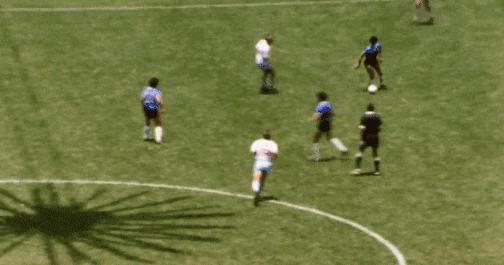
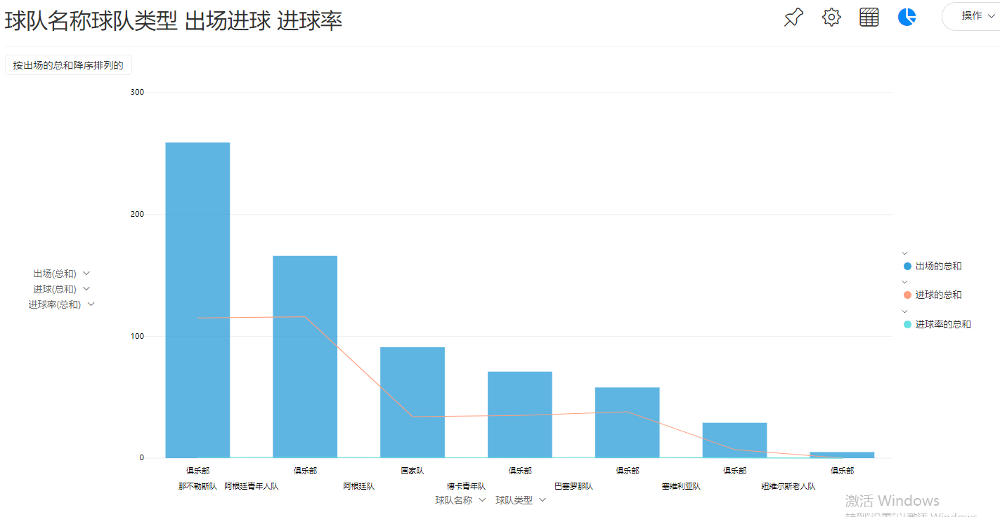

永别！永远的上帝之手 | 带你回顾马拉多纳进球史

11月26日，阿根廷球王迭戈·马拉多纳在家中突发心脏骤停，不幸去世，享年60岁。

阿根廷总统府当天发布公告称，因马拉多纳去世，阿全国进入为期三天的哀悼期。

马拉多纳帮助阿根廷1986年世界杯夺冠

马拉多纳亲吻大力神杯

“上帝之手”马拉多纳为何对阿根廷如此重要

一项民调显示，10个阿根廷人中有9个宣称自己是球迷，3岁到70岁的阿根廷男性中，足球的渗透率达到了98%，在阿根廷，作为世界第一运动的足球意义非凡，这或许容易让人理解，为什么马拉多纳如此受拥戴。

马拉多纳的足球生涯极具传奇色彩。

马拉多纳曾带领阿根廷队在1986年赢得世界杯冠军。就是在这届世界杯上，马拉多纳献上了他足球生涯里最伟大的一场表演。

那一年，马拉多纳用天神下凡般的表现征服了世界、征服了足球，5个进球5个助攻，他直接参与了阿根廷队全部14个进球中的10球，有13个进球和他有关，主导了每一场比赛的胜负。

那个年代的阿根廷刚刚经历过军政府长达7年的混乱执政，尤其是马岛海战的失败不仅让阿根廷在国际政治上处于空前的弱势，原本不堪的经济也继续下滑，阿根廷国内弥漫着一种悲观和绝望的情绪。

新仇旧恨交织，英阿之战远远超出了足球的范畴。世界杯历史上最经典的一刻，发生在下半场开球不久的4分钟。英格兰后卫霍奇倒钩解围，门将希尔顿即将稳稳地把球收入囊中。

这粒进球，也被称为“上帝之手”。

没等英国人回过神来，马拉多纳又开始了一场伟大的表演，他从中圈拿球，将里德、布彻、霍德尔、芬威克、希尔顿一一甩在身后，直捣黄龙。无论上帝之手卑劣与否，英国人都必须承认，这次单骑闯关是世界杯历史上最经典的进球，甚至没有“之一”。

马拉多纳在谈到那粒进球时，态度曾非常坚决。“我不会因为用手进球而感到后悔，现在不会，再过30年也不会，哪怕将来在床上死去的时候也不会。”

为了记录下马拉多纳的传奇人生，我整理了他的足球生涯重要事件，并用DataFocus盘点了他的进球时刻。

马拉多纳足球生涯重要事件一览

1975年10月，马拉多纳完成了在阿根廷甲级联赛的处子秀。

1977年，马拉多纳率领阿根廷队获得世界青年足球锦标赛冠军。

1978年，成为阿根廷甲级联赛历史上最年轻的最佳射手。

1982年7月，马拉多纳转会至西甲球队巴塞罗那。

1984年7月，马拉多纳以创纪录的750万美元转会费加盟意大利那不勒斯队，1987年获在那不勒斯意甲冠军。

1986年6月，马拉多纳率领阿根廷队获得世界杯冠军。

1990年7月，马拉多纳率领的阿根廷队，在世界杯决赛中不敌德国队，获得亚军。

1997年10月29日，马拉多纳正式宣布退役。

2008年11月5日，马拉多纳出任阿根廷国家队主教练。

2010年7月28日，阿根廷足协官方宣布马拉多纳不再担任阿根廷国家队主教练。

X轴为马拉多纳加入的球队名称以及类型，Y轴为出场、进球、进球率，呈现图为组合图。

马拉多纳进球统计组合图

马拉多纳也许忘记了我们，

而我们永远值得铭记马拉多纳。
