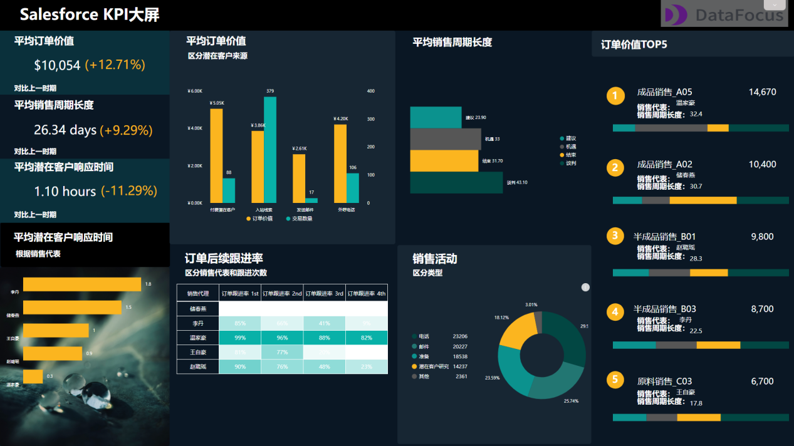

销售看板是一个重要的数据可视化格式，它主要用于帮助销售团队监控他们的销售表现和指标。以下是您可以在销售看板中找到的一些常见数据：

**1\. 销售额** 销售额通常是销售看板中最重要的一个指标，因为它反映了销售团队实际赚取的收入。销售额可以按月、季度或年度显示，并且可以对比以前的时间段。

**2\. 销售增长率** 销售增长率显示了当前销售额与先前期间销售额之间的差异。这可以帮助销售团队了解其销售策略的成功程度。

**3\. 客户数量** 客户数量是另一个重要指标，它可以让销售团队了解市场份额和客户群体的变化趋势。

**4\. 新客户数量** 新客户数量与总客户数类似，但它只考虑新客户的数量。这可以向销售团队提供有关其营销活动的效果的更具体信息。

**5\. 平均订单价值** 平均订单价值是指每个订单的平均价值。对于销售团队而言，了解这一指标很重要，因为它可以帮助他们确定如何最大化每个客户的价值。

**6\. 毛利率** 毛利率是指销售额与成本之间的差异。了解毛利率可以帮助销售团队确定哪些产品或服务应该重点推广，以实现更高的利润。

**7\. 市场份额** 市场份额是指企业在特定市场中的销售额占总销售额的百分比。它可以让销售团队了解他们在市场上的地位，并确定提高市场份额的策略。

Datafocus是一种搜索式BI工具，它具有良好的数据可视化功能和数据处理能力。以下是这种工具在数据可视化方面的优势：

**1\. 多样化图表类型** Datafocus支持多种图表类型，包括柱状图、折线图、饼图和散点图等，这使得用户能够选择最适合其需求的图表类型。

**2\. 数据交互性** Datafocus允许用户使用多个过滤器和维度来探索数据，并且这些选项都是交互式的。这使得用户能够实时看到他们的数据变化。

**3\. 可定制性** Datafocus允许用户对其生成的图表进行自定义，包括修改颜色、字体和标签等。这使得用户能够根据自己的需求创建个性化的图表或看板。

**4\. 数据集成** Datafocus可以与许多不同的数据源进行集成，包括数据库、API和文件。这种功能使得用户能够使用他们已有的数据来生成他们所需的图表和报告。

总之，数据可视化是数据分析工作中的重要组成部分，销售看板是一个很好的例子。通过使用Datafocus这样的搜索式BI工具，您可以轻松地生成交互式、定制化和有用的销售看板，以更好地监控和理解销售团队的表现。
