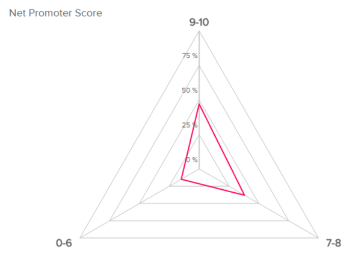

在商业竞争日益激烈的今天，企业要想脱颖而出，就必须深入了解并不断优化与客户的关系。而关键绩效指标（KPI）正是衡量这种关系质量的重要工具。接下来，我们将逐一详细解析七大关键客户KPI，通过生动的例子帮助大家更好地理解它们的意义和应用。

**一、客户满意度**

客户满意度是衡量客户对产品或服务是否满足其期望和需求的重要指标。通过定期的调查问卷、在线评价或电话访谈等方式，企业可以收集到客户对产品、服务质量、价格、交付等方面的反馈。

**实例**：假设你是一家餐饮连锁企业，通过客户满意度调查发现，顾客对菜品的口味和餐厅的环境较为满意，但对服务速度颇有微词。针对这一问题，你可以加强服务员的培训，优化点餐和传菜流程，从而提升客户满意度。

**二、净推荐值（NPS）**

净推荐值反映了客户对企业的整体满意度和忠诚度，以及他们是否愿意向他人推荐你的产品或服务。这个指标通过询问客户一个简单的问题来衡量：“你有多大可能向朋友或同事推荐我们公司/产品？”

**实例**：一家健身房通过NPS调查发现，大部分会员表示愿意推荐该健身房给朋友。这表明该健身房在服务质量、设施环境等方面做得较好，可以继续保持并加强这些方面的优势。

**三、电子邮件打开率和点击率**

对于依赖电子邮件营销的企业而言，这两个指标至关重要。它们反映了客户对企业邮件内容的兴趣和参与度。如果打开率和点击率持续低迷，可能意味着邮件内容不够吸引人或者发送时机不合适。

**实例**：一家时尚电商发现其营销邮件的打开率和点击率逐渐下降。经过分析，他们发现邮件内容过于单一，缺乏新意。于是，他们开始尝试多样化的邮件内容，如搭配建议、时尚资讯等，并调整发送时间至工作日晚上，从而有效提高了打开率和点击率。

**四、客户终身价值（CLV）**

客户终身价值是指一个客户在其与企业的整个关系期间所能带来的总收益。这个指标有助于企业识别并重点关注那些具有高价值的客户。

**实例**：一家信用卡公司通过分析客户消费数据，发现某些客户虽然初期消费不高，但随着时间的推移，他们的消费额逐渐增加，成为公司的忠实客户。于是，该公司针对这些客户推出了更多优惠政策和增值服务，以进一步提高他们的终身价值。

**五、获客成本（CAC）**

获客成本是企业为吸引一个新客户所需花费的平均成本。降低获客成本对于提高企业的营销效率和盈利能力至关重要。

**实例**：一家在线教育平台通过社交媒体广告、合作伙伴推广和口碑营销等多种渠道吸引新客户。他们发现，口碑营销的成本最低且效果最好。因此，他们加大了对老客户的回馈力度，鼓励老客户邀请新客户加入，从而有效降低了获客成本。

**六、结账放弃率**

结账放弃率是指在购物过程中，客户在结账环节放弃购买的比例。这个指标对于电商和在线服务平台来说尤为重要，因为它直接影响到销售额和利润。

**实例**：一家电商网站发现其结账放弃率较高，经过分析发现原因是结账流程过于复杂且需要填写大量个人信息。为了简化流程，他们引入了第三方支付平台，减少了填写信息的步骤，从而降低了结账放弃率。

**七、客户努力得分（CES）**

客户努力得分是衡量客户在使用产品或服务过程中所需付出的努力程度的指标。一个较低的客户努力得分意味着客户能够更轻松地完成他们的需求，从而提高客户满意度和忠诚度。

**实例**：一家银行通过调查发现，客户在办理业务时需要填写大量表格并等待较长时间。为了降低客户努力得分，他们推出了线上预约和自助服务系统，使客户能够更快速地完成业务办理，从而提高了客户满意度。

综上所述，这七个关键客户KPI对于衡量和优化客户关系至关重要。通过深入了解这些指标并采取相应的改进措施，企业可以更好地满足客户需求、提升客户满意度和忠诚度，从而推动业务的持续增长。
