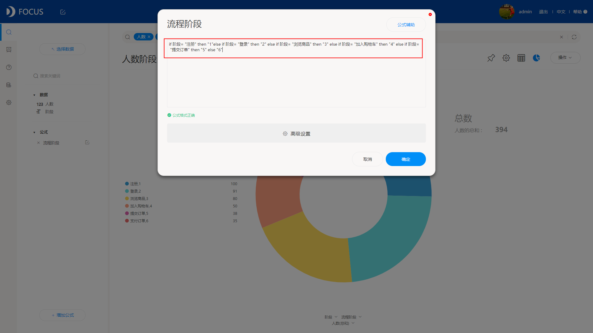

之前，有很多人咨询我DataFocus的漏斗图怎么使用。今天正好有时间，那就来给大家讲一讲DataFocus中漏斗图的使用技巧。

首先，要想很好地运用漏斗图，必须先要了解清楚漏斗图是什么以及这个图形的特点。这边先科普一下，漏斗图又叫倒三角图，其是由堆积条形图演变而来的，就是由占位数把条形图挤成一个倒三角的形状儿形成。该图形便于进行业务流程比较规范，周期长、环节多等分析时，能直观地发现和说明问题在哪里。

在DataFocus中，制作漏斗图非常简单，只需要选择展示的列，双击加入搜索框，选择基础图形中的漏斗图，即可完成漏斗图的制作，如下图。

但是，从这份数据来看，我们想要分析的是整个流程的转化率，流程是有一定的方向的，但是上图中展示的没有按照一定方向，所以其实展示的没有意义，那么怎么样让它按照我们设定好的流程方向显示呢？这种情况下我们就要借助公式来解决。输入如下的公式，将每个阶段按照需求进行编号，注意这里的编号需要是字符串形式，故在公式中的数字要用引号，公式：if 阶段= "注册" then "1"else if 阶段= "登录" then "2" else if 阶段= "浏览商品" then "3" else if 阶段= "加入购物车" then "4" else if 阶段= "提交订单" then "5" else "6"；

然后我们将公式加入到搜索款内，按照公式进行升序排列，再将图形转换成以漏斗图显示，即可看到我们要的漏斗图效果，按照一定的流程显示每个流程之间的转换率。

至此，一个真正有意义的漏斗图才算完成，但是也很简单不是吗？现在，大家对于漏斗图的应用有没有更了解一些呢？
