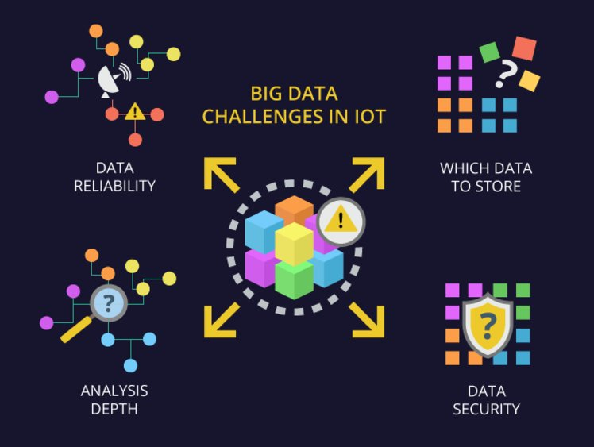

随着物联网的发展和进步，所有可以想象到的东西和行业都变得更加智能：智能家居和城市、智能制造机械、互联汽车、互联健康等等。无数能够收集和交换数据的事物正在形成一个全新的网络——物联网——物理对象网络，可以在云中收集数据、传输数据并完成用户的任务。

物联网和大数据正走向胜利。尽管如此，仍有一些特殊性和陷阱需要牢记，以受益于这一创新。在本文中，我们很高兴地分享我们在物联网咨询方面挖掘的知识。

## 如何应用物联网大数据

首先，从物联网大数据中获取好处的方法有很多种：在某些情况下，快速分析就足以获得好处，而一些有价值的结果只有在更深入的数据处理之后才能获得。

**实时监控。**通过连接设备收集的大数据可用于实时操作：测量家中或办公室的温度、跟踪物理活动（计数步骤、监控运动）等。实时监测在医疗保健中非常使用（例如，测量心率、测量血压、糖）。它还成功地应用于制造业（控制生产机械）、农业（监测牛和植物）和其他行业。

**数据分析。**处理物联网生成的大数据，有机会超越监控，从这些数据中获取有价值的见解：识别趋势和趋势，揭示看不见的模式，并找到隐藏的信息和相关性。

**过程控制和优化**。来自传感器的数据提供了额外的上下文，以揭示影响性能和优化流程的非平凡问题。

- **交通管理**：跟踪不同日期和时间的交通负荷，找出旨在优化交通的建议（例如，在一定时间段增加火车和公共汽车的数量，看看是否有利可图，建议引入新的红绿灯方案，并修建新的道路，使一些街道不那么繁忙，并管理交通拥堵）。
- **零售**：由于一些商品在购物场所几乎结束了，超市的人员被告知，例如，重新装货架的商品。
- **农业**：根据传感器的数据，在必要时种植水厂。

**预测性维护。**使用连接设备收集的数据可以成为预测风险的可靠来源，从而主动识别潜在危险条件，例如：

- **医疗保健**：监测患者状态和识别风险（例如，患者有糖尿病、心脏病的风险），及时采取措施。
- **制造**：预测设备故障。

**并非所有的物联网解决方案都需要大数据。**还应指出，并非所有的物联网解决方案都需要大数据（例如，如果智能家居的所有者要在手机的帮助下关灯，则此操作可能无需大数据即可执行）。考虑减少处理动态数据的努力并避免大量存储数据非常重要，因为将来不需要这些存储。

## 物联网中的大数据挑战

大量的数据是完全没用的，除非他们被处理，以获得有价值的东西。此外，与数据收集、处理和存储相关的各种挑战。

**数据可靠性**。虽然大数据从来不是 100% 准确的，但在分析数据之前，必须确保传感器正常工作，用于分析的数据质量可靠，不会受到各种因素的影响（例如，机械运行环境不利、传感器故障）。

**要存储哪些数据。**连接的事物生成 TB 的数据，选择存储哪些数据以及丢弃哪些数据是一项艰巨的任务。更重要的是，一些数据的价值远未浮出水面，但您将来可能需要这些数据。如果您决定为未来存储数据，则面临的挑战是以最少的成本（只要数据存储和处理成本相当昂贵）来存储数据。

**分析深度**。一旦并非所有大数据都很重要，另一个挑战就会出现：何时足以通过快速分析，何时更深入的分析可以带来更多价值。

**安全性。**毫无疑问，各个部门的互联可以改善我们的生活，但与此同时，数据安全也非常重要。网络罪犯可以访问数据中心和设备，连接到交通系统、发电厂、工厂，从电信运营商那里窃取个人数据。物联网大数据是安全专家比较新的现象，缺乏相关经验会增加安全风险。

## 物联网解决方案中的大数据处理

在物联网系统中，物联网架构的数据处理组件因传入数据的特殊性、预期结果等而异。我们已经制定了处理物联网解决方案中大数据的方法。

数据来自连接到**事物****的传感器**。一个"东西"可以字面上是任何对象：烤箱，汽车，飞机，建筑物，工业机器，康复设备。数据定期或流式传输。后者对于实时数据处理和管理至关重要。

Things 将数据发送到**网关**，确保初始数据过滤和预处理减少传输到下一个物联网系统块的数据量。

**边缘分析。**在进行深入的数据分析之前，进行数据过滤和预处理以选择某些任务所需的最相关数据是有意义的。此外，此阶段确保实时分析能够快速识别之前通过云中的深度分析发现的有用模式。

**云网关**对于不同数据协议之间的基本协议翻译和通信是必要的。它还支持数据压缩，并保护字段网关和中央物联网服务器之间的数据传输。

连接设备生成的数据以自然格式存储在**数据湖**中。原始数据来到带有"流"的数据湖。数据保存在数据湖中，直到可用于业务目的。清洁和结构化数据存储在**数据仓库**中。

**机器学习。**机器学习模块根据以前积累的历史数据生成模型。这些模型定期（例如，每月更新一次）与新的数据流。传入的数据被积累并应用于培训和创建新模型。当这些模型经过专家测试和批准时，它们可用于控制应用程序，该应用程序会针对新的传感器数据发送命令或警报。

## 总结一下

物联网生成了大量大数据，可用于实时监控、分析、流程优化和[预测维护](https://www.datafocus.ai/)，仅举几例。但是，应该记住，从各种格式的海量数据中获取有价值的见解并不是一件小事：您需要确保传感器正常工作，数据安全传输并有效处理。此外，总有一个问题：哪些数据值得存储和处理（只要这两个过程都相当昂贵）。

尽管存在上述潜在问题，但应记住，物联网发展势头强劲，帮助多个行业的企业开拓新的数字机遇。
