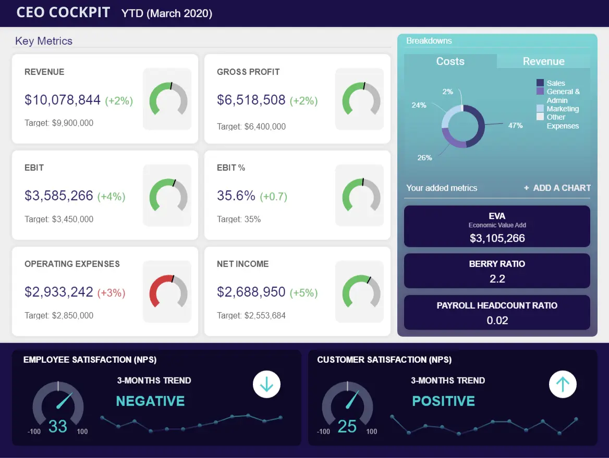
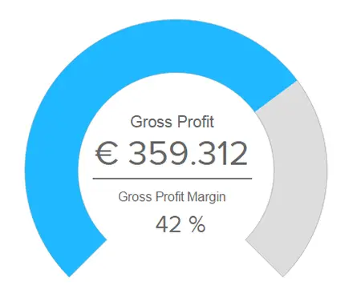
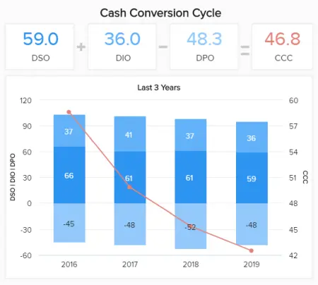
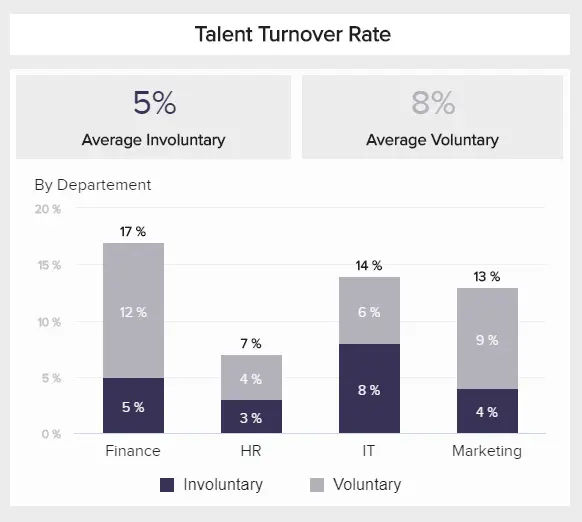
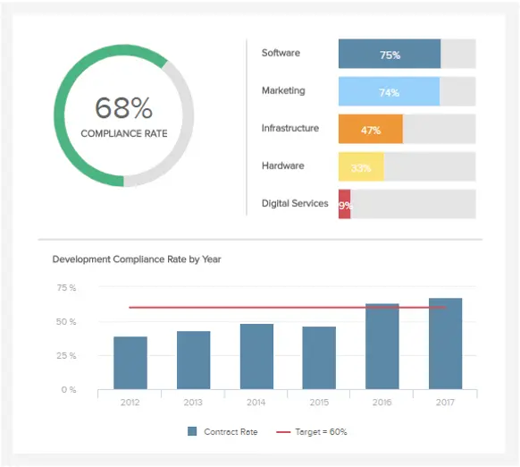
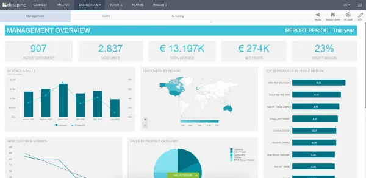
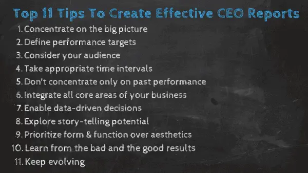

任何企业要想在数字时代取得成功，都需要目标、方向和资源来发展并适应周围不断变化的环境。要实现这一目标，强有力的领导至关重要。

作为首席执行官，您负责监督业务的各个方面，从人员和内部文化一直到关键的销售、营销和财务战略。虽然您的组织无疑充满了可以推动组织各个方面向前发展的人才，但最终，公司的成功取决于您的肩膀。

 

撇开同情心和人际交往能力不谈，每个强大的领导者都需要有远见卓识，才能做到最好。为了获得更大的愿景，您需要利用数字数据的力量，使用专业的 CEO 仪表板和报告作为您的信息容器。

通过以正确的方式利用智能[在线数据分析](https://www.datafocus.ai/infos/data-analysis-tools)，您将获得见解，这些见解将帮助您制定促进增长和创新的战略，同时保持员工的积极性、参与度和快乐。在这个时代，粗略估计或在黑暗中射击只会让你走得更远。因此，获得有形见解的完美组合至关重要。

“但是我如何全面改进我的领导策略？”你可能会问。CEO报告就是答案。

如前所述，CEO 仪表板将使您能够访问质量见解，让您对流程更有信心。

通过利用[在线仪表板](https://www.datafocus.ai/infos/online-dashboard)的强大功能，您可以在几分钟内使用您的数据创建强大的执行级叙述。在这里，我们将考虑领导力仪表板是什么，以及它的作用，探索一系列现实世界的 CEO[仪表板示例](https://www.datafocus.ai/infos/dashboard-examples-and-templates)，以展示这个有价值的领导力工具的强大功能，然后是创建 CEO 报告的重要提示。我们将专注于各个部门的关键方面，这些部门将从动态的CEO级数据中受益，使首席执行官能够做出明智的实时决策以及创新的领导战略。

让我们潜入。

## 什么是首席执行官仪表板？

CEO 仪表板是一种管理报告工具，用于跟踪、分析和可视化数据。它使首席执行官和其他 C 级高管能够在销售、营销、财务和其他领域的交互式高级指标的帮助下做出数据驱动的决策。

首席执行官需要对最突出的指标有一个鸟瞰的概述，这将有助于他们做出最佳决策，以改善结果，而全面的领导力仪表板是肯定可以提供帮助的解决方案之一。

数据驱动的仪表板为业务领导者提供了一定程度的洞察力，最大限度地提高了触手可及的顶级数据的价值，全面增强了战略决策和指导。

此外，仪表板可以用作 CEO 报告，现在我们将解释如何操作。

## 什么是首席执行官报告？

CEO 报告是一种关键的分析工具，它以可视化、易消化且易于导航的方式提供历史趋势和实时见解。例如，这些报告可以以交互式仪表板或.pdf文件的形式提供。

您可以根据您的特定需求、目标和要求定制 CEO 仪表板，并使用 CEO KPI，帮助您轻松发现无价的趋势和见解。为此，CEO仪表板软件将被证明是数字时代的关键领导工具，但我们稍后将详细介绍。从本质上讲，它提供了以下好处：

- 改进决策。
- 更广泛地访问重要数据。
- 通过 24/7 全天候移动仪表板访问实现移动性。
- 改善内部沟通，使组织更强大。

## CEO 报告和仪表板的主要优势

现在您已经快速掌握了领导力仪表板的概念及其在 C 级的功能，我们将探讨使用 CEO 仪表板指标为您带来优势的主要好处。

### 1\. 信心、认可和信任

作为领导者，组织中的每个人都会自然而然地向您寻求指导和答案，以解决有关业务的大量非常具体的问题。为了保持沉着并保持积极的权威影响力，使用强大、可靠和易于消化的数据至关重要。通过以可访问的可视化格式提供准确的数据，现代 CEO[BI 仪表板](https://www.datafocus.ai/infos/bi-dashboard-best-practices)将让您有信心负责业务的每个核心方面，同时通过可操作的见解验证您的选择。反过来，这将建立更大的信任和透明度，提高过程中的参与度和生产力。

### 2\. 决策

扩展我们的最后一点，CEO 仪表板的可访问视觉特性将帮助您在压力下做出明智、准确和渐进的决策。通过与大量实时数据驱动的见解进行交互，或为您的高级员工提供工具，通过动态 CEO 报告创建有见地的叙述，您将做出始终如一的有力决策，最终加速组织的发展。

### 3\. 广泛的数据访问

通过投资创新的[商业智能仪表板软件，](https://www.datafocus.ai/infos/bi-dashboard-tools)您将在整个组织中创建数据驱动的文化。借助现代 CEO 董事会报告，您不再需要成为开发人员或技术向导即可将洞察转化为行动。任何值得一提的现代 CEO 仪表板都是可定制的，允许您使用与您的特定目标和目的相一致的关键绩效指标，同时为每个人提供发挥最佳能力的工具。CEO 仪表板软件等于广泛的数据访问，将可访问的见解交到您以及您组织最聪明的人才手中。当您这样做时，您的业务将蓬勃发展。

### 4\. 灵活性和适应性

CEO[仪表板](https://www.datafocus.ai/infos/dashboard-reporting)报告软件不仅允许您从一个中心位置策划、分析和访问大量宝贵数据 - 因为任何可靠的现代 CEO 报告生成器都针对一系列设备（包括移动设备和台式机）进行了优化，无论您身在何处，您都可以连接促进业务的见解并做出 24/7 全天候敏锐的决策。

### 5\. 全景视觉和BI

通过利用历史、预测和实时分析的完美风暴，您可以利用优势、识别劣势、发现新兴趋势并发现您从未想过的见解。此级别的[BI 报告](https://www.datafocus.ai/infos/business-intelligence-reporting)将在整个组织中向下筛选，使其跨部门高效、有效且行业领先。

### 6\. 绩效考核

无论您的利基市场或行业如何，实现甚至超越业务目标的最有效方法是设定明确的目标和基准。无论您是在谈论 CEO 每周报告模板还是 CEO 季度报告模板，通过与高度可视化和富有洞察力的顶级 KPI 进行交互，您都可以精确地监控各部门的绩效，并在需要时提供适当级别的支持和战略调整。

### 7\. 沟通与创新

所有这些促进业务发展的好处相结合，有助于打破业务内部的孤岛并创造创新文化。通过能够做出更快、更有价值的决策，同时节省筛选静态报告或大量数字的时间，您可以专注于提供额外的支持、指导和制定创新战略，将您推向竞争对手的领先地位，一次一项强大的领导活动。

您的机会：[想用专业的仪表板打动您的首席执行官吗？](https://www.datafocus.ai/console/)试用我们的现代仪表板软件 14 天，完全免费！

## 基本CEO仪表板示例和模板

现在我们已经考虑了使用 CEO 使用现代仪表板的好处，现在是时候探索一些现实生活中的 CEO 仪表板模板了。这 4 个非常不同但同样强大的示例是交互式和可视化的，并提供了一定程度的洞察力，可以在许多领域增强领导力。

让我们从专注于财务和满意度的 CEO KPI 仪表板开始。

### 1\. 财务健康和团队成功的首席执行官仪表板

首席执行官需要跟踪公司的财务业绩，但也要关注团队和客户，以产生最好的见解并推动业务向前发展。在我们的第一个首席执行官公司仪表板中，我们专注于这一点。

 通过在收入、息税前利润、净收入和成本明细等高级财务 KPI 的帮助下监控财务状况，每位高管都有大量数据来监控和优化公司的[财务](https://www.datafocus.ai/infos/kpi-examples-and-templates-finance)业绩。此外，现代CEO需要与团队和客户保持联系，以了解他们的满意度。这在我们的数字时代很重要，因为如果员工不满意，他们就会更换公司。您可以为客户假设同样的事情。

首席执行官指标解释：

- 毛利率：

此[财务图表](https://www.datafocus.ai/infos/financial-graphs-and-charts-examples)阐述了您在考虑与您的产品或服务相关的所有成本后保留的总销售收入。这是一个需要跟踪的重要指标，因为您可以评估运营流程的效率。

例如，您需要在计算中包括生产设施的所有材料和劳动力价格，但不包括租金等费用。利润率越高，您从销售收入中保留的收入就越多。

- 营业费用率：

运营费用比率需要包含在您将从财务角度创建的每个 CEO 报告模板中，因为它将显示您与总收入相比管理运营费用的程度。

这个指标对投资者来说特别有趣，因为他们通常想知道您的运营成本与产生的收入有多高，如前所述。将此指标包含在您的[财务报告中](https://www.datafocus.ai/infos/daily-weekly-monthly-financial-report-examples)非常重要，因为 C 级高管需要清楚地了解公司是否可扩展。如果能将运营费用保持在较低的水平，公司将实现更多的利润。

- 现金转换周期：

将资源转换为现金是现金转换周期 （CCC） 的重点。首席执行官向董事会提交的报告通常会描述CCC，以显示公司需要多少时间将其库存投资（和其他资源）转换为销售现金流。

此策略视觉对象会自动跟踪过去 3 年的表现。它是使用专业的 CEO[仪表板生成器](https://www.datafocus.ai/infos/dashboard-creator)创建的，使您能够从手动计算中节省时间和资源，并立即发现图示周期每年都变得更健康。

### 2\. SaaS 管理仪表板以实现可持续增长

随着数字技术的发展，SaaS行业也在不断发展。如果您是一家崭露头角的服务软件公司的负责人，此 CEO 仪表板模板将帮助您始终如一地实现甚至超越您的目标。

 这个动态 SaaS CEO 仪表板示例具有 4 个区域，旨在跟踪和衡量客户流失、购置成本、经常性月收入和每单位平均收入（以及其他关键见解），提供了增长、效率、流动性和战略规划的所有关键要素。

无论您的 SaaS 企业是全新的，还是您已经存在了一段时间并希望扩大您的受众，此[管理仪表板](https://www.datafocus.ai/infos/dashboard-examples-and-templates-management)都将帮助您定期实现甚至超越您的目标。

首席执行官关键绩效指标解释：

- 获客成本：

客户获取成本对于任何严肃的 SaaS 业务来说都是至关重要的 KPI，这些业务需要在说服潜在客户购买产品或服务之前知道产生了多少成本。专注于SaaS领域的首席执行官报告需要定期监控此指标，以产生宝贵的见解。

- MRR：

SaaS公司的领导者通常会密切关注MRR，因为它可以很好地指示业务是否以健康的方式发展，特别是因为它将使您能够根据用户的订阅做出准确的财务预测。

 全面的[SaaS 仪表板](https://www.datafocus.ai/infos/saas-dashboard-examples-metrics-templates)将包括 MRR 作为 SaaS 管理中最重要的指标之一，尤其是在最高管理层级别，每月经常性收入在成功的业务发展中起着关键作用。

- 阿普：

每单位（用户或帐户）的平均收入是 CEO 指标，对于指示客户从您的所有销售中获得的收入至关重要。关键是要保持收购成本低于您的ARPU，以获得稳定的利润。

### 3\. 投资者关系仪表板，用于强大的演示

我们的第二个 CEO 仪表板示例侧重于任何蓬勃发展的企业中最关键的组成部分之一 - 投资者关系。

 投资者关系 CEO 仪表板模板提供了无价的高级指标组合，可帮助您保持专业的健康关系，同时确保您的资产驱动型财务事务始终流畅且受到保护。

通过深入了解您现有的资产、资产和权益回报率以及您的市盈率，这个强大的执行级 CEO 仪表板示例将帮助您和您的股东无限期地蓬勃发展。

使用的首席执行官指标：

- 资产回报率
- 股本回报率
- 市盈率
- 债务权益比率
- 股价
- 营运资金比率

### 4\. 顶级营销绩效的 CMO 仪表板

毫无疑问，在我们残酷的数字时代，在企业的各种营销策略上投入充足的时间和资金至关重要。

我们的下一个模板侧重于[营销仪表板](https://www.datafocus.ai/infos/dashboard-examples-and-templates-marketing)，这是一个以 CMO 为中心的工具，可帮助您在一个直观的中心位置整合、组织和分析庞大的数据集。这实际上是一个给CEO的报告示例，是一个很好的蓝图，如果有具体的营销相关问题，可以更详细地向首席执行官展示营销绩效。

 这个全面的 CEO 仪表板示例拥有顶级见解的完美组合，将帮助您优化营销绩效，从而帮助您显着提高品牌知名度和底线。适用于任何领导者数字工具包的必备仪表板工具。

首席执行官关键绩效指标解释：

- 客户终身价值：

营销 C 级套件中的另一个关键指标是，客户的终身价值需要包含在 CEO 公司仪表板中，因为它是实现业务成功的宝贵指标。留住客户的时间越长，产生的收入就越多。

首席执行官需要掌握营销并密切监控客户终身价值，因为它将帮助您确定最有利可图的营销渠道，您可以在运营层面进行额外检查。此外，它还将帮助您确定在哪里分配预算以及如何分配预算。

在我们的示例中，其他测量：

- 销售目标和增长
- 网站流量与潜在客户比率
- 每条线索的成本
- 潜在客户与 MQL 比率
- MQL 与 SQL 比率

要了解有关其他指标的更多详细信息，您可以查看我们最重要的[营销 KPI](https://www.datafocus.ai/infos/kpi-examples-and-templates-marketing) 的概要。

### 5\. 用于增加收入和利润的销售 KPI 仪表板

作为首席执行官，您无疑会知道，销售是您组织存在不可或缺的一部分。

我们的销售仪表板专注于该部门的每个重要顶级领域，提供见解，帮助您减少客户流失、提高经济效益、优化您的活动并利用增加收入的活动，例如追加销售和交叉[销售](https://www.datafocus.ai/infos/dashboard-examples-and-templates-sales)。此仪表板将使您能够创建易于理解的销售[报告](https://www.datafocus.ai/infos/sales-report-kpi-examples-for-daily-reports)并增强您的决策过程。

 作为企业领导者，密切关注组织的销售活动至关重要。此 CEO 报告示例将确保您不仅可以轻松衡量这些[销售 KPI，](https://www.datafocus.ai/infos/kpi-examples-and-templates-sales)还可以发现有助于提高利润的新见解。

使用的关键绩效指标：

- 销售目标：

由于销售是每个战略的关键部分，首席执行官还需要考虑他们的团队是否达到了计划目标。为了使事情更简单，可视化的 CEO 报告示例（如下面的示例）应该在战略销售业绩跟踪列表中名列前茅。

该指标将帮助您确定您的销售流程是否在正确的轨道上或需要更多调整。当然，目标是超越您的预测金额。

- 客户流失率：

失去客户绝非易事，但跟踪此指标以评估业务趋势并提升保留策略非常重要。

通过在现代[KPI 仪表板软件](https://www.datafocus.ai/infos/kpi-dashboard-software)的帮助下自动执行这些计算，流失率将立即显示最新信息，而无需繁琐的手动工作。在上面的模板中，我们可以看到流失率为 2%，但这取决于您的业务领域和行业。

我们示例中的其他指标：

- 追加销售和交叉销售率
- 每代表的利润率
- 按广告系列划分的增量销售额

### 6\. 跟踪员工敬业度的人才仪表板

在首席执行官需要监控的许多关键任务和领域中，人力资源位居榜首。首席执行官需要确保公司正在招聘最优秀的人才，并让他们满意和高效。为此，此[人力资源仪表板](https://www.datafocus.ai/infos/dashboard-examples-and-templates-human-resources)是一个很好的工具，可帮助领导者监督不同人才指标的状态。

 拥有像上面这样的仪表板在当今的上下文中特别有用。德勤发布的《2022年首席执行官年度报告》显示，全球不稳定的政治、社会和经济状况严重扰乱了商业世界，一波辞职潮统称为“大辞职”。从这个意义上说，62%的受访者表示，培训领导者如何雇用和吸引员工是他们为避免受到这一日益严重的问题的影响而采取的首要行动之一。考虑到所有这些因素，拥有一个分析工具来跟踪与人才管理相关的一切是一笔宝贵的资产。让我们看一些人力资源的首席执行官 KPI 示例。

- 人才满意度

顾名思义，人才满意度指标跟踪员工对您的业务的内容水平和参与度。有许多因素会影响员工对工作场所的感受，其中一些因素包括薪水、办公环境和灵活的工作时间，仅举几例。为了衡量这一指标，有必要进行满意度调查并确定具体的改进领域。在这种情况下，KPI 是根据目标进行跟踪的，并按雇佣期划分员工，这是要考虑的另一个重要因素。

- 人才流失率

人才流动率是有效[人力资源分析](https://www.datafocus.ai/infos/business-intelligence-human-resources)的另一个相关指标。它跟踪在给定时间段内离开公司的员工人数。在上图中，离职率由非自愿和自愿休假以及部门跟踪。对于C级高管来说，这是一个重要的指标，因为雇用新员工需要花费大量的时间和金钱。更不用说它可能会损害一般的组织战略，因为有些职位需要填补不同的年份才能使投资物有所值。

### 7\. 采购 KPI 仪表板，用于全面了解采购流程

除了人力资源、营销和财务之外，CEO需要监控的另一个相关领域是采购。首席运营官与 CPO 携手合作，需要确保组织的采购流程高效便捷。也就是说，下面的模板是执行此操作的完美工具，因为它包含关键[采购指标](https://www.datafocus.ai/infos/kpi-examples-and-templates-procurement)的组合。

 通过上述示例提供的见解水平，首席执行官可以评估合规性、供应商质量、供应链战略绩效以及采购团队，从而为公司做出最佳交易。此外，此仪表板的交互性级别允许管理层向下钻取数据并提取更深入的结论以进行改进。让我们看一下下面这个仪表板中的两个关键指标。

- 合规率

合规率是一个采购 KPI，用于深入了解公司与供应商的关系，并确保满足所有合同协议。它包括各种因素，例如出现任何问题时的最大反应时间、交货时间、特别折扣优惠等。它可以帮助采购团队与供应商协商更好的价格和折扣。

- 采购订单周期时间

顾名思义，采购订单周期时间跟踪从创建采购订单到批准、接收、发票和最终付款的端到端订购流程。每个供应商根据其采购订单周期时间分为短、中和长部分。这是有价值的信息，因为它告诉您在紧急需要服务时与谁联系。

为了更深入地了解创建上述示例的 CEO 仪表板解决方案，我们将看看 CEO 仪表板软件应包含的主要功能，以便为各种规模和行业的公司创造价值。

您的机会：[想用专业的仪表板打动您的首席执行官吗？](https://www.datafocus.ai/console/)试用我们的现代仪表板软件 14 天，完全免费！

## 在 CEO 仪表板软件中寻找什么？

如前所述，每位首席执行官都需要对整个业务有一个鸟瞰图，而现代软件和工具可以帮助他/她节省时间，整合多个接触点，并在几分钟内生成可操作的见解。要创建我们上面讨论的示例，专业的 CEO 仪表板软件应具有以下组件和/或元素：

1\. 专业数据连接器

正如您在我们涵盖营销、人力资源、财务和销售的示例列表中看到的那样，CEO 需要集中查看所有部门，以确保组织平稳运行。为此，他们需要信任解决方案，这些解决方案将为他们提供一种简单有效的方法，在一个地方监控所有重要区域，而无需进行任何繁琐的手动工作。也就是说，仪表板软件应该提供专业的[数据连接器](https://www.datafocus.ai/infos/data-connectors)。该技术允许用户只需单击几下即可将多个数据源连接到一个位置。通过这种方式，高管可以获得所有相关指标的集中视图，而无需从一个报告跳转到另一个报告或手动更新报告上的数据。

2\. 先进的交互性水平

对于首席执行官来说[，最好的仪表板软件](https://www.datafocus.ai/infos/best-dashboard-software-features)需要具有高级交互功能，例如向下钻取、时间间隔小部件、图表缩放等。这些功能是从不同角度查看数据的本质，同时在出现不同问题时与屏幕交互，无论是在会议上还是在分析过程中。

3\. 跨设备可访问性

首席执行官需要随时随地访问信息。专业软件可确保从多种设备（无论是移动设备、台式机还是平板电脑）访问数据。这样，最高管理层就可以立即访问信息，而不必“在黑暗中拍摄”。得益于现代云解决方案和简单的互联网连接，首席执行官可以立即获得数据。

4\. 白标

通过自定义为您的仪表板提供专业外观的可能性是您在投资此类软件时应该寻找的另一个基本功能。白标 CEO 仪表板使您可以将布局更改为业务的颜色、徽标和字体。这在与投资者、客户或任何其他外部利益相关者会面时特别有用，因为它可以让您的组织看起来很专业。

5\. 多种可视化选项

要考虑的另一个重要功能是具有多个数据可视化选项。能够用数据讲述故事是成功的仪表板流程最重要的方面之一，而数据可视化（如各种类型的图形和图表）是讲述连贯故事的关键。这是因为人脑处理图像的速度比数字快得多，因此，必须拥有可以让您自由地通过各种视觉效果讲述故事的软件。除此之外，视觉效果还使数据更易于访问和理解，当首席执行官试图向员工解释他们应该如何改进以及将实施哪些策略时，这可以证明是有用的。

6\. 预测分析和预测

首席执行官需要预测未来情景，以避免潜在的瓶颈并创造一个可持续的商业环境。近年来出现的技术提供了预测功能，可以简化首席执行官的生活，并为未来的发展提供额外的视角。根据过去的数据点，该软件会自动计算预测并以可视化方式呈现数据，因此，您可以立即发现来自销售、营销、财务、采购或任何其他行业的数据会发生什么现代 CEO 需要领导和升级。

7\. 多种共享选项

当您创建某个 CEO 报告到董事会模板时，您希望能够快速有效地共享。自定义报告、收件人和要共享的信息可确保完全控制要显示的数据以及对指定收件人的访问级别。实际上，这意味着您可以通过公共 URL 共享完整的首席执行官仪表板，在查看者区域中启用特定权限，最后将仪表板嵌入到另一个应用程序、Intranet 或网站中。

列出的功能是您应该寻找的一些最突出的功能，如果您需要向首席执行官展示您的数据，或者如果您是需要与执行委员会分享见解的首席执行官。现在，我们将重点介绍此类仪表板中应包含哪些信息，并以提示结束，以使您的执行工作更有价值、更有效。

## 首席执行官在仪表板中需要哪些信息？

很明显，CEO 仪表板软件为担任领导角色的人提供了各种促进业务的好处。但是，要获得最佳成功，了解[管理报告中](https://www.datafocus.ai/infos/management-reporting-best-practices-and-examples)应包含的内容至关重要。那么，首席执行官在仪表板中需要哪些信息？

让我们通过查看您应该包含在 CEO 仪表板报告中的核心信息来探索：

1\. 正确的关键绩效指标和指标

为了确保您的仪表板为您的个人目标提供正确的见解，使用正确的指标是绝对必要的。如果您的仪表板包含与您希望获得的见解无关的 KPI，则基本上毫无用处。

在协作环境中与您的高级团队坐下来，检查您当前的流程以及您提出的目标。一旦您确定了目标并全面了解了您的流程，您将能够选择最适合您的需求并帮助您推动业务发展的衡量标准，并创建一个强大的 CEO 月度报告模板。

您还可以查看我们丰富的库，其中包含基于不同部门、部门和职能的各种[KPI 示例](https://www.datafocus.ai/infos/kpi-examples-and-templates)，供您考虑。

2\. 正确的设计和可视化

选择正确的 KPI 后，您需要设置仪表板并根据您的偏好对其进行自定义。不同的 KPI 将提供不同的可视化效果，具体取决于其性质或功能。

为了确保快速有效地访问您最有价值的数据，正确设计您的 CEO 仪表板指标和模板至关重要。通过遵循最突出的[仪表板设计原则](https://www.datafocus.ai/infos/dashboard-design-principles-and-best-practices)，您将有更大的机会从内到外更清楚地了解公司的流程。

3\. 集管理、营销、财务与销售于一体

作为首席执行官，您需要访问跨部门的各种数据。通过这样做，您将获得组织进展的全面全景视图，同时获得在许多关键领域制定关键战略的能力。

要成为数据驱动的业务领导者，您需要在管理、营销、销售和财务之间包括平衡的 KPI 和信息——确保您涵盖所有基础。

当然，仪表板中包含的特定[分析报告](https://www.datafocus.ai/infos/analytical-report-example-and-template)和数据将根据您作为首席执行官的目标量身定制。然而，这里的要点是，你必须确保你的CEO软件提供完美的见解组合，而不是倾向于一个特定的领域，以避免阻碍你的专业视野。

4\. 性能数据

当然，与前几周、几个月或几年相比，CEO 仪表板 KPI 将为您提供特定领域绩效的清晰可视化表示。但是，如果您想作为 CEO 从 KPI 和可视化中获取最大价值，那么利用阐明部门以及个人产出和效率的见解将为您提供在正确领域提供培训和支持所需的工具。

作为商业领袖，您是导师。如果您确切地知道在哪里提供支持、咨询和指导，您将引导您的组织走向成功。包括基于绩效的 KPI，包括客户支持或销售代表成功率和生产力基准，将帮助您做到这一点。

5\. 增长洞察

作为业务领导者，您将使用各种 CEO 仪表板示例。但是，为了确保您能够牢牢掌握公司的财务状况和成功，使用模板、图表和指标，一目了然地访问基于增长的信息，如销售数据、支出、利润率、合作伙伴数据和履行信息，将使您能够监控公司的增长，同时在出现任何问题或差异时进行快速的战略调整。

6\. 人力资源 （HR） 信息

除了分析与销售、营销和财务相关的顶级分析外，作为创建（和维护）信任、透明度和社区文化的领导者，您还将决定业务的持续增长。

为了让组织中的每个人都参与其中，同时确保组织持续增长，使用[人力资源指标](https://www.datafocus.ai/infos/kpi-examples-and-templates-human-resources)（包括人才招聘 KPI、员工生产力和以人才为中心的数据）将为您提供留住员工所需的愿景水平，同时促进全面的协作、沟通和创新。

## 创建有效CEO报告的11大技巧

我们已经阐述了各种 CEO 报告示例和模板，但要充分利用创建此类报告工具的力量，您应该记住以下提示：

1\. 着眼大局

CEO对虚荣指标或低级指标不感兴趣。他们需要确保公司的战略步入正轨，但细节和运营活动由经理和员工控制。通过利用高级 KPI，每位 CEO 都可以根据业务的发展方向和需要调整的内容描绘出一幅全貌。话虽如此，不要提供您网站上的跳出率数据或通知他/她特定产品缺货，而是专注于需要由首席执行官监控的战略见解，例如客户成本或价值。

2\. 定义绩效目标

鉴于首席执行官需要确保整个组织的效率和增长，设定绩效目标是一个很好的做法。这不仅有助于评估不同活动和策略的成功，还有助于衡量员工和部门的绩效。通过设定可实现和现实的目标，领导者还可以发现改进机会，以确保效率和成功。如果您想更深入地了解 KPI 指标和目标的主题，请查看我们关于该主题的完整指南！

3\. 考虑您的受众

根据具体情况，首席执行官可能需要向不同的受众展示报告。当然，它们中的每一个都需要有不同的信息和格式来达到目的。例如，C级高管，如CMO，CTO或COO，可能需要比可能只需要查看一些财务指标的投资者更详细的战略和绩效信息。重要的是了解他们每个人的目的，并根据每个受众的需求构建报告。这样，报告过程将更具吸引力和效率。

4\. 采取适当的时间间隔

正如我们在上面的CEO报告示例中所看到的，它们都不是基于日常水平的。首席执行官不需要对各部门为了正确管理其业务部分而需要遵循的每个每日报告感到震惊。通常，明智的做法是使用每周、每月或每季度的间隔，具体取决于 CEO 委派的责任级别。它也可能因企业而异，因此进行沟通和相应地调整可能是有意义的。

5\. 不要只关注过去的表现

CEO报告还应该展望未来并指出预测。使用[仪表板构建器](https://www.datafocus.ai/infos/dashboard-builder)创建报表时，请确保设置切合实际的目标，并且还拥有实现这些目标所需的资源，报表可以提供清晰的业务图景和下一开发级别的路线图。

6\. 整合您业务的所有核心领域

每个企业都需要几个核心领域才能正常运行并产生增长。SaaS公司将具有与零售不同的核心领域，但正如我们在文章中已经提到的，销售和营销通常始终很重要。您可能需要涵盖的其他相关指标包括客户支持、人力资源、[IT KPI](https://www.datafocus.ai/infos/kpi-examples-and-templates-it)、采购等。

在这些领域拥有清晰的结构至关重要。通过使用各种仪表板选项卡和内部小部件链接，您的业务故事可以更轻松地呈现，并伴随着有效的视觉效果，确保高效的仪表板和数据故事讲述。

7\. 实现数据驱动型决策

首席执行官必须得到他们需要的一切，而且简明扼要。但更重要的是，通过利用现代[交互式仪表板](https://www.datafocus.ai/infos/interactive-dashboard-features)并避免静态报告，让他们能够自己或在与其他 C 级高管的商务会议期间深入了解中央 KPI，见解和可能性是无穷无尽的。

8\. 发掘讲故事的潜力

人类对引人入胜的情节和叙述反应最好 - CEO数据分析也不例外。在制定 CEO 报告和选择 KPI 时，您应该考虑每个指标如何协同工作，根据特定部门、职能或结果讲述故事。

对 CEO 和领导力仪表板采用讲故事的方法将使您的见解更易于访问、更具启发性，从而更强大。阅读我们的鼓舞人心[的数据故事讲述](https://www.datafocus.ai/infos/data-storytelling-examples-with-data-visualization)示例指南，了解如何利用这种有效的技术来发挥自己的优势。

9\. 优先考虑形式和功能而不是美学

作为 CEO 创建自定义报表时，正确[完成设计工作](https://www.datafocus.ai/infos/dashboard-design-principles-and-best-practices)非常重要。为了确保仪表板内容（报表）易于理解且易于交互，您必须确保您的设计在形式和颜色上保持一致，以逻辑格式呈现，并为您自己以及业务中的其他用户提供特性或功能，帮助他们轻松深入到重要的信息口袋。重视功能而不是美学的另一个优点是，在与外部利益相关者会面时，您的信息将显得更加一致、专业和美观，从而进一步推动您的品牌声誉和业务增长。

10.从坏结果和好结果中学习

作为组织的负责人，您负责做出推动组织成功的重要决策。为了充分利用该过程，不仅要关注良好的结果，这是一个重要的最佳实践。糟糕的结果背后隐藏着各种各样的见解，一个成功的CEO必须能够更深入地挖掘它们并找到改进的机会。毕竟，全面了解好的和坏的，可以让领导者全面了解业务，这是成功管理的关键要求。对于大公司来说尤其如此，首席执行官需要对董事会负责。向董事会展示有需要改进的地方，并且正在做一些工作来改进这些领域，这是接近领导层的好方法。

11\. 不断发展

这听起来可能很明显，但你会惊讶于有多少CEO忽视了这个要点：一旦你创建了CEO报告模板，你应该定期更新它，以确保它提供最大的价值。

在我们这个快节奏且令人难以置信的残酷数字时代，格局总是在变化。无论您在哪个利基市场或行业经营，花时间经常调整和发展您的 CEO 风格的报告将确保您的报告工作获得最佳的投资回报 （ROI），同时让您保持领先地位。

您的机会：[想用专业的仪表板打动您的首席执行官吗？](https://www.datafocus.ai/console/)试用我们的现代仪表板软件 14 天，完全免费！

## 关于 CEO 仪表板和报告的最终想法

我们提出了“首席执行官在仪表板中需要哪些信息”的问题，研究了促进业务发展的领导优势的组合，并探讨了现实世界的高管仪表板示例的组合。有一点是明确的：如果你是一位希望将你的业务推向新水平的商业领袖，那么数据确实是你的朋友。

CEO 仪表板将帮助您管理触手可及的无穷无尽的数据，使您能够提取可操作的见解，使您的业务决策更有价值，同时提高整个组织的信任、透明度和沟通。

这样做将改善部门间的协作，提高流程的效率，推动您的商业影响力，提高您的底线，并引导您的组织走向光明和繁荣的未来。

数据是新的石油，而领导力仪表板是推动它的工具 - 不要错过。

想要利用现代 CEO 仪表板模板功能并创建报告，通过滑动屏幕或单击几个按钮为您的 CEO 留下深刻印象并为 CEO 提供令人惊叹的数据？探索专业的业务报告并试用我们的软件，免费试用[14 天](https://www.datafocus.ai/console/)。
