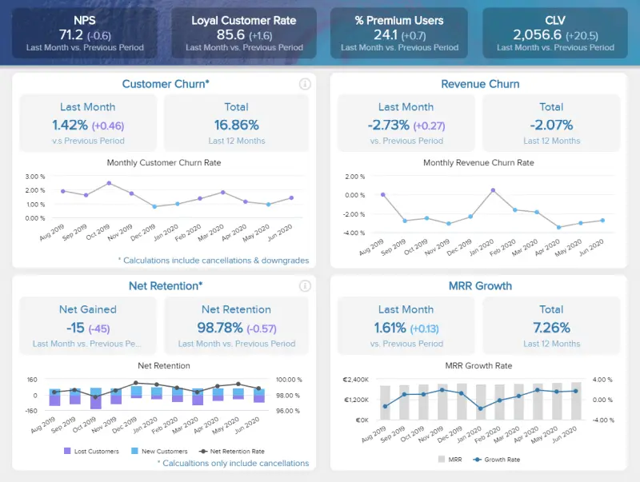
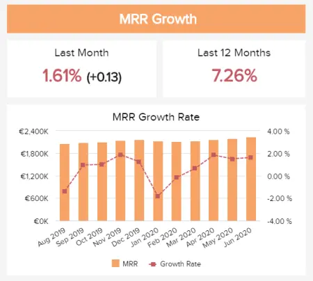
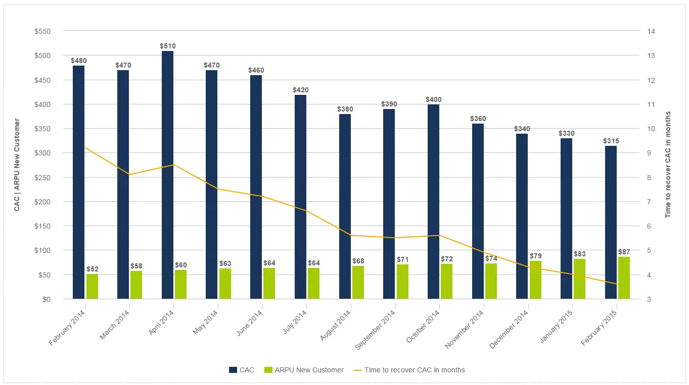

目录

[1） 什么是 SaaS 仪表板？](https://www.datafocus.ai/infos/saas-dashboard-examples-for-modern-business-management-practices#definition)

[2） 为什么需要 SaaS 仪表板？](https://www.datafocus.ai/infos/saas-dashboard-examples-for-modern-business-management-practices#why)

[3） 顶级 SaaS 仪表板示例](https://www.datafocus.ai/infos/saas-dashboard-examples-for-modern-business-management-practices#examples)

[4） SaaS 仪表板的关键绩效指标](https://www.datafocus.ai/infos/saas-dashboard-examples-for-modern-business-management-practices#metric-examples)

[5） SaaS 仪表板中应该包含什么？](https://www.datafocus.ai/infos/saas-dashboard-examples-for-modern-business-management-practices#how-to)

[6） SaaS 技术的优势](https://www.datafocus.ai/infos/saas-dashboard-examples-for-modern-business-management-practices#benefits)

在信息时代，数字技术已经发展到如此程度，以至于存在丰富的工具、应用程序和平台来增强企业在许多领域的运营方式。

软件即服务（SaaS）在过去五年中蓬勃发展，预计今年及以后的公共SaaS市场将呈指数级增长。

毫无疑问，SaaS市场拥有光明和繁荣的未来，但随着新的创新不断涌现，竞争从未如此激烈。

 

如果您是成长中的 SaaS 公司的一员，并希望加速您的成功，那么利用数据的力量是获得真正竞争优势的方法。这就是 SaaS 仪表板进入折叠的地方。

SaaS 仪表板是一种强大的商业智能工具，可为雄心勃勃的技术企业提供许多好处。在这里，我们将探讨 SaaS 技术和 SaaS 仪表板的实际优势，更详细地查看 SaaS 仪表板模板，浏览 SaaS 示例，并概述使用[SaaS 商业智能](https://www.datafocus.ai/infos/saas-bi)来发展业务的重要性。

让我们开始吧。

您的机会：[想要通过几次点击构建自己的 SaaS 仪表板？](https://www.datafocus.ai/console/)试用我们的专业仪表板软件 14 天，完全免费！

## 什么是 SaaS 仪表板？

SaaS 仪表板是一种管理工具，可整合和可视化重要的 SaaS 指标，例如 MRR、ARPU、CLTV 等，以便全面了解 SaaS（软件即服务）业务，实现更好的性能，并最终获得利润。

如前所述，SaaS企业在竞争激烈的市场中运营。通过使用相关的[SaaS KPI](https://www.datafocus.ai/infos/top-5-saas-kpis-every-company-needs-track/)，SaaS 仪表板提供了一种用户友好的方法来发现数据驱动的趋势、识别优势和劣势、做出明智的决策，并最终引导企业走向光明、繁荣和盈利的未来。

要了解有关 SaaS（软件即服务）的更多信息，我们建议您阅读我们关于 10 大[SaaS 趋势](https://www.datafocus.ai/infos/saas-trends/)的文章。

## 为什么需要 SaaS 仪表板？

既然我们已经考虑了“什么是 SaaS 仪表板”这个问题，那么是时候谈谈为什么您的业务需要一个仪表板了。很明显，SaaS 仪表板对于像您这样的软件即服务企业（如您）来说是无价的，这些企业希望发展自己的帝国并在竞争中获得至关重要的优势。无论您是需要开发[IT 报告](https://www.datafocus.ai/infos/it-report-templates-and-examples/)还是更深入地处理业务的[财务分析](https://www.datafocus.ai/infos/finance-analytics)方面，当您在干净的交互式屏幕上查看所有数据时，仪表板都将证明其价值。

为了将这一概念置于一个活生生的现实世界视角中，以下是您的企业应该利用 SaaS 仪表板模板、技术和创新无与伦比的力量的五个明确原因。

1） 数据管理

作为SaaS业务，您将需要分析与几个关键业务功能和活动相关的大量数据流。

虽然曾几何时，向下钻取到各种数据源既费力又分散，但现在使用 SaaS KPI 仪表板使您能够使用 KPI，从而提供与您的业务相关的见解。此外，由于 SaaS 指标仪表板在一个集中空间中提供所有数据，因此您无需浪费时间登录不同的应用程序或平台来获取所需的见解。

数据质量、速度和一致性集于一个简洁的软件包中。

2） 愿景

SaaS 指标仪表板改进了数据管理，但它也通过提供重要见解或指标的易于理解的仪表板可视化，使理解数据并与组织内外的关键人员共享发现变得快速而简单。

[仪表板创建](https://www.datafocus.ai/infos/dashboard-creator)者是任何现代软件即服务业务的强大工具。SaaS 仪表板软件基于提供您最重要信息的可访问可视化表示，使您能够通过数据可视化制定强大、准确的策略，这将使您的业务受益匪浅。

3）凝聚力

SaaS 仪表板示例是量身定制的，易于导航。由于它们提供跨多个平台的 24/7 全天候访问，因此可以通过增加对信息的访问来使您的整个组织更具凝聚力。

未能凝聚力运营的公司通常会阻碍他们的成长和成功，但如果组织内的每个人都能从他们可用的数据中获得最大收益，那么业务就会蓬勃发展——这是使用 SaaS 仪表板的一个明显案例。

4） 成长

更大的愿景意味着更大的增长。通过有效的[DSS 系统](https://www.datafocus.ai/infos/decision-support-system)获得识别数据中的历史和实时趋势的能力，您将能够在业务的所有主要领域进行改进。最终，这将导致持续增长。

如果您能够利用自己的优势并最大程度地减少劣势，您将能够领先于 SaaS 包，同时随着时间的推移稳步扩展。SaaS 仪表板软件是您始终如一地实现甚至超越目标的容器。

5）沟通与协作

在 SaaS 企业中，如果您希望您的业务随着时间的推移而扩展和发展，内部协作（或合作）至关重要。

有效的 SaaS 仪表板工具将为任何新兴的软件即服务业务提供增强通信和协作所需的指标和功能。

通过数据驱动的可视化和交互式 SaaS KPI 为企业中的每个人提供支持，每个人都将能够更好地表现，同时分享有利于跨部门协作的发现或想法，并最终促进业务的成功。

您的机会：[想要通过几次点击构建自己的 SaaS 仪表板？](https://www.datafocus.ai/console/)试用我们的专业仪表板软件 14 天，完全免费！

## 我们的顶级 SaaS 仪表板示例

SaaS 仪表板提供了丰富的业务增强优势，现在您已在更深入、更实用的层面上了解它们，是时候探索现实世界的 SaaS 仪表板示例了。

我们的执行 SaaS 仪表板模板具有交互性、直观性，并拥有凝聚力的 KPI 组合，有助于成功管理所有关键的软件即服务部门、职能和流程。

让我们更详细地探索这个创新的仪表板。

### a） SaaS 管理仪表板

我们最有价值的 SaaS 仪表板示例来自我们的[管理仪表板](https://www.datafocus.ai/infos/dashboard-examples-and-templates-management)系列，此可视化工具侧重于雄心勃勃的技术驱动型公司的执行级运营。

\*\*点击放大\*\*

任何成长中的 SaaS 业务都应监控的 3 个最关键领域是消费者、经常性收入和运营成本。

通过汇集所有MRR和帐户数据，您的SaaS帝国将根据过去，现在和预测数据全面了解您最有价值的业务指标。反过来，这种级别的范围使高级管理人员能够深入了解他们需要采取的行动，以使业务更有利可图。

此外，通过深入了解您的持续运营成本以提高您的流程效率，同时牢牢掌握您的客户生命周期价值和购置成本，您将能够制定实现全面 SaaS 行业主导地位所需的计划。

以下是我们的 SaaS 管理仪表板模板中的基本关键绩效指标的概要：

- 客户获取成本
- 客户终身价值
- 阿普
- 磁共振

### b） 使用 SaaS 技术创建的 CMO 仪表板

我们的尖端[营销仪表板](https://www.datafocus.ai/infos/dashboard-examples-and-templates-marketing)是一个光辉的例子，说明从技术角度来看，SaaS 仪表板软件如何使如此有价值的数据驱动见解成为可能。此示例重点介绍首席营销官。

\*\*点击放大\*\*

撇开部门或行业不谈，CMO（首席营销官）在推动业务的促销和客户驱动计划方面负有不可思议的责任。这个特殊的 SaaS[KPI 仪表板](https://www.datafocus.ai/infos/best-kpi-dashboard-examples)提供了提供可持续结果所需的指标。

作为我们最强大的 SaaS 仪表板示例之一（演示 SaaS 技术如何使此类数据驱动的创新成为可能），我们以 CMO 为中心的技术以推动增长为中心，同时监控网站流量与潜在客户比率、每条潜在客户的成本和 MQL 与 SQL 比率，以及许多其他重要见解。

总的来说，这些 KPI 和指标创建了一个更加智能、自信和知情的以客户为中心的生态系统，这将加速您的业务成功，同时帮助您[适应或应对](https://www.accesscorp.com/blog/digital-transformation-adapt-or-disrupt/)我们快节奏的数字时代的不断变化。

在这里，您将找到识别营销趋势、简化计划并提高效率所需的一切，同时在更深入、更有意义的层面上与您的受众建立联系——这证明了 SaaS 仪表板软件的业务推动能力。

下面是示例中描述的主要 KPI 的列表：

- 销售目标和增长
- 网站流量与潜在客户比率
- 每条线索的成本
- 潜在客户与 MQL 比率
- MQL 与 SQL 比率

### c） 客户保留仪表板

我们已经提到，任何SaaS业务的重点领域之一是其客户。出于这个原因，我们的下一个 SaaS 仪表板示例充满了有用的[客户保留指标](https://www.datafocus.ai/infos/customer-retention-dashboard-metrics/)，可以清楚地了解您的策略的执行情况。

\*\*点击放大\*\*

客户保留是任何软件即服务业务的支柱。通过让客户满意，公司的所有其他方面都应该得到改善，流失率应该最小化，利润应该增加。为此，该仪表板专注于 SaaS 业务，配备了优化策略和提高业务保留率所需的所有数据。

首先，我们快速概述了四个基本指标：NPS 分数、客户忠诚度、高级用户百分比和 CVL。通过快速浏览这些数字，您可以轻松了解公司的表现，它们越高越好。

接下来，SaaS 仪表板更详细地介绍了客户流失、收入流失、净保留率和 MRR。所有指标都以较长的时间段进行描述，并与不同的目标进行比较，例如，一年的前一时期或上个月。我们将在这篇文章中进一步深入探讨所有这些指标的重要性。

同时，以下是我们示例中的主要 KPI 列表：

- 客户流失
- 净留存率
- 收入流失
- MRR增长率

### d） MRR 仪表板

MRR 或每月经常性收入是任何 SaaS 业务的动力，因为它最终推动了增长并使这种商业模式脱颖而出。因此，使用自己的 SaaS 仪表板详细跟踪此指标可以帮助您了解订阅模式是否有效以及您的业务是否正在获得动力。

\*\*点击放大\*\*

MRR衡量公司预计在一个月内的可预测收入总额，它只是通过汇总每个付费客户支付的月费来计算的。对于大型SaaS企业，此过程可能既繁琐又耗时，因此，MRR通常使用ARPU或每单位平均收入进行计算。这样，您只需将付费客户总数乘以所有这些客户每月支付的平均金额即可。

详细了解我们的 SaaS 仪表板示例，如果您想从 MRR 中提取可操作的见解，则需要在分析中包含更多指标。如上图所示，仪表板显示与 MRR 相关的 5 个 KPI：

- 总MRR：每月经常性收入总额。
- 扩展 MRR：升级套餐或购买附加功能的客户数量。
- 流失的 MRR：由于客户取消或降级其计划而损失的 MRR。
- 新净MRR：新客户带来的收入。
- MRR 净增长：最后，使用以下公式计算 MRR 增长考虑所有其他指标：净新 MRR = 新 MRR + 扩展 MRR – 流失 MRR。

您的机会：[想要通过几次点击构建自己的 SaaS 仪表板？](https://www.datafocus.ai/console/)试用我们的专业仪表板软件 14 天，完全免费！

## SaaS 仪表板的 8 大基本 KPI

现在，您已经了解了 SaaS 仪表板的动态及其背后的技术，让我们探索有助于 SaaS 仪表板模板的业务改进动态的关键绩效指标 （KPI）。

每个可靠的 SaaS 仪表板示例都将包含交互式和高度可视化 KPI 的重点组合，这些 KPI 提供了业务中每个关键功能的全景快照。以下是最重要的指标 - 您不能忽视的指标。

1\. 获客成本

无论您做什么或提供什么，对注册客户的成本进行有意义的衡量都至关重要。

作为任何 SaaS 动态仪表板不可或缺的一部分，您的[每次购置成本 （CAC）](https://www.datafocus.ai/infos/kpi-examples-and-templates-management#customer-acquisition-cost) 将使您能够对业务模型进行战略性财务调整，同时提高整体运营效率，尤其是在您提供基于订阅的服务时。

通过使用这种最具交互性的 SaaS 指标并随着时间的推移跟踪您的 CAC，您可以获得降低购置成本所需的洞察力，同时简化业务中面向客户的关键方面。

2\. 客户终身价值 （CLV）

任何值得一提的 SaaS 分析仪表板或 SaaS KPI 仪表板都应包括[客户生命周期价值 （CLV）](https://www.datafocus.ai/infos/kpi-examples-and-templates-management#customer-lifetime-value) 指标。

CLV KPI 是典型 SaaS 分析仪表板中最不可或缺的元素之一，因为它可以让您清楚地表明在你们的关系过程中您可以从普通客户那里获得多少收入。

通过可视化特定时期的消费者收入并[设置特定的基准](https://www.investopedia.com/terms/b/benchmark.asp)，此 SaaS 仪表板示例将使您能够预测客户可能提供多少价值，从而使您能够分配资源，同时在此过程中进行更明智的投资。

这里游戏的目的是随着时间的推移逐步增加您的 CLV，这样做将巩固您在日益残酷的数字环境中的发展和增长。您生活中需要的 SaaS KPI 仪表板。

3\. 每单位平均收入 （ARPU）

最好的 SaaS 仪表板模板具有[平均单位收入](https://www.datafocus.ai/infos/kpi-examples-and-templates-sales#average-revenue-per-user) （ARPU） 指标，以易于理解的交互式格式呈现它们，以便快速做出决策。

此 SaaS 指标仪表板提供了在设定的时间范围内从您的合并销售中获得的平均客户价值的动态快照。通过访问这些非常有价值的 SaaS 仪表板软件信息，您将能够了解可能阻碍您的 ARPU 的因素，同时制定策略以智能、可持续的方式提高您的底线。在现代[仪表板设计师](https://www.datafocus.ai/infos/dashboard-designer)的帮助下，您也可以轻松将其可视化。

4\. 每月经常性收入 （MRR）

\*\*点击放大\*\*

我们已经在 MRR 仪表板示例中更详细地向您展示了此 KPI。无论您提供哪种类型的 SaaS，MRR 都是您应该在 SaaS 指标仪表板工具包中拥有的东西，因为它可以让您深入了解您的业务收入流，从而了解您的财务状况。

没有其他 SaaS 仪表板模板 KPI 可以为您提供更准确的业务发展以及每月可靠、经常性的商业势头。

MRR有几个SaaS业务促进分支以及多个用于计算每月经常性收入以获得最佳结果的分支。为了帮助您提高 SaaS 仪表板的工作，以下是[每月经常性收入](https://www.datafocus.ai/infos/monthly-recurring-revenue/)的基本指南，可为您带来阅读乐趣。

5\. 客户流失率

对于任何 SaaS 业务来说，客户流失都是一个特别重要的[客户服务 KPI](https://www.datafocus.ai/infos/kpi-examples-and-templates-customer-service)，因为它允许您评估客户在特定时间内停止使用该服务的原因，并为您提供客户保留策略绩效的真实概述。

流失率的计算方法是将月初的客户总数除以流失的客户总数。在上图中，我们看到一个图表，该图表将每月损失的客户与随之而来的收入损失进行了比较。这里的主要目标是将流失率保持在最低水平，一个健康的基准是每年 5-7%，每月 0，42-0，58%。

如果您的 SaaS 业务提供免费试用，请务必考虑在免费期后未能转换的潜在客户不应包含在您的流失计算中，因为这仅被视为未转换。仅当客户主动关闭帐户或取消已为您的业务带来收入的订阅时，才会发生流失。但是，您可以创建的许多策略来减少客户流失，也可以为您的产品增加价值并鼓励转化。

6\. 收入流失

任何 SaaS 指标仪表板需要包含的下一个顶级 KPI 示例是收入流失。此 KPI 与客户流失密切相关，因为它跟踪因客户流失而损失的收入金额。收入损失可以转化为取消、降级或业务关系的结束。这是一个特别重要的跟踪指标，因为它可以全面了解公司的财务状况。

尽管监控所有客户的整体收入流失很重要，但详细了解特定类型客户的具体趋势也很重要，例如，如果您的订阅价格根据其包含的功能而变化，并且您看到最昂贵的订阅损失的收入更高，也许您需要调查一下，看看客户是否得到了他们所支付的费用。

7\. 客户保留

我们已经在[服务仪表板](https://www.datafocus.ai/infos/dashboard-examples-and-templates-customer-service)示例中指出，SaaS 业务都是关于客户的，他们的大多数策略都是关于留住他们的。出于这个原因，客户保留指标不能被排除在 SaaS KPI 仪表板的基本指标列表中。

此 KPI 的计算方法是将执行重复业务操作的客户数量除以 SaaS 保持活动订阅并将其除以客户总数。不断增长的保留率是每个软件即服务业务的目标，这就是为什么它应该是在 SaaS 仪表板中跟踪的主要指标之一。

在上图中，我们可以看到两个图表，显示一年的客户保留统计信息。第一张图显示 6 月、7 月和 8 月有所下降;然而，在接下来的几个月里，它呈指数级增长，正如我们在第二张图中看到的那样，该图显示了92%的健康客户保留率，目标为90%。

8\. 净推荐值

最后但并非最不重要的是，在我们的 SaaS 仪表板基本指标列表中，净推荐值是净推荐值。这是一个对任何类型的业务都至关重要的指标，不仅在 SaaS 行业中，但仍然值得一提，因为它可以让您通过查看推荐来了解客户对您的服务的满意度。

上图显示了一个问题的结果，即从“0-10 你会向朋友推荐我们的服务”的范围内，结果分为发起者和批评者，然后减去以获得公司的总 NPS 分数。NPS 分数越高，对您的业务越好。

SaaS 公司可以从 NPS 分数中提取大量价值，例如，通过发送示例中的调查，客户可以提供有价值的反馈以改进服务。

您的机会：[想要通过几次点击构建自己的 SaaS 仪表板？](https://www.datafocus.ai/console/)试用我们的专业仪表板软件 14 天，完全免费！

## SaaS 仪表板中应该包含什么？

既然您知道需要在仪表板中包含哪些指标，并看到了一些可能对您的业务有用的模板，那么是时候了解成功的 SaaS 仪表板中应包含的要点了。

1\. SaaS 关键绩效指标的混合

第一步是选择 SaaS KPI 的组合，以确保您涵盖所有业务目标。SaaS 业务会产生大量数据，涵盖分析过程的所有数据可能会让您失去时间，您可以花在专注于绩效指标上，从中提取可操作的见解，这可以在[KPI 工具](https://www.datafocus.ai/infos/kpi-reporting)的帮助下轻松完成。

此外，还需要考虑要使用的指标之间的相互依赖关系。尽管仅一个指标就可以告诉您很多有关您业务特定领域的信息，但当您将其与其他指标配对时，您可能会遇到更高级的结论。

例如，通过跟踪每用户平均收入 （ARPU） 和客户获取成本 （CAC），您可以了解收回在获取新客户方面的投资需要多长时间。下图有效地显示了这一点，在该图中，图表将两个指标的性能与第二个轴上的一条线进行比较，该线预测 CAC 在几个月内恢复所需的时间。

\*\*点击放大\*\*

2\. 高质量的数据

深入到第一点，在创建 SaaS 仪表板时，您还需要在流程中考虑数据质量管理 （DQM）。DQM 是一个重要的过程，企业在其中评估其数据以确保其符合必要的质量标准，以满足他们在运营、规划和决策方面的需求。低质量的数据会影响企业的生产力以及整体投资回报率。

对于SaaS企业来说，使用错误的数据可能意味着对客户行为的理解不佳，这直接影响他们的盈利能力。企业可以专注于以下几个领域，以实现成功的数据质量管理：

- 数据概要分析：此过程涉及详细查看数据、运行统计模型以及将数据与其自身的元数据进行比较和对比。这是 DQM 流程的起点，为如何提高信息质量设定了标准。
- 数据质量：为了对数据进行良好的评估，您应该根据业务目标创建规则或参数。这些规则将定义数据是否被认为有价值或需要修复某些内容。
- 数据报告：这是删除和记录所有有危害数据的过程。
- 数据修复：这是确定修正数据的最佳方式和实施更改的最有效方法的过程。

重要的是要考虑到数据质量管理流程需要高级知识，因此您需要投资于一个能够以最佳方式执行 DQM 的团队。如果您想了解有关此主题的更多信息，请阅读我们的[数据质量管理](https://www.datafocus.ai/infos/data-quality-management-and-metrics/)实用指南。

3\. 交互式可视化

尽管数字是 SaaS 仪表板中最重要的部分，但如果没有正确类型的可视化来显示它们，它们将一无是处。无限的 Excel 工作表或静态图表不再足以提取能够为您的企业带来竞争优势的见解类型。出于这个原因，您应该投资提供交互式视觉效果的工具，这些工具将促进您的数据故事讲述。

DataFocus 是一种[BI 报告工具](https://www.datafocus.ai/infos/bi-reporting)，它提供了创建具有用户友好界面的[在线仪表板](https://www.datafocus.ai/infos/online-dashboard)的可能性，只需单击几下即可创建功能强大的报告。该工具的好处在于它的交互性。您可以从各种图形和图表中进行选择，以可视化您的数据并支持您的决策。此外，整个分析过程可以在一个屏幕上完成，并且可以根据需要使用数据的人员或需要支持的讨论来过滤数据。

4.可操作和可访问的数据

最后但并非最不重要的一点是，为了实现成功的 SaaS 仪表板，要使其对每个人都可操作和访问。

如今，借助广泛的[业务分析工具](https://www.datafocus.ai/infos/best-bi-tools-software-review-list)，您可以在一个 SaaS 仪表板中可视化来自不同接触点的所有重要 KPI，并自动执行流程，以便您拥有最新的数据。这两点将使您的仪表板成为可操作的工具，最终导致更好的决策。

此外，还应确保您的 SaaS 仪表板是用户友好的，并且组织中的每个人都可以访问。授权所有员工依靠数据进行工作流程，将确保您的业务可持续增长。

您的机会：[想要通过几次点击构建自己的 SaaS 仪表板？](https://www.datafocus.ai/console/)试用我们的专业仪表板软件 14 天，完全免费！

## SaaS 技术有什么好处？

作为处于起步阶段的创新技术，SaaS仪表板软件的历史相对较短，但众多好处已被证明是相当有利可图的。以下是最重要的列表：

1\. 传统 IT 部署的经济高效的替代方案

SaaS 解决方案的初始设置成本远低于本地系统，因为您无需构建自己的基础架构并雇用整个 IT 部门来维护它。您只需要通过互联网连接访问该软件并决定您的订阅计划。这可以在现代[云 BI](https://www.datafocus.ai/infos/cloud-bi)工具的帮助下完成。

2\. 快速集成

遵循第一点，制定计划和快速部署的能力将使您能够加快业务收益。管理和安装过程大大减少，而现代 SaaS 工具将使您能够在几分钟内连接各种数据库。由于快速集成的可能性，开发全面的[分析报告](https://www.datafocus.ai/infos/analytical-report-example-and-template/)不再是几天或几周的事情，而只是几分钟。

3\. 灵活且可扩展的解决方案

如果您想获得成功，那么在当今的商业环境中保持敏捷的要求至关重要。SaaS 工具使您能够选择符合业务需求的最佳交付模式，并随着业务的变化进行调整。附加功能提供从手机、平板电脑和笔记本电脑的访问，因此您可以随时随地访问您的信息和选定的[KPI](https://www.datafocus.ai/infos/kpi-examples-and-templates-)。

要了解有关如何管理不同接触点和提高公司灵活性的更多信息，您可以阅读我们关于[企业软件](https://www.datafocus.ai/infos/enterprise-software-applications-tools)主题的文章。

4\. 前所未有的数据分析

借助交互式仪表板和图表编译分析结果是 SaaS 解决方案可以提供的主要功能之一。可以以各种格式共享您的[KPI](https://www.datafocus.ai/infos/what-are-kpi-reports-examples/)报告并自动执行交付时间，收件人将始终拥有最新的数据状态，并有能力通过简单地利用专业[报告软件](https://www.datafocus.ai/infos/online-reporting)自行生成可操作的见解。

5\. 可持续商业智能 （BI）

在当今高度互联的时代，如果您是一家 SaaS 公司，强调可持续商业智能 （BI） 对于持续成功至关重要。

SaaS 示例的卓越分析洞察力、全天候访问和无缝软件升级创造了一场信息演进的完美风暴，使通过一致的 BI 推动创新成为可能。

撇开利基或行业不谈，您永远不应该低估[在线商业智能](https://www.datafocus.ai/infos/online-bi-tools)的力量 - 通过采用 SaaS 仪表板模板的强大功能，您将长期获得回报。

6\. 买入

SaaS 仪表板示例的另一个明显好处是，这些创新的可访问视觉性质使得说服内部和外部利益相关者了解某些活动、提案或计划的价值变得更加容易和有效。

最好的 SaaS 仪表板模板讲述了一个故事，描绘了生动的数据驱动图景，将帮助您为全面的业务促进计划提供有效的案例。获得高管的支持意味着您有更大的机会推动业务创新，从而推动您领先。

您的机会：[想要通过几次点击构建自己的 SaaS 仪表板？](https://www.datafocus.ai/console/)试用我们的专业仪表板软件 14 天，完全免费！

## SaaS 仪表板上的关键要点

数字时代有如此多的数据可用，了解什么是有价值的，什么是多余的对于成功至关重要。SaaS KPI 仪表板将帮助您做到这一点。

如果您想加速 SaaS 的增长和成功，让您的创新闪耀给所有人，采用数据驱动的方法将被证明是非常有效的。

在这一点上，您无疑会同意 SaaS 仪表板技术和创新是前进的方向。这种级别的数据驱动软件不仅有助于全面改善沟通和效率，而且还会为您的企业提供一定程度的愿景，帮助您在利基市场中脱颖而出。无论您是否需要开发[财务报告](https://www.datafocus.ai/infos/daily-weekly-monthly-financial-report-examples/)、营销或采购，SaaS 都可以支持任何数据驱动的事业。

另一方面，作为软件即服务提供商，您的产品或产品很可能建立在为现代构建的前瞻性解决方案之上。也就是说，在数据分析或商业智能计划方面，没有生活在过去的空间。

在数字世界中竞争、改进和发展的唯一方法是收集简洁的信息并将其发挥到最佳能力。如果你不这样做，你的竞争对手就会这样做——你将面临被抛在商业尘埃中的风险。

底线？我们生活在一个[商业智能](https://www.datafocus.ai/infos/bi-skills-for-business-intelligence-career/)至高无上的时代。那些利用正确的工具、平台和指标来增强其业务各个方面的人将取得胜利——尤其是在 SaaS 领域。这意味着拥抱 SaaS 分析工具的强大功能不是一种选择，而是必不可少的。

如果您想立即探索 SaaS 仪表板的业务提升优势并在竞争中领先，请尝试[DataFocus 进行 14 天试用](https://www.datafocus.ai/console/)。你不会后悔的。
