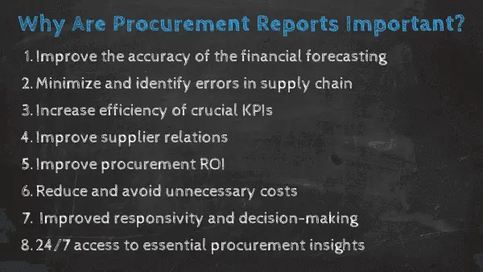
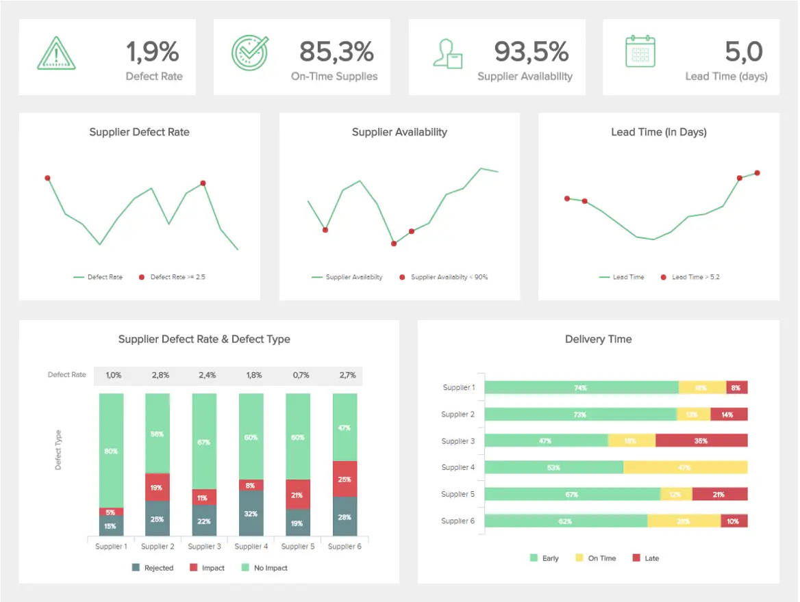
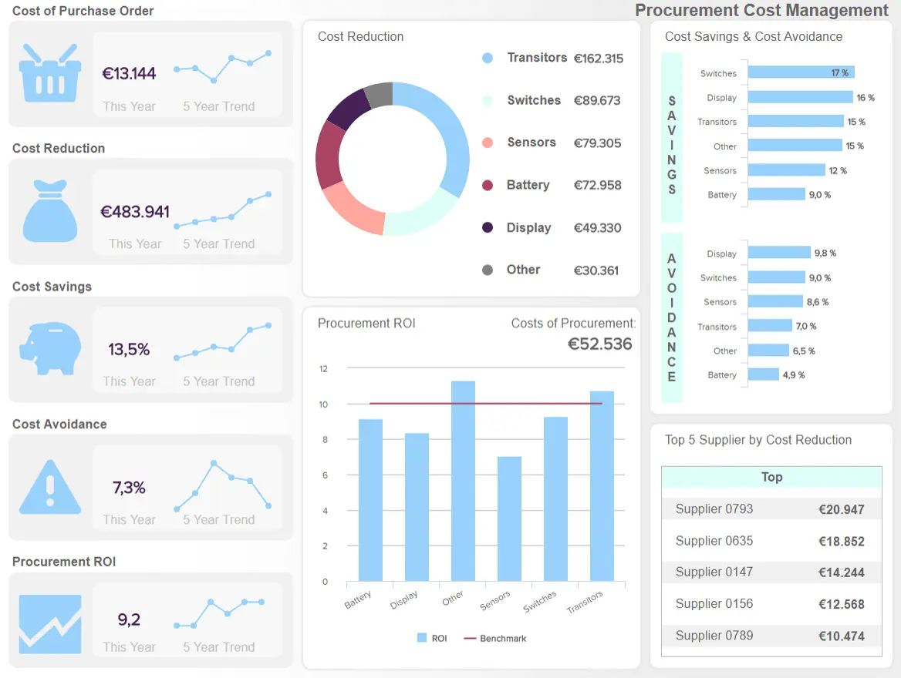

撇开创新、品牌和商业模式不谈，如果你的公司效率低下，决策不力，你的增长潜力就会受到阻碍。无论您身处哪个行业或行业，高效和战略性地采购商品和服务都将加速您的成功。有效的[采购分析](https://www.datafocus.ai/infos/business-intelligence-procurement)将节省您的时间和金钱，同时使您的组织更具生产力和可持续性。

如果您的采购流程花费了您宝贵的时间并产生不必要的成本，您最终可能会落后于竞争对手。

然而，我们生活在一个数字时代，统计数据、数据和深入的见解占据主导地位，使我们能够发现业务中的潜在问题和低效率。借助正确的[KPI 软件](https://www.datafocus.ai/infos/kpi-dashboard-software)，识别趋势和设定目标变得更加容易，这些目标最终将提高生产力、推动增长并提高利润。

在这里，我们将揭示公司采购报告的力量，考虑它们在数字时代的重要性，并研究如何制作它们。我们还将解释处理采购数据时出现的好处和挑战，为您提供发现效率低下的创新想法。

让我们开始吧。

您的机会：[想免费测试采购报告软件吗？](https://www.datafocus.ai/console/)我们提供 14 天免费试用。受益于出色的采购报告！

## 什么是采购报告？

采购报告使组织能够展示其采购活动如何实现资金价值，有助于实现其更广泛的目标，并提供其采购战略有效性的全景快照。

通过跟踪正确的[采购 KPI，](https://www.datafocus.ai/infos/kpi-examples-and-templates-procurement)公司可以通过防止轻微的低效率成为重大问题并清楚地了解有效或无效的做法或供应商关系来增强其战略的能力。

多年来，这些报告是通过传统的数据管理方式（如电子表格或静态演示）创建的和管理的，但公司需要抛弃这些石器时代的做法，并开始利用现代[在线报告软件](https://www.datafocus.ai/infos/online-reporting)来改变您的结果，并最终增加利润。接下来，我们将更详细地了解它们的重要性，以及最常见的挑战。

## 为什么采购报告很重要？

在数字数据提供丰富洞察力的时代，企业在采购策略方面不能在黑暗中射击。

IDC 的一项研究表明，来自销售、人力资源、采购和其他部门的80% 以上的受访企业领导者认为，出现问题是因为公司配备了不同的内部系统和应用程序，这些系统和应用程序不会相互“交谈”。43%的受访员工还表示，他们经常需要复制和粘贴或重新键入信息，从而浪费时间并阻碍生产力。

深入到采购流程重要领域的常见采购报告能够帮助您在当今残酷的数字环境中做出可以成就或破坏您的业务的改进。[数据报告](https://www.datafocus.ai/infos/data-report-examples)是一个水晶球，可以让我们一瞥公司采购活动的过去、现在和未来，帮助它以最好和最可持续的方式向前发展。

制作精良的采购报告结构有很多好处。其中一些包括：

### 1\. 提高财务预测的准确性

通过识别组织中的潜在问题区域，您可以轻松提高财务效率并节省成本。如果您定期跟踪成本，您的采购部门月度报告将包含关键的财务分析见解，这些见解将帮助您简化供应商管理流程，确定是否需要培训员工如何降低成本，并确保持续监控以确保您的[财务](https://www.datafocus.ai/infos/finance-analytics)得到良好管理和高效。财务预测对于采购活动的持续健康至关重要。通过使用现代仪表板，您将能够精确地交付投影。但不仅如此，交互式[财务图表](https://www.datafocus.ai/infos/financial-graphs-and-charts-examples)的使用还将使您的数据探索过程更快、更容易。

### 2\. 最大限度地减少整个供应链中的错误

通过在设定的时间范围内监控您对供应商的依赖，并确定哪些供应商在正确的时间提供正确的产品或服务，您可以轻松分析供应商的绩效，同时在整个业务中进行比较。在[仪表板设计器](https://www.datafocus.ai/infos/dashboard-designer)的帮助下，您可以简单地拖放您的值并创建交互式可视化效果，这些可视化效果将立即指出错误。这样，您将能够显着减少错误并提高您的生产力水平。

### 3\. 提高关键关键绩效指标的效率

由于需要考虑的领域如此之多，在定义指标测量周期时决定重点关注哪些 KPI 在初始阶段可能是一个挑战。在采购流程的所有领域扩展分析的价值在开始时可能很困难，但通过确保团队的所有关键成员都可以访问您的[KPI 报告](https://www.datafocus.ai/infos/what-are-kpi-reports-examples)并了解如何利用数据发挥优势，实现战略的步骤将很快变得清晰。例如，您可能希望跟踪关键的订单周期时间和订单履行速度，以便能够处理紧急订单，并考虑可以快速满足您的要求的提供商，而无需增加复杂性。

### 4\. 了解哪些关系有效

如果您创建定期采购报告，您可以轻松确定哪些供应商不仅在紧急时期可用，还可以根据许多其他标准（例如特殊折扣、反应时间和合同的其他合规参数）对它们进行分类。这样，您可以为每个提供商引入类别，并确定哪些提供商一方面与您的公司保持良好关系，另一方面哪些需要终止或更换。我们将在本文下面的示例中看到这一点。

### 5\. 进行准确的测量

另一个好处是，它们如何根据您的各种采购行动、计划和活动提供大量机会来提高您的投资回报率。通过提供采购旅程中每个关键方面的全景快照，将实现您业务的短期和长期目标。通过准确地衡量您的成功，您可以提高投资回报率，同时保持推动您前进的卓越标准。

### 6\. 减少和避免不必要的成本

由于采购是如此关键的组成部分，因此提供润滑组织齿轮并保持一切流动的油以及监控和分析流程的各个方面至关重要。从成本和交付到合规率和订单周期时间，有大量的见解可供探索。

随着公司的发展和壮大，扩展您的常见采购工作以反映业务的新需求也可能具有挑战性。但是，通过采用协作方法并遵循一些[仪表板最佳实践](https://www.datafocus.ai/infos/dashboard-design-principles-and-best-practices)来与您的关键业务目标保持一致，您将能够避免数据碎片，并继续从最有价值的见解中受益。

### 7\. 提高压力下的责任心和决策能力

就像几乎所有可以想象的业务流程一样，事件可能会发生，事情可能会出错。通过使用正确的采购分析报告，您可以“立即”应对潜在的挑战或变化，并创建最终节省时间和金钱的快速解决方案。

准确的实时和动态[在线数据可视化](https://www.datafocus.ai/infos/data-visualization-tools)的紧密组合意味着您可以一目了然地查明问题并完全自信地做出战略决策。因此，您的供应链可以始终保持流畅。

### 8\. 获得 24/7 全天候访问基本见解

另一个突出的好处是对现代[BI 仪表板](https://www.datafocus.ai/infos/bi-dashboard-best-practices)提供的数据的普遍访问。

现代采购报告可在多种设备上访问，包括台式机、平板电脑和智能手机。无论您身在何处，现代基于采购的工具将使您能够 24/7 全天候访问宝贵的信息和基本见解，而不是在办公室或特定位置依赖数据。

因此，即使您在旅途中，也可以衡量您的改进、应对潜在问题并制定策略。

现在您了解了为什么采购报告很重要，我们将重点介绍操作方法，并查看您可以在自己的采购操作中使用的最佳实践和技巧。

“一张照片的最大价值在于它迫使我们注意到我们从未期望看到的东西。”

您的机会：[想免费测试采购报告软件吗？](https://www.datafocus.ai/console/)我们提供 14 天免费试用。受益于出色的采购报告！

## 采购报告中应该包含哪些内容？

在构建此类报告时，重要的是要考虑一些应包含的基本项目，以便有一个成功的过程。在这里，重要的是要记住，并非所有项目都需要添加到一个报告中，但它们是构建数据驱动采购部门的绝佳起点。

- 成本控制：本节是关于成本的。在这里，您可以包括财政年度迄今的成本节省、自上一时期以来产生的成本、成本节约机会以及与需要进一步观察的成本相关的一些潜在威胁。
- 供应风险：在任何问题上保持领先一步是现代[在线数据分析](https://www.datafocus.ai/infos/data-analysis-tools)的巨大好处。供应风险部分将列出已识别的所有风险以及减轻每个风险影响的现实解决方案。这可以在预测分析等先进技术的帮助下完成。稍后会详细介绍！
- 内部客户关系：成功的采购流程的一个重要方面是与内部客户的关系，例如供应商、股东、其他部门的员工等。在本节中，您可以与内部客户共享有关已完成协作的所有相关信息，以确保每个方面都受到监控。
- 绩效检查：每个想要长期成功的采购部门都需要确保公司与最好的供应商合作。也就是说，该项目应监控不同供应商的表现，列出每个供应商面临的挑战，以及他们如何及时改进。这是有用的信息，因为它可以让您确保健康的协作。
- 流程改进：除了检查供应商外，您还应该监控采购日常工作中一般流程的发展。在这里，您可以跟踪每个关键流程是否平稳运行，并找到提高效率的改进机会。
- 寻源项目：顾名思义，此部分应跟踪与寻源项目相关的所有方面。为了使其尽可能高效，您应该将这些项目中的每一个分成几个阶段，这样您就可以详细监控每个阶段并在需要时提取结论。
- 战略合作：最后但并非最不重要的一点是，创新和协作是有利于此类报告的一个重要领域。有时，公司可能会发现自己与经验丰富的供应商合作，这些供应商可以提供创新的解决方案，企业可以将其应用于其他项目或流程。出于这个原因，重要的是要跟踪所有这些建议，以及它们在实践中如何发展并在未来考虑它们。

这些只是您可以包括的领域的几个示例，当然，这将取决于每个组织的需求和目标。让我们通过一些有用的提示更详细地了解这一点。

## 采购报告步骤和提示

确保您正确使用辛苦赚来的钱对于在当今残酷的商业环境中取得成功并保持成功至关重要。这就是为什么定期分析您的流程并利用各种类型的采购报告将确保您充分利用您的资源。让我们仔细看看最有用的技巧，以执行您的分析过程并从长远来看保持盈利。

### 1\. 定义您的目标和需求

流程的第一步应该是定义您的总体目标和需求。这将帮助您巧妙地组织资源并确保一致性。一些常见的采购分析目标包括降低成本、提高质量、确保与供应商的良好关系等。但是，报告也可以让您了解部门在实现公司总体目标方面所扮演的角色。为此，您可以问自己一些问题，例如：采购在组织中当前的战略角色是什么？我们与作为客户的内部利益相关者的协作程度如何？采购部门是否负责本组织的大部分直接和间接支出？

通过回答这些关键问题，您可以找到改进机会，这些机会将成为您部门的目标。但是，为了找到所有这些有用的信息，您首先需要处理您的数据，这将我们引向第二点！

### 2\. 识别并收集所有数据源

无论您的公司规模大小，您都需要收集和整合所有数据源 - 来自所有部门和单位，包括应付账款、电子系统或各种格式、平面文件、数据库等。从许多不同的来源提取信息将造成比可持续增长更多的混乱。您需要包含一个通用接口，您的数据将被存储，并在经理或团队成员需要创建报告时随时提取或操作。也许听起来这个过程需要一段时间，但使用[仪表板构建器](https://www.datafocus.ai/infos/dashboard-builder)将确保您的信息只需单击几下即可可视化，而无需花费无数小时或数天的时间。

### 3\. 清理数据

确定并收集所有数据后，就可以对其进行清理、分类和组织了。专业工具可以帮助您完成此步骤，因此您不必手动计算或搜索无穷无尽的文件以获取正确的信息。请记住根据您要查找的信息标准化您的分析。您还需要协调所有交易，以便能够提高所有支出流程的可见性，并确保您的采购策略将提高生产力。这听起来可能令人恐惧和令人生畏，但幸运的是，我们生活在一个数字舞台上，您可以利用现代机器学习功能并让软件完成艰苦的工作。

### 4\. 对供应商进行分组

为了确保最大的成功，对您的供应商进行分组和联系至关重要，以便他们彼此之间有明确的联系。例如，如果其中一个是可口可乐公司，请确保将其所有公司（如雪碧、芬达或可口可乐零）组合在一起，因为它们属于同一提供商。这样，您将最大限度地减少采购过程中的任何潜在错误，并获得最正确的信息来管理您的供应商。

### 5\. 管理支出数据

例如，您需要分析和优化来自内部和外部来源的支出数据，以便能够推动公司向前发展、降低成本并改善与供应商的关系。这是采购分析的关键部分之一，因为您可以轻松识别机会并提高支出流程的可见性。在此步骤中，您可以使用5Ws：谁？什么？哪里？什么时候？为什么？通过添加如何评估支出并查看在哪里更好地分配资源。其中一些问题可能包括：

- 我们从谁那里购买？
- 我们在买什么？
- 我们什么时候（多久）购买一次？
- 产品在哪里交付？
- 我们如何将数据与以前的时期进行比较？

如果您添加支出预测，以确保您清楚地了解采购流程对利润的潜在影响，您可以鸟瞰整个生命周期并降低成本。更多关于预测下一点的信息！

### 6\. 使用预测分析和自动化

扩展上述观点，在构建高效的采购报告时，预测和自动化可能是两个非常宝贵的工具。一方面，预测分析技术允许您分析有关支出、目录、供应商、材料等的历史和当前数据，以发现趋势和模式并预测未来结果。有了准确的预测，组织可以优化其战略，预测未来的价格趋势、可能的风险并寻找创新机会。

另一方面，与预测分析相结合，您可以从自动化技术中受益。定期生成报告可能需要数小时甚至数天。[BI 报告工具](https://www.datafocus.ai/infos/bi-reporting)（如 DataFocus ）提供自动化技术，允许您使用可用的最新数据自动生成报告。通过这种方式，您可以通过始终领先于任何新开发项目来最大化您的采购工作。

### 7\. 分析您的发现

无论您是需要监控和分析特定的[供应链指标](https://www.datafocus.ai/infos/supply-chain-metrics-and-kpis)，还是确保已协商出最佳合同交易，您都需要定期分析流程。这样，您可以减少每个类别的提供商数量并协商更好的合同费率，从而显着降低成本。请记住，只有正确完成计算和先前的步骤（例如清理数据），才能节省成本。这样，您就可以在几分钟内向管理层开发采购报告或将其发送给您的同事。当然，我们建议使用现代技术，因为时间就是金钱，您需要基于强大的[BI 功能](https://www.datafocus.ai/infos/business-intelligence-features)（如机器学习和智能[数据警报](https://www.datafocus.ai/infos/business-intelligence-data-alerts)）的软件来收集、存储、分析和监控您的数据。

### 8\. 创建叙述

采购过程很像一个故事——它有一个明确的开始、中间和结束。也就是说，一旦您分析了数据，您应该使用 KPI 和可视化来创建叙述或讲述数据驱动的故事。

数据驱动的叙事如此有效的原因是人类大脑对叙事的反应最好。通过使用您的数据创建逻辑图，您可以使用采购报告使信息全面可访问，从而改善内部沟通，同时消除供应链中的低效率。此外，当你描绘出一幅易于理解和易于理解的图景时，你可能会得到高管对新战略和投资的支持。

为了帮助您入门，您可以查看我们关于主题：[数据讲故事示例](https://www.datafocus.ai/infos/data-storytelling-examples-with-data-visualization)的文章。

### 9\. 依靠数据可视化

分析大量数据并让所有相关利益相关者参与流程并非易事，采购部门也不例外。我们刚刚讨论了使用数据创建叙述的重要性，但是您如何使受众能够理解、直观和有趣地进行叙述？答案很简单：数据可视化。

正如我们在本文中的某个时刻所提到的，传统的报告方式是静态的，创建它们非常耗时，更不用说对于没有技术知识的用户来说，它们很难理解。考虑到这个问题，出现了各种技术，使该过程成为更直观的任务。[BI 仪表板软件](https://www.datafocus.ai/infos/bi-dashboard-tools)（如 DataFocus）提供了一组图形、图表和仪表板，只需单击几下即可可视化您最相关的采购数据。

使用一组交互式可视化来讲述您的数据故事将帮助您使见解更易于理解，同时增强相关用户之间的沟通。这里需要注意的是，并非所有类型的数据可视化都对每种目的都有用。遵循一些数据可视化技术至关重要，这些技术将帮助您以最有效的方式讲述[数据](https://www.datafocus.ai/infos/data-visualization-techniques-concepts-and-methods)故事。

### 10\. 最后但并非最不重要的一点是：重复和学习

我们可以用一个简单的概念来结束本节：重复。无论您是需要升级[财务报告](https://www.datafocus.ai/infos/financial-reporting-and-analysis)程序以制定更有效的采购策略，还是需要清理数据以了解供应商是否值得您付出努力，您都需要不断评估您的策略。

如前所述，现代技术可以帮助您在此过程中自动更新您的信息，并通过设置自动时间表将其发送给利益相关者、同事或管理层，并且您无需再使用电子表格或手动计算。[商业智能仪表板](https://www.datafocus.ai/infos/bi-dashboard-best-practices)可以简化您的流程，并帮助您创建最佳的采购管理报告、日常运营，或者在发生异常时向您发出警报。

为了能够了解这是如何完成的，我们准备了一份采购报告样本清单，您可以仔细查看并在您自己的策略中实施。

“当观点取代洞察力和理解时，可能是一种危险的奢侈品，”加拿大传播学教授马歇尔·麦克卢汉（Marshall McLuhan）说。

您的机会：[想免费测试采购报告软件吗？](https://www.datafocus.ai/console/)我们提供 14 天免费试用。受益于出色的采购报告！

## 热门采购报告示例

现在，我们已经了解了如何创建此类报告，探讨了其优势并研究了一系列基本技巧，接下来我们将介绍四个主要仪表板，这些仪表板展示了它们的增强功能。

### 1\. 采购关键绩效指标仪表板

无论您是处理实物商品还是数字服务，采购都同等重要。这是因为该部门将组织的需求与其承包商联系起来，因此在任何企业的竞争力中都起着不可或缺的作用。

\*\*点击放大\*\*

也就是说，此采购状态报告模板提供了对部门成功至关重要的各种指标的全面概述。这个直观的[交互式仪表板](https://www.datafocus.ai/infos/interactive-dashboard-features)有助于总结采购部门的主要活动及其与公司供应商的关系。反过来，仪表板不仅有助于部门顺利和成功的管理，还有助于建立品牌知名度。

此仪表板将使您能够查明和跟踪大多数采购部门中的指标，以及详细信息以及向下钻取、交互和筛选可视化的每个部分的可能性。此外，您可以轻松导出或设置每周或每月的[自动报告](https://www.datafocus.ai/infos/automated-reporting-system-and-tools)，例如，将此仪表板与最新和更新的数据一起发送到您的收件箱中。在[在线商业智能软件](https://www.datafocus.ai/infos/online-bi-tools)的帮助下，采购管理从未如此简单。

主要关键绩效指标：

- 合规率：在采购中，合规代表公司及其供应商设定的基本协议。通过将每个供应商分解为明确的类别，此特定 KPI 提供了各个合作伙伴的合规性以及是否需要进行任何更改的清晰快照。
- 供应商数量：此 KPI 跟踪您在特定时间范围内对供应商的依赖程度。依赖太少的供应商并且未能使您的来源多样化可能会产生严重的依赖风险。相反，太多会减少有价值折扣的可能性。这个无价的指标将帮助您确定适合您组织的最佳提供商数量。
- 采购订单周期时间：订单周期时间是衡量端到端订购流程的指标，从提出采购订单到订单审核、收货、发票和付款。通过减少这段时间并消除任何低效率，您不仅可以提高生产率，还有助于提高品牌声誉。

### 2\. 供应商交付仪表板

此采购报告模板基于供应商在正确的时间为您的企业提供正确的产品和服务的能力。

\*\*点击放大\*\*

通过基于缺陷率和交付时间等元素的指标和 KPI 的组合，所有这些都旨在提供有关单一供应商绩效以及整体绩效的宝贵信息，这是您的企业绝对需要的一个仪表板。分销商是采购策略的关键部分之一，您必须衡量关系和合同的每个部分，例如缺陷率、供应商的可用性、装载时间等。让我们仔细看看这些宝贵的 KPI。

主要关键绩效指标：

- 可用性：此 KPI 衡量您的供应商持续响应紧急需求的能力和能力。在消费者购买习惯不断变化以应对不断增长的购买渠道的时代，确保您的分销商能够应对波动的订单和请求从未如此重要。而这个 KPI 将帮助您做到这一点。
- 缺陷率：在我们快节奏的数字时代，几乎没有时间犯错，持续的缺陷可能会损害品牌的声誉。这个宝贵的采购KPI衡量您各个供应商在质量、服务和产品方面的质量，并帮助您将潜在问题扼杀在萌芽状态，以免它们对您自己、您的合作伙伴和您的客户造成伤害。
- 提前期：提前期有助于量化履行订单所需的总时间。这种洞察力的概念是尽可能缩短交货时间，同时保持卓越的质量水平。

### 3\. 采购成本仪表板

我们的第三个采购报告示例深入分析了与您的各种采购活动相关的成本和采购。

\*\*点击放大\*\*

为了成功优化这些成本，预测整个组织中各个业务部门的需求，并最终节省宝贵的时间，在一个中心位置监督整个采购区域至关重要。此示例提供了所有有价值的基于成本的信息的全景快照。如前所述，成功的采购过程的主要目标之一是有效管理成本的能力。如果您通过跟踪成本降低、避免和投资回报率等 KPI 来获得高质量的成本管理流程，您可以获得无尽的回报。让我们更详细地了解这些主要 KPI。

主要关键绩效指标：

- 采购订单成本：此指标有助于监视和控制企业每次采购产生的内部成本，从而从理论上表示从采购创建到发票结账的处理订单的平均成本。这些成本具有令人难以置信的变化水平，因此仔细查看它们并根据所需的时间长度决定采购订单的平均成本非常重要。
- 降低成本：作为采购成本报告最核心的组成部分之一，此 KPI 有助于简化所有采购活动和流程中的切实资金节省，从而显着提高组织的经济效益。
- 成本规避：通过提供您的各种承包商及其与您的业务相关的活动的视图，您将能够了解导致业务不必要成本的低效率领域，并制定策略以避免它们在未来。这些就是所谓的“软储蓄”，因为它们不直接涉及底线。尽管如此，这些节省仍然是无价的。
- 采购投资回报率：投资回报率有助于确定采购部门内投资的盈利能力。要计算采购投资回报率，您必须将年度成本节省除以内部年度采购成本，并将其表示为比率。这样做将帮助您从投资中获得最大价值，并且通过衡量这些指标以及其他关键指标，您将在相对较短的时间内看到显着的改进。

### 4\. 采购质量仪表板

\*\*点击放大\*\*

最后但并非最不重要的是我们的质量仪表板。这是一个有效的采购成本节约模板，这个最动态的仪表板深入到采购流程或供应链的端到端质量。

为了使采购流程保持稳健和弹性，保持质量至关重要。通过分析特定指标，可以简化您与供应商的关系，同时创建更好的合同并在此过程中最大化您的业务价值。这个尖端、节省成本的模板具有质量与基于预算的指标的紧密结合，将帮助您深入了解战略的特定部分，确保供应链的关键要素以最佳效率运行。

这个强大的采购报告样本采用逻辑且直观易懂的设计，可快速访问以顶级供应商、供应商成本和拒绝率趋势、管理支出等为中心的关键指标。

此仪表板中包含的每个 KPI 和指标都将告诉您优化采购流程质量所需的所有信息——我们现在将更详细地探讨它们。

主要关键绩效指标：

- 质量评级：基于监控和基准测试供应商关系绩效的 KPI，无论是现在还是未来，质量评级将帮助您正面解决供应链中的问题，同时精确评估承包商关系的价值。如果您发现滞后或特定问题，您可以采取纠正措施，同时在必要时更改供应商。
- 供应商拒绝率和成本：此采购部门月度报告将帮助您勤奋而自信地分析您的质量管理策略。您的供应商成本和拒绝率对您的业务持续增长至关重要。通过定期监控此指标，可以将代价高昂的问题扼杀在萌芽状态，同时制定战略计划，以确保采购流程的持续健康。
- 紧急购买比率：此采购报告模板指标将为您提供在特定时间范围内跟踪紧急购买所需的工具。通过这样做，您可以解决潜在的财务差异和组织瓶颈，这些差异和瓶颈将阻碍您的业务增长。这里的目的是保持较低的比率，以推动整个企业的可持续增长。
- 时间和预算采购：此指标将使您能够根据采购类别深入了解特定成本。在这里，您将获得准确的快照，了解您的预算和支出将在哪里推动您的采购计划。通过严格跟踪这些指标，您将能够采取有价值的措施，让您长期按时和预算。
- 管理支出：此 KPI 对于跟踪和优化您的顶级支出非常有价值。它以逻辑折线样式图表呈现，您可以保持预算的正轨，同时根据采购流程的关键财务要素（例如未充分利用的节省）发现趋势。这是持续改善和维持财务状况的有力指标。

## 采购报告的类型

现在我们已经介绍了一些可视化示例，我们将介绍组织内使用的一些常见类型的采购报表。

- 支出：顾名思义，支出报告有助于监控预算和采购部门的整体财务绩效。它们可用于实时将实际支出与批准的预算进行比较，并在效率变大之前发现任何低效率。支出分析回答的一些常见问题包括：我们在买什么？我们从谁那里购买？我们多久购买一次？我们什么时候买的？等等。像这样，企业可以降低成本并提高效率。
- 供应商基础：它有助于跟踪与单个供应商发展相关的每个相关细节。它通常包含详细信息，允许用户评估风险，可持续性，成本，库存使用情况，以及比较不同供应商的发展并提取可以引导公司前进的相关结论。
- 应付账款：应付账款 （AP） 允许您通过找到降低成本并仍然保持全面质量的方法来简化供应链。如果采购过程产生的支出超过预期，则可能导致效率低下以及时间和资源的浪费。为了避免所有这些事情的发生，AP允许优化现金流管理，最大限度地降低风险，并寻找创新机会，使业务从竞争对手中脱颖而出。
- 类别分析：此类型使用类别管理技术将材料、商品和服务中的数据分组到类别中以进行机会识别。这样可以识别供应商随时间推移的趋势和类别绩效的改进机会。
- 合同管理：顾名思义，这种类型的采购报告样本涵盖了合同管理的不同方面。它提供有关合同、合规性以及与供应商建立潜在合作伙伴关系的机会的指导和相关信息，这些机会可以使公司受益。它还涵盖了付款条件和到期日期等方面，以确保每份合同顺利运行。
- 节约生命周期分析：简而言之，节约生命周期用于评估一段时间内节省成本措施的有效性。公司使用它来评估不同的储蓄计划对采购过程的财务底线的影响。

您的机会：[想免费测试采购报告软件吗？](https://www.datafocus.ai/console/)我们提供 14 天免费试用。受益于出色的采购报告！

## 开始创建您的报告！

无论您专注于哪个利基市场或行业，如果不利用数据做出更好的决策、发现基本见解并开发能够产生真正组织影响的叙述，您就会落后于竞争对手。采购是几乎所有现代企业的一个微妙而重要的方面。在信息时代，在黑暗中射击没有任何借口。

在采购方面，几乎没有犯错的余地。通过以正确的方式处理数据，您不仅可以保持计划正常进行，还可以应对突然的变化并制定最终加速整个业务成功的战略。

总之，采购分析对于您的业务的成功和发展至关重要。通过利用这一系列的创新见解来发挥您的优势，您将获得商业成功水平，从而推动您领先。在尖端[采购仪表板](https://www.datafocus.ai/infos/dashboard-examples-and-templates-procurement)的帮助下，您将以从未想过的方式利用您的数据。

要了解有关使用仪表板增强采购分析工作的更多信息，您可以与我们联系或试用我们的[14 天免费试用](https://www.datafocus.ai/console/)版。我们期待您的来信！
