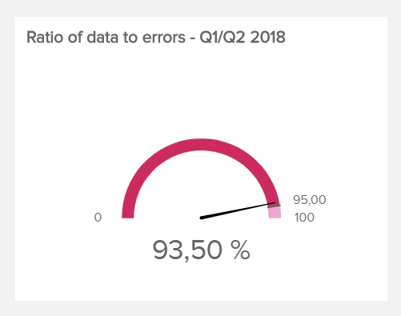
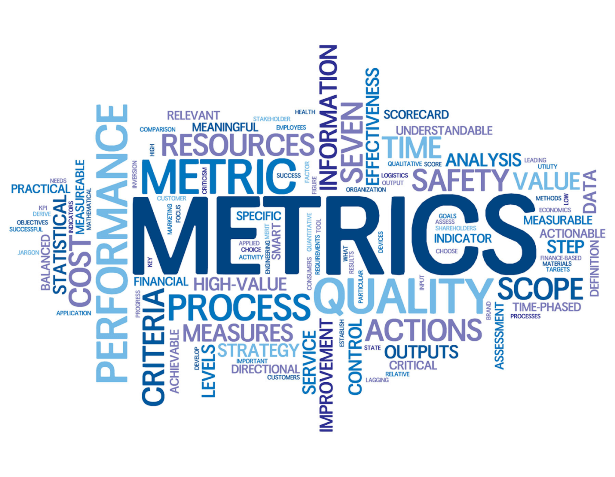
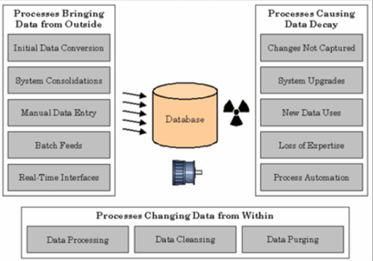

## 什么是数据质量管理 (DQM)？

数据质量管理(DQM)是一组旨在维护高质量信息的实践。DQM 从数据采集和高级数据流程的实施一直到数据的有效分配。它还需要对您拥有的信息进行管理监督。有效的 DQM 被认为对于任何一致的数据分析都是必不可少的，因为数据的质量对于从您的信息中获得可操作且更重要的准确见解至关重要。

您可以使用许多策略来提高信息质量。DQM 流程旨在成为数据开发的“瑞士军刀”，让您的组织做好准备，以随时随地应对数字时代的数据挑战。在本文中，我们将详细介绍 DQM 所涉及的一切：为什么它是必要的、如何衡量数据质量、良好质量管理的支柱以及一些数据质量控制技术。报告是有效 DQM 的一部分，我们还将介绍一些数据质量指标示例，您可以使用这些示例来评估您在此问题上的努力。

## 为什么需要数据质量管理？

虽然数字时代成功地推动了广泛的创新，但它也助长了所谓的数字时代的“数据危机”——低质量数据。但在开始任何事情之前：

**数据质量的定义是什么？**

数据质量是指对您拥有的信息的评估，相对于其目的和服务于该目的的能力。数据质量由不同因素定义，本文稍后将详细介绍这些因素，例如准确性、完整性、一致性或及时性。这种质量对于满足组织在运营、规划和决策方面的需求是必要的。

如今，公司的大部分运营和战略决策都严重依赖数据，因此质量的重要性更高了。事实上，低质量数据是先进数据和技术计划失败的主要原因， 每年给美国企业带来的损失高达 970 万美元（不包括世界上所有其他国家的企业）。更普遍的情况是，低质量的数据会影响生产力、底线和整体投资回报率。

稍后我们将讨论低质量数据的一些后果。但是，让我们确保不要陷入“质量陷阱”，因为 DQM 的最终目标_不是_ 创建“高质量”数据是什么的主观概念。不，它的最终目标是提高那些依赖数据的业务部门的投资回报率 (ROI)。

从客户关系管理到[供应链管理](https://www.datafocus.ai/infos/logistics-analytics)，再到企业资源规划，有效的 DQM 的好处是可以对组织的绩效产生连锁反应。有了高质量的数据，组织可以形成[数据仓库](https://www.datafocus.ai/infos/data-storage)，以检查趋势和制定面向未来的战略。在整个行业范围内，质量数据的积极投资回报率是众所周知的。根据埃森哲公司的大数据调查显示，92% 高管对使用大数据进行管理的结果感到满意，89% 的高管认为数据“非常”或“极其”重要，因为它将“像互联网一样彻底改变运营”。

如您所见，大企业的领导者清楚地了解优质数据的重要性。

## 数据质量管理的 5 大支柱

既然您了解了高质量数据的重要性并希望采取行动来巩固您的数据基础，那么让我们来看看 DQM 背后的技术以及支持它的 5 个支柱。

### 1 – 人民

技术的效率取决于实施它的个人。我们可能在技术先进的商业社会中运作，但人类监督和流程实施尚未过时。因此，有几个 DQM 角色需要填补，包括：

**DQM 项目经理：**项目经理的角色应由一名高层领导担任负责对商业智能计划进行全面监督。他还应监督涉及数据范围、项目预算和计划实施的日常活动的管理。项目经理应该领导质量数据和投资回报的愿景。

**组织变革经理：**变更经理所做的正是其名称所暗示的：组织。他通过提供对高级数据技术解决方案的清晰和洞察力来协助组织。由于使用[仪表板软件](https://www.datafocus.ai/infos/best-dashboard-software-features)通常会突出质量问题，因此变更经理在数据质量的可视化中扮演着重要的角色。

**业务/数据分析师：**业务分析人员负责业务的基本内容。此人从组织的角度定义质量需求。然后将这些需求量化为用于获取和交付的数据模型。这个人（或一组人）确保将数据质量背后的理论传达给开发团队。

### 2 – 数据分析

数据分析是 DQM 生命周期中的一个基本过程。它涉及：

1. 详细审查数据
2. 将数据与自己的元数据进行比较和对比
3. 运行统计模型
4. 报告数据质量

启动此过程的目的是深入了解现有数据，并将其与质量目标进行比较。它帮助企业在 DQM 流程中建立一个起点，并为如何提高其信息质量设定标准。完整和准确数据的数据质量指标对于这一步至关重要。准确的数据是寻找不成比例的数字，完整的数据是定义数据体并确保所有数据点都是完整的。我们将在本文的第三部分讨论它们。

### 3 – 定义数据质量

DQM 的第三个支柱是质量本身。应根据业务目标和需求创建和定义“质量规则”。这些是数据必须遵守的业务/技术规则，以便能被认为是可行的。

业务需求可能会在这一支柱中占据首位，因为关键数据元素应取决于行业。质量规则的制定对于任何 DQM 流程的成功都至关重要，因为这些规则将检测并防止受损数据影响整个数据集的健康状况。

就像抗体检测和纠正我们体内的病毒一样，数据质量规则将纠正有价值数据之间的不一致性。当与[在线 BI 工具](https://www.datafocus.ai/infos/online-bi-tools)结合使用时，这些规则可以成为预测趋势和报告分析的关键。

### 4 – 数据报告

DQM 报告是删除和记录所有受损数据的过程。应该将其设计为数据规则执行的自然过程。一旦识别和捕获异常，就应该将它们汇总，以便识别质量模式。

应根据特定特征（例如，按规则、按日期、按来源等）对捕获的数据点进行建模和定义。统计完这些数据后，可以将其连接到[在线报告软件](https://www.datafocus.ai/infos/online-reporting)，以报告质量状态和仪表板中存在的异常情况。如果可能，还应实施自动化和“按需”技术解决方案，以便实时显示仪表板信息。

报告和监控是数据质量管理投资回报率的关键，因为它们可以实时查看任何时候的数据状态。通过允许企业识别数据异常的位置和住所，数据专家团队可以开始制定补救过程的策略。

了解从哪里开始进行主动的数据调整，将有助于企业进一步挽回每年因低质量数据而损失的 97 亿美元。

### 5 – 数据修复

数据修复是确定的两步过程：

1. 修复数据的最佳方法
2. 实施变更的最有效方式

数据修复最重要的方面是执行“根本原因”检查，以确定数据缺陷产生的原因、位置和方式。一旦实施了这项检查，就应该开始整治计划。

依赖于先前有缺陷的数据的数据处理可能需要重新启动，特别是当它们的功能受到有缺陷数据的威胁或损害时。这些流程可能包括报告、活动或财务文件。

这也是应该再次审查数据质量规则的地方。审查过程将有助于确定规则是否需要调整或更新，并将有助于开始数据演化过程。一旦数据被认为是高质量的，关键的业务流程和功能就应该更高效、更准确地运行，从而获得更高的投资回报率和更低的成本。

## 您如何衡量数据质量？

要衡量数据质量，您显然需要数据质量指标。它们也是评估您为提高信息质量所做的努力的关键。在各种质量管理技术中，数据质量指标必须是一流的并且定义明确。这些指标包含质量的不同方面，可以用首字母缩略词“ACCIT”来概括，代表准确性、一致性、完全性、完整性和及时性。

虽然数据分析可能相当复杂，但所有关键的数据质量管理(DQM)涉众都应该了解一些基本指标。数据质量指标对于为未来的分析提供最好和最坚实的基础至关重要。这些指标还将帮助您跟踪质量改进工作的有效性，这当然是确保您走上正确轨道所必需的。让我们看一下这六类指标并详细说明它们所包含的内容。

**准确性**

指实时发生的业务交易或状态变化。应通过源文档（即来自业务交互）来衡量准确性，但如果不可用，则应通过独立的确认技术来衡量。它将指示数据是否没有重大错误。

衡量准确性的一个典型指标是数据与错误的比率，它跟踪相对于数据集的已知错误（如缺失、不完整或冗余条目）的数量。这个比率当然应该随着时间的推移而增加，证明您的数据质量会变得更好。数据与错误之间没有特定的比率，因为它在很大程度上取决于数据集的大小和性质 - 但当然越高越好。在下面的示例中，我们看到数据错误率刚好低于 95% 的准确率目标：

**一致性**

严格来说，一致性指定从不同数据集中提取的两个数据值不应相互冲突。然而，一致性并不自动意味着正确性。

一致性的一个例子是一个规则，它将验证公司每个部门的员工总数不超过该组织中的员工总数。

**完全性**

完整性将表明是否有足够的信息来得出结论。完整性可以通过确定每个数据条目是否是“完整”数据条目来衡量。所有可用的数据输入字段必须完整，并且数据记录集不应缺少任何相关信息。

例如，您可以使用的一个简单质量指标是数据集中的空值数量：在库存/仓储环境中，这意味着每一行商品都指向一个产品，并且每个项目都必须有一个产品标识符。在填写该产品标识符之前，该行项目是无效的。然后，您应该随着时间的推移监控该指标，以减少它。

**完整性**

也称为数据验证，完整性是指对数据进行结构测试，以确保数据符合程序。这意味着没有意外的数据错误，并且它对应于其适当的名称（例如，日期、月份和年份）。

在这里，一切都归结为数据转换错误率。您希望使用的指标跟踪相对于整体而言有多少数据转换操作失败- 或者换句话说，以一种格式存储数据并将其转换为另一种格式的过程未成功执行的频率。在下面的示例中，转换错误率随时间变化：

及**时性**

及时性对应于对信息的可用性和可访问性的期望。换言之，它衡量的是从预期数据到数据可供使用的时间之间的时间。

评估及时性的一个指标是数据价值实现时间。这对于衡量和优化这个时间至关重要，因为它对企业的成功有很多影响。获取有价值的数据信息的最佳时机始终是现在，因此您越早访问该信息越好。

无论您选择哪种方式来提高数据质量，您都将始终需要衡量您的努力的有效性。所有这些数据质量指标示例都可以很好地评估您的流程，不应被排除在外。你评估得越多，你就能改进得越好，所以控制好它是关键。

## 什么是数据质量指标示例？

在此处找到您可以使用的 5 个数据质量指标示例：

- **数据与错误的比率：**监控与整个数据集相比已知数据错误的数量。
- **空值数量：**计算数据集中有空字段的次数。
- **数据价值实现时间：**评估您从数据集中获得洞察所需的时间。还有其他影响它的因素，但质量是这次可以增加的主要原因之一。
- **数据转换错误率：** 该指标跟踪数据转换操作失败的频率。
- **数据存储成本：** 当您的存储成本上升而您使用的数据量保持不变，或者更糟糕的是，数据量减少时，这可能意味着所存储的大部分数据的质量很低，无法使用。

## 为什么需要更好的数据质量控制

### 高质量数据的好处

让我们来看看高质量数据在一个领域的好处：营销。想象一下，您有一个您购买的清单，上面有 1万封电子邮件、姓名、电话号码、企业和地址。然后，假设该列表中有 20% 是不准确的（这与上面 Ringlead 的图表数据相符）。这意味着您的列表中有 20% 的人有错误的电子邮件、姓名、电话号码等。这如何转化为数字呢？

好吧，这样看：如果您针对此列表中的姓名投放 Facebook 广告活动，由于这些虚假姓名条目，成本将比应有的高出 20%。如果您使用实体邮件，多达 20% 的信件甚至不会送达收件人。通过电话，您的销售代表将把更多时间浪费在错误的号码或无法接听的号码上。对于电子邮件，您可能认为这没什么大不了的，但是您的打开率和其他指标会根据您的“糟糕”列表而失真。所有这些成本迅速增加，导致美国公司每年面临 6000 亿美元的数据问题。

但是，让我们反过来看：如果您的数据质量控制到位，那么您将能够：

- 以比竞争对手更低的成本获得 Facebook 潜在客户
- 从您执行的每个直邮、电话或电子邮件活动中获得更多投资回报
- 向最高管理层展示更好的结果，使您的广告支出更有可能增加

总而言之，在当今的数字世界中，拥有高质量的数据是区分领先者和“失败者”的关键。

### 不良数据质量控制的后果

糟糕的数据质量控制会影响组织的各个方面，包括：

- 您的营销活动的成本和效果如何
- 您了解客户的准确程度
- 您可以多快将潜在客户转化为销售
- 您做出业务决策的准确性如何

RingLead 为我们提供了一个信息非常丰富的信息图表 ，它揭示了不良数据和干净数据的真实成本。以下是一个摘录：

_资料来源：__RingLead_

除此信息图外，Gartner 的一项研究 告诉我们，糟糕的数据质量控制使他们调查的公司平均每年损失 1420 万美元。

**无形成本**

但是，我们可以找到很多关于不良数据的有形成本的数据，我们无法直接检验无形成本。但是，我们可以在这方面发挥我们的直觉和想象力。

假设您正在努力在您的公司创建一种[数据驱动的文化](https://www.datafocus.ai/infos/create-dashboard-culture)。您正在带头开展这项工作，目前正在开展一项试点计划，以展示使用商业智能和分析做出[数据驱动决策的投资回报率。](https://www.datafocus.ai/infos/data-driven-decision-making-in-businesses)如果您的数据质量不高，那么您将遇到很多问题，向其他人展示 BI 的好处。如果你“事后”责备数据质量，你的话听起来就像是借口。

但是，如果您提前解决问题，向您的同事明确表示高质量是绝对必要的，并且是从数据中获得 ROI 的基石，那么您将处于一个更好的位置。

**一项巨大的无形成本：错误的决定**

也许您并没有试图让其他人相信数据驱动决策的重要性。也许您的公司已经使用了分析，但没有对数据质量控制进行尽职调查。在这种情况下，您可能会面临更大的打击：根据不准确的数据做出代价高昂的决策。

正如大数据专家 Scott Lowe 所说，也许最糟糕的是，决策是用糟糕的数据做出的：这最终会导致更大更严重的问题。他宁愿听从自己的直觉做出决定，也不愿冒险用不良数据做出决定。

例如，假设您有一个不正确的数据集，表明您当前的现金流是健康的。乐观地看，你们大幅扩张了业务。然后，一个或两个季度后，您遇到了现金流问题，突然间就很难向您的供应商（甚至您的员工）付款了。这种灾难性的情况是可以通过更高质量的数据来预防的。

### 3 低质量数据来源

_图片来源：__TechTarget_

我们刚刚介绍了如何清理可能不准确的数据。然而，俗话说，一分的预防胜过十分的治疗。考虑到这一点，这里有一些低质量数据的来源，您可以注意随着时间的推移保持记录的准确性。请记住：保持数据的高质量不是一次性的工作。这是一个永无止境的持续过程。

**资料来源#1：并购**

当两家公司以某种方式联合起来时，他们的数据就会融入这种新的工作关系中。然而，就像前一段婚姻中有孩子的两个人建立一段新的关系一样，事情有时会变得一团糟。

例如，您的两家公司很有可能，甚至非常可能使用完全不同的数据系统。也许你们中的一个公司有一个遗留数据库，而另一个已经更新了东西。或者使用不同的方法收集数据。甚至有可能关系中的一方拥有大量不正确的数据。

数据专家史蒂夫霍伯曼举了一个合并造成困难的例子。他写道，当这两个数据库彼此不一致时，您必须建立一个_赢家 - 输家矩阵_，说明哪些数据库的条目将被视为“正确的”。正如您所料，这些矩阵可能会变得非常复杂：在某些时候，“赢家-输家矩阵是如此复杂，以至于没有人真正了解发生了什么”，他说。事实上，程序员可以开始与业务分析师争论无用性和“抗抑郁药的消费量正在上升”。

**行动步骤**：如果有计划的合并或收购，请确保让 IT 负责人坐到谈判桌前，以便在签署任何交易之前提前计划此类问题。

**来源#2：从遗留系统过渡**

对于非技术用户来说，可能很难理解从一种操作系统切换到另一种操作系统所固有的困难。从直觉上，外行会期望事情已经“设置好”，以便最终用户可以轻松地进行转换。这绝对不符合现实。

许多公司将所谓的“遗留系统”用于已有数十年历史的数据库，当不可避免的过渡时期到来时，需要处理大量问题。这是由于数据系统本身的技术性质。每个数据系统都包含三个部分：

1. 数据库（数据本身）
2. “业务规则”（解释数据的方式）
3. 用户界面（数据呈现方式）

在从一个系统到另一个系统的数据转换过程中，这些不同的部分可能会带来不同的挑战。正如 Steve Hoberman 所写，关注的焦点是数据转换过程中的数据结构。但这是一种失败的方法，因为源和目标的业务规则层非常不同。转换后的数据在实际应用中不可避免地不准确，即使它在技术上仍然是正确的。

**行动步骤：**从遗留系统过渡到新系统时，您的过渡团队仅仅在一个系统或另一个系统中是专家是不够的。他们需要成为这两个方面的专家，以确保过渡顺利进行。

**来源#3：用户错误**

这是一个可能永远不会消失的问题，因为人类总要参与数据输入，并且人类会犯错误。人们经常打错东西，这必须加以考虑。在TechTarget的一篇文章中，史蒂夫·霍伯曼（Steve Hoberman ）讲述了他的团队如何负责“清理”数据库并纠正所有错误条目的故事。

你会认为数据清理专家是绝对可靠的，对吧？好吧，事实并非如此。正如霍伯曼先生所说，“仍有 3% 的更正是错误的。这是在一个以数据质量为主要目标的项目中！”

**行动步骤：**尽可能简单直接地创建公司使用的所有表单。虽然这不会完全防止用户错误，但它至少会减轻错误。

## 总结...

我们希望这篇文章为您提供了保持数据高质量所需的信息和工具。我们也希望您同意，数据质量管理是保持您的组织在当今数字市场中具有竞争力的关键过程。虽然维护高质量数据似乎真的很痛苦，但考虑到其他公司也觉得 DQM 是一个巨大的麻烦。因此，如果您的公司是努力使您的数据健全的公司，那么您将自动在您的市场中获得竞争优势。俗话说，“如果容易，每个人都会这样做。”

DQM 是创建高效[业务仪表板](https://www.datafocus.ai/infos/dashboard-examples-and-templates)的先决条件，这将帮助您做出决策并推动您的业务向前发展。要开始构建您自己的公司仪表板并从市场上最好的解决方案之一中受益，请[在此处开始您的 30 天免费试用](https://www.datafocus.ai/infos/registration/bi)！
