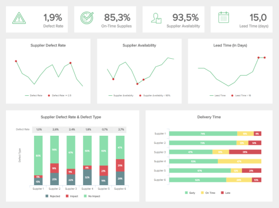

BI 报告工具是一个术语，用于描述旨在收集、分析、转换和报告来自各种数据源的数据并以可视方式呈现的平台类型，通常使用提供可操作见解的交互式仪表板。

多年来，业务报告的趋势是经理需要等待数小时或数天才能从 IT 部门或 SQL 开发人员处获得报告。即使只是快速分析，该过程也可能需要很长时间，从而减慢需要立即修改的工作流程和机会。今天，企业比以往任何时候都更多地收集大量数据，这些数据通常由于低效的数据管理而未被利用。考虑到这个问题，我们创建了自助式商业智能报告工具。

借助现代[BI 解决方案](https://www.datafocus.ai/infos/business-intelligence-bi-solutions)，企业可以利用其数据的力量并提取可行的见解，从而为他们带来竞争优势并确保持续的业务增长。借助自助服务工具，IT 部门的工作量将减少，您组织中的任何人只需单击几下即可执行数据分析并创建令人惊叹的[BI 报告，而无需任何技术技能。](https://www.datafocus.ai/infos/business-intelligence-reporting)BI 报告需要快速、彻底和直接，而现代解决方案可以做到这一点。

考虑到当今业务环境中收集的数据量，重要的是要考虑 BI 报告工具可以带来的所有好处：

- **基于事实的决策：**从 BI 报告软件解决方案中获取详细的报告可以极大地改进产品或服务的管理决策流程，以专注于开发或制造。它可以帮助读取财务信息、客户数据、生产数据和许多其他业务方面，以提取可行的见解并提高绩效。
- **识别新机会：**每个企业都需要知道他们如何与竞争对手和市场抗衡。由于使用现代商业智能报告工具进行的数据分析，决策者可以确定优势和劣势，更有效地应对机会，并确定需要采取的有利可图的行动。
- **提高效率：** BI 中的报告工具代表了节省成本和时间的强大力量。花时间和资源在正确的时间找到正确的信息会导致生产力、运营和战略效率的滞后。使用正确的工具，可以从一个访问点、一个软件、一个解决方案立即发现业务趋势。
- **了解公司的过去、现在和未来：**使用商业智能中的现代报告工具更容易掌握反映一段时间内业务绩效的数据。更好地了解市场统计数据、访问历史数据、基准测试以及利用可以告知正面和/或负面业务异常的智能数据警报，可用于规划未来的战略和运营任务。
- **交互式数据可视化：**人脑处理视觉效果的速度比文本或数字快 60.000 倍，考虑到这一点，不可能忽视带有[仪表板创建者](https://www.datafocus.ai/infos/dashboard-creator)的专业 BI 报告工具可以为您的组织带来的力量。数据管理面临的最大挑战之一是如何让每个人都能理解它。由于交互式可视化，企业可以通过交互式且易于理解的图形和图表，用他们的数据讲述一个引人入胜的故事，让每个利益相关者参与决策过程。
- **授权业务用户：**这是市场上所有[BI 仪表板工具](https://www.datafocus.ai/infos/bi-dashboard-tools)的目标。用户执行自己的分析，生成洞察力，而无需等待数天甚至数周来处理单个查询。实现动态交互的简单可视化为每个利益相关者带来了力量，并增加了不同部门之间的协作。然后在所有级别的战略和运营流程上创建公司的整体概览。

### 智能商业智能报告软件

与市场上没有多少其他商业智能报告工具不同。DataFocus 的开发考虑到了用户。我们的 BI 解决方案易于使用，因此您组织中的每个人，从 CEO 到新实习生，都可以使用它。我们还提供各种图形和图表，您可以使用它们来展示您的发现，并且使用 DataFocus 等[在线数据可视化工具](https://www.datafocus.ai/infos/data-visualization-tools)，您可以以他们能够理解的格式向您的同事提供信息。

DataFocus的 BI 报告工具允许您创建和共享充满图表和表格的动态[在线仪表板](https://www.datafocus.ai/infos/online-dashboard)，从而提高效率（不再等待 IT 人员的结果）。这使管理人员和部门能够全面掌握新的业务机会，并快速、一致且有效地监控正在进行的内部运营。

使用 DataFocus 的[在线 BI](https://www.datafocus.ai/infos/online-bi-tools)软件，您可以：

- **连接所有数据源：**您不再需要等待数小时或数天来生成报告和分析数据。借助专业的数据连接器，您可以将所有内部和外部数据源收集到一个单一的访问点。只需单击几下，您就可以在没有任何 SQL 知识的情况下执行跨数据库分析和复杂的商业智能报告。
- **轻松生成报告：**借助我们创新的拖放界面，您将能够通过强大的[BI 仪表板](https://www.datafocus.ai/infos/bi-dashboard-best-practices)比以往更快地分析数据。您需要做的只是将要测量的数据字段拖到要测量的位置，DataFocus 会为您完成所有工作。在短短几秒钟内，您将获得一份专业报告，而无需编写任何其他[MySQL BI](https://www.datafocus.ai/infos/mysql-tools)工具无法提供的代码。
- **受益于 SaaS 解决方案：** DataFocus 是一种软件即服务解决方案，可让您利用数据的力量并从在线环境中提取可操作的见解。无需复杂的安装过程或大量下载，您只需输入您的DataFocus 帐户即可获得所有信息。此外，通过投资用于商业智能的在线报告工具（例如 DataFocus），您可以避免维护或更新成本，因为软件会自动更新。
- **多设备可用性：**使用我们的一体化 BI 软件随时随地访问您的数据。借助 DataFocus 的在线功能，您可以从任何具有 Internet 连接的设备中可视化您的数据，而不是您不在办公室，或者您希望利益相关者能够从他们的个人 iPad 或手机中可视化数据，DataFocus 为您提供让您的 BI 报告更上一层楼的灵活性。
- **高级共享功能：**在组织内部培养协作环境是 DataFocus 的主要任务之一。这就是为什么我们的商业智能报告软件包括共享选项，例如可以受密码保护的实时 URL、您可以提前安排的自动报告，以便以您想要的任何格式（pdf、png、xls 或 csv）共享您的仪表板。为了确保您的数据始终安全，您的仪表板还可以共享特殊查看权限。这意味着接收者只会看到您允许他们看到的数据。
- **过滤您的数据：**您正在创建[客户报告](https://www.datafocus.ai/infos/client-dashboard-report-examples)、投资者演示文稿，或者只需要一份报告来支持常规团队会议中的讨论，静态演示文稿将不再适用。为了帮助您以最有效的方式讲述您的数据故事，DataFocus 的 BI 报告工具为您提供了在一个屏幕上可视化相关 KPI 的可能性。在呈现过程中，可以根据需要过滤数据。例如，如果您有一张包含所有目标国家/地区的地图，您可以单击一个特定国家/地区，仪表板中的所有信息都将根据该地点进行过滤。
- **展望未来：**借助可分析历史数据以识别绩效趋势和模式的预测分析技术，DataFocus 提供准确的预测，使您能够提前规划策略、找出特定情况的原因并发现在它们变得更大之前的任何问题。获得这种洞察力可以使您的企业的 BI 报告达到意想不到的效率水平。

使用 DataFocus，等待和麻烦都结束了。通过使用我们的商业智能报告软件和有效的[管理报告工具](https://www.datafocus.ai/infos/management-reporting-tools)您的业​​务发展重新回到您的手中。在几个步骤和几分钟内，您可以将您的数据库连接到我们的 BI 报告工具并开始生成有价值的见解。如果您可以浏览您的电子邮件收件箱，您现在可以创建并与您的管理层或其他利益相关者共享综合报告。现在，从小型初创公司到全球竞争者，任何人都可以利用我们直观易用的拖放界面为自己创建报告。基本上，DataFocus 已经将复杂的 BI 报告变成了一个简洁的系统，其工具可用于在 BI 中以一种足够简单的方式生成报告，每位员工无需复杂培训即可导航，但功能强大，即使是最有经验的商业智能专业人士也能欣赏。 开始使用 DataFocus 很容易，因为您需要做的就是连接您的数据库、CSV 文件、CRM 或 ERP 系统、Google Analytics 或 Google AdWords、社交媒体平台等，这将在您准备好开始之前花费不到 10 分钟分析。连接后，很容易通过我们的[自助式商业智能](https://www.datafocus.ai/infos/self-service-bi-tools)软件。

### 商业智能报告工具——使用 DATAFOCUS 创建您自己的报告

将原始、难以理解的数据转换为连贯、简洁的报告和信息从未如此简单。DataFocus 让您比其他企业和整个市场拥有明显的优势，从而增加您组织的长期稳定性。

即使是一些最好的 BI 报告工具也无法提供我们提供的功能——因为 DataFocus让公司有机会随时随地访问他们的仪表板和图表。使用我们基于云的工具，您不仅可以随时随地查看这些仪表板和图表，还可以随时随地运行复杂的 SQL 查询。只要您连接到支持互联网的设备，您就可以访问我们的所有功能——无论您是在办公室使用电脑、在上班途中使用智能手机，还是在度假时使用平板电脑尝试快速获得您需要的洞察力。

但是，没有什么比试驾更好的了，这是您真正能够体验到DataFocus [仪表板报告软件](https://www.datafocus.ai/infos/dashboard-reporting)的强大功能和易用性的唯一方式。这就是我们提供 30 天免费试用的原因。我们相信，在此期间，您会发现 DataFocus 对您的组织非常有用和必要，您将自己掌握[KPI 报告，让您的 IT 部门专注于更重要的任务。](https://www.datafocus.ai/infos/what-are-kpi-reports-examples)因此，继续尝试使用 DataFocus，看看这些惊人的报告可以为您的组织的发展做些什么。
