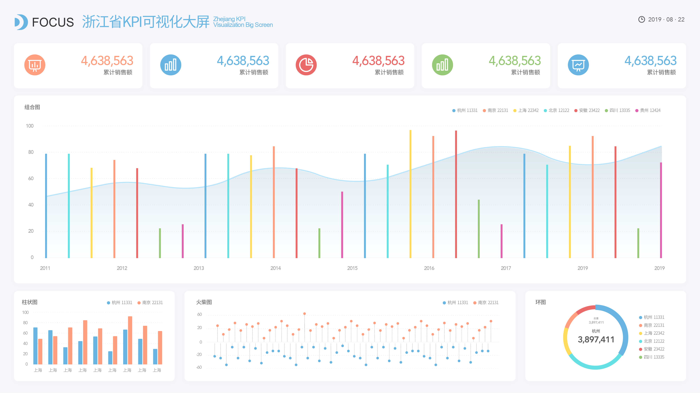

在这个大数据时代，企业尤其是TO C企业对于客户数据越来越多的以资产般对待，每个客户数据资产对于企业来说都是非常有价值的财富，对于做数据营销，客户服务和忠诚度管理都有着非常大的作用。我们前面说过，客户数据对于企业来说非常重要，甚至是很多BI工具如DataFocus或是CRM软件如数据赢家的分析基石。而每个应用一定都有一个理论依据，在此类应用方面，很多人会习惯于把客户数据分析与4P挂钩，并最终直接或间接的以4P或4C理论去导出。但其实，现在对于客户数据分析最流行的，应是4R理论。

首先关于4P和4C理论相信很多人都了解，这里做一个简单的介绍。4P营销理论：营销是企业计划和执行4P（产品/服务、价格、促销、渠道）策略的一个商业过程，旨在赢得满足客户同时实现企业经营目标，4P大多是以企业或企业数据为中心的。而对于4C理论，则是便利性、成本、消费者、沟通四方面，由劳特朋提出，是以客户数据和客户体验为中心的。

而关于4R，老司机们给出的解释如下：

关联（Relevancy）, 企业数据客户数据应是统一全景化管理，企业和客户是一个命运共同体。

反应（Respond），实时数据分析，站在顾客的角度及时地倾听（高度回应需求的商业模式） 。

关系(Relation)，周期性客户数据诊断，抢占市场的关键是与顾客建立长期而稳固的关系。

回报(Return)，反馈数据分析，交易与合作关系的巩固和发展在于一定的合理回报。

所以我们会发现，用4R来衡量和导出客户数据分析，相对于4P或4C，会更加的立体更加的有长远的价值。
