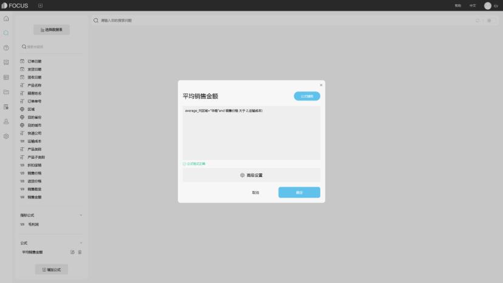
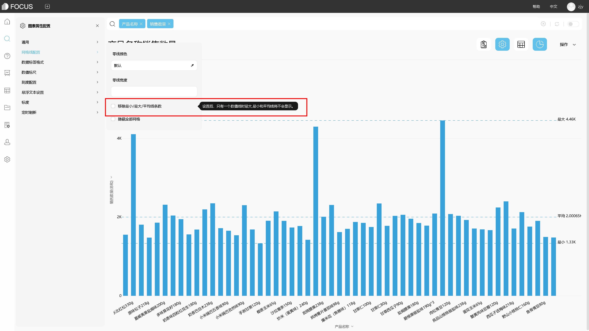
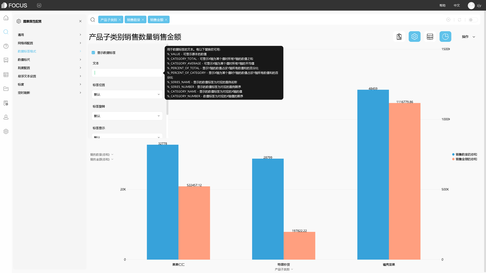
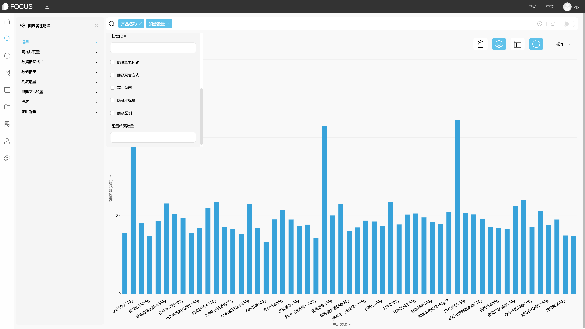

用DataFocus将Excel数据绘制图表后的编辑与美化

前面的内容我们了解到，专业的图表需要有 图表类型简单、观点表达明确、细节处理到位、设计美观等特点，以及了解了图表的绘制方式和图表的选择。今天，我们继续来看下，用DataFocus将Excel数据绘制成所需图表后，如何进行图表的编辑与美化。

# 一、图表编辑

在DataFocus系统的搜索模块搜索数据并在“图形转换”中选择合适的图表后，可点击图表右上方的“图表属性”，在页面左侧弹出的图表配置界面中对图表进行编辑；也可以点击图表对应轴，在跳出的配置页面对当前轴进行设置。

不同的图表有其特有的配置。下面以柱状图为例，探寻一些常见的图表配置。

## 数据列的随时添加

当需要对数据源表中数据进行计算并展示在图表中时，可以制作公式列，也可以直接在搜索框中使用公式和源列名进行数据计算。

制作公式列时，点击页面左下角的“增加公式”按钮，在进入的公式编辑界面，使用“公式辅助”中显示的、系统支持的公式进行公式列的制作，命名并保存后，同样是双击或在搜索框中输入列名以进行数据的搜索。

图表 1.1公式列

## 1.2 辅助线

在进行数据分析时，有时为了显示项目之间的差距，突出对比，会需要辅助线的参与，在DataFocus中，例如柱状图，系统会默认显示最大最小平均线，可以在配置界面的网格线配置中进行移除。

图表 1.2 辅助线

## 1.3 数据标签

在配置界面的“数据标签格式”中可以给图表添加数据标签，标签默认显示Y轴值，可以在文本中进行宏的替换。如下柱状图，也可以重新设置标签位置、标签旋转角度、显示方式、是否使用标尺缩写等。

图表1. 3 数据标签

## 1.3 “修剪”刻度的显示单位

在对图表的细节处理方面，一般会让坐标轴的标签尽量简洁。在DataFocus的图表中，可以在轴名称处设置数值列的格式，包括数字、货币、百分比、财务 等。根据不同的格式可以设置对应的数量单位和保留的小数点位数。

图表1. 4 格式

## 1.4 调整默认分类间距

在用DataFocus制作柱状图后，有时为了特殊的目的或美化图表，需要调整柱宽或柱间距。可以在配置界面的通用中，通过更改“柱宽比例”或“配置单页”进行调节。

图表1. 5 柱间距

## 1.5 x轴刻度标签

当x轴刻度过长，但需要显示更多内容时，可以在配置界面的刻度配置中，对刻度的旋转角度、间距、显示高度等进行设置。

图表1. 6 x轴刻度

## 1.6次坐标轴辅助设计图表

除了前面文章中提到双图表类型时涉及右Y轴的使用，在使用不同数值维度绘制图表，例如 显示各产品销售数量和销售金额的柱状图，也可以使用右Y轴辅助设计。如图，.点击图形右边的配置图按钮，在弹出的图轴配置界面中进行设置。

图表1. 7 右y轴

# 图表美化

经过美化后的图表能给人带来更好的体验，甚至增加数据的说服力。

## 2.1 美化原则

图表的美化一般遵循 简洁 、对比、整体协调性等设计原则。

图表简约，即图表中的每一点都有其存在的理由。除了图表的类型，还包括网格线、坐标轴、标签等修饰图表的元素。

图表可以采用对比强调的原则，对图表中重点信息进行强调处理，例如调整字体、颜色，以便于迅速抓住重要信息。

图表的整洁，体现在图表中所有元素排列整齐、和谐自然。

## 2.2 外观设计

外观的设计主要是从布局与配色两个方面。

### 2.2.1图表配色

同一份分析报告中，最好使用统一的配色方案。而在做图表时可以有目的使用颜色，用于突出、强调、区别等作用。图表中颜色数量不宜过多，一般少于六种。比较刺眼的颜色避免同时使用，例如大红、大绿，属于起强调作用的色彩。用相同色相不同明度进行配色，较不易出现不和谐现象。

在DataFocus系统中，图表的配色可以选择系统默认的主题配色，具体操作如下：

- 点击右上角的图表属性，打开图表属性配置页面。
- 点击通用-主题，选择需要的主题配色。

也可以自定义修改图形颜色，具体操作如下：

- 点击图形右侧的图例，选择某一项前的有色圆点。
- 在弹出的颜色选择框里选择想要改变的颜色。直接在左边选择想要的颜色，或者是在右边拖动小黑点选择不同颜色及其深浅程度。
- 最后点击“选择”。

### 2.2.2 图表布局

图表的布局，包括标题、绘图区、图例等元素。DataFocus在展现搜索结果时，生成的图表会有默认的布局样式，可以在图表配置界面、轴名称处重新设置。图表设置完成并点击操作栏下的“保存”项，以历史问答形式保存到系统中时，需要进行图表标题以及描述的设置。

用DataFocus系统将Excel数据绘制成图表后的编辑与美化，暂时介绍到这里。制作完成的图表可以在操作栏下保存或导出，以用于可视化大屏、数据分析报告的制作。
