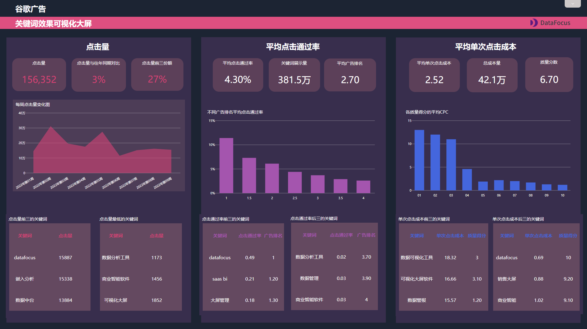

职场中要想升职加薪，那必是离不开工具的辅助。毕竟高薪职场精英都是把时间用在了对的事情上，而没有浪费在那些没有意义的事情上。

今天推荐4款职场必备办公软件，每一款都能大幅提升你的工作效率，成为职场精英。

## **1.**

## **疯狂番茄**

**拖延症克星，专注工作**

很多人工作的时候总是容易被各种事情分心，而无法专注工作。疯狂番茄就是利用科学的方法——番茄工作法，帮你制定计划、拆分计划并完成计划，循序渐进地把任务完成。它会将你的工作时间分成几段，每一段是工作25分钟就休息5分钟的时间间隔。

这款App界面精简，但简单好用。除了简易的番茄计时外，它还会记录一天下来的工作情况，你可以根据结果反馈调整下一次工作状态，直到调整到合适的状态。

这简直就是拖延症患者的福音。

# 2.

# Mweb

**专业的 Markdown 写作工具**

工作中常常会需要记录笔记，不论是记录要做的事，还是记录下思考的想法，这对于工作都有帮助。其实市面上有很多笔记工具，但这一款算得上是比较强大好用的。

首先是性能比较强大，打开和记录都是几秒内就可以完成，不会卡顿，很方便好用。其次，就是文档库了，像管理电脑磁盘一样管理书签，还可以导出Epub、PDF 和生成静态网站。

当然了，这款App只支持苹果macOS、iphone和ipad。

# 3.

# DataFocus

**搜索式数据分析，一键数据可视化**

工作中常常需要给领导做工作汇报、项目复盘等，一般都会用到Excel和PPT，但是时间和精力也真的很耗费。如果领导不满意就得反复修改，而太多的数据和文字放在Excel和PPT中，稍微有一些变动就容易卡顿，这要是忘了保存就得重做。

其实一个可视化大屏就能解决问题了。现在市面上有很多数据可视化BI工具，但这款DataFocus非常适合新手使用，不用学习代码知识，像谷歌一样搜索人类语言，系统就会以自动适配的可视化图表回答。

把所有制作好的图表直接套用大屏模板使用，就可以制作成酷炫的可视化大屏。图表配以文字说明，汇报内容一目了然还美观，老板看了都想给你点个赞。

此外，若有数据需要修改，直接替换原数据即可，大屏里的数据会自动更新。下一次还需要汇报，直接替换大屏里的数据和文字即可，完全不会卡顿。

当然最重要的是，**个人版免费**。

# 4.

# 讯飞语记

**语音转文字，更快记录**

会议中常常需要记录会议内容，工作中也会有临时性灵感涌入，这时候就可以直接把说的语音转成文字记录下来。

像微信语音最多只有60秒，转也只能转60秒的语音内容，但这款软件可以支持120分钟持续输入语音，而且识别率高达98%。

此外，它还支持拍照识别、发音人朗读、图文编排等功能。

# **小结**

聪明出于勤奋，天才在于积累。

相信在日积月累的学习和使用下，工作起来定会达到新的境界。你有什么推荐的职场必备软件呢？欢迎评论区评论、分享。
