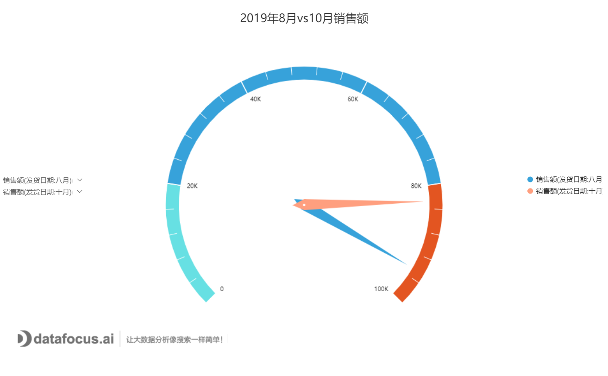
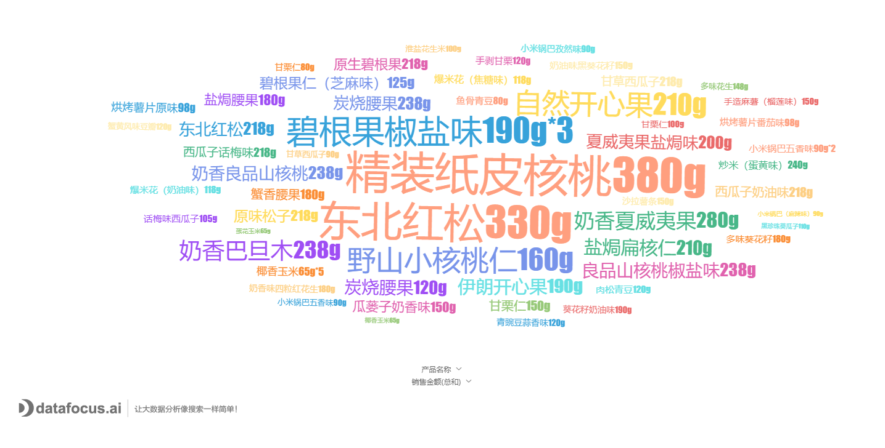

用什么工具制作信息图 (Infographic)？

那必须是DataFocus，多图预警。

1.散点图，用来观察各个数据点之间的关系以及分析变量之间的联系。

2.气泡图，可以用气泡的大小表示数值，角度比较多维，效果美观。

3.漏斗图，可以用于一个连续流程的完成情况分析。

4.帕累托图，按照发生频率大小顺序绘制的直方图，可以进行两个维度的分析。

5.仪表图，可以在确定的范围内对比多个数值项。

6.雷达图，常见于分析人物或者事物的各项水平，比较每个数据相对于中心的数值变化情况。

7.词云图，用于显示词汇出现的频率，字体大的就是出现频率较高的。

8.旭日图，利用父子层次结构来清晰地表达层级和归属关系，了解数据的真正构成。

9.打包图，其实就是将同一大类下的数据进行打包，数值较大的占的面积就较大。

10.桑基图，是一种特定的、可用于代表数据一步步流程的特殊图表类型。

DataFocus内置40多种图表类型，自定义图表样式很丰富，完全可以满足制作信息图的要求。
