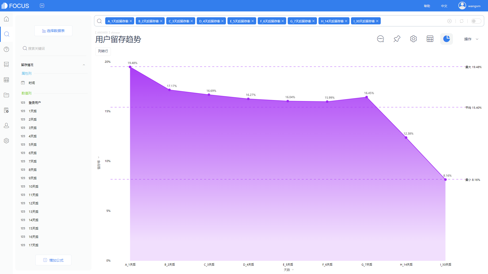
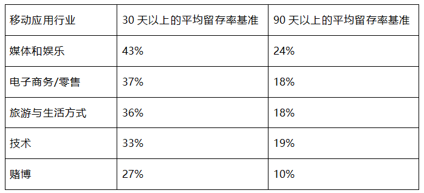

上一篇，我们介绍了用户激活的内容，今天我们就展开聊聊关于用户留存的话题，希望能对大家有所启示。

用户留存，是每个公司都要面对的一大难题。用户激活后需要立马想办法做用户留存，不然花费巨大成本得到的活跃用户都留不下来，那这钱就白花了。

所以留存是关键，生于拉斯，死于留存。

### **什么是留存率？**

简单理解用户留存，就是让用户在注册后仍不停的使用你的产品，并且成为回头客。

用户留存按照用户属性可以区分新增用户留存和活跃用户留存。其次，从时间维度可以划分次日留存、周留存和月留存等；如果设置自定义观察期，可以细分成2日留存、3日留存、4日留存、5日留存、6日留存、7日留存、14日留存等，一般是着重记录前7天数据，用来观察新用户质量。

留存率则是在给定时间段（日、周、月或季度）内继续使用产品的用户百分比，与用户流失相反。（如果您的90天留存率为25%，那么您的流失率为75%）

了解产品的留存率以及它如何与您的垂直行业甚至整个更大的移动App行业中看到的基准数据相对比，是确定您的客户参与和留存策略的重要部分。

截图来源：DataFocus（数据已脱敏）

上图使用数据分析工具DataFocus制作的用户1日留存率、2日留存率、3日留存率、4日留存率、5日留存率、6日留存率、7日留存率、14日留存率变化的趋势图。

### **如何计算留存率**

总保留率：

**月活跃用户数/安装量=总留存率(%)**

留存率还可以涉及群组分析，或者通过几种不同的方式计算留存率。您的总留存率只是每月活跃用户总数除以安装总数。

如果您想比较特定时间段的群组留存率，首先确定您要分析的群组，其次确定时间段，每周、每月、每季度，或者可以是自定义时间段，然后将时间段结束时保留的用户数除以时间段开始时的安装数，得到留存用户的百分比。

### **留存率的优缺点**

**优点：**

留存率是增长趋势和潜在收入的领先指标，显示了产品的粘性。留存率是一个比下载量或安装量更具洞察力的指标，因为如果您无法留住这些用户，那么您拥有多少安装下载并不重要。

按同类群组分析用户留存率特别有助于更好地了解用户行为并确定重大变化或趋势的可能原因。

截图来源：DataFocus（数据已脱敏）

**缺点：**

仅跟踪总体留存率可能会扭曲当前留存用户的趋势。例如，如果您对用户体验进行了重大改进，您的留存率可能会上升。但是，如果您仍在跟踪总体留存率，那么可能不会发生太大变化。

这就是为什么同期群分析（按特定时间段跟踪和比较留存率）如此重要的原因。

### **行业基准**

尽管确切的基准因行业而异，但移动应用程序的平均30天留存率为42%，90天留存率为25%。按行业划分的平均30天留存率从27%到43%不等，但对于性能更高的应用程序，该范围为32%到66%。

虽然90天的平均留存率在20%左右徘徊，但根据您所在的行业，最好将目标定为25%或更高。

### 小结

不同业务类型的产品，用户留存的侧重点也会不同，一定要根据具体情况进行判断；产品的功能越丰富、用户行为路径越多，做好“留存+转化”的难度就会越高，当然供发挥的空间也就越大。

相比用户激活，用户留存的工作涉及的工作内容更多，难度也更大，因此，产品经理需要花费更多的精力，通过数据看板查看每日、每月的留存数据，争取阶段性的重点提高用户留存。

做用户留存永远没有终点，必须时刻关注自身产品价值，持续不断的优化运营策略，争取不断优化用户留存。
