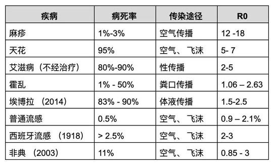
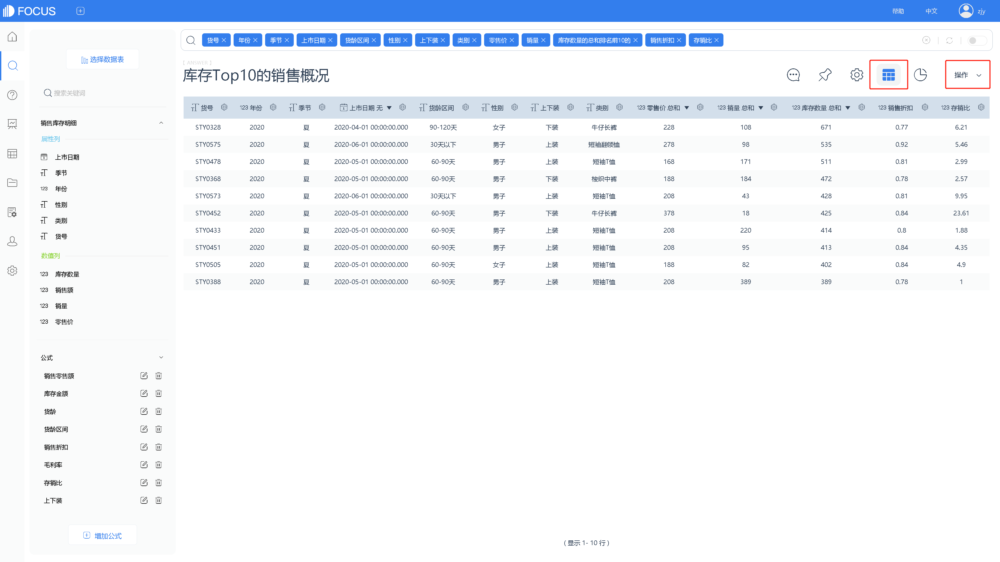
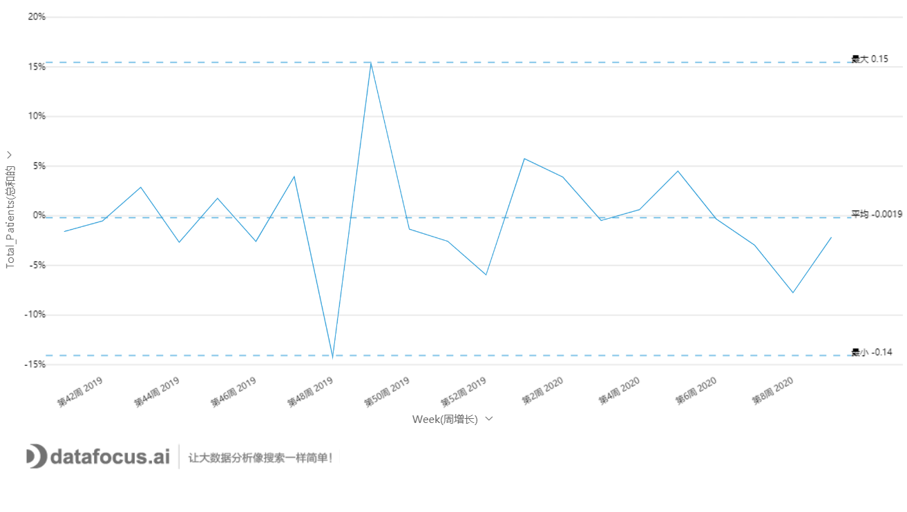
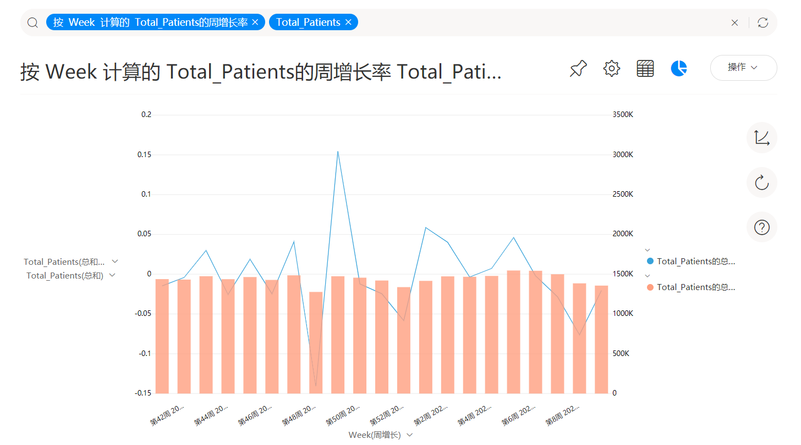

始发于2020年初的一场新冠病毒疫情毁了全国人民的春节，如今正在肆虐欧美日韩等海外强国——以至于坚挺了10年之久的美国大牛市也被终结，还创历史记录地出现了两次跌停熔断！甚至连89岁高龄的股神巴菲特老同志也瞠目结舌：活了一辈子还没见过这样的情形。

这场疫情，一开始就被美国某些媒体冠以“武汉病毒”的称谓（他们这么说的时候，大概是早就忘了起源于美国的H1N1，可从来没被称为“美国流感”）。然而这场蹊跷的病毒疫情，一开始就不同寻常——从中国疾控中心的调查来看，最初的感染者大部分集中在武汉华南海鲜市场。**但这并非全部，还有更早的感染者和华南海鲜市场毫无关系。**

1. **无风不起浪：事件始末**

早在2月21日，日本朝日新闻报道：“流感在美国仍在肆虐，已经造成14000人死亡。而事实上，这其中很多人是感染了新型冠状病毒。”报道还提到，本季度美国已有2600万人感染流感。同时，美国控制传染病中心宣布了令人惊讶的消息：在检查疑似患有流感的病人的样本时发现，**很多病人患的并不是流感**。

然而，对于朝日新闻的报导，美国疾控中心并没有承认。

图1：朝日新闻报道

2月27日，在美国确诊第一例不明来源的新冠病毒患者之后，台湾东森新闻的电视节目中，主持人引用了中国科学院西双版纳热带植物园郁文斌博士的论文。论文中提到，美国病例的病毒基因比中国病例更古老，新冠病毒的源头在美国。但是很快就有专家进行了辟谣。原来是该论文中提到的，溯源的所有来源于美国的14个患者，都跟武汉有关。

图2：台湾东森新闻报道

**3月11日，美国CDC主任罗伯特.雷德菲尔德承认存在死于新冠肺炎的病例被误认为是流感死亡病例的情况**；3月12日晚，中国政府外交部发言人赵立坚在推特上发文：“美国欠我们一个解释”！

图3：赵立坚推文

外交部发言人华春莹当天也用英文发推，“罗伯特·雷德菲尔德博士透露：之前在美国诊断为流感的一些病例，事实上患的是新冠肺炎。将新冠病毒称作‘中国新冠病毒’，绝对是错误的、不恰当的。”

1. **美国流感数据分析**

那么病毒究竟起源于哪里呢？如果说发源于2019年9月的美国大流感，就是新型冠状病毒疫情的起源的话，也许分析美国流感的数据可以为我们揭开这个秘密。好在美国疾控中心也公开了相应的流感统计数据（网址：[https://www.cdc.gov/flu/index.htm](https://www.cdc.gov/flu/index.htm)）。

在[流行病](https://baike.baidu.com/item/%E6%B5%81%E8%A1%8C%E7%97%85" \t "https://baike.baidu.com/item/%E5%9F%BA%E6%9C%AC%E4%BC%A0%E6%9F%93%E6%95%B0/_blank)学上，传染病都有一个基本传染数（Basic reproduction number），它是指在没有外力介入，同时所有人都没有免疫力的情况下，一个感染到某种传染病的人，会把疾病传染给其他多少个人的平均数。基本传染数通常被写成为R0。

图4：各种病毒R0值表

我们都知道，新冠病毒之所以厉害，最关键的特点就是传染力强——在没有外界干预的情况下，R0值是大于3的。流行感冒的特征也是传染性强，H1N1据统计在1.2-1.6之间。我们来看看湖北省疫情早期的新冠病毒感染者周增长曲线：

图5：湖北省确诊病例增长曲线

下图是意大利的感染者增长情况，与湖北省的情况何其相似：

图6：意大利确诊病例增长曲线

再来看看美国流感大流行的数据：

图7：美国CDC统计流感患者周增长趋势

图8：美国CDC统计流感患者数量及增长率

从图7和图8来看，美国的流感周增长率呈现平稳波动的状态，整体维持在正负5%的区间。从总确诊人数来看，自2020年第6周后，还进入了回跌状态。从这些数据来看，美国的流感疫情，似乎并非新冠疫情。

然而，根据CDC官方曾经的估计，去年的美国流感患者数量可能在2000-3000万区间。而图8展示的最终确诊人数，却远低于这个数目。这样的差异不禁令人“浮想联翩”。

其次，假设这份数据是高度可信的，那么我们不得不怀疑另一种可能性的存在——美国流感中的部分患者确实携带有新冠病毒，然而感染性却不强；在武汉军运会后，美国军人携带有的病毒发生扩散和变异，传染性大大提升，最终变异后的新病毒造成了全球大流行。

不管是哪种可能性，我们都希望美国政府能给中国中民、给世界人民一个解释，也希望科研界加快研究步伐、让真相水落石出。虽说传染病是天灾人祸，但某些“不作为”导致的全球流行和家破人亡实乃人间惨剧，任何渎职的人都应当被追责！

我们真诚地希望，这个“冬天”能早日过去。
