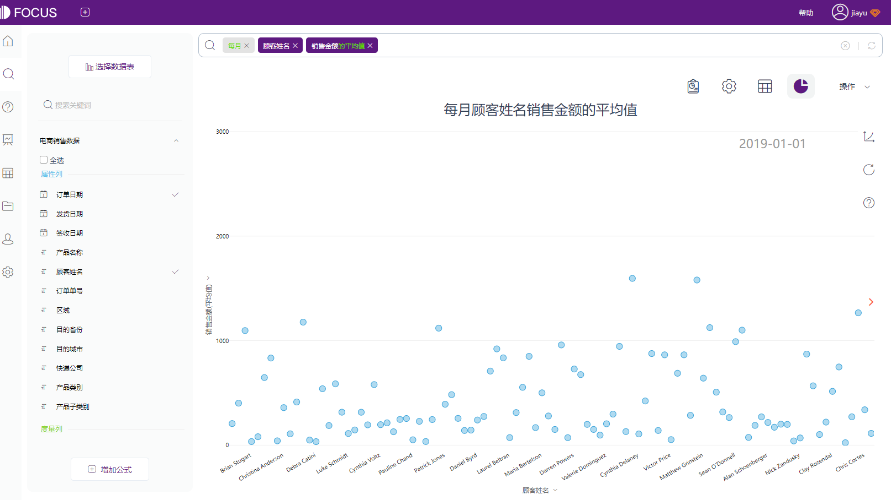
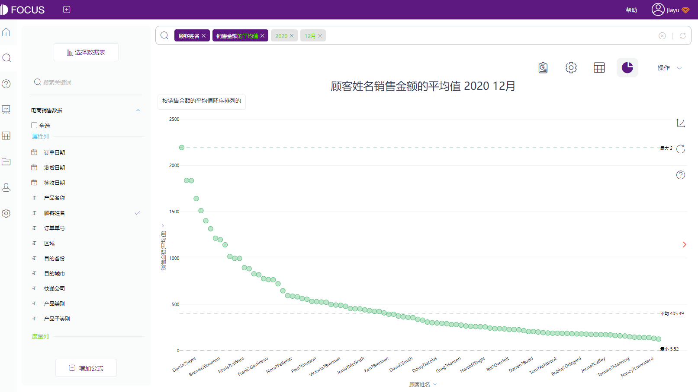

到本季度末了，是时候对你的电子商务业务进行健康检查以了解情况如何。但是你从这么多来源收集数据——你怎么知道哪些电子商务KPI（关键绩效指标）是最重要的？

正如Adventure Cats的联合创始人劳拉·莫斯（Laura Moss）所建议的那样，“你所能追踪的KPI数量之多可能会让人难以承受......建议你挑选最能反映你企业健康状况的几个KPI，并将重点放在这些KPI上。”

在为你的电子商务业务选择正确的KPI时，必须跟踪成本指标，如客户获取成本（CAC）。以及收入和客户保留指标，如返回客户的百分比。这种组合将为你提供最佳的公司整体健康状况信息。

以下是电子商务专家建议跟踪的前12个KPI，并按重要性对它们进行排名。

## **1、转化率**

转化率，在访问你的网站或产品页面后进行购买的人的百分比。

你可以跟踪整个店铺的转化率，也可以将其分解，查看特定页面或用户旅程部分的转化率。例如，你可以查看广告活动中每个步骤的转化率，以及整个广告活动的转化率。

转化率是电子商务公司的重要指标，需定期对其进行监控。转化率的小幅提高可能会导致每月或每年的收入大幅增加。

**专业提示：**分别跟踪来自不同来源的转化率，以了解你可能需要改进的地方。比较网站转化率与付费社交、自然社交和其他渠道的转化率。一旦你知道哪些渠道的转化率最低，就可以集中精力对其进行优化。

## **2.平均订单价值**

平均订单价值(AOV) 是一个人在你商店的单个订单上花费的平均金额。AOV越高，利润率越高。单笔订单可以带来更多收入，但只会产生一次交易成本（如包装和运输）。

AOV 还可以帮助你衡量你吸引的客户帐户的规模。“平均订单价值，对于了解我们吸引了较大的还是较小的客户来说很有价值。这归结于 80-20 法则，即 20% 的客户带来 80% 的收入。”

**专业提示：**每月做一个订单散点图，看看异常的高或低异常值是否会影响平均订单值。如果你的订单量相对较小，则异常值可能会产生特别显著的影响。散点图将帮助你显示AOV是否指示了一种实际上不存在的趋势。

像DataFocus这样的数据分析平台可以提供帮助。除了可以制作“本月的订单散点图”并随时间自动更新图形外，还可以制作每月的时序散点图、查看固定月份的散点图等等。

 

## **3、毛利率**

毛利率衡量扣除营销和管理费用等运营成本后的实际利润。它显示了你的业务的盈利能力，包括收入和基本费用。

通过跟踪毛利率，你可以了解你的销售成本(COGS)是否过高或定价是否过低。如果是这样，你可能需要调整定价或进行更改，以提高生产和销售渠道的效率。

**专业提示：**查看单个产品的毛利率以及整个公司的毛利率。

## **4\. 总收入**

总收入是给定时期内的总销售额。逐月跟踪此指标 (MOM) 以查看销售额是否在增长（增长幅度有多大）以及你的销售流程有多有效。

“我们所有产品类别的固定成本通常相同。这使得收入成为一个简单而容易的北极星，可以确定业务的整体健康状况和增长。”——莫雷尔（Morrell）

如果你的成本在每个月或不同产品类别之间存在显著差异，你可以通过跟踪包含成本的电子商务 KPI（如毛利率）来更好地了解公司的健康状况。

**专家提示：**跟踪每月的总收入以及销售数量。

跟踪销售数量也会向你显示总收入增长是否来自客户数量的增加或订单价值的增加。

## **5.回头客百分比**

回头客百分比是以前从你那里购买过的客户总数的百分比。该指标有助于衡量客户满意度，并量化你的客户保留战略的成功与否。

留住客户的成本低于获取新客户的成本，而回头客通常花费更多，拥有更高的客户生命周期总价值。

“对我们来说，回头客每次购买的花费大约是新客户的 2 倍。此外，他们通过推荐他们的朋友和同事成为我们的品牌拥护者，”——莫雷尔。请记住，此 KPI 与某些行业的相关性高于其他行业。例如，与家电品牌相比，时尚品牌的回头客可能更多，因为消费者倾向于购买更多的服装而不是电器。

**专业提示：**跟踪客户流失率以及回头客百分比。总之，这些电子商务KPI将帮助你了解客户返回下额外订单的频率。

## **6.获客成本**

客户获得成本（CAC）是你为获得新客户所花费的费用。它包括营销、销售、管理费用以及营销和销售团队的工资。

“客户获取成本可以决定企业的成败。获取客户的成本越高，企业就必须从该客户那里获得更多价值才能获利。”

密切关注购置成本将帮助你了解在高 CAC 对你公司的盈利能力构成威胁之前，可能需要削减的地方。

**专家提示：**按渠道和总体平均 CAC 跟踪 CAC，以查看你是否需要提高任何特定渠道的销售或营销效率。例如，如果你在知乎上的 CAC 很高，你可能需要在平台上重新优化你的广告。

看板来源：DataFocus

## **7\. 流量来源收入**

按流量来源划分的收入告诉你每个渠道有多少收入，例如社交、付费搜索、自然搜索或电子邮件。

按流量来源跟踪收入可以告诉你应该将资源集中在哪里。

**专家提示：**良好的营销并不意味着通过尽可能多的渠道进行广告宣传。将你的精力和资源集中在提供最高投资回报的渠道上。

## **8\. 购物车放弃率**

购物车放弃率告诉你，有多大比例的访客将商品添加到他们的购物车，但没有购买就离开了。高放弃率可能表明你的结帐流程存在问题，表明它太复杂或客户认为它不够安全。

根据Adventure Cats的Moss的说法，放弃率是每个企业都应该跟踪的电子商务 KPI，尤其是与放弃电子邮件打开率一起。

**专业提示：**设置自动放弃活动电子邮件，以便客户在放弃购物车后立即收到通知。如果在放弃后一小时或更短的时间内发送，则重定目标电子邮件的性能最佳。

## **9\. 客户生命周期总价值**

客户生命周期总价值(LTV) 告诉你在整个业务过程中，你从单个客户那里获得了多少收入。对于电子商务来说，这意味着将他们从你的网站上购买的所有商品相加。

“客户LTV是衡量我们的产品有多大价值以及它给客户带来多大好处的最佳指标，这有助于我们更清楚地定义我们的产品路线图。”

“虽然我们喜欢在客户第一次购买时‘收支平衡’，但情况并非总是如此。我们必须跟踪每月的客户群，以了解客户在6、12、18和24个月后的价值。”

**专业提示：**跟踪平均或个别客户的LTV:CAC比率，以查看收入是否平衡成本。

## **10\. 广告支出回报**

广告支出回报率 (ROAS) 衡量付费广告活动的收入回报率。它通常显示为收入与支出的比率。如果你的 ROAS 小于 1，则你的广告支出高于你的收入。

广告支出回报率 (ROAS) 可帮助你了解是否需要降低或优化广告成本，或者是否可以进行更多投资。

**专家提示：**ROAS 提供了更清晰的盈利能力图景。将其与利润率等指标一起跟踪，以了解 ROAS 对公司的整体增长做出的贡献。

## **11\. 电子邮件参与率**

电子邮件参与率，跟踪人们打开你的电子邮件、点击链接以及通过电子邮件活动进行购买的频率。它可以衡量电子邮件营销活动的成功程度，并指出你可以采取的后续步骤。

跟踪整体参与率有助于衡量整个电子邮件活动的成功与否。不过，单独跟踪打开率、电子邮件转换率和点击率也很有用。每一项都表明你可能会采取不同的步骤来改进你的电子邮件。例如，如果你的打开率很低，你可以对多个主题行进行 A/B 测试，看看哪些内容对你的受众更有吸引力。

**专业提示：**深入挖掘参与率最高的电子邮件，看看你可以在未来的电子邮件复制哪些内容。查看你发送邮件的时间、主题行的长度或语气以及电子邮件中涵盖的主题，以检查模式。

## **12\. 社交媒体参与率**

社交媒体参与度，关注人们对你的社交媒体帖子的点赞、评论、点击和其他操作。高社交参与度有助于提高品牌知名度，尤其是份额，这可以为你的网站带来流量。可购买的帖子，如 Instagram 上的帖子，也有助于推动转化。

社交媒体参与率是否是你最重要的电子商务 KPI 之一，取决于你在社交平台上的活跃程度。例如，Adventure Cats （冒险猫）在社交上非常活跃，Instagram 和 Facebook 等平台是它们的主要驱动力。因此，该公司密切跟踪社交媒体的参与情况。

**专家提示：**查看参与率最高的产品帖子是否对应于销售额较高的产品。这将帮助你确定“社交参与”与“实际销售”之间的联系。如果高参与度没有带来销售，那么你可能需要通过在平台内设置购物来让社交购物变得更容易。

## **使用数据仪表板将电子商务 KPI 放在首位**

在确定你的顶级电子商务 KPI 后，使用电子商务仪表板为你的团队实时显示它们。借助仪表板，每个团队成员都可以轻松查看当前订单、未完成的请求、畅销商品和其他数据。这种透明度有助于推动决策制定，并向团队展示将时间和资源集中在哪里。在DataFocus中可以通过共享仪表盘或分享仪表盘链接，来实现团队之间的沟通。

