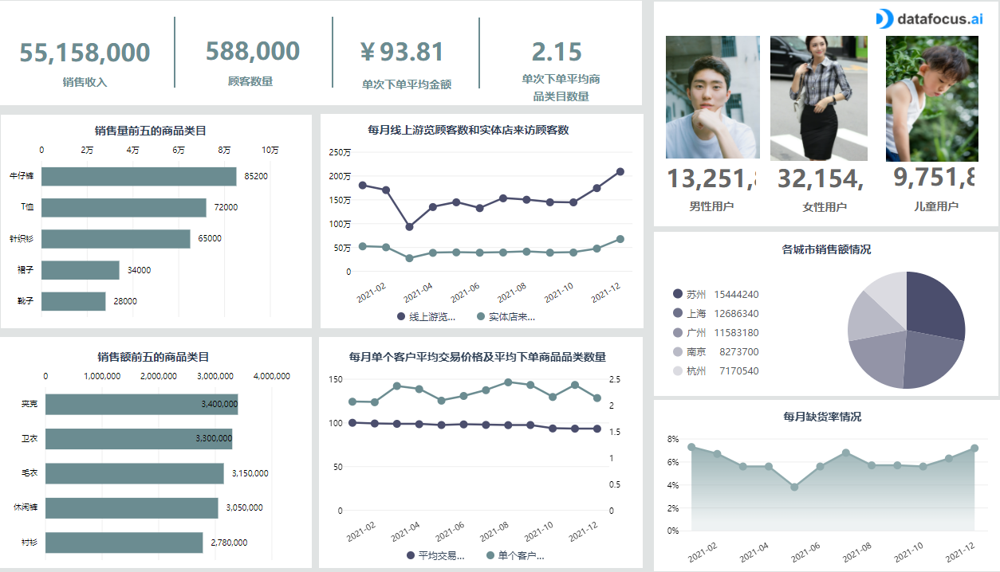
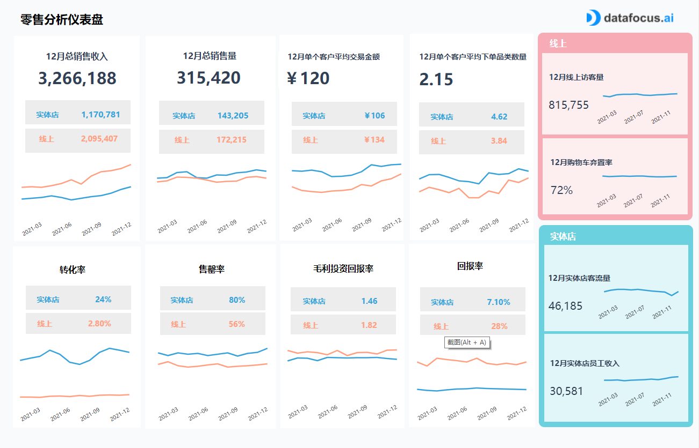

区别于以往任何一次零售变革，新零售将通过数据与商业逻辑的深度结合，真正实现消费方式逆向牵引生产变革。如今的新零售的模式，将更注重消费者体验，以数据驱动，它将为传统零售业态插上数据的翅膀，优化资产配置，孵化新型零售物种，重塑价值链，创造高效企业，引领消费升级，催生新型服务商并形成零售新生态，是中国零售大发展的新契机。

后疫情时代下的新零售又该如何数字化转型呢？

零售仪表板是一种可靠的工具，用于在一个中央界面中可视化和报告所有重要的零售KPI，并将收集的数据转化为可操作的见解。除其他事项外，它还使零售商能够识别消费者模式，增强库存管理，降低回报率，并最终提高销售额和盈利能力。

为了在当今的现代零售业取得成功，无论是线上还是实体店，零售商都必须不断优化其流程。无论您是需要在[零售中使用某个KPI](https://www.datafocus.ai/solution/industry/retail.html)来生成临时见解，还是需要通过自动报告来加强分析流程，作为零售商，您都需要考虑针对现代问题的解决方案。这个数据驱动的行业严重依赖[零售分析](https://www.datafocus.ai/solution/industry/retail.html)，以确保客户按时收到订购的商品，没有缺陷，并提供一流的客户服务。通过结合所有这些元素并利用[仪表板创建者](https://www.datafocus.ai/solution/industry/retail.html)生成交互式视觉效果，每个零售商都有机会在竞争中获得优势，并在我们残酷的商业环境中生存。

在这里我们提供了3个专业零售仪表板示例，每个零售商都可以从中受益：

零售店仪表板

****

越来越多的行业不仅被数据收集所吸引，而且还可以从中获得优势。零售业是一个高度数据驱动的行业，需要随时获得最大化信息。从那里自然需要商业零售仪表板，聚合您正在跟踪的各种KPI，为您提供公司的脉搏。

您可以使用上述零售仪表板模板来识别客户的模式并适当地调整您的策略。在分析的帮助下，分析这些数据既简单又快速。首先是评估您企业的总客户，如果您有在线商店，您可以将其与实体店的总访客量对比。从那里，您可以分析他们平均每笔交易购买的商品品类数量以及平均交易的成本。请注意在其上下文中分析最后一个KPI，因为如果一个客户进行了非常昂贵的购买，则平均交易价格可能会有偏差，从而夸大了平均数字;每个客户的平均单位也是如此。这就是为什么在不同时间段测量这些指标并在一个图表中将它们可视化是很有趣的，以便对它们的演变有一个更大的了解。

一旦您对您的业务和客户的购买习惯有了概览，您就可以专注于您的商品和库存。为了始终拥有合适的商品并避免缺货，设置前5名，前10名或更多畅销商品的列表是一个合适的行动。这样，您就可以预测您的库存，并避免延期交货，这些订单会让客户不满意，并损害您的形象。监控您的缺货 （OOS） 商品是维护业务绩效的首要任务。如果您面临高缺货或长缺货期，您应该关注库存和供应链管理的效率。同时，按收入设置热门列表也将很有趣，您可以查看利润最高的商品以及它们是否也最容易销售。

最后，上面的零售商店仪表板示例为您提供了有关客户的数据。这将帮助您调整和适应您的营销活动以及您拥有的不同渠道。在我们的例子中，按部门细分您的销售量将表明，女性是您的第一个收入点。然后，您可以根据受众特征和购买习惯，创建针对不同目标设计的特定广告。这对于高客户保留率非常重要，因为通常从现有客户那里产生收入比获得新客户便宜。另一种分析销售情况的方法可以按位置进行。无论您是拥有在线商店还是实体店，都要衡量您在一段时间内跨城市、国家或地区的绩效。您不仅可以了解商店在某些时期的动态，还可以比较它们进行改进。事实上，如果其中两个具有相似的销售行为和相似的客户人口统计数据，您可以尝试在其中一个商店中提供折扣，促销，销售或其他营销计划时实施A / B测试活动，并查看其与类似商店并行的表现。借助这些见解，您可以在商店中发起各种活动，并增加销售额和收入。

零售分析仪表板

在当今的零售行业中，在线和实体销售变得越来越频繁，因此，零售分析仪表板是分析和优化各种业务接触点的绝佳工具。此仪表板专注于在线和实体店指标，可一目了然地概述最突出的指标，这些指标可以帮助定义未来的战略并进行优化以增加利润。

在左上角，您可以看到转换率的清晰细分。实体店已达到23%，而在线商店几乎达到2%。一个人实际进入商店的事实;这已经是购买意向的强烈表达。如果您是一家希望增加销售额的零售商，那么有一些策略可以帮助您，例如将高转化率的商店与表现不佳的商店进行比较。这样，您将开始了解是什么让它们如此不同。还应考虑其他指标，例如位置，人口统计，商店类型（街道与购物中心）。在我们的零售店分析报告中，您还可以看到一段时间内的发展，并确定问题发生的位置，以避免将来出现问题。

实体店和网上商店之间的销售率也会比较，它将告诉您商品的位置，以及您是否需要比预期更快地囤货，例如，您是否在几天内就售出所有鞋子。接下来，此实体店和在线零售仪表板表示毛利率投资回报率和回报率。这两个指标对于确定您的努力是否具有成本效益以及您需要处理多少回报至关重要。很自然地看到实体店的回报率较低，因为与线上相比，人们可以立即尝试商品，有时订购的物品不适合或根本不令人满意。

在右侧，流量和购物车弃置率等重要指标以清晰的方式显示于实体店指标的正上方，而实体店指标介绍了客流量和每位员工收入。您可以立即发现实体店收入的稳定增长，这是增长的良好迹象，也是每位员工的收入。另一方面，在线商店的网站流量正在波动，并与购物车放弃相关。在这里，深入研究网站分析数据是有意义的，并找出哪种产品表现不佳以及为什么。也许是因为购物车总成本太高了？

这些视觉对象可以生成为商店绩效仪表板，你可以在其中添加更多指标，根据需要进行调整，并确保分析是最新和自动化的。借助现代在线 BI 工具，您可以确定在何处分配更多资源，提高工作效率，并确保客户满意。

零售 KPI 仪表板

从以订单为中心的角度来看，您将在此零售仪表板上找到与客户、订单以及如何管理相关的 KPI 。即使您拥有牢固的关系和良好的客户服务来支持，您的订单管理以及您的供应链也会直接影响您的客户满意度。您的零售企业希望在销售更多商品的同时留住更多客户或保持竞争力，而像这样的零售 [KPI 仪表板](https://www.datapine.com/articles/best-kpi-dashboard-examples)可以提供帮助。

在零售商店仪表板中，客户保留率是要跟踪的重要指标。它确实告诉了你很多关于你长期保持客户的情况有多好，展示一定的品牌忠诚度。对于您的业务来说，从现有客户那里创收的成本将低于获得新客户的成本。为了尽可能保持这个数字，您可以为复购用户准备折扣、专属价等特别优惠。不过，这个指标应结合不同的业务背景，因为你的零售业务的性质会极大地影响它。

现在转到客户下达的订单，在此零售产品 KPI 仪表板上要衡量的第一个有趣的指标是延期交货率。它评估客户下订单时无法履行的订单数量。这一数字应尽可能低，以避免客户感到失望。同样，需要在具体业务背景下理解这一指标，例如高延期交货率可以转化为低效的库存管理或生产流程，但它也可以说是销售额在飞速增长。当然，如果订单不能按时完成，则进行调整以避免突然下降。但是，比率的下降也可以表明您的库存管理有所改善。无论如何，在操作指标时，结合业务背景理解它们非常重要！

接下来，此零售仪表板侧重于订单的退货率，即任何客户发送或带回的订单数量。由于使用人工的额外处理，或者由于缺陷或损坏使物品无法使用，或者以不会使其盈利的价格出售，退货成本高昂，退货率要尽可能的低。退货率也可能是由于邮局或家中未挑选的包裹，所以为避免这些不便而实施的一个好策略是缩小平均交货时间，让您的客户尽可能准确地知道他何时必须取件。一旦您对一段时间内的回报率进行了基准测试，您就可以设定一个目标比率来实现。同样，您可以按类别对退货进行评估，以便了解退货的物品类型并尝试了解原因。

最后，这些仪表板将帮助您进行运营和战略零售业务开发，无论您是需要临时创建它们，还是定期自动化它们并当场获取最新数据。要开始创建仪表板，立即使用DataFocus的[可视化大屏软件](https://www.datafocus.ai/solution/scene/view.html)进行14天免费试用！
