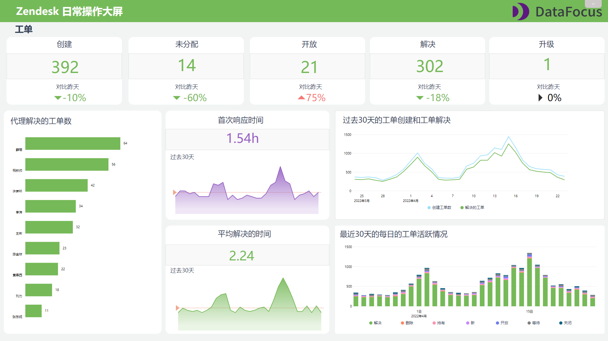

作为一个资深的淘宝剁手党，我在淘宝走过最长的路就是客服的“套路”。电商平台的客服人员是接触买家的最直接也是最重要的一环。因此，做好客服支持工作对提高客户留存、创造收益有着非常直接的关系。

### **什么是首次响应时间？**

首次响应时间(Frist Reponse Time，FRT)指的是，过滤掉系统自动回复后，买家联系客服，客服人员首次回复买家消息所用的时间。通常需要区分平均响应时间，平均响应时间是对上述时间求平均值后的结果。

许多公司在其服务水平协议(SLA)中包含基线FRT，这意味着他们必须在指定的时间范围内响应客户。

因为统计首次响应时间可以衡量客服人员的工作效率，因此最好以工作时间进行区分，确保不会收到晚上或周末的影响，当然，如果贵公司的支持时间是24/7制的，那么也不必考虑是否在工作时间内。

### **如何计算平均首次响应时间？**

**首次响应时间总和/工单数量=平均首次响应时间**

FRT通常以分钟、小时和天为单位。为避免异常值扭曲平均数据，还可以根据中位数计算平均的FRT。

在统计首次相呼应时间的总和时，需要排除自动响应（例如来自聊天机器人或虚拟助手的响应）在规定工作时间之外到达的工单。

幸运的是，可以通过类似DataFocus等BI工具，提前构建好FRT的计算规则，然后将最新的数据导入便可以自动得出FRT的结果，达到实时更新、实时监测的效果。在此基础上，还可以按照不同的客服人员、团队或地区过滤FRT数据，查看可以优化的地方。

 

### **跟踪首次响应时间的意义**

回复问题的及时性和解决速度与客户满意度(CSAT)密切相关。而首次回复时间比整体解决时间更重要，因为这是向客户确认他们的问题正在调查中，以获得积极的第一印象。而且与假设相反的是，大多数客户更喜欢快速但‘无效’的响应，而不是经过计算的延迟答复，例如回复“您的询问已收到”等。

对于缺乏解决客户问题所需的工具和培训的团队，选择查看平均首次响应时间的趋势很有必要，检查其在一段时间内是增加还是减少，及时发现个别客服人员可能存在的问题。

在大多数情况下，如果您响应查询所需的时间越短，客户满意度就越高。不同的支持渠道对响应时间也有不同的期望。就行业基准而言，通过电子邮件与您联系的客户通常希望在24小时内得到回复；对于社交，推荐的基准是在60分钟或更短的时间内做出响应；对于电话，普遍接受的响应时间是三分钟；而对于客服，响应时间的基准在15秒左右。

### **总结**

从必须意义上说，只有把客户服务上的功夫做好了，才有可能保证企业的良性运转。客户服务⼯作的好坏代表着⼀个企业的⽂化修养、整体形象和综合素质，于企业利益直接挂勾；能否赢得价值客户，不仅仅是企业的产品质量、标准、价格等方面的问题，客户服务也是⼀个关键环节。
