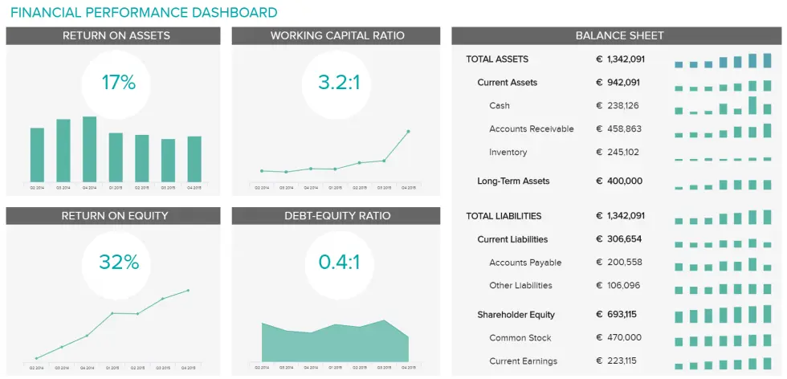
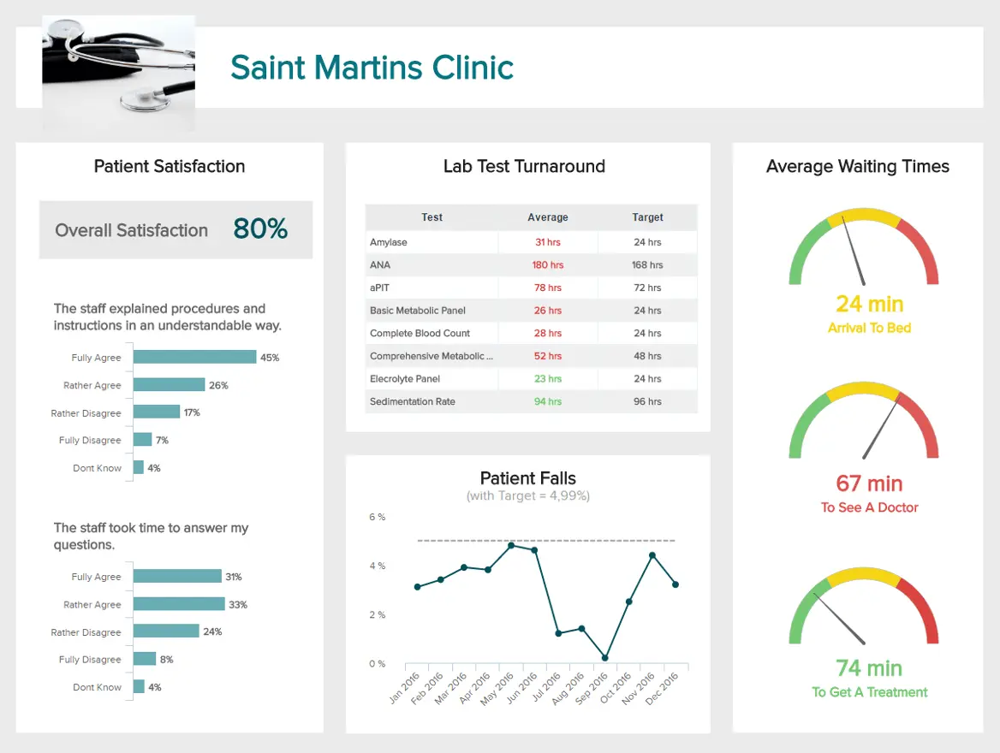
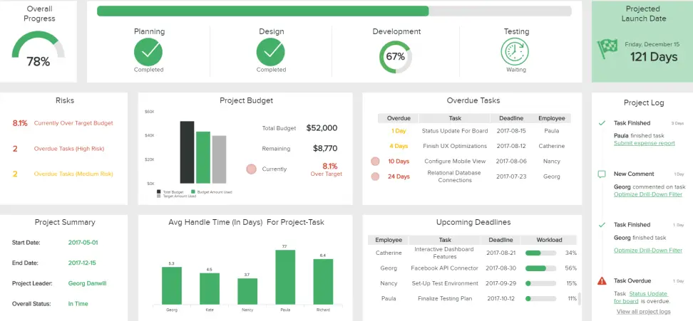

目录

[1） 什么是商业仪表板？](https://www.datafocus.ai/infos/make-sure-you-know-the-difference-between-strategic-analytical-operational-and-tactical-dashboards#definition)

[2） 满足每个业务需求的仪表板类型](https://www.datafocus.ai/infos/make-sure-you-know-the-difference-between-strategic-analytical-operational-and-tactical-dashboards#dashboard-types)

[3） 战略仪表板示例](https://www.datafocus.ai/infos/make-sure-you-know-the-difference-between-strategic-analytical-operational-and-tactical-dashboards#strategic-dashboard-example)

[4） 操作仪表板示例](https://www.datafocus.ai/infos/make-sure-you-know-the-difference-between-strategic-analytical-operational-and-tactical-dashboards#operational-dashboard-example)

[5） 分析仪表板示例](https://www.datafocus.ai/infos/make-sure-you-know-the-difference-between-strategic-analytical-operational-and-tactical-dashboards#analytical-dashboard-example)

[6） 战术仪表板示例](https://www.datafocus.ai/infos/make-sure-you-know-the-difference-between-strategic-analytical-operational-and-tactical-dashboards#tactical-dashboard-example)

[7） 仪表板注意事项](https://www.datafocus.ai/infos/make-sure-you-know-the-difference-between-strategic-analytical-operational-and-tactical-dashboards#how-to)

秘密已经出来了，而且已经存在了一段时间：为了保持竞争力，从初创公司到企业的各种规模的企业都需要商业智能（BI）和不同类型的仪表板。

商业智能已经发展成为提供有效数据管理的智能解决方案 - 从提取、监控、分析和推导出在市场上保持竞争力所需的可操作见解，到使用[仪表板构建器](https://www.datafocus.ai/infos/dashboard-builder)创建的强大可视化，使业务用户能够随时与数据交互并钻取他们可能需要的零碎信息， 任何地方。

 

但是，您如何处理所有这些商业智能？您可以拥有最强大的 BI 基础结构。但是，如果基础信息不容易访问、分析或理解，那么它就毫无意义。这就是[业务仪表板](https://www.datafocus.ai/infos/dashboard-examples-and-templates-)的力量发挥作用的地方。仪表板通常是深入了解组织及其各个部门、运营和绩效的最佳方式。构建良好、重点突出的仪表板可轻松提供对组织最关键的 BI 的摘要和报告。此外，不同类型的仪表板将使您能够向受众传达改进的信息，更有效地组织数据，并全面提升业务流程。

话虽如此，在这篇文章中，我们将解释什么是业务中的仪表板，战略、战术、运营和分析仪表板的功能，并阐述可以使用这些不同类型的仪表板的示例。让我们开始吧。

您的机会：[想要免费构建自己的业务仪表板？](https://www.datafocus.ai/console/)探索我们的现代仪表板软件 14 天，完全免费！

## 什么是商业仪表板？

企业中的仪表板是一种用于从单一访问点管理所有业务信息的工具。它可以帮助经理和员工跟踪公司的 KPI，并利用商业智能帮助公司做出数据驱动的决策。

让我们打个比方来进一步解释这个概念：汽车仪表板即时识别并提供有关汽车状态的反馈：速度、维修需求、轮胎压力、燃油油位等。业务中的仪表板做同样的事情，只是更多。通过仪表板，组织可以快速识别当前和历史绩效。组织还可以进一步利用这些数据来定义指标和设定目标。通过将这些关键绩效指标 （KPI） 和目标集成到其仪表板中，公司可以主动识别问题、最大限度地降低成本并努力超越绩效预期。当然，选择正确的[KPI](https://www.datafocus.ai/infos/kpi-examples-and-templates-)也很重要。

近年来，仪表板已被许多不同的行业使用和实施，包括医疗保健、人力资源、营销、销售、物流或 IT，所有这些行业都体验到了仪表板实施的重要性，作为降低成本和提高其受人尊敬的业务的生产力的一种方式。无论您来自哪个企业或您的公司有多大，您总是希望在发现问题后获得有效的结果和明确的行动。

让我们用一个仪表板示例来解释这一点：

\*\*点击放大\*\*

上面的销售业绩仪表板是销售见解的一站式商店。仪表板通过关注各种销售 KPI 来提供销售部门进度的完美概述：销售增长、[销售](https://www.datafocus.ai/infos/kpi-examples-and-templates-sales)目标、单位平均收入 （ARPU）、客户获取成本 （CAC） 和客户生命周期价值 （CLV）。

销售经理一目了然地看到他们的团队是否实现了他们的个人目标。经理还可以查看整个团队是否达到了目标。这为企业带来的价值是巨大的。一旦公司定期深入了解其 KPI，他们就会更深入地了解他们的数据并产生可操作的见解。

这种类型的分析对于传统的纸质报告和电子表格工具是不可行的。传统类型的报告无法满足当今数据管理的要求，也无法像[交互式仪表板](https://www.datafocus.ai/infos/interactive-dashboard-features/)那样提高效率，其中数据集以互补的方式呈现。有效的仪表板动态组合信息以衡量绩效并推动业务战略。这种交互性确实是通过直观地描述不同部门可以访问的重要数据来推动盈利结果的原因。基于云的实时[在线数据可视化](https://www.datafocus.ai/infos/data-visualization-tools)软件使决策者能够快速采取数据驱动的行动。

数字时代需要数字数据。现在，当您拥有大量有关仪表板的信息时，让我们仔细看看每种类型，以及如何在日常运营或战略目标中选择所需的仪表板。

## 满足每个业务需求的仪表板类型

除了避免“数据呕吐”之外，仪表板的成功还有另一个重要因素。这就像选择正确类型的仪表板一样简单。

如前所述，仪表板的目的是推动操作。在这个数据驱动的世界中，许多仪表板类型正在改变成功的商业智能策略的执行方式。这意味着，尽管您可以采用健康的业务发展方法，但如果您不将正确的数据集传达给公司中的正确人员，则长期成功可能会受到威胁且代价高昂。这就是为什么选择正确类型的仪表板可以带来持久且具有成本效益的结果。

但这并非易事。如今，随着数据量如此之多，以及管理人员需要在短时间内实现的所有目标和目标，对所有仪表板感到困惑和不知所措的情况并不少见。首先，您需要问自己所有问题的问题：

### 你想解决什么问题？

为了帮助您确定[需要解决哪种问题](https://www.hiscox.co.uk/business-blog/the-10-biggest-challenges-businesses-face-today-and-need-consultants-for)，您应该从以下查询开始： 仪表板的主要用途是什么？而且，您的仪表板是分析性的还是可操作的？确定仪表板属于哪个总体类别是首要任务。

操作仪表板查看与 KPI 相关的当前绩效。它们帮助组织实时了解他们的绩效是否符合目标。它们通常用于组织的各个级别。

分析仪表板可帮助组织根据对历史数据的见解建立目标。它们通常很复杂：利用复杂的模型和假设语句。分析仪表板的所有权通常属于业务分析师/专家。

在讨论仪表板类型时，很容易陷入语义游戏。当然，这两种类型之间存在重叠，仪表板命名约定也随着该领域的发展而发展。重要的是，在构建仪表板之前，要确定要回答的问题。

## 那么哪种类型的仪表板最适合您的业务？

现在，我们已将仪表板分为两大类，让我们更深入地了解一下。仪表板有 4 个常规子类型：

- 战略 - 专注于长期战略和高级指标
- 操作 - 显示较短的时间范围和操作流程。
- 分析 - 包含分析师创建的大量数据。
- 战术 - 中层管理人员用来跟踪绩效。

是的，使用我们当前的层次结构，您可以拥有一个运营-运营仪表板。我们告诉过你，我们可以进入一些仪表板语义。这些仪表板类型中的每一种都对摘要级别、分析功能和用户界面有不同的要求。

您的机会：[想要免费构建自己的业务仪表板？](https://www.datafocus.ai/console/)探索我们的现代仪表板软件 14 天，完全免费！

## 什么是战略仪表板？

战略仪表板是一种报告工具，用于借助关键成功因素监控公司的长期战略。它们通常在创建过程中很复杂，对企业范围的影响，并且主要由高级管理层使用。

战略仪表板通常用于各种业务类型，同时调整公司的战略目标。他们根据企业范围的战略目标跟踪绩效指标。因此，这些仪表板倾向于汇总设定时间范围内的绩效：过去一个月、一个季度或一年。当战略仪表板得到适当的开发、设计和实施时，它可以有效地减少完成特定业务关键绩效指标所需的时间，同时降低运营成本。要了解战略规划中的仪表板是什么以及为什么它很重要，重要的是要记住，这些仪表板可以为高级团队提供战略问题的清晰图片，因此，让他们有机会完成特定的行动方案。

虽然它们可以为特定部门的运营和进一步分析提供机会，但战略报告和仪表板通常是相当高级别的。如前所述，团队的高级成员可以相当快地识别战略问题，并提供包含分析数据的全面战略报告。重要性在于分析管理流程，使用通用的定性和定量语言，并确定必须将其纳入仪表板的特定系统，以便每个决策者都能理解呈现的数据。

让我们通过 5 个战略仪表板示例来了解这一点。

### a） 管理战略仪表板

下面的[管理](https://www.datafocus.ai/infos/dashboard-examples-and-templates-management)仪表板是可以在董事会会议上轻松显示的最佳战略仪表板示例之一。它并不杂乱，但它很快就讲述了一个有凝聚力的数据故事。仪表板侧重于总收入以及客户级别以及获取新客户的成本。仪表板设置为特定的时间范围，其中包括重要的 KPI：客户获取成本、客户生命周期价值和销售目标。

\*\*点击放大\*\*

此仪表板回答以下问题：与去年同期相比，我的客户群和收入是多少？在解决特定价值、纳入特定关键绩效指标并使用通用的定性和定性语言的同时，该仪表板代表了管理委员会的明确价值和具体行动方案，同时使用比较指标和分析。

### b） 首席营销官战略仪表板

另一个例子来自营销部门。首席营销官 （CMO） 通常没有时间检查某些广告系列的流量或点击率等数字。但他们确实需要仔细研究更具战略性的营销工作，甚至与销售部门合作，以达到企业可以拥有的最佳营销结果，从而产生利润。此[营销仪表板](https://www.datafocus.ai/infos/dashboard-examples-and-templates-marketing)以直观、信息丰富且直接的方式显示这些重要的战略 KPI。

\*\*点击放大\*\*

上面的战略仪表板示例阐述了获取每个客户、潜在客户、MQL 的成本，并将其与以前的时期进行比较，并设定了目标。首席营销官必须对战略目标有鸟瞰图，以便他/她能够迅速做出反应并控制部门的结果。高管可以立即看到他/她的目标在哪里，这使他们能够进一步深入了解这些营销[KPI，](https://www.datafocus.ai/infos/kpi-examples-and-templates-marketing)并查看整个营销漏斗中可以改进的地方。

要构建此策略仪表板，您无需具备广泛的 IT 技能或高级数据库管理知识。重要的部分是您了解您的战略目标以及实现这些目标所需的 KPI。其余的由[KPI 软件](https://www.datafocus.ai/infos/kpi-dashboard-software)的简单拖放界面完成，使您能够减少数据管理的手动任务，并通过与每个指标交互更快地挖掘数据。

### c） SaaS 管理仪表板

我们的下一个示例是另一个管理仪表板，但侧重于 SaaS 业务的执行级别。在这里，经理可以大致了解任何软件即服务公司的三个最重要的领域：客户、收入和成本。通过随着时间的推移密切跟踪这些指标，您可以鸟瞰过去、现在和未来绩效的相关指标，以优化流程并确保您的业务随着时间的推移保持盈利。

\*\*点击放大\*\*

从左侧开始更详细地查看此战略仪表板，我们看到两个折线图显示与客户相关的相关指标。在顶部图表上，我们可以看到付费客户、流失客户和流失率。所有这些都在一年内显示，使您能够查看每个价值是如何发展的，以及您的策略是否成功并且您的目标是否实现。我们在底部图表中也有类似的情况。这一个展示了CAC，ARPU和CLTV的发展。通过这种方式，您可以了解每个客户为您的业务带来了多少。

仪表板的右侧部分显示有关每月经常性收入的重要信息。MRR 是跟踪 SaaS 业务的最重要指标之一，因为它可以给出业务增长多少的概念。它通过衡量公司在给定月份预期的可预测收入来做到这一点，您可以通过将总MRR除以客户（合同）数量来计算它。

### d） 用于战略规划的首席财务官仪表板

首席财务官需要保持公司战略的正轨，密切监控财务业绩，并在偏离战略目标时做出反应。但不仅如此，公司的财务状况还受到员工和客户满意度等非直接因素的影响。例如，如果员工对他们的工作环境不满意，他们可以请病假或离开公司，这将导致财务瓶颈。但是，让我们仔细看看首席财务官需要什么样的战略仪表板。

\*\*点击放大\*\*

我们将从对战略财务分析优化至关重要的关键指标开始仪表板[分析](https://www.datafocus.ai/infos/finance-analytics)，此处以美元和百分比表示，而简单的仪表图立即将重点放在红色和绿色上。可视化界面将立即向您显示运营费用高于预期，您可以使用它来深入挖掘并确定原因。另一方面，我们可以看到收入、毛利润、息税前利润和净收入等指标受到控制，实际上产生了正值。对目标的快速概述准确地显示了收益增加了多少，以美元表示。

通过以清晰简洁的格式提供所有这些数字，每位首席财务官都可以将视觉对象用作全面的[财务报告模板](https://www.datafocus.ai/infos/daily-weekly-monthly-financial-report-examples/)，整合来自多个接触点的数据，并自动执行此战略计划仪表板以供将来使用。

让我们继续了解仪表板右侧的更多详细信息。成本通过描述销售、一般和管理、营销和其他费用的百分比细分可视化。在这里，我们可以看到销售占用了大部分成本，其次是一般和管理。也许有空间消除一些成本，但要注意不要造成相反的效果。

最后，员工和客户满意度水平是财务[图表](https://www.datafocus.ai/infos/financial-graphs-and-charts-examples/)，与总体财务业绩没有直接关系，但它们肯定会影响它。现代需要现代解决方案，因此，首席财务官需要对可能影响公司财务状况的其他因素有一个密切的概述。

### e） 销售关键绩效指标仪表板

转到我们的下一个战略仪表板模板，这是一个强大的[销售 BI](https://www.datafocus.ai/infos/business-intelligence-sales)工具。销售 KPI 仪表板侧重于高级销售指标，C 级高管和经理需要密切监控这些指标，以确保实现目标。

\*\*点击放大\*\*

首先，我们看到仪表板显示 4 个关键指标：销售数量、收入、利润和成本，每个指标都与设定的目标以及上一时期的值进行比较，这样您就可以快速浏览当月的表现只需快速查看图表。接下来，仪表板更详细地分解这些指标中的每一个，以得出结论并分析当前策略是否需要额外调整。查看过去的数据可以让管理人员了解数字应该在哪里，并找到有效的解决方案来实现目标。销售策略的底线应该是增加业务的收入和利润，这一切都可以通过利用手头数据的力量来实现。

现在我们已经说明了这些战略报告的强大功能，现在是时候仔细研究我们的下一种类型的仪表板，继续使用操作仪表板。

您的机会：[想要免费构建自己的业务仪表板？](https://www.datafocus.ai/console/)探索我们的现代仪表板软件 14 天，完全免费！

## 什么是操作仪表板？

操作仪表板是用于监视和管理时间范围较短的操作的仪表板类型之一。由于他们专注于跟踪运营流程，因此通常由初级管理层管理。

它们在当今数字时代的价值在于，企业开始意识到运营团队和部门之间快速正确数据的重要性。虽然仪表板报告和分析领域的空前发展使运营工作变得相当简单，但运营经理也可以从使用这些类型的[仪表板](https://www.datafocus.ai/infos/dashboard-reporting)中获利匪浅，并以视觉和交互方式指出必须迅速解决的实时数据问题。

这些类型的仪表板可以说是最常见的仪表板。它们主要用于监控和分析公司在特定业务领域的活动。这些仪表板通常侧重于针对业务异常发出警报，并基于实时数据。操作指标仪表板通常最终掌握在主题专家手中。这通常会导致更直接的行动，然后是进一步的分析。因此，操作仪表板通常比战略仪表板更详细。他们还可以为操作报告提供特定数据集的更详细视图。

操作仪表板可帮助部门保持主动并提前发现问题。例如，制造公司可以使用它们来跟踪制造的产品以及缺陷、投诉或退货的数量。这有助于[制造分析](https://www.datafocus.ai/infos/manufacturing-analytics)过程 - 使用仪表板，任何有问题的更改都会实时突出显示。我们将在其中一个示例中更详细地看到这一点。

但是，让我们看一下另一个营销示例。在上面的最后一个示例中，我们已经说明了营销部门的策略仪表板，现在我们将重点介绍运营仪表板示例，也是出于营销目的。

### a） 营销运营仪表板

上面的营销绩效仪表板是我们最重要的运营仪表板示例之一。它显示了过去 12 周内 3 个广告系列的效果。它为营销团队提供了重要的运营信息和关键绩效指标，包括每次获取成本、总点击次数、获得的总获取量以及在特定广告系列中花费的总金额。任何重大更改都会立即提醒营销团队。为什么有用？因为快节奏的营销部门或机构可以根据实时数据调整其运营活动，并且团队不必等待电子表格中呈现的广泛传统报告和分析。

\*\*点击放大\*\*

我们可以看到每个广告系列的效果以及在设定的时间范围内带来了什么样的结果。当每个广告系列都需要优化以提供最佳结果时，这非常有用，并且通常每天都会进行，尤其是在代理商中。运营报告需要快速构建，此仪表板可以通过获得实时、准确的数据来帮助每个活动经理。

### b） 制造生产仪表板

正如我们之前提到的，操作仪表板可以成为跟踪生产的完美工具。为了正确看待这一点，让我们看一下我们的[制造仪表板](https://www.datafocus.ai/infos/dashboard-examples-and-templates-manufacturing)示例。该可视化工具详细概述了与生产相关的所有方面，从数量、订购数量、退货到机器性能。获得这种级别的洞察力可以帮助制造商发现可能损害生产的任何潜在问题或隐藏趋势，并找到改进机会以优化关键流程。

\*\*点击放大\*\*

更详细地了解此操作仪表板，我们首先查看生产量和订购数量，这使您能够了解每天、每周、每月或每年在生产和机器可用性方面的预期。将生产量与订购数量进行比较还可以让您监控您的生产是否高效，以及您是否没有过度或表现不佳。与这些指标齐头并进的是机器的性能。机器是任何制造公司跳动的心脏，通过仔细监控每台机器的性能，您可以确定最有效的机器，安排维护，并始终了解您拥有哪些资产。

最后但并非最不重要的一点是，对于制造公司来说，这是最昂贵的问题之一：退货。详细跟踪此指标可以告诉您您的业务在交付应该交付的内容方面的效率如何。较低的退货率意味着您的客户得到了正确的订单，而较高的退货率意味着您没有提供最好的服务。保持这种利率尽可能低的一个好方法是更深入地研究退货的原因并解决问题，这样它们就不会继续发生。

### c） 物流拣货和包装操作仪表板

我们的下一个示例是跟踪与订单处理相关的所有方面的[物流仪表板](https://www.datafocus.ai/infos/dashboard-examples-and-templates-logistics)。更广为人知的是拣货和包装，它是工人从仓库中的订单中找到物品并将其放入盒子或其他类型的包装中以运送给客户的过程。详细跟踪这些指标使企业能够优化关键流程并节省成本，同时仍然确保优质服务。让我们更详细地了解仪表板。

\*\*点击放大\*\*

该操作仪表板分为拣选和包装流程的 4 个主要领域：财务、有效性、利用率和质量。将每个领域与上个月的表现目标进行比较，作为改进的基准。与此配对，仪表板显示所涵盖的每个区域的 3 种不同工作线的性能。单独跟踪每条线可以让您在每条生产线上实施不同的策略，然后测试哪一条更有效。它还可以帮助您了解员工或团队是否表现不佳，并找到培训机会来提高他们的效率。

### d） LinkedIn操作仪表板示例

我们继续列出LinkedIn操作仪表板示例。这种社交媒体网络对于在个人资料级别或公司层面建立业务关系至关重要。随着用户数量的稳步增长，到2020年会员人数将超过6.1亿，对于希望接触决策者和商业专业人士的公司来说，LinkedIn应该是更高的优先事项。为了有效地管理公司的存在，公司可以使用运营数据仪表板来解决多个社交媒体问题，例如自动化、报告定制并提供高级分析功能。让我们看一下专门为LinkedIn创建的操作仪表板设计示例。

\*\*点击放大\*\*

要了解您的公司如何发展，在快节奏的社交媒体世界中，必须在更短的时间内管理您的帐户。与关注者沟通，监控参与率和最近的更新将确保您随时了解您收到或发送的任何社交消息。如果您比较一段时间内的结果，您可以识别趋势，发现运营管理中的低效率，并创建一个[社交媒体报告](https://www.datafocus.ai/infos/social-media-reports-examples-and-templates-)，以整合所有与LinkedIn相关的沟通。

在上面的例子中，我们可以看到每周获得的关注者数量和发展。关注者数量增加是件好事，因为您的帖子将有更大的机会覆盖更多人。仪表板继续显示展示次数、按行业划分的关注者和参与率等指标。了解您的受众来自哪里很重要，因为不同的行业需要不同的内容。通过总参与度、喜欢、分享和评论对参与率的细分将让您知道哪种内容效果最好，以便您将来可以重复使用它。检查如果您看到某个峰值会发生什么，并尝试再次重新创建相同的策略。

最后一部分显示了点击率和最近 5 家公司的更新。这些指标对于跟踪至关重要，因为您将了解实际点击了您的链接的用户数量以及最新更新的行为方式。现代[BI 报告工具](https://www.datafocus.ai/infos/bi-reporting)将确保自动计算所有这些数据，并在您设置的时间范围内（例如每天或每周）交付，而无需导出大量电子表格或使用其他潜在限制。

### c） 客户服务运营指标仪表板

我们的下一个操作仪表板示例之一侧重于客户服务。通过在单个屏幕上显示所有重要的[客户服务 KPI](https://www.datafocus.ai/infos/kpi-examples-and-templates-customer-service)，团队可以更有效地管理其运营。让我们通过一个视觉示例来了解这一点。

\*\*点击放大\*\*

这种类型的仪表板在较短的时间内（在本例中为每天）阐述客户服务团队的绩效，并额外每月概述第一次、第二次、第三次呼叫和未解决的呼叫。我们可以看到客户服务[仪表板](https://www.datafocus.ai/infos/dashboard-examples-and-templates-customer-service)分为两部分：分辨率和响应时间。一周中的每一天都会提供额外的见解，如果团队定期跟踪响应时间指标，则可以帮助团队减少响应时间指标。这样，团队就可以知道在响应时间较长的日子里，他们是否需要更多员工或更好的时间表。这就是为什么保持运营正常进行并每天关注团队的表现很重要的原因。为了增加价值，您可以查看我们关于顶级[呼叫中心KPI](https://www.datafocus.ai/infos/call-center-metrics-and-kpis/)的文章，并确保提供最佳的客户服务。

我们已经看到了专注于营销和客户服务的运营仪表板示例，现在我们将继续使用其他不同类型的仪表板，专注于公司的分析流程。

您的机会：[想要免费构建自己的业务仪表板？](https://www.datafocus.ai/console/)探索我们的现代仪表板软件 14 天，完全免费！

## 什么是分析仪表板？

分析仪表板是一种仪表板，其中包含分析师创建和使用的大量数据，为高管提供支持。它们为企业提供了全面的数据概览，其中中层管理人员是其使用的关键部分。

如前所述，分析仪表板的重要性在于它对历史数据使用的影响，分析师可以识别趋势，将其与多个变量进行比较，并创建预测和目标，这些预测和目标可以在公司的商业智能战略中实施。当复杂的分类信息海量而广泛，并且需要可视化以对生成的数据进行清晰的分析时，它们通常很有用。

分析仪表板也可以在战略和运营仪表板的交叉点找到。它们由不同的模块组成，如果使用得当，可以对业务绩效产生积极影响。

### a） 财务业绩仪表板

在下面的示例中，专注于绩效的[财务仪表板](https://www.datafocus.ai/infos/dashboard-examples-and-templates-finance)分析可以帮助决策者了解公司资本的使用效率，并建立特定的运营任务以更好地构建未来的决策。

\*\*点击放大\*\*

通过重要的财务[KPI](https://www.datafocus.ai/infos/kpi-examples-and-templates-finance)，例如资产回报率、股本回报率、营运资本和资产负债表概览，财务部门可以清楚地了解其资本结构。因此，该分析仪表板使该部门能够设置具体的业务活动以进一步改进。

### b） 采购成本仪表板

另一个仪表板侧重于成本，但在这种情况下，专门针对采购部门。众所周知，大多数公司都可以将采购作为将公司与其供应商、承包商、自由职业者、代理商等联系起来的功能。它不仅对制造业等行业至关重要，而且对面向服务也至关重要。要了解采购部门的分析视角，让我们看一个可视化示例。

\*\*点击放大\*\*

采购部门处理大量数据，通过分析采购周期的成本和采购，分析师可以呈现数据，这些数据将为不同单位提供构建块，以节省宝贵的时间。上面可视化的[采购仪表板](https://www.datafocus.ai/infos/dashboard-examples-and-templates-procurement)可以作为以可视化和直接的方式呈现数据的工具。

仪表板首先描述了与成本和节省相关的指标以及在特定时间范围内发生的趋势。趋势线显示，事实上，大多数指标都增加了，但原因可能是订单数量也增加了。仪表板中间的成本降低分为不同的产品类别，这样，管理层就可以确定是否有空间使采购成本更加合理化。仪表板继续使用 ROI，这是一种[采购 KPI](https://www.datafocus.ai/infos/kpi-examples-and-templates-procurement)，实际上计算方式与常规 ROI 不同。在这种情况下，您需要将年度成本节省除以内部成本并将其表示为比率。设定目标将有助于管理层立即发现与成本相关的工作是否成功。在这种情况下，目标设定为 10，因此您可以清楚地看到它是如何针对不同类别发展的。

在右侧，我们可以看到有关成本节约和避免的详细信息，这很重要，因为它可以通过引入诸如更好的谈判流程等具体措施来简化希望避免未来成本的经理的决策过程。最后，前 5 名供应商将向您展示与供应商相关的成本分配在哪里，管理层可以使用这些成本进行进一步优化。

这种分析是必不可少的，因为采购部门通常从多个来源收集数据，例如 为了优化成本管理并增加整体积极结果，像这样的分析仪表板可以证明是有益的。

### c） 患者的医疗保健分析仪表板

我们的下一个分析仪表板模板来自医疗保健行业，旨在监控与您的患者对您的设施及其提供的服务的满意度相关的所有方面。该仪表板涵盖人员、治疗、等待时间和安全等方面，将帮助您评估与患者的关系，并确保他们获得所需的一切。

\*\*点击放大\*\*

[医疗保健仪表板](https://www.datafocus.ai/infos/dashboard-examples-and-templates-healthcare)首先根据与医院工作人员如何向需要信息的患者提供信息相关的两个问题的答案显示患者满意度分数。这是一个有价值的见解，因为沟通是与患者建立良好关系的关键方面之一。如果您确保他们始终清楚相关信息，您将享受健康的满意度。接下来，您将获得有关不同活动的等待时间的详细信息，例如实验室测试周转，看医生，接受治疗的时间以及到达床上的时间。所有这些指标都显示在仪表图中，其颜色可轻松指示分数是差、中还是好。优化这一点的一个好方法是设定目标时间并实施不同的措施来达到这些目标，这样您就可以避免患者无限排队并更有效地护理。

### d） 分析零售 KPI 仪表板

另一个分析仪表板示例来自零售行业。它在管理和客户满意度之间建立了分析上的平行关系，因为供应链可以直接影响它。这个全面的仪表板向我们展示了零售业务重要方面的概述，使分析师能够识别趋势并为管理层提供业务流程所需的支持。[零售分析](https://www.datafocus.ai/infos/retail-analytics)变得简单。

\*\*点击放大\*\*

正如我们在上面的零售[KPI 仪表板](https://www.datafocus.ai/infos/dashboard-examples-and-templates-retail)上看到的那样，一些关键指标，如回报率（也按类别描述）、总销售额、客户保留率以及通过设定的时间范围内的新客户和回头客数量，可以让我们更全面地了解零售业务的状态。这些[零售KPI](https://www.datafocus.ai/infos/kpi-examples-and-templates-retail)可以显示您在留住客户和发展品牌忠诚度方面有多好，管理层可以清楚地看到业务的哪些方面需要改进。如果您将缺货率保持在尽可能低的水平，客户就不会感到沮丧，您的整体数字将表现良好。很简单，让客户满意将使您能够成长。

### e） 快速消费品行业的KPI分析仪表板

供应链管理并非易事，尤其是当所涉及的产品来自快速消费品类别时。为了帮助优化多个流程并确保运营成功，创建了此分析仪表板。

\*\*点击放大\*\*

快速消费品仪表板配备了与交付、销售产品、库存和库存相关的 KPI，概述了快速消费品业务正确运作的所有重要方面。通过密切跟踪缺货率，您可以了解库存状态并避免可能影响销售的缺货。另一方面，在新鲜日内销售的产品和平均销售时间可以告诉您是否有某种产品需要更多时间才能销售，因此您可能需要降低库存并避免扔掉不再新鲜的产品。通过定期监控所有这些指标，您可以在快速消费品业务中可能出现的任何问题中领先一步。

我们的下一种仪表板专注于支持战略计划的纯分析：战术仪表板。

您的机会：[想要免费构建自己的业务仪表板？](https://www.datafocus.ai/console/)探索我们的现代仪表板软件 14 天，完全免费！

## 什么是战术仪表板？

战术仪表板用于分析和监控中层管理人员进行的过程，强调分析。然后，组织有效地跟踪公司目标的绩效，并为未来战略提供分析建议。

战术仪表板通常是最具分析性的仪表板。它们非常适合监控支持组织战略计划的流程。战术仪表板有助于指导用户完成决策过程。他们通过为用户提供探索数据的能力来利用仪表板的交互性质。

战术仪表板的详细级别介于战略仪表板和运营仪表板之间。战术销售[仪表板](https://www.datafocus.ai/infos/dashboard-examples-and-templates-sales)可以跟踪您的销售目标（实际收入与预测收入）。它允许各种过滤器和细分，包括区域、销售经理和产品。运营仪表板将在一年中的不同时间交替跟踪这些特定产品与竞争对手的销售情况。由于它们的级别更高一些，战术仪表板也往往比操作仪表板包含更多的数据可视化。让我们通过项目管理中的一个例子来了解这一点。

### a） IT 项目管理仪表板

下面的示例显示了项目的详细概述，其中包含特定的时间表和相关各方的效率。您可以定义特定风险、查看总体进度和执行特定任务的平均时间。项目完成后，您可以创建全面的[IT 报告](https://www.datafocus.ai/infos/it-report-templates-and-examples/)，评估结果，并使未来的项目更加成功。

\*\*点击放大\*\*

每个 IT 管理的目标都是提高效率、减少工单数量并交付成功的项目。通过以IT运营仪表板的形式使用正确的工具，单个屏幕可以为项目经理提供他/她分析项目所有重要方面所需的所有数据。虽然有各种类型的项目仪表板，但上面的此特定视觉对象设置为监视项目管理工作，并在流程中出现任何异常时向领导者发出警报。

### b） 能源管理战术仪表板

发电厂为多个部门和行业提供能源，这导致每天产生大量数据，隐藏的趋势和改进机会等待开发。该能源仪表板旨在通过为您提供正确管理能源业务的每个相关方面的概述来做到这一点：从总销售额到按部门划分的消耗量，再到每种来源类型的生产成本，您可以全面了解不同工厂的绩效。

\*\*点击放大\*\*

可以从此分析仪表板中提取多个见解。借助这个强大的管理工具，企业高管可以了解他们的能源在哪些部门消耗最多，并相应地计划他们的生产和交付，看看他们的客户对可再生能源感兴趣的百分比，并投资于可持续的电力来源，以及管理生产成本，并监控停电次数，以确保最佳服务质量，同时将成本保持在最低水平。

### c） 人力资源人才管理仪表板

长期以来，无论业务规模如何，人力资源部门面临的最大挑战之一就是有效地管理人才，从而延长人才的留用时间。我们的人才管理仪表板允许通过监控成本、招聘统计数据、营业额和满意度等指标来进行高级[人力资源分析](https://www.datafocus.ai/infos/workforce-people-hr-analytics)。通过详细了解这些价值观，人力资源团队可以实现成功的人才管理并确保较长的人才生命周期。

\*\*点击放大\*\*

分析仪表板示例首先快速概述公司员工总数、平均月薪和一年第一季度的职位空缺。与此配对，我们获得了与招聘相关的其他统计数据，例如填补时间、新员工、净培训成本和每次招聘成本。

接下来，仪表板按部门显示人才流失率，以及按公司劳动期（6 个月、1 年、2 年和 5 年）划分的下岗员工百分比。密切监控这些指标可以帮助您找到某些趋势的原因并相应地调整您的人力资源策略。

接下来，我们得到一个非常重要的指标，人才满意度，旨在衡量你的员工对公司的满意度。在这种情况下，满意度水平是通过每组员工的净推荐值来衡量的，该分数基于他们在组织中工作的时间。在这里我们可以看到，最忠诚的员工是在公司工作了5年以上的员工。最后，我们得到了一个按类别衡量趋势的图表，您可以在其中查看员工如何发展他们的技能、知识、效率、沟通和交付。这里重要的是专注于留住合适的人才并保持员工满意，以避免高流动率，从而避免成本高。

### d） 社交媒体仪表板

由于有不同类型的商业智能仪表板涵盖各种目的，我们已经阐述了LinkedIn作为一个单独的渠道，需要每天监控，以使公司与其追随者群保持联系并扩大其影响力，但现在，在战术意义上，[KPI 记分卡](https://www.datafocus.ai/infos/kpi-scorecard-examples-templates-to-track-performance/)可以为管理社交帐户提供多种好处， 因此，确保用户有足够的数据来生成未来的建议。为了正确看待这一点，我们将展示一个业务流程仪表板，重点关注 4 个主要的社交媒体渠道：Facebook、Twitter、Instagram 和 YouTube。

\*\*点击放大\*\*

仪表板从Facebook开始，它是世界上最大的社交媒体网络，目前[每月用户超过25亿](https://zephoria.com/top-15-valuable-facebook-statistics/)。在我们的示例中，我们可以看到关注者的数量没有达到设定的目标，但与前一时期相比确实有所增加。在这种情况下，社交媒体经理可以更深入地挖掘，以了解为什么以及是否需要特别注意[Facebook KPI](https://www.datafocus.ai/infos/kpi-examples-and-templates-facebook)。

其他指标和渠道具有相同的结构和战术方法：通过额外的比较分析目标，使管理人员能够更深入地挖掘数据并为未来提出建议。

### e） 供应链管理战术仪表板

创建战术仪表板策略时，请务必关注流程的分析和监视部分，为有效的数据驱动型决策提供支柱。我们的下一个仪表板专注于物流公司的供应链。

\*\*点击放大\*\*

上面示例中描述的[供应链指标](https://www.datafocus.ai/infos/supply-chain-metrics-and-kpis/)向我们展示了如何监控数据驱动的供应链，以确保公司的健康流程。对库存管理的额外关注将使公司能够清楚地了解保持竞争力和避免商品缺货所需的[物流 KPI](https://www.datafocus.ai/infos/kpi-examples-and-templates-logistics)。

不仅如此;您可以监控库存准确性，并在看到此比率下降时采取行动。差异是正常的，但应保持在最低限度。其他指标，如库存与销售比率和库存周转率，显示了公司的财务稳定性——您需要知道已售出物品和库存商品之间的比率。然后，营业额将衡量贵公司每年销售其全部库存的次数，从而增加组织的效率：然后您可以在运营层面对其进行分析（还记得我们的运营仪表板示例吗？），并查看您如何满足产品的需求，您有什么样的运营实践以及您的货运管理如何运作， 例如。

通过充分利用物流[分析](https://www.datafocus.ai/infos/logistics-analytics)，您可以在物流业务中获得丰厚的回报，并最终设法留住客户。

您的机会：[想要免费构建自己的业务仪表板？](https://www.datafocus.ai/console/)探索我们的现代仪表板软件 14 天，完全免费！

## 成功实施业务仪表板的注意事项

因此，您现在被仪表板的强大功能所吸引。在您跑到仪表板印刷机之前，我们指的是数据可视化软件，让我们谈谈使用正确的方法来构建和使用仪表板。最好从正确的计划开始并实施[仪表板设计](https://www.datafocus.ai/infos/dashboard-design-principles-and-best-practices/)原则，这些原则将考虑到您公司最相关的数据。成功的仪表板实施将：

- 节省整个组织的时间：IT、分析师、经理、最高管理层等。
- 通过突出不必要的运营成本为公司节省资金
- 提供对客户行为的洞察
- 有效地使战略与战术保持一致
- 确保以目标为导向和基于绩效的数据文化
- 鼓励互动和分析

无效的仪表板实施无法最大限度地发挥这些仪表板优势，并且会迅速破坏任何数据驱动的文化。不要害怕！请继续阅读，了解如何轻松避免组织中的仪表板疲劳。

实施仪表板时，需要牢记 2 个最重要的参数：

- 不要“数据呕吐”
- 选择正确的仪表板类型

市场动机和谷歌数字营销布道者的联合创始人Avinash Kaushik对仪表板失败的一些方式有深刻的见解。他还提出了一些创建强大仪表板的规则。Kaushik最大，最有趣的规则是“不要数据呕吐”。请务必记住，仪表板不仅仅是报表。确保仪表板包含见解、操作建议和业务影响。它还需要提供上下文！您不希望高管和其他任何人最终使用您的仪表板对数据做出自己的解释。仪表板应该讲述一个足够清晰的数据故事，其中不需要解释。还要记住，当涉及到 KPI、细分和您的建议时，请确保涵盖端到端的获取、行为和结果。

考什克说：“这将是有争议的，但无论如何让我说出来。仪表板的主要目的不是通知，也不是教育。主要目的是推动行动！

## 现在您可以前往仪表板大楼了！

通过了解仪表板类型之间的差异，您可以确保在正确的时间向正确的人呈现正确的信息，并使用出色的[数据可视化类型](https://www.datafocus.ai/infos/how-to-choose-the-right-data-visualization-types/)。虽然仍然强调您应该始终知道自己正在构建什么，但有时您的战略仪表板可能看起来有点战术性，而战术仪表板则有点可操作性。别担心。[自助式分析](https://www.datafocus.ai/infos/self-service-analytics)使您有机会使仪表板最适合您的需求，并创建仪表板策略，以建立和开发数据驱动的业务环境。

如果您准备开始完全免费构建您的第一个仪表板，那么我们的[14 天试用](https://www.datafocus.ai/console/)版可以为您提供完美的解决方案！
