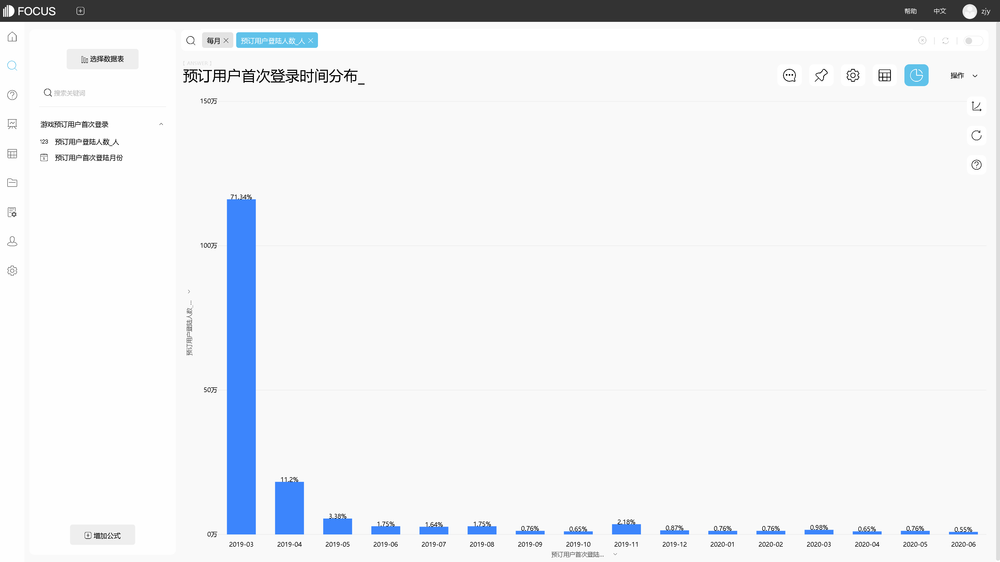

现如今进入大数据时代，无论是企业还是个人，都能深刻的感受到节奏在加快，信息在爆炸，知识在迭代。对于企业来说，有很多方法去应对大数据时代所产生的机遇和挑战，比如雇佣数据分析师或干脆使用DataFocus或tableau等数据分析工具。但是很多企业都只停留在数据分析本身，很少有去突破。比如使用DataFocus进行搜索分析，固定了3-5个看板，以后就靠它吃饭，而我们见过非常厉害的分析员，比如一个分析师来自大型通信巨头，所用的看板有300多个，其每天都在思考新的关键词和逻辑进行分析，每一天都在突破数据分析价值。那么有人会问了，我也想突破，问题是没有合适的方法。

我们以前说到过学习区和舒适区的问题，很多人的疑惑就是出不了舒适区或干脆会进入迷茫区。但其实，突破数据分析价值的关键是找到黄金标准，举个黄金标准的例子。

1968年，越南战争时期，美国的空军与越南空军经常正面交锋，越南的很多空军飞行员都是接受过苏联的培训，水平并不低，而且驾驶的俄制的米格战机。在越战的前三年海军在空战中一直保持着三分二的胜率，也就是没击落两架敌机，自己就会损失一架，在1968年的前5个月里，胜率甚至降到了50%一下，美军击落了9架敌机，但是自己损失了10架战机，1968年夏天，海军飞行员发射了超过50枚空对空导弹，无一命中，飞行员的水平和技术严重影响了战争的结果，

于是美国海军推出了至今著名的王牌训练计划，通过对最优秀飞行员飞行技术的模式，来提升整个飞行员队伍的水平，而且让普通飞行员与王牌飞行员之间进行模拟空战，相当于是通过人作为标准来培养人，并且不断的总结每次模拟后的经验与效果。该计划持续 了2年，2年后1970年-1973年间，美军每损失1架飞机能够击落越南空军的12.5架战机，水平得到飞跃式的提升。

很多时候我们对于数据分析的盲目，对数据分析能力的无法提升是因为缺乏对标的标准，我们不知道该通过数据分析达到什么样的水平或高度，因此在突破数据分析价值中一个很重要的因素是找到企业或分析师自己的黄金标准。这个有很多，比如同行业的数据分析效率如何，他们用的是什么工具，他们的数据分析部门在企业中起到什么作用，这是环比。还可以同比，去年我的数据分析产出方案助攻了200万元销售，今年要做到一个什么样的标准，可以进行团队讨论评估，结果出来后可以多人评价，比如DataFocus可视化图表做出来后，可以多人共享进行点赞或评论。所以关键还是要多思考，多找可实现的目标和标准。
