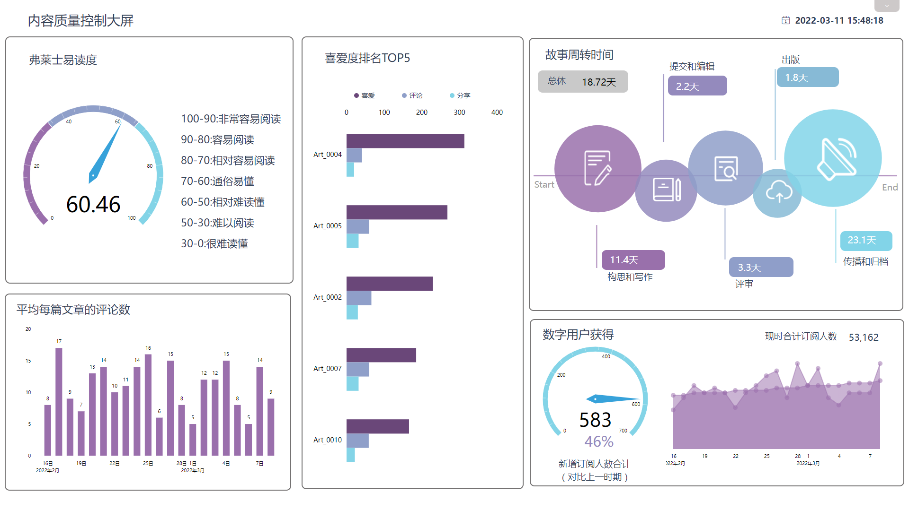

“书中自有黄金屋，书中自有颜如玉”，千百年来，人们总是不断强调读书对个人成长的重要作用。但随着电子传媒的快速发展，人们的生活习惯开始改变，地铁上端着手机低头看书随处可见，手机轻松下载的阅读软件可以使人人拥有一本“口袋书”，而平板电脑更是让新闻、杂志、报纸等传统媒体图书成为简单的手指轻轻一触。

据悉，总部位于伦敦的Quercus最近出版了一部十分有趣的书籍《Life in Five Seconds》，这本书的特色在于一改讲故事的方式，将诸多名词(包括很多名人)用插图分步骤进行解释，号称5秒钟即可读完一个故事。创意表现既一目了然，又让人不禁啧啧称奇。

当数字媒体不断冲击传统纸媒，对大多数人而言，手捧一本书在安静的时间段阅读正逐渐成为一种奢侈和幻影。纸媒逐渐衰落，传统出版商的日子当然也不好过。他们应该怎样应对行业的萧条？视频网站和社交媒体可以成为数字媒体发展的新方向。

接下来，我们将针对受众特征、社交媒体、文章内容质量等方面展示三个数字媒体大屏：

## **在线出版商大屏**

在线出版商大屏盘点了出版商如何了解受众的过程以及更具吸引力的内容所需的材料，成功地通过网络流量获利——跟踪产生的广告收入，了解哪些页面表现良好以及原因。

首先跟踪与出版内容互动最积极的部分受众：订阅者。订阅者不仅阅读发布的内容，还为此付费并获得对其他无法获得的其他文章的高级访问权限。因此需要着重关注，因为留住现有客户比获得新客户更便宜。

第一步，分析受众特征：性别、年龄、所处地区、兴趣爱好等等，搜集这些特征可以有利于定位用户画像，定制提供对其更有吸引力的优质内容。

第二步，关注“节点”。一般来说，作为内容的发布者，您会比较想知道谁访问了您的网站、从哪里访问、使用哪种设备以及在一天中的什么时间访问？然后跟踪几个月内总体流量的变化趋势，如果独立访问者的数量出现了明显的上升或者下降，特定类型的内容是否高于平均水平？如果触发关键节点，一定要重视他们，要调查清楚引起该变化的原因，了解导致成功或失败的因素是什么。

第三步，读者的热门文章和读者的热门类别。当您知道什么类型的内容带来了大量流量时，您可以质疑成功的原因：主题是否具有争议性或话题性？宣传时主打的是这个主题使用的格式，还是写作风格？当然，访问量应始终与其他指标一起分析，这将为您提供更广泛的流量图像：例如，您有一个非常吸引人的标题误导访客，导致访问量骤增，但他们在登录页面后马上离开，页面停留时间很短且跳出率很高，那您就可以由此了解到人们是否真的找到了他们正在寻找的东西。同样地，热门类别会让您知道人们在您的网站上访问的内容类型。将此指标与属于每个类别的文章百分比并行阅读可能会很有趣：如果一个类别的文章很少，但这些文章吸引了最多的流量，您可能会重新考虑您的策略并更多地关注该类别。

第四步，其他指标。例如平均访问持续时间和每次访问的页面数，由此可以让您了解您的受众在网站上的行为：他们是否喜欢您的内容并参与其中，通过点击将他们发送到其他文章的内部链接，并停留更长时间？就像前面提到的页面跳出率和停留时间一样，当您想知道人们是否找到了他们正在寻找的东西时，这些 KPI 是很好的指标。

## **社交媒体参与大屏**

社交媒体参与大屏处理的是在线出版社的社交媒体部分。无论我们如何看待社交网络，是广告商眼中提供独角兽的神奇天堂，还是散播仇恨言论和自恋情绪将世界末日降临到每个人头上。传统行业面对互联网的出现和普及，必须开始向在线业务过渡，因此社交媒体需要小心处理，并构成您总体战略的一个组成部分。

因此社交媒体参与大屏应该通过跟踪主要指标来了解您的社交存在感。首先，查看失去的关注者的数量。随着时间的推移，您的者的增长将代表着您的受欢迎程度，并表明您的“对话份额”。您应该监控随着时间的推移和跨不同平台的演变，以了解您在哪里接触到最多的受众。

其次需要了解您的关注者，就像查看受众人口统计数据一样，通过了解谁喜欢您的页面、他们的年龄和性别，可以更好地定位出版商们分享的内容以及分享方式：视频资料、调查、正式或随意的演讲、互动程度等。

最后，大屏右侧的列关注您的受众的参与度。将发布的帖子数量与其产生的反应进行比较：每个帖子的总点击次数和平均点击次数，留下的评论和分享。最后两个指标非常重要，因为它们揭示了某个帖子引发的兴趣。您想知道哪些内容引发了最多的反应、分享和评论，从而重现其成功——前提是这些反应不是坏消息，因为社交网络的病毒式传播，它可能会像野火一样发生并不受控制地传播。

## **内容质量控制大屏**

内容质量控制大屏可以帮助您监控文章的制作。从故事周转时间到阅读轻松度，利用所有关键性能指标来控制内容制作。

从周转时间开始，您可以了解一篇文章需要多长时间才能上线并被您的读者阅读。您会获得流程每个阶段的平均值——构思和写作、提交和编辑、修订、出版和存档。这样，您可以监控所有正在进行的文章，发现在某个阶段停留时间过长的文章，并找出原因——作者写作困难吗？没有足够的人进行修订？出版阶段的瓶颈？

同时可以查看热门文章的点赞情况，以及对应的评论和分享，可以并行分析这些指标查看是否存在相关性。不过，点赞、评论和分享不应决定某些内容的表现——这些指标通常被称为虚荣指标。他们没有提供完整的画面，但给出了一个主题引起参与的概念。可以将它们与其他与内容相关的KPI一起分析，以了解其背后的成功因素。

例如，弗莱士易读度是一个美国指数，可让您了解文本的难度级别。它考虑了单词、句子和音节的数量，并根据难易程度从0到100对文本进行评分。如果您意识到低分（困难）内容的流量、参与度、页面停留时间和向下滚动时间非常低，那么这可以帮助您根据受众的喜好调整写作语气和风格。这是您想要阅读并提供某种投资回报的东西。因此，如果您意识到难以阅读的内容不会带来任何流量或回报，您可能需要重新审视您的策略并根据这些结果调整您的目标。

自从互联网安定下来并改变规则以来，出版商经历了许多起起落落。为了与不断发展的实践保持同步，并面对新的挑战，使用实时信息将让您在正确的时刻做出正确的决定。机会来来去去，但您不想错过所有机会——在新趋势出现之前发现它们是DataFocus提供的众多可能性之一。借助14天内免费使用的现代数据分析软件，立即从您的分析中获得可行的见解！
