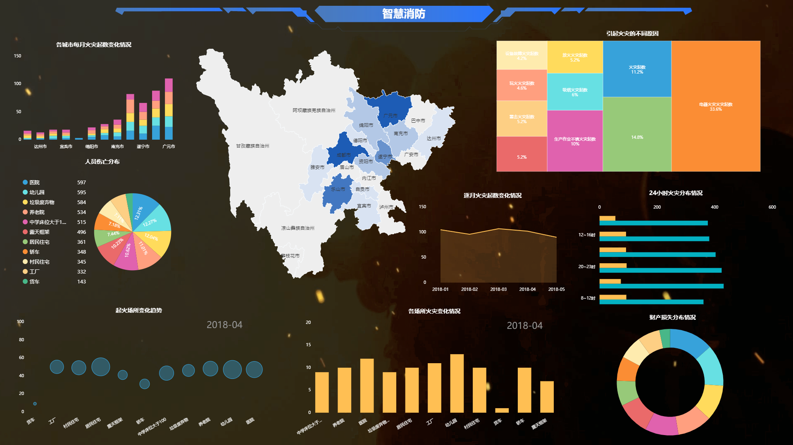

谈到BI分析工具，大家平时看到最多的应该就是Tableau和Power BI了，这两款工具分别凭借着好看的可视化效果和Excel的影响力，在近几年俘获了很多用户，这两款有个共同点，都是国外BI行业的领先者。因此，对于国内复杂的业务需求，国外的工具都有点“水土不服”，而且学习教程也大多是英文的，这对于英文一般的人来说学习难度不小。所以，我们今天来聊聊，国内有没有“符合国情”的BI工具呢？

带着这样的疑问，在国内市场观察并且试用了很多比较火热的BI工具，其中最让我印象深刻的是新崛起的DataFocus。这款也是我试用时间最长的，他们的免费试用期一个月，我就用了一个月，如果我是企业用户，一个月之后我肯定会续费继续使用，因为DataFocus这款工具，他们的搜索式分析，我敢说，在不久的未来，一定会成为主流。

选择DataFocus也是一个巧合，我当时在搜寻一些主流的BI工具，准备试用评测，然后无意间看到了DataFocus相关的文章，立马被文章中提到的DataFocus独特的搜索式分析给吸引住了，因为之前所有的BI工具，都是采用的拖拽式或者直接代码实现，所以我忍不住去搜索了DataFocus，然后下载安装试用了。从安装到我可以制作出好看的图表，进行数据分析，只有短短2个多小时。搜索式分析的智能高效在DataFocus中完美体现，在搜索框内，简单输入字段，或者关键句式，即可实时得到分析结果，并以最合适的图表展示。其中最重要的，DataFocus的关键句式搜索分析，很好地适应了中国复杂的业务需求，化繁为简。

一家企业，在选择BI时，不要盲目从众选择主流产品，要选择一款最合适企业业务的产品。
