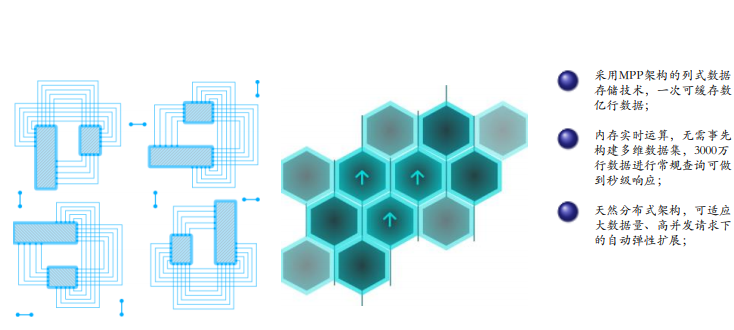

在这个大数据时代，很多行业都开始挖掘企业自身的大数据价值，而在数字化竞争越来越白热化、同质化的今天，对于企业的客户尤其是C端客户，如何让辛辛苦苦引进来的新客变成老客，老客不流失成了一大难题，尤其是电商行业。不仅如此，在数字化交易的背景下，越来越多的商家开始使用诸如DataFocus、集客CRM等做数据分析，以想要做数据化营销。但无论工具怎么先进，分析还是得靠数据分析师的人脑和思维，以思维驱动工具。思维驱动的意义就在于看到数据的呈现，能够了解其背后含义，并剖析其影响因素，从而辅助决策。那么本篇我们就以真实案例来列举一些常见的线上客户转化率数据，讨论意义并剖析影响因素。

由于数据保密性考虑，数据呈现仅以文字描述。以下是某真实零食企业数据。

数据呈现：

1、从整体的数值来看，指标略低于行业值，明显低于主要竞争对手。

2、同比去年，1-6月活跃老客户重复购买率呈下降趋势，其他指标局部提升；环比今年，各指标增长不大。。

数据意义：

衡量品牌新客吸引及老客维护效果。

影响因素：

1. 运营推广 2、店铺活动 3、服务体验 4、客户维护

那么根据以上数据解读，我们可以按照以下方法进行策略优化。

1、设定季度指标，搭建优化框架，从各环节提升店铺体验和营销，实现阶梯式增长

2、勿与运营端脱节

服务端：客服端提升、完善的客户服务、产品的关联推荐、相同产品的二次回购引导、流程化关怀、个性化包裹

营销端：详情页优化、有节奏有规划地利用活动刺激各生命周期客户回购、合理设计刺激回购的吸引点

会员端：搭建会员体系，利用会员日活动和SNS，盘活老客。

