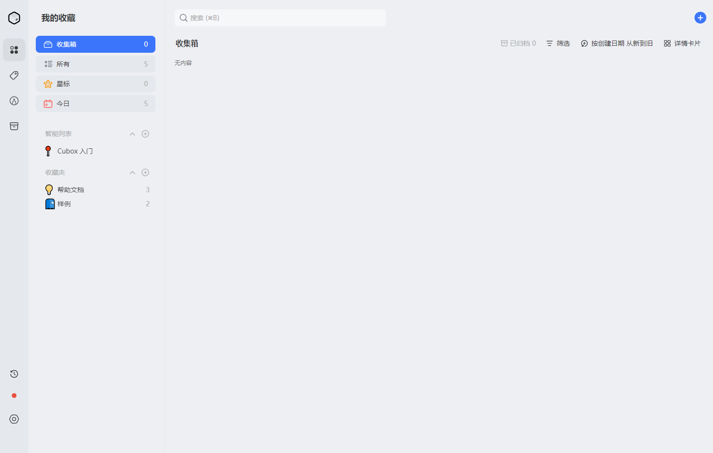
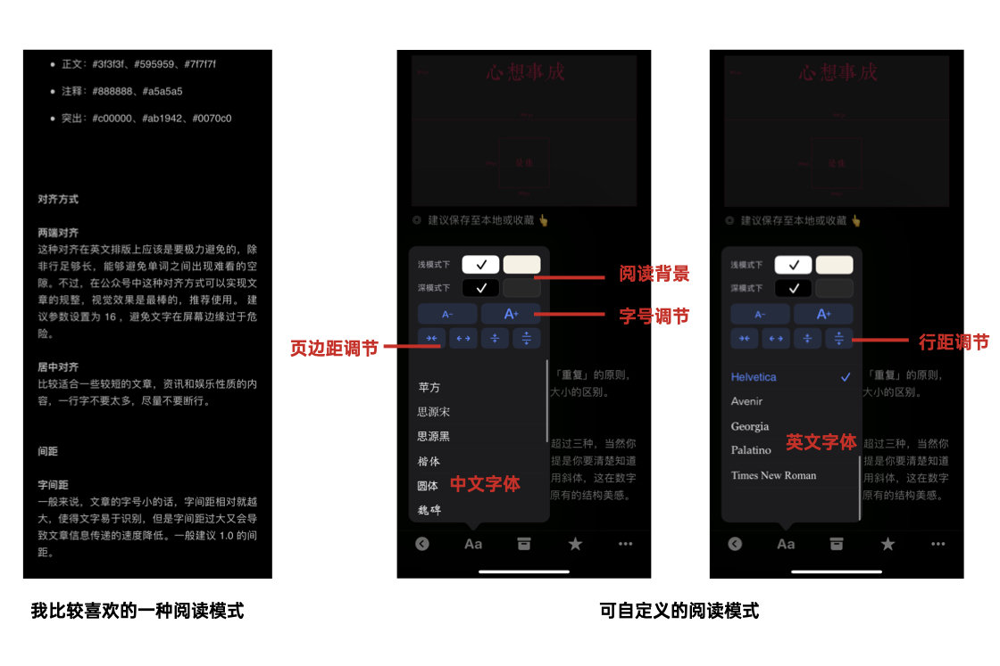
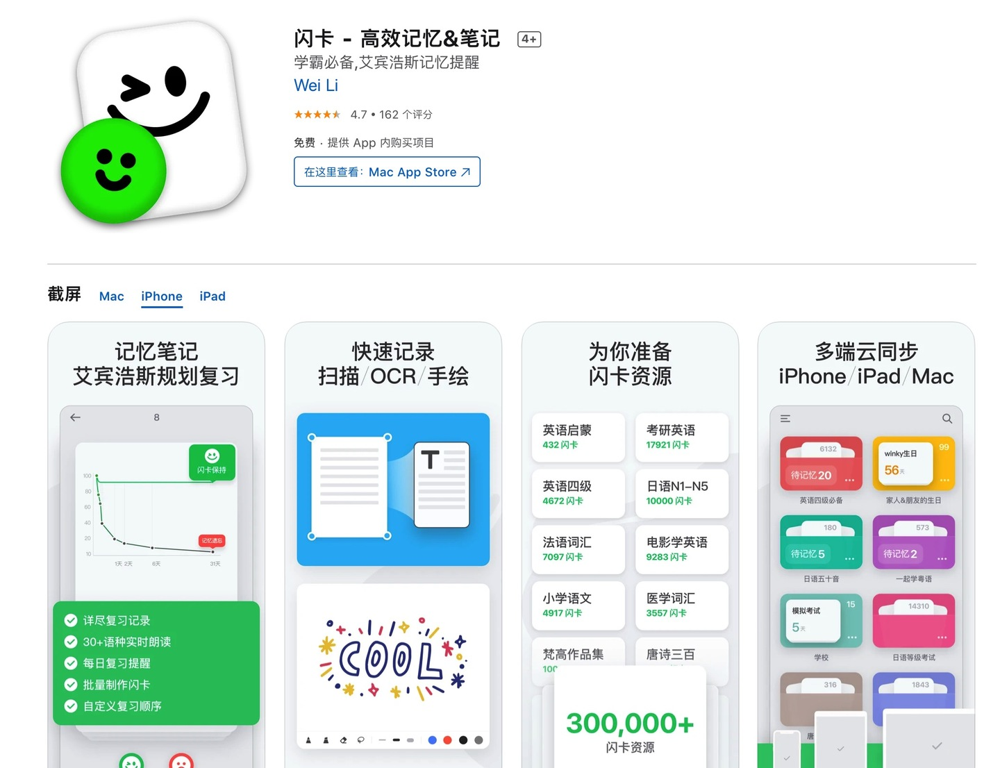
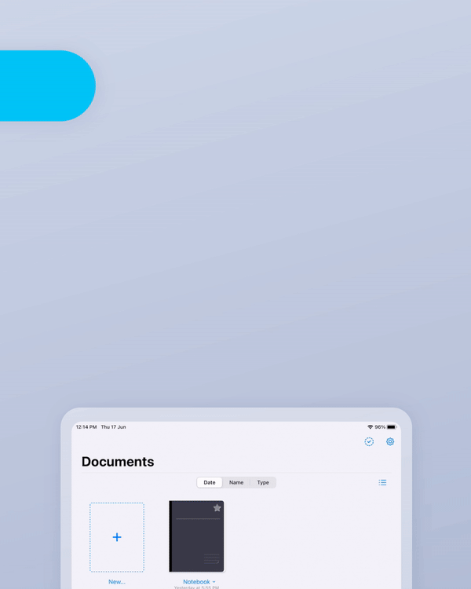
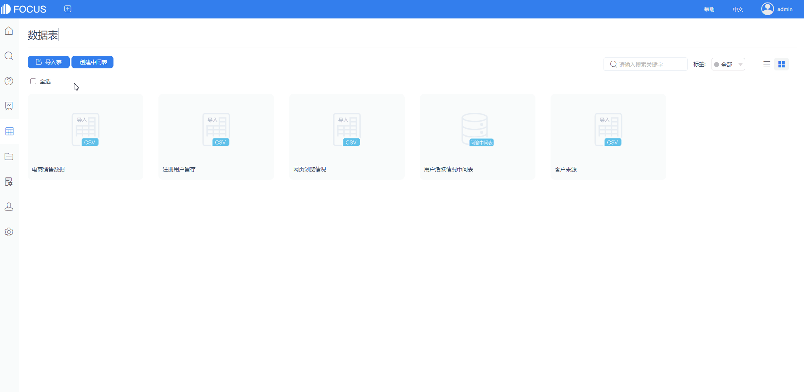
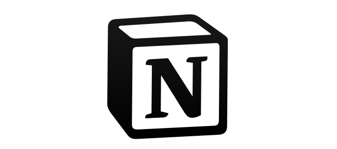

当今时代，我们需要协调好生活、工作中的各种难题，而一款合适的工具可以很好地帮助我们解决。

今天推荐四款超好用的硬核软件，每一款都能帮你大忙。

### 1.Cubox

**私人网络漫游助手**

我们在网上需要收集网站时，常常会用到网页的收藏夹功能。如果遇到一些文章想要收集，那就会利用某些读类App，之后再对文章进行阅读和处理。但实际上这些方式很不方便，文章、视频、图片、网站往往都是割裂开来的。

Cubox就是可以帮助你快速收集网络上的信息，包括文章、视频、图片、网站等等，整合好了之后就方便后期处理和搜索信息。

比如要收藏一篇公众号文章，我们一般要通过打开Safari浏览器再收藏，而有了这个插件，复制链接后下拉出通知中心并向右划就可看到 Cubox 小插件捕获了文章链接，点一下即可添加收藏。

Cubox还有”稍后读”功能，即先把文章收藏起来放到软件之后再阅读。这里软件特别注意用户的阅读体验，针对文章Cubox还提供了离线阅读视图，你可以自由调整文字排版，而不是让你阅读系统默认的文字。

当然，你收藏的信息多了，你可以进行快速地分类，需要的时候还可以通过搜索查找内容。

总的来说，这是一款非常轻巧的工具，集“收藏夹、稍后读、搜索工具、信息管理”于一身，如果你有收集信息的习惯，可以试一试这款工具。

### 2.闪卡

**专注于记忆的应用**

不论是学生还是职场人士，都不能停止学习。在学习中最头疼的就是记忆问题了，常常学过就忘或是背不下知识点。

而闪卡就是一款帮助你巩固记忆，温故知新的软件。

它可以创建记忆卡片，在上面记录学习的问题及答案。当你开始记忆的时候，点击右上角的记忆闪卡，则卡片上只会出现问题，再次点击后卡片会翻转，公布答案。

记忆完成后你可以给予反馈，分别是较好、难、再来一次。那么这就可以根据不同的学习情况调整自己的记忆计划。

当然如果不想自己创建的话，闪卡还有“发现”页面提供大量的闪卡资源，目前已达30W+的闪卡资源，直接下载使用就可以了。

总的来说，这是一款非常适合记忆学习的工具，帮助提升你的学习效率。

### 3.DataFocus

工作中常常需要数据分析，但是太多工具既卡又慢，操作还复杂，非常影响工作效率。大多数人还停留在使用Excel来处理数据的阶段，实际上早就已经有更快的数据分析工具出现了。

DataFocus就是一款简单易上手、轻巧又敏捷的搜索式BI工具。导入数据后，像谷歌一样通过搜索关键词，系统就会在几秒内以可视化图表回应。

把制作好的图表放置于一张大屏里，还可以实现炫酷的效果。可视化大屏的主题可以设置成各种类型的行业和场景，快速跟踪业务目标、项目复盘，实现业务增长不在话下。

总的来说，DataFocus是一款高效的数据分析软件，由于软件学习门槛低、易使用，也很适合小白使用。这款软件企业协作版是付费的，但个人版是免费的，有需要的话可以马上使用起来。

### 4.Notion

**出色的个人笔记软件**

不管是生活还是工作，我们都要把身边的事物、信息最大程度地简化，保持干净、有序。

我们可以通过记录笔记的方式，来进行信息整合。但和其它笔记软件不同的是，Notion使用起来就像是你生活的产品手册。

它是从上到下，逐级细化，更系统地展示内容。这也是符合你达成目标的逻辑，将你的目标细分成为可执行的小行为，并且你可以将其记录下来。

还有一点比较特别的是，它可以进行页面嵌套，可以从一页中打开新的一页，这极大地提高了思考自由度。

当然这款软件也是支持团队协作的，可以共享协作区域内的文件，而管理者拥有管理权限。

总的来说，这是一款自由度特别高的笔记工具，可以帮助你思维更敏捷，逻辑更清晰，表达也变得更简单直接。

### 小结

工欲善其事，必先利其器。

用好这几款工具，相信可以帮你变得越来越好。哪怕一个人面对生活中和工作中的难题，也能轻松应对。你还有什么优秀的工具想要推荐呢？欢迎评论区评论、分享。
