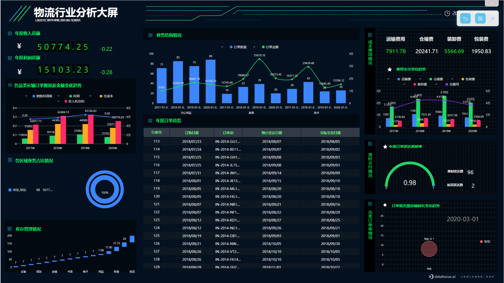

使用对了软件，职场提升效率那是迟早得事。今天给大家推荐4款精心挑选的软件，很多都是职场精英正在使用的。

# 1.

# Ditto

**Windows粘贴板增强工具**

Windows系统有个特点，你只能复制一次内容，当你复制之后，上一次复制的内容就会被替换掉。所以需要复制内容时就只能手动一次次地复制。

而Ditto是一款免费的Windows粘贴板增强工具，它可以列出你复制过的所有内容记录，你可以点击所需要的内容进行粘贴。如果你找不到你复制的内容，你还可以搜索粘贴板，找到对应的记录。

所以，当你需要多次复制时，你可以使用Ditto工具，能提升不少效率。

# 2.

# **ProcessonOn**

**流程图在线创作工具**

很多时候需要梳理工作流程或者理清工作思路，那这就需要制作流程图了。ProcessonOn是一款界面简洁操作简单的工具，直接拖放图形再加连接线，就可以完成。

除了流程图外，还支持UML图、维恩图、组织结构图、BPMN图等。

想要制作的时候，直接打开网站就可以开始了，非常方便。

# 3.

# 智办事

**简单好用的企业管理协作软件**

组织中常常会建立共同目标，并下发任务。但很多时候组织中的成员往往各做各的，而且各自进度也会不统一，个人效率就会影响整个团队效率。所以这时候就需要一款工具来提升整体的团队效率。

智办事是一款简单易用的企业管理协作软件，主要以目标为导向，帮助组织项目最终达成目标。组织负责人可以将目标拆分为子目标，再分配给团队成员，这样组织内可以清晰看到团队所要达成的效果，每个人在其中的环节占到什么位置。

这款软件主要帮助团队协作，提升个人效率，也提升了团队效率。

# 4.

# DataFocus

**“搜索”式高效分析，一键数据可视化**

工作中常常需要通过数据来汇报工作，一般的职场人会用excel记录数据，再把处理好的图表放置于PPT中。可excel和PPT在包含太多数据和内容后就会卡顿，运气不好没保存就得重来。而且老板如果提新的要求，你还得反复修改特别麻烦。

其实一款数据可视化工具就可以解决了。DataFocus是一款搜索式分析云BI平台，像谷歌一样搜索关键词，系统就会以自动适配的可视化图表回答，并以秒级响应。

再把图表放置于同一张大屏中，配上文字，就可以直接跟老板汇报了。而且大屏还是联动的，比如点击”广东”，则整张大屏都是广东地区的数据，这不比PPT香吗？

当然，这款可视化工具个人版是免费的。

# 小结

工欲善其事，必先利其器。相信熟练使用这些职场工具，必定会给你的工作效率带来质的提升。如果你也有什么工具想要分享，欢迎评论区评论、分享。
