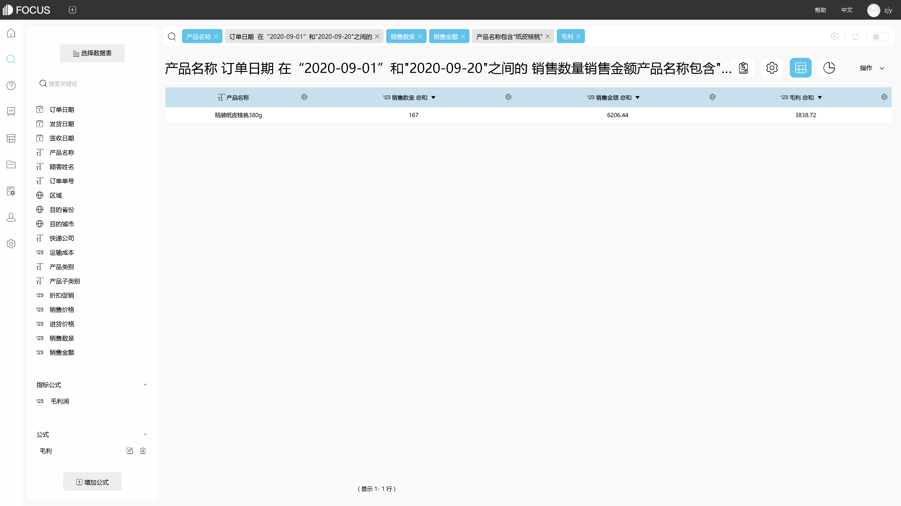

当今时代，企业数据市场正面临大数据的入侵。对于企业来说，海量的数据中蕴含着大量有价值的金矿，分析和处理数据的能力直接决定了企业挖掘数据的商业价值的能力。

一个公司发要掘这个巨大的金矿，最大的问题便是大数据分析。而大数据分析需要解决几个问题：

1. 由于各个部门使用着不同的操作系统，不同的数据格式。造成数据的关联性较差，数据不能很好的统一分析，造成数据孤岛数据壁垒。
2. 由于当今时代，企业信息化的建设，数据的产生和更新的速度越来越快。这就造成我们需要处理大量的数据，以及数据的实时更新交互。
3. 大数据实施周期长，成本高也是一个企业在大数据方面的一个难点。
4. 学习成本高，不能与前端业务人员挂钩，不符合企业生态。

作为企业大数据分析的一把利剑，选择一个合适的自助型BI至关重要。Datafocus作为一个自助型BI 完美的解决了这些问题：

1. 跟搜索一样简单。降低学习成本，做到像搜索引擎一样简单。把数据分析真正交到业务人员手中，让每个业务人员得到最合适的数据分析结果。
2. 节约成本支出，便捷式自助分析。让企业花费最少的成本获得最大的价值，无需专业的分析人士，无需另外学习复杂的编程语言和数据库语言。
3. 实施周期短，只需要三周的时间大型企业即可完成整个数据分析部署，最高程度的提高工作效率。
4. 消灭数据孤岛，轻松处理海量数据。企业可以通过datafocus快速打破数据孤岛，处理海量数据，辅助企业运营决策。

如果公司想要正确地分析数据，他们将需要一个聪明的分析师，一个处理海量数据的“智能”工具。幸运的是，专门研究大数据的商业智能BI Datafocus出现了。我们期待着智能企业的出现，把海量的云数据转化为信息，然后把信息转化为知识，最后从知识中提炼出智慧，为企业插上腾飞的翅膀。
