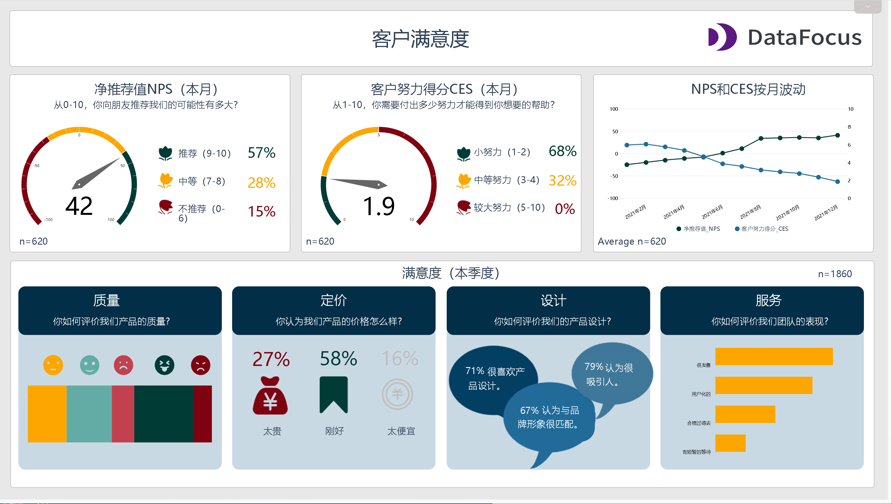
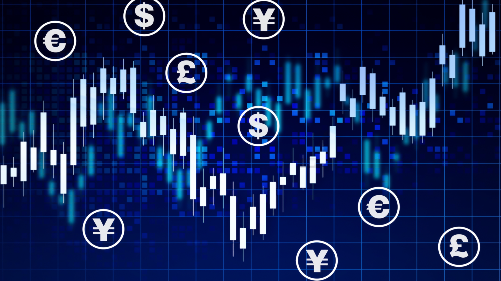
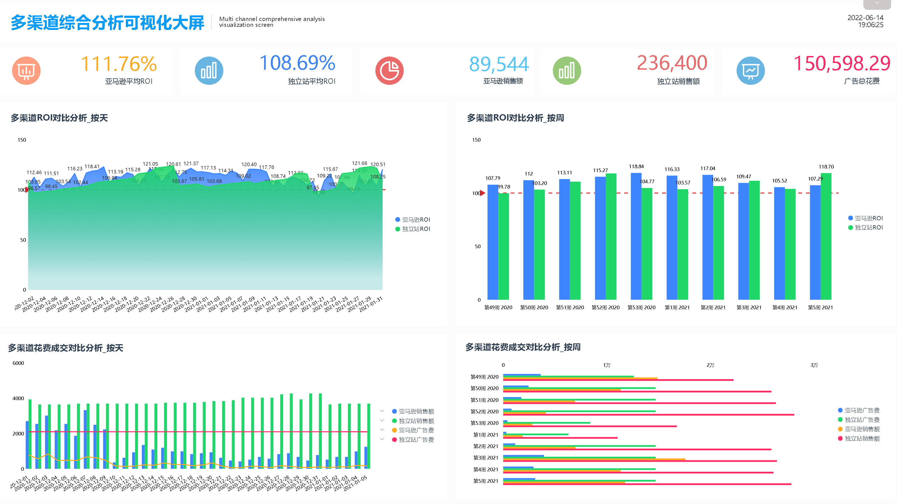
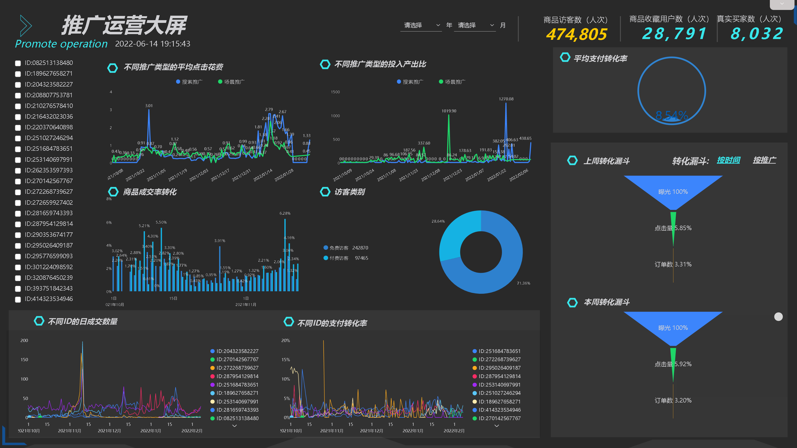

你是否听过这样的内容：“用4P营销理论做微商”，“4P营销模型解析直播带货成功的关键”，“4P模型可以帮你更好的理解餐饮营销”，“根据4P营销理论分析数据来对酒店运营提建议”......那么，什么是4P营销理论？

**营销4P理论，是一种以时长为导向的营销组合理论，普遍被企业应用在营销领域。**

4P分别是指产品（Product）、价格（Price）、渠道（Place）和推广（Promotion）。通过将这四项结合并协调发展，进而提高企业在市场中的份额，以达到最终获利的目的。

## 1、产品（Product）

这里的产品，不仅指销售的实物，还可以是内容、服务、信息等等。

在营销之初，你需要先明白如何才能让自己的产品在市场中脱颖而出，并吸引到客户。

除了需要研究产品特性、研究竞品、定位客户，还需要不断地根据客户需求对产品进行改进。一个比较好的方式，就是尽可能收集并分析客户和市场的反馈。

例如图中，BI工具DataFocus的客户满意度仪表盘，就是根据客户反馈数据，进行的客户满意度分析，从中我们可以大致了解客户对产品的评价并参考改正。

## 2、价格（Price）

你的产品是如何定价的？不同市场定位的产品，一般会有不同的价格策略。例如刚进入某个竞争激烈的领域时，你可以采用降低产品价格，甚至是免费的策略。

也可以从数据出发，通过对竞品的价格、这个领域的平均价格以及一定时间范围的价格趋势等等来判断定价。

## 3、渠道（Place）

你的潜在客户在哪里，你可以通过什么渠道接触到他们，线上还是线下。如果是线下的话，主要是哪些城市，城市中的哪些地点，甚至是哪个商场。如果是线上的话，同类产品在哪些平台会比较活跃，你是否了解这些网络平台的优缺点和特性。

## 4、推广（Promotion）

这里的推广，包括促销、品牌宣传、公关等等。

通过推广实现你的商业价值。你会如何让你的客户发现你；你会选择哪些渠道对产品进行推广，电视、微博、抖音、大众点评、直播平台亦或是地铁广告牌；你会选择在什么时间进行推广；你在推广时会采取什么样的方式......

**为什么某些直播带货会那么火？**

我们从4P营销模型上简单来看，最火的几个直播带货，直播间中商品不仅能够满足日常需求，而且价格也是其它渠道轻易买不到的。在保证产品质量、直播内容吸引人的情况下，直播间受欢迎是毋庸置疑的。并且在主播的背后，也会有一个专业的团队进行招商选品、发货、售后、PR宣传等等。

4P营销理论可以帮助你制定有效的营销策略，但如何通过营销策略打败竞争对手，则需要我们不断地学习和实践。
