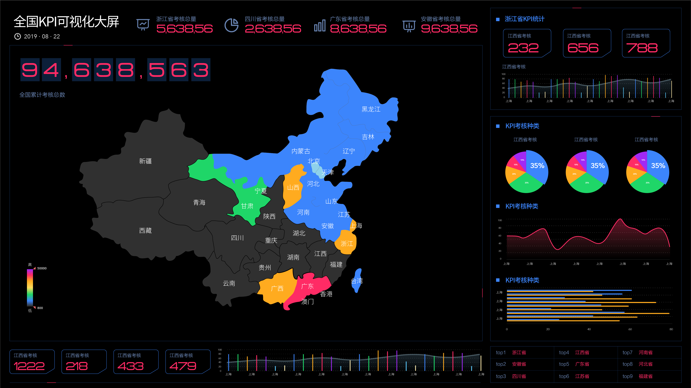

在新零售行业，随着数字化交易的大量进展，越来越多的客户被数据化，并且导入到了企业的客户数据库。而我们都知道，以阿里为首的新零售平台每年都有各类狂欢节日，甚至店铺也有自己的会员日等节日。很多企业都会在活动前后进行数据分析预测，活动实时分析，以及活动后数据复盘，包括转化率分析、好评率分析等，有的企业有专门的数据分析团队，也有的企业使用DataFocus等BI工具进行分析。而有很多平台大型活动是有预售的，比如618年中大促或是双十一狂欢节，而和预售捆绑的“孪生兄弟”就是优惠券。那么关于这个营销利器来说，应如何实施呢，还是那句话，决策需依靠数据分析进行辅助。

首先我们要了解预售对于企业或店铺的真正意义。其实，预售通过付定金，起到一个提前圈定客户的作用，并可以通过数据实时分析做得精细些，不断的优化目标“圈定”的客户群体，实时数据分析的意义就是能够让圈定的客户群体精准化。那么数据分析结果出来后，当商家知晓了应“圈定”的人群，就可以进行通知。而且，这个阶段通过历史数据分析，分析出对于预售敏感度很大的客户进行二次通知，促成客户付定金，付定金后也要进行实时数据分析，看付款率如何，因为我们有接触过历史数据分析后得出的群体进行二次催付，付款率却很低，原因是此群体客户已经部分流失，就像我们说的自媒体粉丝一样，变成了无价值数据。所以实时数据分析可以避免店铺一股脑的认定此类人群是敏感度极高并且容易付款的，节省营销成本。

然后就是优惠券的发放工作了。为什么要强调发放优惠券呢，现在店铺都会在页面放人人都可领取的优惠券，对部分老客户来说会没有尊贵感。所以可以以访问但未领取优惠券的客户群体数据，和老客户群体数据，进行交叉分析，得出看到了却没有领取的老客，针对这部分老客发送专属的优惠券。这个优惠券可以通过客户运营平台来发送，也可以发电子优惠券。这里要注意的是，还可以进行一步针对客单价的数据分析，对不同客单价的客户要推送不同的面额，比如客单100-200的送10元送优惠券，200-300的送15元优惠券等等，根据店铺实际情况去设置。
