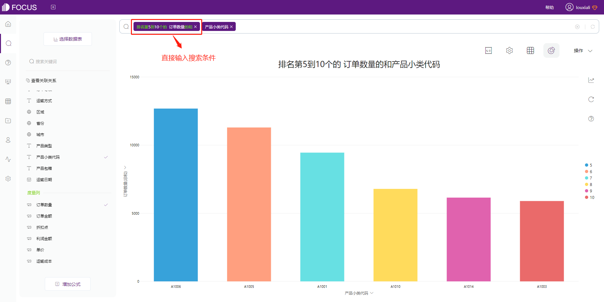
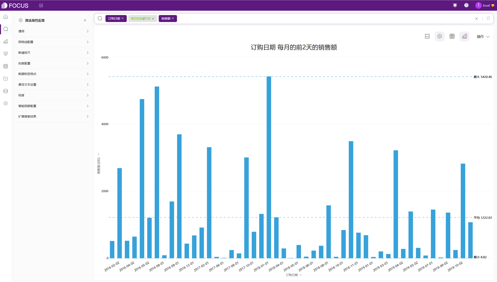
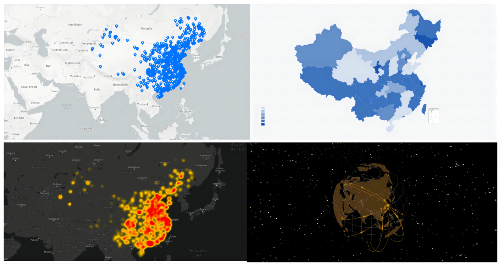
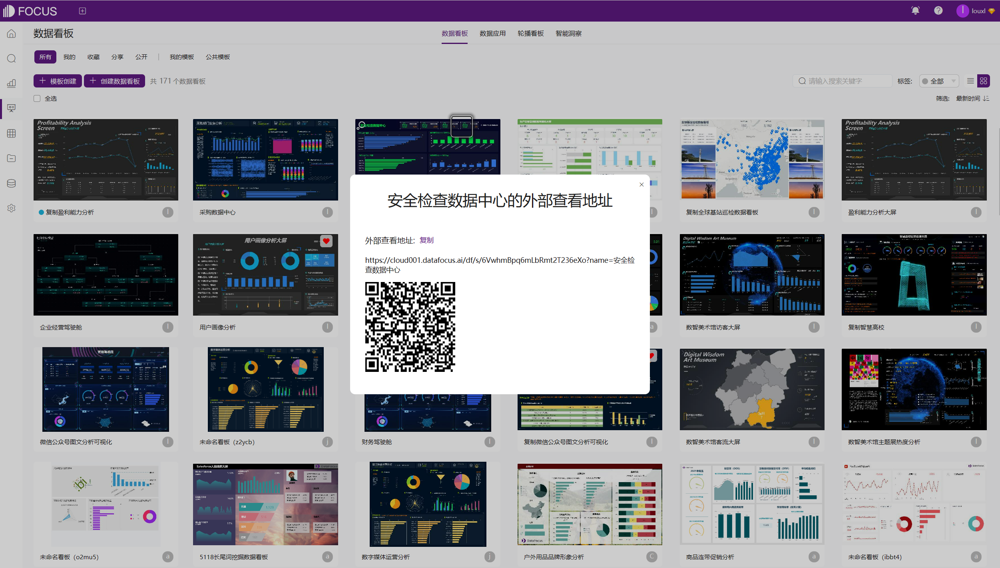

# HENGSHI SENSE vs DataFocus Cloud

## **一、产品简介**

HENGSHI SENSE是可私有部署的 BI PaaS 能力平台，数据分析 PaaS 基础设施，以Analytics as a Service 形态，为 SaaS 企业提供深度整合的能力平台，快速赋能伙伴拥有企业级的 BI 报表能力。

DataFocus Cloud （以下简称 DFC ）是一个一站式智能搜索式数据分析BI平台，提供从数据源整合到可视化分析的全流程功能。DFC面向业务，不仅为业务人员提供了便捷的、零代码式的搜索分析，还提供业务编排、数据Reverse-ETL到业务系统等功能，Focus Search搜索模块集成等优势能力，帮助企业真正实现数据为业务赋能。

1. **交互方式**

HENGSHI SENSE利用传统的拖拽式操作来创建仪表盘。从Tableau起，拖拽式就是数据分析工具的主流交互方式，然而拖拽式操作会花费大量时间，尤其是在创建复杂的可视化的情况下。

DFC应用简单易上手的搜索式操作：用户只需要输入问题，其他全部由系统自动实现。

在交互方式上做出的革新，从以下几个方面提高了数据分析效率。

1. 字段输入

搜索式分析带来最直观的变化是字段输入方式。HENGSHI SENSE的拖拽式操作是分别把字段拖入横轴和纵轴的位置。如果临时需要使用数据表中没有的字段，还需要重新去数据集中创建指标，整体操作流程比较繁琐。

DFC可以直接在搜索框中输入字段和计算条件，系统会自动返回结果，之后可以更改图形类型。DFC还支持直接在搜索框中输入公式参与计算，或者在搜索页面直接创建公式参与计算。如原数据表中有单价和运输成本，输入“订单日期 单价-运输成本 每月 产品类型”就可以获取每种产品每月的利润情况了。

图2-1 搜索式输入

DFC内置关键词分为7大类，覆盖用户所有分析场景，支持关键词智能提示功能。

图2-2 关键词智能提示

b.条件过滤

DFC的搜索框，还能简化过滤条件设置。数据分析离不开对条件的定义，比如销售时间段的选择（年/年月/季度等），销售额标准的界定（大于/小于/不等于/前N个等），客户地域的过滤等，这样才能从多角度了解原始数据的情况。

在拖拽式操作中，每一次条件过滤都需要好几个步骤来设置，而在DFC 中却只需要直接输入。

得益于强大的内置关键词库，DFC可以把需要筛选操作的步骤都直接转化成关键词输入，比如X月、X季度、周一、具体日期之前/之后等。

c.复杂计算

一些过去需要用SQL语句进行分析的场景，在HENGSHI SENSE的拖拽式操作下会受限而无法实现，但是在DFC 中仍然只需要搜索即可，比如销售量第5到第10的产品、每月的前2天的销售额、按区域统计排名前3的订单金额的总和等。

图2-3 销售量第5到10个的产品

图2-4 每月的前2天的销售额

1. **数据接入与预处理**

HENGSHI SENSE的数据分析基于数据集市进行的，数据集市就是满足特定的部门或者用户的需求，按照[多维](https://baike.baidu.com/item/%E5%A4%9A%E7%BB%B4/7456169?fromModule=lemma_inlink" \t "https://baike.baidu.com/item/%E6%95%B0%E6%8D%AE%E9%9B%86%E5%B8%82/_blank)的方式进行存储，包括定义维度、需要计算的指标、维度的层次等，生成面向决策分析需求的[数据立方体](https://baike.baidu.com/item/%E6%95%B0%E6%8D%AE%E7%AB%8B%E6%96%B9%E4%BD%93/9851963?fromModule=lemma_inlink" \t "https://baike.baidu.com/item/%E6%95%B0%E6%8D%AE%E9%9B%86%E5%B8%82/_blank)。HENGSHI SENSE支持新建数据集（本地文件导入、数据连接、SQL查询）和转换已有数据集（多表联合、数据聚合、数据合并、引用数据集、行转列、列转行），支持在数据集中新建指标参与计算。

而DFC由于其独有的交互方式，决定了在数据接入和与预处理方面也更便捷、更流畅。

首先，DFC支持本地数据文件导入、接入外部数据源数据（直连/导入）和API数据导入，接入的数据表可以直接用来进行数据分析，不需要进行预先的数据集市创建过程和与预先的聚合数据、行列转换操作。

此外，DFC提供了ETL工具DataSpring进行更大规模、复杂的数据接入场景。DataSpring采用了当前最流行且成熟的Flink框架，既支持多业务系统数据的定时、批量数据处理任务，也支持一些需要实时计算的流处理场景，比如传感器的采集数据、网站埋点数据的即时收集和处理。并且有可扩展的接口用于自定义接入连接器。DataSpring通过创建任务流的方式预处理数据。系统默认提供了抽取、转换、过滤、加载等处理器供用户拖到画布中配置和使用。每个处理器可以选用丰富的算子函数，也可以在算子模块自定义UDF算子，对源数据进行一系列的转换和清洗。清洗完成的数据可以通过加载器导入到DataFocus数仓中完成下一步分析和可视化展示。

### 

图3-1 任务流管理

此外，DFC还有中间表应用、多表关联、行列转换、列拆分、列错行、公式应用等方式来辅助数据处理。

DFC支持直接在搜索页面添加公式列参与计算，以便用户更好地进行探索分析。公式包括聚合、分析、变换、日期、逻辑等公式，还可以利用已创建的公式进行二次创建，即公式嵌套使用。

另外，DFC也支持在系统管理中创建自定义公式和指标公式。设置自定义公式，该公式可以在搜索页面和创建关联中间表页面中添加公式时直接使用，即在原有的函数基础上，用户自己设计逻辑计算函数。

创建指标公式后，进入搜索页面，选择指标公式所在数据源，可以在页面左侧看到此指标公式，并能使用该指标公式进行搜索分析。

1. **图表可视化**

HENGSHI SENSE提供了40多种可以直接使用的图表类型。还支持用户将字段绑定到图表的颜色、大小、形状、标签等属性上。

而DFC的可视化逻辑是让图形适配数据，而不是用数据适配图表。你只需要在搜索框中正确输入条件，系统会根据你输入的维度和度量个数，结合图表需要呈现的比较/分布/随时间变化等目的，智能展示最合适的图表（支持自由更换）。

DFC 支持的图表类型超过 50 种。除了覆盖HENGSHI SENSE的所有图表类型外，还有平行坐标图、直方图、时序图等。

针对用户的特殊需求，DFC还提供插件图形的方式，根据需求灵活定义新图形。

图4-1 DFC支持插件图形

DFC支持的地图类型也更丰富，包括3D地球散点图、轨迹图、位置经纬图、GIS位置图等。此外，用户还可以将自己的地图或地理数据导入到系统。

图4-2 地图可视化

1. **大屏可视化**

HENGSHI SENSE是直接在仪表盘中创建图表，不能单独保存或导出。如果需要临时制作某张图表，也需要创建可视化大屏，操作繁琐且浪费时间。

而DFC的图表（历史问答）和数据看板（大屏）相互独立，制作好的图表可以用来组合成大屏，也可以单独操作，实现保存、保存为中间表、以csv或图片格式导出，方便复用或单独分析。

图5-1 DFC历史问答操作项

还支持将制作好的图表添加到数据简报中实时发送给邮箱用户进行查看，操作灵活，时效性高。

图5-2 DFC加入数据简报

从可视化大屏支持的控件来看，HENGSHI SENSE支持图表、图片、富文本、网页、过滤器、容器控件等。DFC除了覆盖上述所有控件外，还支持视频、更丰富的文本组件以及直接在大屏中加入搜索组件进行实时的搜索分析。

HENGSHI SENSE支持以URL和iframe嵌入仪表盘。而DFC不仅支持嵌入仪表盘，还支持嵌入单个图表，而且大屏和图表都可以通过创建外部链接的方式进行访问，访问用户不需要注册与登录。通过这个功能，可以让非系统内的用户临时查看，适用于项目对接、方案介绍、工作汇报等场景。

图5-1 创建外部访问链接

1. **嵌入分析**

HENGSHI SENSE支持iframe嵌入、设计器嵌入、API深度集成或将各个标准的功能模块通过API按需接入，提供二次开发能力。

DFC支持iframe嵌入、Focus Search嵌入和API深度集成或将各个标准的功能模块通过API按需接入，提供二次开发能力，拥有与华为的深度集成实践。

1. **权限管控**

HENGSHI SENSE和DFC都提供了基于角色的用户权限管控，从源头隔离用户数据，支持多级权限、支持多种认证协议，精细到行列级的权限控制。HENGSHI SENSE需要在单个数据集中进行权限设置，而DFC在系统管理的权限管理下，提供了全局的、统一的权限配置页面，操作起来更加便捷快速。

1. **DFC其余优势功能**

DFC秉承用数据为业务赋能的理念，帮助业务人员实实在在解决业务难点。为此在功能模块上进行了拓展。

1. 数据应用

数据应用模块是将企业的指标体系、业务模型、数据分析模型打造成开箱即用的数据看板模板，企业只需要替换模板中的数据，就可以实现开箱即用。数据应用支持API创建和数据表创建，可以让企业快速打造业务驾驶舱，实时监控企业业务动向。

1. 业务编排

通过设置同步消息任务，形成自动化的业务联动逻辑。当数据满足设定条件时，会在运营和事务系统（例如ERP，CRM，MES，钉钉）等进行自动消息提醒，形成系统间的双向连接，从而允许用户在DataFocus中做出的分析在整个数据环境中全面传播。

## 九、总结

 

<table style="width: 1415px; display: none;"><tbody><tr><td style="width: 78px;"></td><td style="width: 754.365px;">DataFocus Cloud</td><td style="width: 563.302px;">HENSGSHI SENSE</td></tr><tr><td style="width: 78px;">交互方式</td><td style="width: 754.365px;">搜索式（中/英文）</td><td style="width: 563.302px;">拖拽式或SQL语句</td></tr><tr><td style="width: 78px;">数据源接入</td><td style="width: 754.365px;">外部数据源、API导入、本地数据文件，<strong>自研的ETL工具DataSpring支持更复杂的数据接入场景</strong></td><td style="width: 563.302px;">外部数据源、API导入、本地数据文件</td></tr><tr><td style="width: 78px;">数据处理</td><td style="width: 754.365px;">数据接入后<strong>不需要创建数据集，可以直接进行使用</strong>，<strong>不需要提前进行数据分组和聚合处理</strong>，都由系统自动实现；

或者通过中间表应用、多表关联、行列转换、列拆分、列错行、公式应用后使用</td><td style="width: 563.302px;">数据必须创建数据集市-数据包-数据集后使用；

支持以多表联合、合并、数据聚合、引用其他数据集、行列转换等方式新建数据集；</td></tr><tr><td style="width: 78px;">图表可视化</td><td style="width: 754.365px;">支持50多种图表类型；

<strong>自适应的图表可视化</strong>，系统智能适配图表，创建前不需要选择；

<strong>支持6种地图和3D地球类型</strong>；</td><td style="width: 563.302px;">支持40多种图表类型；

先选择图表类型，再拖拽式创建图表；

支持2种地图；</td></tr><tr><td style="width: 78px;">大屏可视化</td><td style="width: 754.365px;">支持数据看板嵌入；

支持图表、文本、图片、<strong>视频</strong>、素材、iframe、Tab筛选、卡片等组件；

<strong>支持在大屏中添加搜索控件</strong>，实现搜索分析；

<strong>支持定时刷新配置</strong>；</td><td style="width: 563.302px;">支持仪表盘嵌入；

支持图表、文本、图片、容器、按钮、筛选、网页等组件；

不支持定时更新配置；</td></tr><tr><td style="width: 78px;">数据应用</td><td style="width: 754.365px;"><strong>支持API或数据表应用</strong></td><td style="width: 563.302px;">不支持</td></tr><tr><td style="width: 78px;">业务编排</td><td style="width: 754.365px;"><strong>支持与业务系统的双向链接</strong></td><td style="width: 563.302px;">不支持</td></tr><tr><td style="width: 78px;">权限管控</td><td style="width: 754.365px;">行列权限管控</td><td style="width: 563.302px;">行列权限管控</td></tr><tr><td style="width: 78px;">嵌入分析</td><td style="width: 754.365px;">支持</td><td style="width: 563.302px;">支持</td></tr><tr><td style="width: 78px;">付费方式</td><td style="width: 754.365px;">按照整套产品定价，不限制使用用户数量，年费制，<strong>价格性价比更高</strong></td><td style="width: 563.302px;">按照整套产品定价，不限制使用用户数量，年费制</td></tr></tbody></table>

