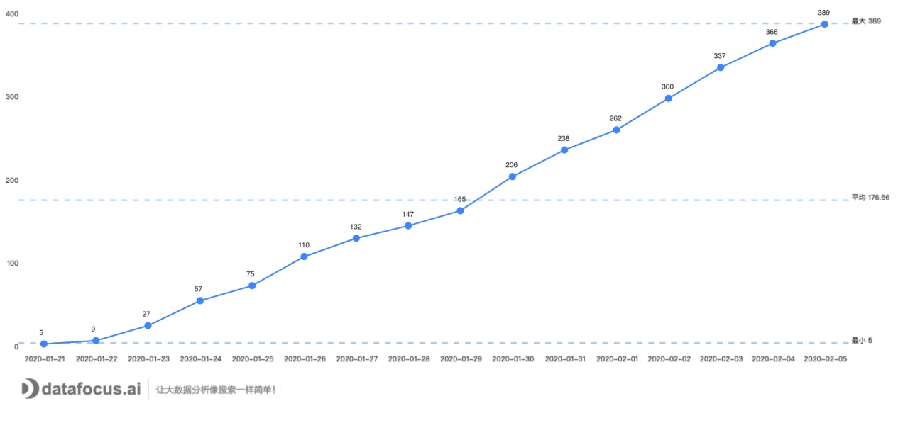
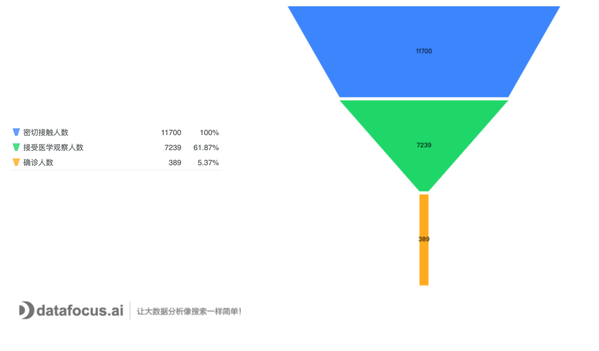

_近日，一则关于“重庆疫情应急物资”的新闻广受关注。该要闻提到，重庆的一批从国外紧急调用的口罩医疗物资，被云南大理中途截获征用了。从疫情的轻重程度来看，重庆确诊人数389，而大理确诊人数仅为8人；俗话说，事有轻重缓急——大理此举，确实不妥。_

_那么重庆现在疫情到底如何呢？接下来我们通过重庆卫健委公布的疫情数据，深入了解下重庆的疫情现状。_

1. 宏观了解疫情现状

截止2月5号24时，重庆市确诊病例累积389例，其中重型病例32例，危重型病例11例，死亡病例2例，出院病例15例。累计追踪到密切接触者11700人，已解除医学观察4461人，尚有7239人正在接受医学观察，**目前确诊病例数排在全国第8位**，疫情不容忽视。

从图1可以知悉整个省份的确诊人数没有特别的爆发期，但始终保持着较高的增长速度，并且即将突破400人；因此情况严峻，需要格外注意，防止突现大幅度增长。

图1 每日确诊人数

从图1结合图2综合来看，重庆市的确诊人数虽然在持续地增长，但是日增长率自1月23号之后，基本维持在50%以下，在1月26号之后，除小幅度上涨以外，基本呈现下降趋势，且现在增长率已经下降到10%以下，说明重庆市疫情相关的政策有一定的成效，疫情发展已经进入平台期。

图2 日增长率

1. 分区深入了解疫情数据

从上文了解到重庆市目前的疫情呈现缓慢增长的趋势，相较前期的增长速度以及幅度都有所下降，疫情防控的工作开展效果较佳。

如下图3所示，万州区的疫情最为严重，占据总人数的17%以上，其余区域比例都在5%以下，因此要格外注意万州区。据了解万州区发病高峰时段与春节返渝时段隔期重叠，以输入性病例为主，因此建议当地政府对外来人员进行严密监控。

图3 各区确诊比例

1. 从各项指标着重分析

从追踪到的密切接触者，以及接受医学观察人数，和确诊人数，来计算每个阶段的转换率，从中可以预判未来的确诊人数增加情况，重庆市最终确诊率为5.37%，说明密切接触者里面有5.37%的机会会被感染。

图4 各阶段转换率

一般在传染病分析里面，一定会关注的四项指标，分别是：死亡率、感染率、重症率以及治愈率，下图中为截止到2月5日24时，重庆市的四项指标，分别是死亡率0.51%、每万人感染率13%、重症率8.2%以及治愈率3.9%，由此可以看到，此次疫情的死亡率没有特别高，但是其重症率较高，且高于治愈率；这说明对于此次疫情，仍然没有找到效果最佳的治疗方案。

图5 重要指标

图6 分析结果展示大屏

分析结果展示地址：

[https://datamart.datafocus.ai/#/pinboard/outside/e3c7d0e405e64c7fa27f0f92a6d95e02](https://datamart.datafocus.ai/#/pinboard/outside/e3c7d0e405e64c7fa27f0f92a6d95e02)

_目前，重庆疫情虽然进入平台期，但是形式仍然严峻复杂，防控正处于关键期，广大市民既不能心存侥幸、麻痹大意，也不要过度恐慌和焦虑。_
