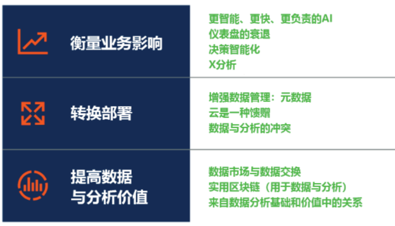

**新冠疫情对数据分析领域有什么影响?新的技术又将带来哪些机会？每个数据分析领域的创新者和从业者都在关注着这些问题。**

全球知名的IT研究与顾问咨询公司Gartner发布了**2020年数据和分析技术十大战略技术趋势**，能够指导我们看向未来，研究如何利用这些趋势，实现复苏和再创造。

图 Gartner 数据和分析技术十大战略技术趋势(2020)

> **趋势1：更智能、更高速、更负责的AI**

到2024年底，75%的企业机构将从人工智能（AI）试点转为AI运营，基于流数据的分析基础架构的数量将因此增加5倍。

新冠疫情期间，机器学习（ML）、优化和自然语言处理（NLP）等AI技术正就病毒传播、应对效果及影响提供重要洞察和预测。

而强化学习和分布式学习等其他更智能的AI技术正在创建更具适应性和灵活性的系统，用于处理复杂的业务情况。例如，基于代理的系统可对复杂系统进行建模和仿真。

**DataFocus解读**

早在2017年，Gartner就提出了“**增强分析**”的概念，被誉为数据与分析市场内的下一波颠覆性技术，是数据分析的未来。简单的理解就是采用机器学习（ML）、自然语言处理（NLP）、数据挖掘等技术应用到数据分析流程中，使数据分析更加自动化、智能化。Gartner对自然语言处理（NLP）等AI技术的持续看好，与DataFocus不谋而合。**从DataFocus问世之初，就一直潜心打磨NLP技术，致力于颠覆数据分析交互过程，从拖拽式时代，进入搜索式到智能分析时代。**

> **趋势2：仪表板的衰落**

具备更多自动化和消费化体验的动态数据故事将取代视觉化、点击式的数据创建和探索。因此，用户使用预定义仪表板的时间也将会减少。向支持增强分析或NLP等技术的动态数据故事转变，这意味着：最相关的洞察将基于用户的场景、角色或用途，流式传输给每个用户。

**DataFocus解读**

**Gartner强调了仪表板从静态展示向动态交互的发展趋势。**DataFocus的数据看板，通过拖拽组件自由组合布局，充分发挥数据分析人员的视觉创意。还可实现数据联动展示、数据实时更新，看板分享与协作等功能。

> **趋势3：决策智能**

到2023年，33%以上的大型企业机构将聘用分析师实现包括决策建模在内的决策智能。决策智能汇集了决策管理和决策支持等多项技术。它提供了一个框架，帮助数据和分析领导者针对业务成果和行为，设计、建立、协调、执行、监控和调整决策模型及流程。

**DataFocus解读**

Gartner预测数据指导决策的观点将进一步普及，企业决策者开始更多地用数据说话。**而DataFocus的野心更大，不仅要有专业的数据分析师，还要让每个业务人员成为数据科学家，成为业务人员最得力的数据助手，充分发挥业务洞察力。**

> **趋势4：X分析**

“X分析”是由Gartner创造的一个总称术语，其中的X指代各种结构化和非结构化内容（如文本分析、视频分析、音频分析等）的数据变量。X分析与AI、图谱分析等其他技术结合起来，将对未来自然灾害和其他危机的识别、预测和规划发挥关键作用。

**DataFocus解读**

企业用来做决策的数据类型将会扩大，组织机构需要布局将触角延伸到视频、音频、嗅觉、振动、自然语言、情绪或情感数据，以获得可操作的见解。数据和分析领域领导者应该探索现有供应商提供的X分析能力，比如用于图像、视频和语音分析的云计算供应商等。

> **趋势5：增强型数据管理**

增强型数据管理利用ML和AI技术优化并改进运营。它还促进了元数据角色的转变，从协助数据审计、沿袭和汇报转为支持动态系统。

增强型数据管理产品能够审查大量的运营数据样本，包括实际查询、性能数据和方案。利用现有的使用情况和工作负载数据，增强型引擎能够对运营进行调整，并优化配置、安全性和性能。

**DataFocus解读**

增强管理在数据质量、数据安全、元数据管理等数据治理和管理领域都将带来改变。在元数据管理方面，利用自然语言处理、语义分析等技术自动识别和提取非结构化数据，建立非结构化数据业务词语库；在数据质量和数据安全管理方面，利用深度学习、知识图谱、语义分析等技术自动实现数据分类，自动识别和处理数据质量问题、数据安全问题等。

> **趋势6：云成为必然**

**到2022年，公有云服务将对90%的数据和分析创新起到至关重要的作用。**随着数据和分析的上云，数据和分析领导者仍然很难实现服务与用例的协调一致，这就增加了不必要的治理和集成开支。

数据和分析问题的关键，已经从某项服务的成本转为如何在定价之外满足工作负载的性能要求。上云时，数据和分析领导者需要优先处理能够利用云能力和专注于成本优化的工作负载。

**DataFocus解读**

在大流行之前，趋势已经很明显：组织将数据管理与分析转移到云上的速度显著加快。**DataFocus又一次引领了数据和分析领域的新趋势。**DataFocus Cloud，帮助企业实现云端数据分析，告别昂贵的硬件维护和人员成本。DataFocus Cloud自带基于云计算、支持大规模并行处理的数据仓库，给企业提供无限扩展的计算和存储资源支持。

> **趋势7：数据和分析的碰撞**

数据管理能力和分析能力在传统上被视为不同的领域，需要分别进行管理。利用增强分析提供端到端工作流的供应商使这两个市场之间的界限变得模糊了。

数据和分析的碰撞将增加这两个传统上相对独立的领域之间的交互和协作。这不仅会影响到所提供的技术和能力，还会使支持和使用它们的人员和流程受到影响。相关角色也将从传统的数据和分析扩展到信息探索人员和公民开发人员等。

**DataFocus解读**

在DataFocus看来，数据管理和分析从来都不应该割裂。**基于这样的理念，DataFocus Cloud颠覆了传统作业模式，采用AaaS（Analyze as a Service）分析即服务模式，直接为企业提供数据智能分析服务。**

> **趋势8：数据市场和交易平台**

到2022年，35%的大型企业机构将通过正式的在线数据市场参与数据交易，而这一比例在2020年为25%。数据市场和交易平台为整合第三方数据产品和降低第三方数据成本提供了统一平台。

**DataFocus解读**

数据共享能力的健壮性将变得更加重要。为了通过数据市场将数据资产货币化，数据和分析的领导者应该通过定义一个生态系统合作伙伴可以依赖的数据治理原则来建立一个公平和透明的交易方法。

> **趋势9：区块链技术在数据和分析中的应用**

区块链技术解决了数据和分析领域中的两项挑战。首先，区块链提供了资产和交易的完整沿袭。其次，区块链为复杂的参与者网络 **DataFocus解读**

Gartner认为区块链技术为数据分析建立了一个可信任环境，提供了数据产生、变更的全链血统信息，在数据分析和管理中，能够有效保护个人隐私和防止核心数据泄露。相信随着区块链的相关技术标准、安全标准的进一步完善，区块链将在数据管理、数据分析中发挥其更大的价值和作用。

> **趋势10：关系奠定了数据和分析价值的基础**

到2023年，图谱技术将促进全球30%的企业机构决策过程的快速情景化。图谱分析是指一系列用于探索不同感兴趣的实体（如组织、人员和交易）之间关系的技术。它帮助数据和分析领导者找到数据中未知的关系，并查看传统分析技术不易分析的数据。

**DataFocus解读**

组织需要有效地关联多个数据集，如人员、地点、事物或位置。图形建模技术允许品牌在人们更可能购买的产品之间建立关系。**DataFocus利用自带的大数据仓库，能够轻松对接企业各类传统关系型数据库。独有的雪花模型，支持复杂的数据库结构；通过多数据源整合，支持跨系统分析，彻底打破数据孤岛。**

> **总结**

怎么样？通过对2020数据和分析技术十大趋势的解读，小编对DataFocus更加充满了信心。DataFocus就是这样一款面向未来、希望用独有的搜索式分析，为数据和分析领域带来变革的智能分析产品。**（后面增加公测和申请试用的说明）**
