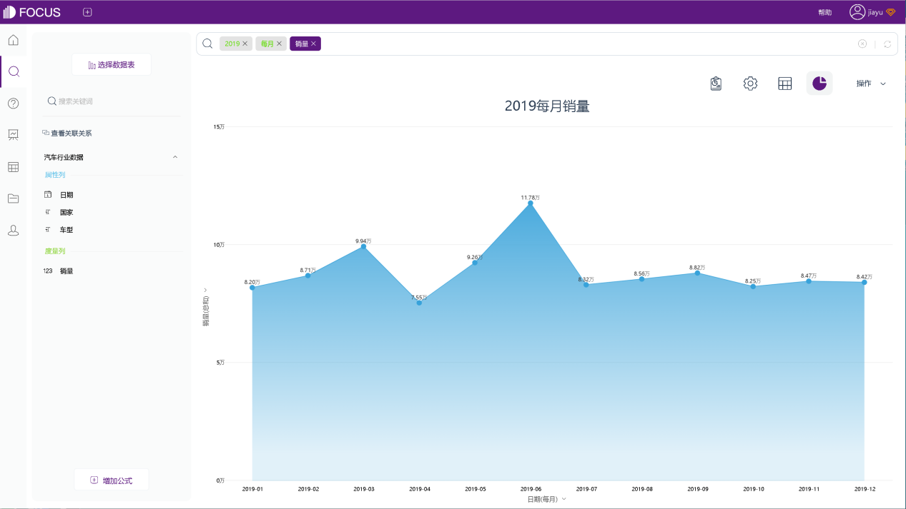

很多公司都在做一件事，就是对业务数据做周维度以及月维度的解读。业务数据解读的理想状态，至少需要三个层面的建设。

1. 经验丰富的大脑
2. 好用的工具
3. 丰富的信息感知

经验丰富的大脑，能够充分的利用好可获得的数据，挖掘到现象背后更多的潜在信息。好用的数据分析工具，能够提高分析效率，并有助于更好的呈现数据、辅助决策。丰富的信息感知力，能够及时发现问题，并结合业务数据，验证问题与数据之间的关系。

丰富的经验和感知力，是无法短时间内获得的，但是好用的工具却可以！

一款优质、性价比高的大数据分析工具，是每一位从业人员做数据分析的利器，它至少需要有以下几个特点：

1. 支持连接多个数据源以进行集成分析
2. 操作便捷，简单易上手
3. 支持跨部门合作，能够实现各部门与用户的共享
4. 性价比高而维护成本低

常见的数据分析工具有PowerBI、Tableau、DataFocus等等。

那么，好用的数据分析工具对业务人员到底有多友好？

我们以DataFocus为例，先来看一份已导入到SaaS版DataFocus的澳大利亚汽车销售数据，包含销售日期以及各车型销量。当查看2019年各个月份的销量时：

直接在搜索框中输入关键词“2019 每月”再加表中字段“销量”即可！系统自动选择了图形！

当然也可以进行自定义设置：

该系统中还支持许多关键词的使用，例如“每周”、“上个月”、“去年”、计算同比环比的关键词等等，能够快速对数据进行各维度的汇总。

除此之外，还有很多数据分析工具可供选择，好用的工具能够助我们提高分析效率，辅助对业务数据的解读。一款数据分析工具是否真的适合自己，还需要亲自去体验才知~
