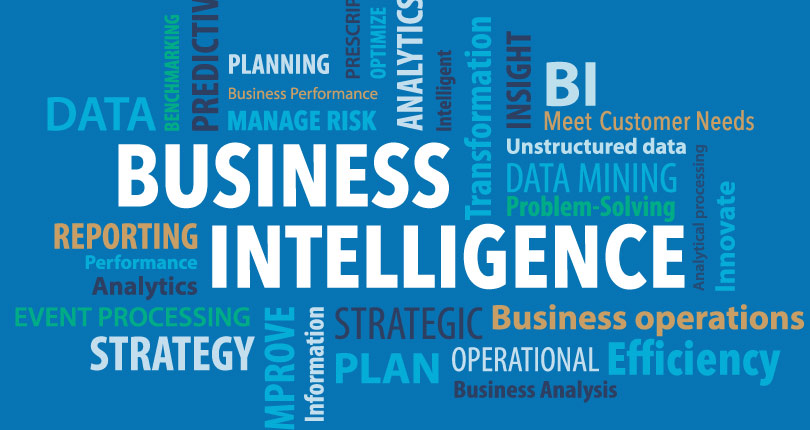
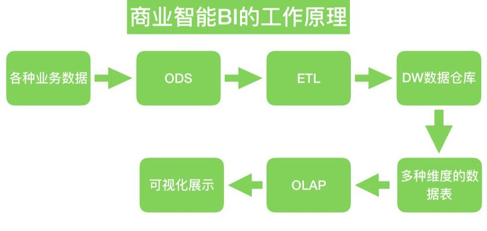
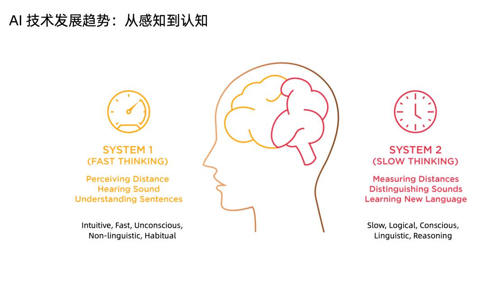
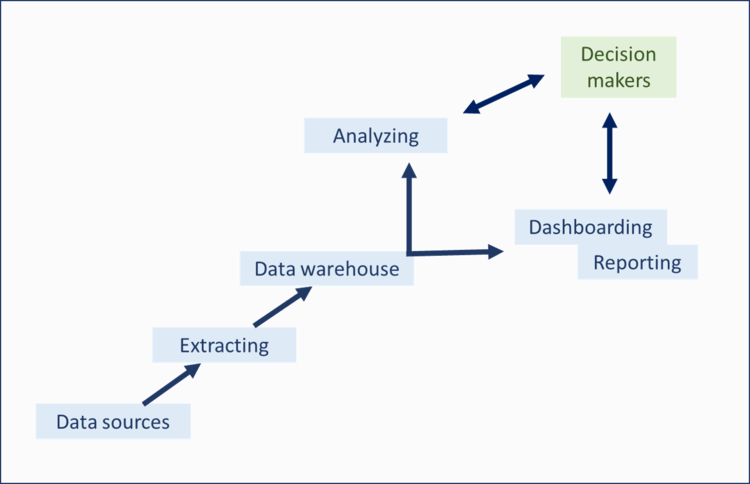
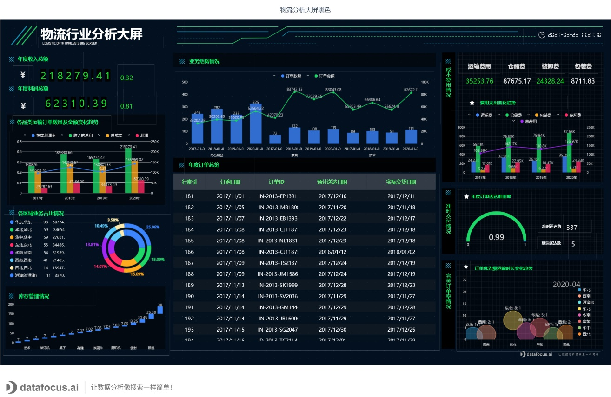

在一个以数据为主导的世界里，对企业来说，理解如何从触手可及的大量数据中提取出价值比以往任何时候都更加重要。

通过了解哪些数据集与你的组织中的特定目标、战略和计划相关，您将能够识别趋势或模式，从而帮助你在组织中的许多关键领域做出显著改进。这个概念被称为商业智能。

商业智能，简称“BI”，正在各行各业中变得越来越普遍。与此同时，人们对商业智能概念的理解也变得混乱，产生出一系列难懂的行业术语。这些术语其实不利于商业智能更广泛的普及，还会让人忽视重要信息。

我们将打破围绕商业智能的神话，探索商业智能的核心概念，介绍商业智能基础知识，并深入研究现实生活中的商业智能示例和用例。

**商业智能概念介绍**

商业智能是指以数据仓库、数据分析和可视化的形式使用数字计算技术，目的是识别和分析基于业务的基本数据，以产生新的、可操作的企业洞察力。

商业智能技术提供了与组织内所有部门相关的内部结构化数据的当前(实时)、历史和预测信息，这极大地增强了运营洞察力并改进了决策流程。

简而言之，商业智能是发现数据中有价值的趋势或模式的过程，以作出与你的商业目标、目的和战略相关的更有效、更准确的决策。

许多商业智能工具都是通过直观的交互式操作和仪表盘（数据看板）来实现的，可以帮助你深入到你的数据中。

接下来，让我们探索一下商业智能概念如何与人脑的内部工作模式相关联。

**大脑中的两种决策模式**

正如诺贝尔奖得主，心理学家丹尼尔·卡内曼在他的著作《思考，快与慢》中所阐述的，你的大脑有两个不同的学习和决策系统：

系统1可以同时接收大量的数据，它还可以非常快速地做出决策，精确度相当高。然而，你的快速思维系统有一个很大的缺点：容易出现逻辑谬误和感性偏差。

系统2是一个缓慢的思维系统，你可以把它看作是注意力的焦点。当你真正一步一步地关注和思考一个问题时，你就使用了这个系统。这个缓慢的思维系统非常准确。但是它在一次处理的信息量有限，并且需要耗费大量的精力。

我们中的大多数人在大多数决策中都不会使用我们缓慢的思维系统。相反，我们使用系统1，也就是我们的直觉。

你可能会想，“这个理论和商业智能有什么关系？”这里的关键点是**，使用快速思维系统时，一个领域的专家能够比普通人员更快地识别和使用更多的信息。**由于这种更强的信息处理能力，专家们能够在重要的地方使用他们缓慢的思维系统：批判性思维和检查他们的偏见。

**你可以将商业智能视为极其强大的数据接收与处理工具，它是快速思维系统的有效延伸。**

这是意义非凡的，因为商业智能可以辅助你以指数方式处理更多的信息。虽然你仍然需要用系统2进行细致思考，但如果你正确使用商业智能，你将比市场上的其他公司拥有难以置信的竞争优势。

**为什么商业智能概念和商业智能解决方案在今天如此重要？**

商业智能的重要性正随着数据产生的速度一同增长，显然，数据量已经远远超出我们大脑的处理范围。

如前所述，我们生活在一个充斥着电子数据的世界，如果不利用它来为你谋利，你将很快落后于其他人。

但是，尽管数据对决策辅助和提高业务效率很有帮助，但只有当你知道如何正确处理它时，它才是有利的。这就是商业智能概念的来源。

为了强调业智能概念在当下的重要性，我们来总结一下拥抱商业智能力量的主要好处：

**1.防止你淹没在数据中**

如果没有商业智能，你很有可能淹没在数据中。从2016年到2020年的时间里，全球数据增长量比过去几千年人类所积累的数据总和还要多！这个令人难以置信的数据量要么是一个巨大的难题，要么是世界上最大的机遇。你当然要利用最先进的工具去利用它。

**2.提供了丰富的见解**

通过为你的企业配备自助商业智能工具，你可以获得丰富的见解，这些见解将有助于改善沟通（通过用数据说话）、解决问题的流程、在线数据分析、财务效率、目标设定、营销和获利。

**3.帮助你预测商业未来**

商业智能的另一个关键概念是预测未来趋势的能力。分析数据并制定计划，以防止灾难发生或在竞争对手之前利用潜在的趋势。

**4.支持强大的数据可视化**

数据可视化的意义是帮助人更好地分析数据，信息的质量很大程度上依赖于其表达方式。而数据可视化的本质就是视觉对话。数据可视化将技术与艺术完美结合，借助图形化的手段，清晰有效地传达与沟通信息。一方面，数据赋予可视化以价值，另一方面，可视化增加数据的灵性，两者相辅相成，帮助企业从信息中提取知识、从知识中收获价值。

了解了商业智能的重要价值之后，我们继续学习商业智能的重要组成部分。

**什么构成了商业智能？**

我们将解释商业智能中的4个基本组件：数据本身(原始数据)、数据仓库、数据访问、分析和展示、数据看板和报告。

1)原始数据

商业智能解决方案的第一个组成部分是原始数据。这些数据可以是任何东西，比如今年的销售记录，工资表，新制定的KPI。

公司的数据通常存储在多个数据库中。由于这种碎片化，今天的商业智能解决方案开发了各种数据连接器，使用户能够将他们的所有数据整合到一个集中的数据仓库中，实现跨数据源分析。

2)数据仓库

如上所述，数据仓库相当于一个物流平台，它将不同的数据库连接在一起，并允许你在它们之间创建关系。随着SaaS版BI的引入，这是一个最近取得巨大进步的领域。

传统的数据仓库通常是不同的电子表格、数据库、基于纸张的记录和专有程序数据库的混合。

在意识到利用这些分散的数据源是多么困难之后，人们开始使用集成的数据仓库。现代模式也优于传统模式，因为它们通常可以实现实时更新，而不是必须手动更新。

3)数据访问、分析和展示

一旦你所有的数据都连接好了，并且可以“相互对话”，下一个关键的商业智能要素就是利用这些数据。这包括访问数据，分析数据的重要趋势，并以一种可以立即理解的方式呈现数据。

这些步骤通常可以混合在一起，尤其是如果你使用交互式仪表盘（数据看板），可以根据你的业务需求放大和缩小数据。自Excel时代以来，数据可视化也取得了长足的进步。使用BI工具中的仪表板示例，可以让你事半功倍。

4) 数据看板和报告

通过访问灵活、可定制、数据驱动的在线数据看板，你可以设定目标、识别模式、发现趋势获取见解。

此外，现在的数据看板都可以在移动端访问，这意味着无论你身在何处，都可以通过多种设备全天候登录、分析数据和共享信息。

商业智能的这四个要素是数据驱动成功的秘诀。现在让我们看看如何在现实世界中应用它们。

**如何在现实世界中应用商业智能？**

如上所述，为了充分利用数据，数据可视化是至关重要的。从选择正确的数据可视化类型到知道如何用数据看板讲故事，有很多要探索的。考虑到这一点，这里有几个商业智能用例。

1.了解你的用户

您可以了解用户的基本属性，检查哪一个用户获取渠道是目前最大的收入来源。你还可以分析你的哪些用户获取渠道为你提供了最好的客户——消费量高且带来更多优质用户。

2.获取销售全貌

使用销售分析大屏，你可以全面了解各渠道、各区域、各类别的销售状况。你应该关注的不同渠道的销售量，以及根据你的目标，如何进行次年的预测和规划。

3.把控物流流程

物流是大量制造企业、电商企业日常运营的核心。保持物流的流畅、连贯、高效和一致是你成功的关键。

我们的物流数据看板提供了对整个物流状况的可扫描的全面概述，提供了有助于强化弱点、管理关系、节省时间和金钱的见解——这是商业智能解决方案力量的又一证明。

我们只是举了3个实用的例子来了解商业智能的应用，事实上商业智能的应用千人千面，场景无限，每个人都可以快速、灵活创建出适合业务的数据看板。

在如今数据驱动的世界中，能够过滤噪音、挖掘真正重要信息的公司和个人将远远超越竞争对手。商业智能为寻求尖端竞争优势的个人和企业提供了一种良好的模式。

总之，商业智能帮助你了解你的市场、你的客户、你的竞争对手和你的业务，以便你做出最有效的决策。

加入商务智能的潮流，享受DataFocus的14天免费试用！
