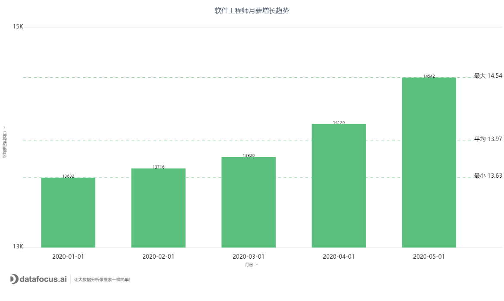

谁说中国人做不好可视化软件，DataFocus的使用体验直逼美国可视化软件巨头Tableau，它是怎么做到的？

说到可视化软件，很多人的第一反应是Tableau，要不然就是PowerBI，或者Qlik。尤其是tableau的确是可视化领域的佼佼者，首创了拖拽式分析，开创了GraphSQL这样一个新的事务。然而经过这么多年的发展，国产软件的设计和质量也让人刮目相看。比如DataFocus这样一款创新的数据分析工具。它的数据分析都是通过搜索的方式进行的，类似于一个问答系统，用户只需要在搜索框中输入相应的问题，系统自动返回图表，使用体验和用google或百度非常类似。

相比于tableau的拖拽式分析，搜索显然更高效。如果用户习惯了使用搜索的方式，DataFocus 还具有自动建议功能，协助用户完成搜索内容的输入，这就更加增强了使用的便利性。从单个图表的分析便利性上来看，的确比tableau要方便不少。相比来讲，Tableau极其丰富的控件给了用户非常大的自主设计自由度。这方面来讲，就是见仁见智了，如果用户更加倾向于自己开发图表，那肯定是Tableau，但如果是非常在意开发效率，而且经常存在反复修改，这个时候就推荐用DataFocus了。而且它自动生成的图表样式都还不错，简洁美观。

另一方面，如果要自己创建可视化大屏，DataFocus也很不错，它有网格布局和自由布局两种模式，网格布局会根据用户设定的图形大小自动排版，如果不是用于对外展示的大屏，用作内部交流的化，采用网格布局效率非常高。如果有大屏展示需求，采用自由布局，自己编辑控件的颜色背景，拖放设定大屏的尺寸，也可以获得很好的效果。Tableau有一个story的功能，可以创建多个看板的集合，用于集中汇报一项功能，这个也很不错。

