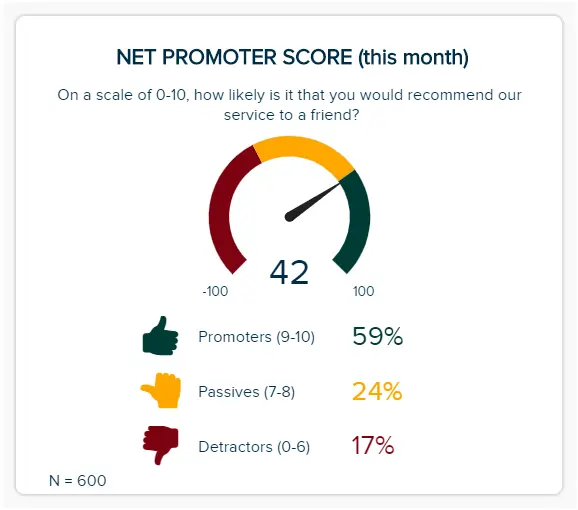
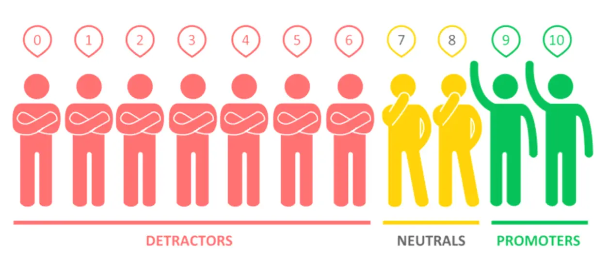
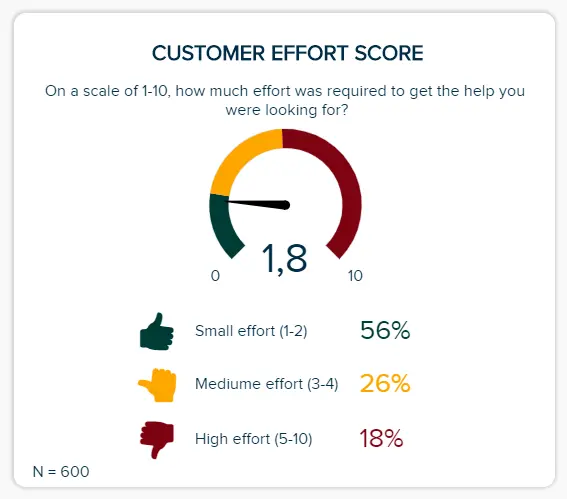
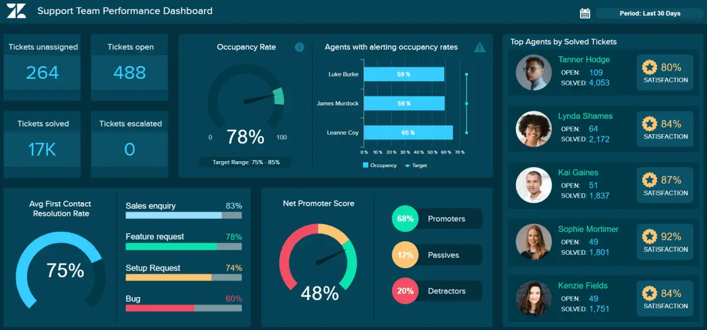

“有一种创造服务、款待和体验的某种方式，让人们觉得自己很重要。”

当今精通技术的客户受到体验的驱动。现在，消费者比以往任何时候都更希望从他们愿意投资的品牌中获得信任、诚实、透明、价值和模范水平的客户体验 （CX）。这意味着，如果你想竞争，你必须始终如一地满足你的观众——而且比你的竞争对手更好。

Forrester Research将“客户体验”定义为：“客户如何看待他们与贵公司的互动。

事实上，感知和互动是任何客户体验的两个最关键的支柱，卓越的客户体验通常会提高客户满意度，这是商业数字时代成功的真正催化剂。

您的机会：[想要轻松可视化和跟踪客户指标？](https://www.datafocus.ai/console/)试用我们的现代客户分析软件 14 天，完全免费！

客户满意度指标评估公司提供的产品或服务如何满足或超过客户的期望。想要留住客户、提高消费者忠诚度和鼓励品牌宣传的企业必须在所有渠道和接触点提供个性化、响应迅速、无缝的体验。到2020年，客户体验将超过价格或产品，成为关键的品牌差异化因素，如果您未能将商品交付给您的受众，您将落后于竞争对手。

创造积极的客户体验的一部分是了解您的业务在哪些方面做得好，哪些领域需要更多关注或改进。

对于客户服务行业，借助正确的[KPI 仪表板软件](https://www.datafocus.ai/infos/kpi-dashboard-software)，利用各种客户满意度指标（如客户努力得分、净推荐值和客户满意度得分）将使您能够满足甚至超过客户的需求。

此外，衡量这些指标还可以避免潜在客户的挫败感，监控客户满意度水平，并让您更具体、更明智地了解面向客户的团队的表现。尽管我们可以分析各种[KPI 示例](https://www.datafocus.ai/infos/kpi-examples-and-templates-)，但我们将重点关注这些 3：[净推荐值](https://www.datafocus.ai/infos/take-charge-of-customer-satisfaction-metrics-customer-effort-score-nps-customer-satisfaction-score#net-promoter-score-nps)、[客户努力](https://www.datafocus.ai/infos/take-charge-of-customer-satisfaction-metrics-customer-effort-score-nps-customer-satisfaction-score#customer-effort-score-ces)得分和[客户满意度得分](https://www.datafocus.ai/infos/take-charge-of-customer-satisfaction-metrics-customer-effort-score-nps-customer-satisfaction-score#customer-satisfaction-score-csat)（单击链接直接跳转到本文中的相关部分）。

我们将深入研究这些概念，以衡量您的客户满意度水平并提升您的客户体验，探索关键领域，包括如何衡量客户满意度、用户满意度指标、客户努力分数计算（了解您的 CES 客户努力分数），并在文章末尾提供简单有效的仪表板示例：[一般客户满意度仪表板](https://www.datafocus.ai/infos/take-charge-of-customer-satisfaction-metrics-customer-effort-score-nps-customer-satisfaction-score#general-customer-satisfaction-dashboard)，[特定的客户满意度仪表板](https://www.datafocus.ai/infos/take-charge-of-customer-satisfaction-metrics-customer-effort-score-nps-customer-satisfaction-score#specific-customer-satisfaction-dashboard)和支持[团队满意度仪表板](https://www.datafocus.ai/infos/take-charge-of-customer-satisfaction-metrics-customer-effort-score-nps-customer-satisfaction-score#support-team-satisfaction-dashboard)（单击链接可直接跳转到本文中的相关部分）。

事不宜迟，让我们开始吧。

## 探索客户体验分析

Forrester指出，72%的企业认为改善客户体验是他们的首要任务。因此，越来越多的企业正在使用工具来帮助他们改善客户体验，包括Mopinion等用户反馈工具。这些类型的工具使企业能够一致地收集和分析来自在线、应用内或通过电子邮件活动的客户的见解。

企业需要分析驱动的见解，重点关注团队绩效和客户满意度水平，以确定影响其整体业务目标的优势和劣势。客户努力得分 （CES）、净推荐值 （NPS） 和客户满意度得分 （CSAT） 等热门[客户服务 KPI](https://www.datafocus.ai/infos/kpi-examples-and-templates-customer-service)可有效衡量客户的质量以及对特定品牌或业务的体验难易程度。

当您使用能够提供提升的可视化效果和简洁的文本详细信息的交互式[实时仪表板](https://www.datafocus.ai/infos/live-dashboards)时，确定准确的 CES、NPS 和 CSAT 会更容易。

## 如何衡量客户满意度？

以下是衡量客户满意度的 5 个基本步骤：

- 起草目标并制定计划：您必须决定哪些客户数据值得收集以及以后如何处理这些数据。这也意味着选择您要使用的指标，并根据客户体验（可能是在他们购买东西、与服务交互等之后）决定何时对其进行衡量。还包括预期成本，并为某些客户的不满意答案做好准备。
- 创建调查：有多种方法可以创建调查。在这篇文章中，我们专注于3个不同的选项：NPS，CSAT和CES。您可以使用不同的量表来衡量体验或表情符号（令人满意的水平的视觉表示）。
- 选择触发调查的内容和确切的时间：您向谁发送调查以及何时发送调查至关重要，因为它会影响数据的质量。触发事件数据的一些示例包括自产品注册以来的时间或完成用户加入。您还可以通过现场调查离线调查。但不要太频繁地这样做，因为它也会降低响应率。
- 分析收集的数据：此步骤应该很清楚。您收集的数据应使用正确的[在线报告工具和](https://www.datafocus.ai/infos/online-reporting)/或软件进行分析，这将为您的未来战略产生宝贵的见解。
- 适应并重复：下一步专注于一个简单的问题：您将如何处理结果？如果答案不令人满意，您可能需要考虑进一步调查并运行其他实验和宣传计划。

这是如何衡量客户满意度的简要概述。我们将更多地关注客户努力得分和净推荐值等特定指标——这是任何现代企业（无论行业如何）可用的两个最重要的[客户指标](https://www.datafocus.ai/infos/top-7-customer-kpis-and-metrics/)，其次是客户满意度得分。如何呈现这些指标以及如何使用仪表板可视化它们以获得清晰的概述是我们在本文中的重点之一。但是为什么？

这些指标对于任何企业的长期成功都至关重要。如果您没有牢牢把握客户情绪的脉搏，那么您就错过了在成功吸引和转化新品牌拥护者的同时保持现有客户忠诚度的重要机会。

## 三大客户满意度指标

### 1\. 净推荐值 （NPS）

### 什么是净推荐值？

净推荐值衡量客户向第三方（例如朋友）推荐公司产品或服务的忠诚度和意愿。客户分为公司的批评者（不高兴）、被动者（犹豫不决）和推动者（忠实的爱好者）。

您的 NPS 对于推动各种成功计划特别有用，例如将客户细分为不同的类别，以更好地根据他们的特定需求定制营销体验。您的 NPS 还与利润或增长相关，因此见解可以帮助高管、投资者、董事会成员和营销团队根据客户满意度见解解决任何问题或解决任何问题。广泛的[营销报告](https://www.datafocus.ai/infos/daily-weekly-monthly-marketing-report-examples/)可以帮助您做到这一点。

这个指标完全是关于推荐的。如果您的客户对体验感到满意，那么他们可能会将您企业的产品和服务推荐给他们认识的人。NPS 指标让企业了解他们在客户促销和客户忠诚度方面的表现。从本质上讲，NPS 是衡量客户忠诚度的指标。

c） 新精神活性物质一览：

要知道谁是推动者，谁是批评者，您可以将此量表应用于在提出“在 0 到 10 的范围内，您向朋友推荐我们的服务或产品的可能性有多大？”后获得的结果：

\*\*来源：surveysparrow.com\*\*

结果，我们看到从 0 到 6，我们有“批评者”，这比“推动者”要多得多，他们需要在 9 到 10 之间打分。被动客户率在7-8范围内下降。

NPS 范围从 -100 开始，这意味着每个人都是批评者，一直到 +100，这意味着每个人都是推动者。许多企业认为超过 +50 的 NPS 非常好，但这在很大程度上取决于您的行业：Temkin Group执行了一个基准测试，并提出了以下图表来代表不同行业的 NPS 范围：

我们看到，10或11的NPS被认为对电信服务有利，而对投资公司来说将是一场灾难。汽车经销商和流媒体的平均NPS最高，而电视和互联网服务得分最低。

您可以使用NPS 模板来帮助您入门，如果您想根据最近一批反馈或调查回复计算您的 NPS，这里有一个有用的净推荐值工具。

a） 何时使用新精神活性物质：

- 这个最有价值的用户满意度指标最好（也是最广泛）在消费者与您的服务互动后使用，无论是在商店离线，还是从您的网站购买产品时在线使用。这样做的原因是，消费者可能会在购买或互动后不久留下有关其体验的反馈 - 这是衡量某人向同行推荐您的可能性的宝贵信息。
- 当您处于开发或服务过程中时，您的NPS将被证明是无价的。例如，如果您在线提供产品或服务的免费测试或试用，您将能够捕获基于 NPS 的数据并了解如何改进您的产品以更好地满足消费者的需求。
- 您可以使用社交媒体 NPS 调查来帮助在漏斗的大多数阶段捕获客户反馈，以了解您的品牌在现有和潜在消费者眼中的排名。

b） 企业如何衡量其NPS：

- 交易：在购买以及与企业客户服务互动之后，公司可以询问客户向认识的人推荐其业务的可能性有多大。分数由推荐者的百分比减去批评者的百分比决定。
- 基于接触点的数据：您可以使用 NPS 调查通过短信、电子邮件、IVR、应用内聊天、Facebook Messenger、购买后登录页面或移动应用程序捕获可量化的数据。这将为您提供丰富的数据，以帮助您计算整体净推荐值并获得衡量客户满意度的能力。
- 基于关系的支持：如果您有忠诚的长期客户，并希望确保他们仍然是您业务的热心“推动者”，您可以定期亲自与他们联系并请求反馈。这样做将帮助您获得更可靠的 NPS，同时为您提供有助于维护与现有客户关系的数据[发现](https://www.datafocus.ai/infos/what-are-data-discovery-tools/)或反馈。

您的机会：[想要轻松可视化和跟踪客户指标？](https://www.datafocus.ai/console/)试用我们的现代客户分析软件 14 天，完全免费！

### 2\. 客户努力得分

### 什么是客户努力得分？

客户努力分数是一种用于衡量客户满意度的指标，通常在规模级别（例如 1-10）上，用于跟踪与公司或企业的互动难易程度。它有助于发现和解决整体用户体验中的具体痛点。

事实上，CES是公司发现客户体验中任何潜在瓶颈的好方法。它也是未来购买行为的有力预测指标，获得的见解通常具有高度可操作性。

客户努力得分基准旨在确定客户找到与您的业务互动的速度和简单程度。忙碌的客户认为体验的便利性是业务的真实反映，也是他们的满意度和忠诚度之间的直接关系。

a） 何时使用CES：

- 测试具体的流程和行动（与专注于大局的NPS相比） - 遵循特定的客户服务接触点，例如在解决基于电子邮件的支持票证之后。
- 在客户咨询或会议、在线结账和购买、访问您的网站以及与企业客户服务的任何互动之后，无论是实时聊天、社交媒体、亲自还是通过电话。在这些情况下，CES调查特别有用。

b） 如何衡量客户努力得分：

- 通过使用比例范围或表情符号：有不同的比例（1-5、1-7、1-10）和表情符号类型查询可以确定此指标。例如，1 表示低级别工作，10 表示高级别工作。通常会包含一个问题，要求客户对他们同意或不同意陈述的方式进行评分。我们的例子可以在上面的图片中找到：“在1-10的范围内，你必须付出多少努力才能获得你想要的帮助？”，1是“完全没有努力”，10是“极端努力”。这些数据通常是通过进行CES调查获得的。
- 获得平均分数：这种简单的方法只需要您获得所有分数的平均值即可计算出满分 10 分的分数。因此，客户工作量分数 = 分数总和除以分数数。
- NPS风格的计算：CES是对NPS的补充，企业可以使用NPS风格的度量来计算CES。因此，客户工作量得分 = % 高级工作量 – % 低级别工作量。您需要确定什么是高水平努力和低水平努力：在上面的示例中，等级为 1 到 10，低级别努力是得分为 1 或 2 的客户，中级努力是得分从 3 到 5 的客户，高级努力是得分从 6 到 10 的客户。您可以使用企业经常使用的另一个量表，从 1 到 7，并相应地确定高或低工作量。

在衡量客户努力得分时，您可以包括不同类型的努力：财务努力（运输成本）、沟通努力（不回复电子邮件或电话）、等待时间努力（发货时间长达一个月，我被搁置了 8 分钟）、体力劳动（包裹递送离我的地方很远）， 流程工作（重复填写联系方式）和其他类似元素，如果它们证明与您的业务相关。

### 3\. 客户满意度得分

### 什么是客户满意度得分？

客户满意度分数是一个广义术语，描述了可以向客户提出的许多不同类型的调查问题，目的是衡量他们对产品、服务或交互的满意度。答案通常以百分比表示。它直接提出问题，主要集中在总体满意度，与NPS（间接）和CES（用于特定过程）相比。

CSAT 提供对客户体验工作绩效的更广泛见解，根据 1 - 5 的等级（从“非常不满意”到“非常满意”）提供有关您的工作的反馈。

通过在购买后或客户互动后请求此反馈，您将能够大致了解您的消费者对您提供的产品或服务水平的满意或不满意程度。

这不仅会为您当前的客户成功奠定坚实的基础，而且还会通过询问人们的意见来提高参与度（这会让他们感到受到重视）。此外，如果您有可靠的 CSAT，您可以将其显示在您的网站上，以向潜在客户展示您的成功以及推荐。

## 更好地了解 CES、NPS 和 CSAT 的客户体验

以这些客户满意度指标的形式获得频繁的反馈可以帮助组织围绕其促销内容、营销技术和客户体验工作制定更加[数据驱动的决策](https://www.datafocus.ai/infos/data-driven-decision-making-in-businesses/)过程。借助专业的[市场研究分析](https://www.datafocus.ai/infos/market-research-analytics)软件，您可以增强您的研究和基准测试，帮助您以有意义的方式收集和可视化您的数据。此外，它还可以帮助企业有效地评估和衡量进度。

### 1\. 常见的客户挫败感从何而来？

了解许多常见的令人沮丧的客户体验发生的位置可以为纠正这些挫败感的策略提供信息，并指导您获得正确的客户体验指标。与客户服务代表的互动以及通过多个渠道与企业互动时出现的障碍是客户不满意的一个重要领域。埃森哲的一项研究发现，89%的客户感到沮丧，因为他们需要向众多代表重复他们的问题和问题。

当发生以下事件时，客户很快就会感到沮丧，并且更有可能切断与企业或品牌的联系：

- 客户必须从在线渠道切换到电话。
- 将客户转移到其他代表或部门以解决问题。
- 客户必须就同一问题反复联系企业。
- 客户必须重新解释问题或问题。

这些事实表明，客户的挫败感对应于他们必须花费的时间和精力以不满意或不满足的方式与您的业务互动。这是另一个例子，说明为什么使用CES和NPS等客户满意度衡量标准来了解您的客户是否满意并以积极的方式参与您的业务如此重要。

### 2\. 使用NPS，CES和CSAT的利弊

使用NPS，CES和CSAT来确定客户满意度有许多优点和缺点。

a） 使用新精神活性物质的优点：

- NPS 用于评估客户对您的业务的看法。它提供了基线指标来衡量客户在一段时间内对您的公司是感到积极还是消极。
- NPS 可帮助企业识别推荐其品牌的客户。
- 它考虑了价格和竞争对手来回答客户的满意度。

b） 使用新精神活性物质的缺点：

- NPS不能独立存在，需要对反馈进行额外的定量和/或定性分析。
- NPS 可能会显示客户响应与实际客户行为不完全一致的信息。

a） 使用CES的优点

- CES非常适合查看特定的客户接触点和特定流程，因此您可以了解他们究竟是如何解决问题的，以及他们花了多长时间才找到解决问题的方法，因此具有高度可操作性。
- CES 或客户工作量分数使您能够预测客户经常向客户服务团队提出的常见后续问题，以便您的客户服务代表可以降低回电率和案例重新打开率。
- 客户努力分数可用于客户成功团队和产品团队，因为用户体验和用户界面都取决于易用性，并且可以识别客户开始感到沮丧的点。

b） 使用CES的缺点：

- CES没有提供确切的原因（或精确的客户努力得分行业基准）为什么努力是高还是低。它只回答客户是否觉得难以使用产品或服务，但为什么以及这些困难是什么仍未得到解答。
- 它还错过了有关客户与公司的整体关系/满意度的信息。

a） 使用 CSAT 的优点：

- 通过以快速、简单的格式要求客户提供 CSAT，您将能够收集频繁的基于客户满意度的数据，从而帮助您提高客户保留率。
- 由于可以将您的 CSAT 与几乎任何业务领域（如质量、设计、定价和服务）相关联（由于其通用性），因此您可以在许多关键领域获得无价的性能反馈，但 NPS 是深入到更深层次领域的指标。
- CSAT 是在短期内跟踪产品、服务或接触点更改成功与否的绝佳方法，因为收集反馈既简单又轻松。

b） 使用 CSAT 的缺点：

- 此指标只能提供客户驱动成功的概述;它无法回答特定问题或深入到客户满意度的更深层次领域，例如 NPS。它必须与 NPS 和客户努力分数基准结合使用，才能提供真正的价值。
- CSAT 最适合获取短期反馈。此指标无法帮助提供预测性见解或说明业务的潜在增长。
- CSAT不考虑客户可能受到竞争对手或产品价格的影响，而NPS则要求您向第三方推荐产品。

### 3\. 客户满意度指标对业务的影响

糟糕的CES或对客户努力得分行业基准的打击可能会对您的业务的长期成功产生负面影响，因为这些数字表明客户忠诚度的丧失。如果您的客户没有与您的品牌互动的轻松体验，没有快速解决他们的问题，或者不太可能推荐您的产品或服务，这意味着您的企业无法提供引人入胜的体验。

根据NewVoiceMedia的数据，由于糟糕的客户体验，美国企业每年损失620亿美元。考虑到在日益数字化的世界中在线互动的性质，客户有能力传播他们的意见，无论是消极的还是积极的，因此您绝对有必要为您的客户提供积极和令人愉快的话。

总之，这些衡量客户满意度的关键指标中的每一个都提供了一种准确、可行的方法来掌握您为客户提供的客户体验水平以及他们如何看待您的品牌。通过结合使用这些[KPI 管理解决方案](https://www.datafocus.ai/infos/kpi-management-and-best-practices/)，您将获得根据周围环境发展、改进和扩展工作的能力——这在当今[的商业智能](https://www.datafocus.ai/infos/bi-skills-for-business-intelligence-career/)世界中是无价的。

您的机会：[想要轻松可视化和跟踪客户指标？](https://www.datafocus.ai/console/)试用我们的现代客户分析软件 14 天，完全免费！

## 客户满意度指标仪表板

将[业务仪表板](https://www.datafocus.ai/infos/dashboard-examples-and-templates-)用于客户服务管理实践，使您的企业能够通过高级预测功能轻松实时了解所有客户数据。借助定义明确、有组织的视觉对象，您的企业能够评估各种客户体验指标和 KPI。

这 3 个客户满意度指标示例展示了动态[在线仪表板](https://www.datafocus.ai/infos/online-dashboard)如何帮助您持续改进面向消费者的工作。

我们将展示在不同级别使用仪表板提高客户满意度的不同示例。两个示例更通用，而最后一个示例特定于客户支持需求。

### 1\. 一般客户满意度仪表板

#### \*\*点击放大\*\*

此[客户满意度仪表板](https://www.datafocus.ai/infos/dashboard-examples-and-templates-customer-service#customer-satisfaction-dashboard)提供了可用于许多不同的满意度方案的一般概述。让我们看看此特定示例中使用的指标：

净推荐值 （NPS）：正如我们所看到的，该指标可让您评估您在客户推荐方面的表现，并确定您可以如何以及在何处改进服务。

客户努力得分 （CES）：如前所述，此指标提供有关客户体验以及您与网站、技术和整体业务提供用户友好交互的能力的宝贵反馈。与满意客户相关的 KPI 对应于业务增长，因此尽可能降低此数字非常重要。

客户保留率：此指标衡量返回重复业务和购买的客户数量。提高保留率是您应该追求的目标，尤其是当我们知道吸引新客户的成本是保留现有客户的[五倍](https://www.invespcro.com/blog/customer-acquisition-retention/)时。

### 2.特定的客户满意度仪表板

#### \*\*点击放大\*\*

此仪表板更具体，还关注质量、定价、设计和服务方面的满意度分数，这可以为客户体验旅程提供更多细节。

主要关键绩效指标：

- 净推荐值 （NPS）
- 客户满意度得分 （CSAT）
- 客户努力得分 （CES）

在衡量客户满意度的指标方面，这个易于理解、动态和交互式[的市场研究仪表板](https://www.datafocus.ai/infos/dashboard-examples-and-templates-market-research)包含了持续消费者成功所需的 3 个关键指标。

这个[在线数据分析](https://www.datafocus.ai/infos/data-analysis-tools)平台无缝融合了 NPS、CES（客户努力分数计算）和 CSAT，提供了一种快速、简单和鼓舞人心的方式来监控和改善您为受众提供的客户体验——这是可以想象的最有效的客户满意度指标示例之一。

### 3.支持团队满意度仪表板

#### \*\*点击放大\*\*

支持团队满意度仪表板专为客户支持团队设计，它还包括座席的统计数据和整体净推荐值。

主要关键绩效指标：

- 顶级代理商
- 首次联系解决率
- 利用率
- 净推荐值

作为全球首屈一指的客户服务平台之一，Zendesk 提供大量宝贵的内部和外部运营数据。

在了解客户满意度分数时，监控一线客户支持团队在各个接触点的表现至关重要。[Zendesk 仪表板](https://www.datafocus.ai/infos/dashboard-examples-and-templates-zendesk)提供了向下钻取到最佳内部指标以衡量客户满意度的能力，例如已解决工单的顶级代理、作为客户服务关键成功标准之一的平均解决率以及对工单的详细见解。

这个特定的[数据仪表板](https://www.datafocus.ai/infos/data-dashboards-definition-examples-templates-)提供对关键 KPI（例如首次联系解决率和最佳绩效座席）的交互式和高度可视化的见解，将帮助您了解以客户服务为中心的优势和劣势所在，同时获得支持或激励可能需要额外培训的团队成员的能力。

通过利用您的优势、解决您的劣势并提高团队士气，您将看到客户满意度得分的提高——而这个全景平台将帮助您做到这一点。

## 从您的客户满意度指标中受益！

全渠道客户体验持续增长，企业需要全面的[数据可视化工具来](https://www.datafocus.ai/infos/data-visualization-tools)了解客户如何轻松、快速和响应地与其品牌互动和体验品牌。

公司可以准确计算其客户努力得分和净推荐值，并将见解应用于其业务的发展，无论是更快地解决客户问题还是提高支持代理的生产力。

减少客户流失和挫折应该是任何企业的目标，尤其是那些以客户为导向的企业。了解如何在其他关键指标中衡量客户努力得分是成功的方法。

“我们将客户视为受邀参加聚会的客人，而我们是东道主。我们每天都在努力让客户体验的每个重要方面都变得更好一点。

您的机会：[想要轻松可视化和跟踪客户指标？](https://www.datafocus.ai/console/)试用我们的现代客户分析软件 14 天，完全免费！

虽然通过Powerpoint演示文稿生成了大量数据，但使用正确的软件，您业务的每个部门都可以获得有助于您成倍提高客户满意度水平的见解。像DataFocus 这样的[在线仪表板工具](https://www.datafocus.ai/infos/online-dashboard)为组织提供了以多维和高效的方式跟踪和可视化其关键客户服务数据的方法。

在一个中心位置借助现代交互式仪表板测量、可视化和共享您的客户满意度指标，而无需使用 Excel 和 PowerPoint！亲眼看看，立即开始您的[14 天免费试用](https://www.datafocus.ai/console/)！
