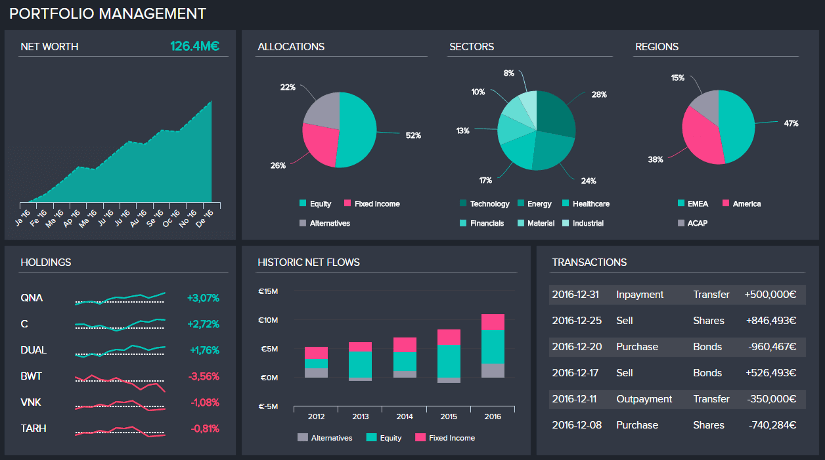
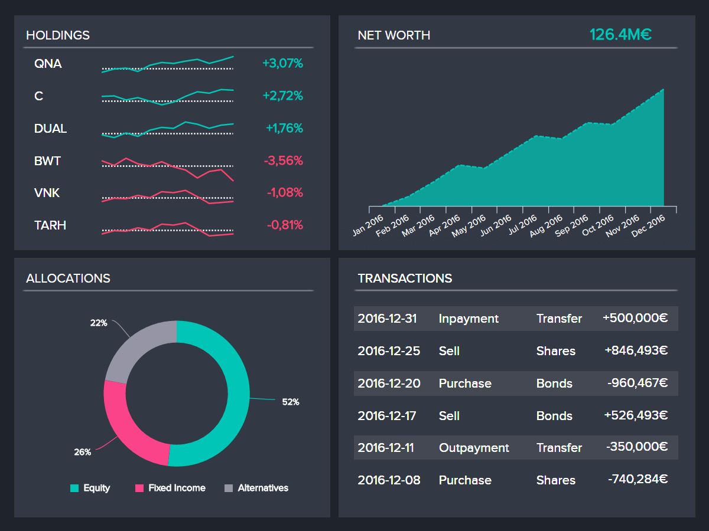

## 什么是财务分析？

财务分析是收集、可视化、监控、分析和预测金融部门数据的过程，目的是评估部门或公司的财务业绩，以做出更好的财务决策。财务就是数字，理解这些数字的力量决定了一个组织的成功。从这些财务事实和数据中获取准确而有意义的信息具有挑战性。财务分析工具具有众多功能，可为您提供精确且未被观察到的有意义的信息，消除任何复杂性。它有助于监控您的现金流，包括整个组织的收入和支出。借助来自 CRM、ERP 和其他系统的数据，它提供了有关整个组织的所有数据的统一视图。这有助于规避风险并抓住新机遇。除此之外，我们的现代财务分析软件的特点是创建易于理解的个人报告（根据部门和利益相关者）和 [财务仪表板。](https://www.datafocus.ai/infos/dashboard-examples-and-templates-finance)

## 触手可及的财务 KPI

来自不同系统的财务数据的综合概述，结合数据和[财务 KPI](https://www.datafocus.ai/infos/kpi-examples-and-templates-finance)的全系统分析，将为您提供实时信息并帮助进行准确的预测。

- 无缝跟踪收入、费用和盈利能力
- 用于计划、预算和报告创建的集成解决方案
- 准确的预测和预算计划
- 提高业务流程的效率
- 为利益相关者创建量身定制的报告

## 财务分析和投资组合管理

作为一个拥有大量受众、客户或投资者的组织，您可能很难对您的投资组合有一个全面的视角，因此需要实施有效的管理流程来跟踪它。借助现代财务分析软件和来自所有系统的数据收集，我们的解决方案可为您提供更好、更准确的预测，而从过去数据中发现趋势，帮助您进行战略规划和决策。您还可以通过实时信息处理获得可靠的信息和见解，您可以通过为每个涉众定制的报告共享这些信息和见解。易于理解的指标的可视化对于规避风险至关重要，而战略预算和资源规划提供了富有洞察力的信息，使您能够有效地抓住机会。今天，组织达到了比以往更高的项目组合管理水平。为了使它们达到成熟期，我们先进的财务分析工具将允许您优化现金流、控制费用和增加收入，从而增强企业规划和资源分配。

