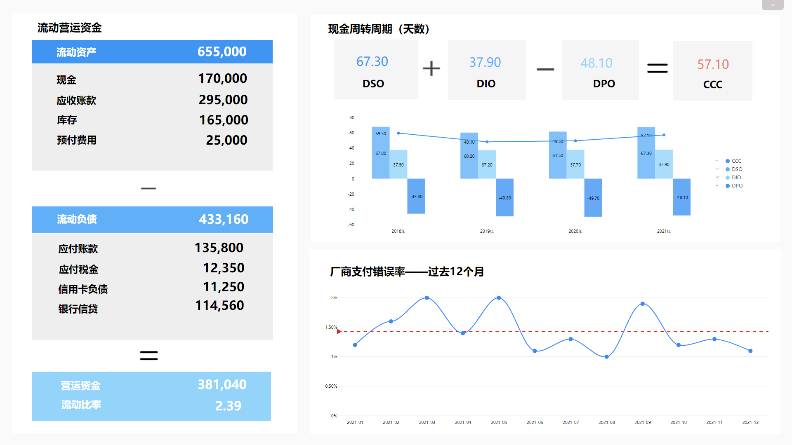
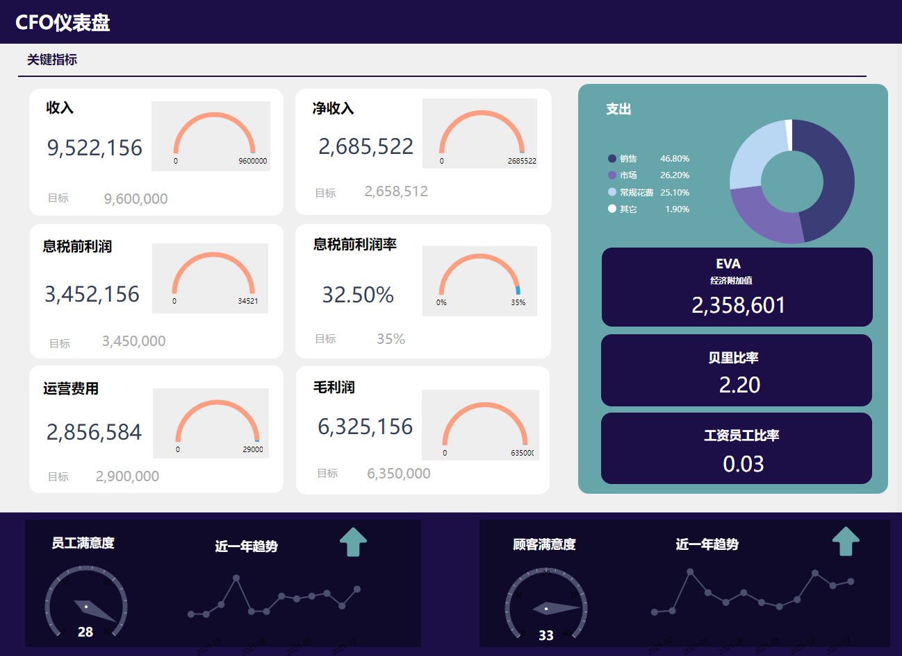

财务分析怎么做？使用这几个大屏就够了！

当今企业的经济环境日益复杂，不管是企业的管理者还是投资者，在做出财务评价和经济决策时，都必须进行充分的财务分析。

美国纽约市大学Leopold A. Bernstein 认为，财务分析主要目的在于，通过评估企业现在或过去的财务状况及经营成本，对企业未来的状况及经营业绩进行最佳预测。

而财务分析大屏，作为专业有效的管理工具，受到了更多财务部门决策者和业务人员的青睐。它不仅有助于跟踪所有相关的财务KPI，允许有效的现金管理，还能够详细跟踪费用、销售和利润，以满足并超越部门或公司的财务目标。

财务专业人员和部门比以往任何时候都更面临着巨大的压力，他们需要提供快速的见解，清晰可靠的[财务报告](https://www.datafocus.ai/)，同时推动公司业绩的提升。通过使用财务仪表板，企业可以快速、准确地、实时地理解和衡量所有数据。如此，财务专家能够更快地验证数据，并根据需要深入研究财务细节，从而提高生产力，并最终提供稳定的财务环境。如今的数据触手可及，同时具有智能警报功能[的财务KPI](https://www.datafocus.ai/)，可立即发现异常。所有这些都为您带来无限的可能，并消除了繁琐的传统数据分析和报告方式。借助现代[金融商业智能](https://www.datafocus.ai/)，您将有机会统一所有财务数据并生成即时可操作的见解。

在这里，我们展示了为财务部门内的各种角色和级别创建的3个专业财务仪表板：

## 现金管理仪表板

此财务仪表板模板概述了您的流动性和当前现金流状况，同时为您提供了强有力的指示，或者如何通过优化应付账款和应收账款的处理流程来改善这些指标的情况。大屏为您提供了速动比率，流动比率，现金余额的快速概述。

首先，现金管理仪表板会检查您当前的流动比率和速动比率。流动比率是一个财务指标，表示公司的流动性及其用短期资产（现金，库存，应收账款）支付短期负债（债务和应付账款）的能力。该KPI代表流动负债与流动资产之间的比率，并展示了您的公司在立即将资金用于收购或偿还债务方面的灵活性。您应该始终以高于1：1的比率为目标，以确保您可以随时支付您的债务。此财务仪表板为您提供了立即确保您的公司具有生存和发展所需的财务流动性的机会。

速动比率，也称为酸性测试比率，对流动性情况给出了更为保守的看法，并且不包括库存和其他流动性较低的资产作为短期资产的一部分，以满足负债。如果您的当前资产包含大量库存，则酸性测试比率将远低于当前比率。与流动比率类似，速动比率大于1表示您的企业能够以最具流动性的资产支付流动负债。此财务仪表板模板中的两个比率都受到应付账款和应收账款周转率的极大影响，这一比率一方面衡量您支付自己账单的速度，另一方面衡量您收取所欠付款的速度。

最后但也挺重要的一点是，我们的财务仪表板示例提供了您当前应付账款和应收账款情况的即时可视化。它为您提供了一个机会，可以快速反映您当前的支出和要收取的款项，以确保没有付款在太长时间内保持未付款状态，同样，您所欠的付款也不会使您拖欠款项。在仪表板的底部，应收账款信息在一年内进行细分，您可以分析与您的当前和快速比率相关的付款和收债模式，这是企业财务流动性和稳定性的两个试金石。

## 财务 KPI 仪表板

我们的下一个财务仪表板示例概述了最突出的 KPI，这些 KPI 可应用于几乎任何需要稳定、主动的管理和运营流程的业务或财务部门。在财务分析软件的帮助下，创建此仪表板是为了回答有关公司流动性，发票，预算和整体财务稳定性的关键问题。

财务 KPI 仪表板首先概述您的当前营运资金，包括您的流动资产和流动负债。这些信息将为您提供一个即时的结论，如果您的公司在短期内是流动的，运营高效，财务状况良好。如果您的营运资金相当高，您就有投资和增长的潜力。另一方面，如果您的流动资产不超过您的流动负债，破产的风险就会更高。我们可以看到，在我们的财务仪表板示例中，营运资金为61000美元，当前比率为1.90，这意味着公司有足够的财务资源在短期内保持偿付能力，在此仪表板上，您就可以立即得出结论。

此仪表板的中心部分侧重于过去 3 年的现金转换周期 （CCC）。跟踪CCC的趋势非常重要，以便能够发现周期是减少还是增加。在过去3年中，若由于现金周期随着时间的推移而稳步下降，则代表该公司在将其投资，库存和资源转换为现金流方面一直很有效。

在现金转换周期下方，此仪表板描述了开具发票和付款流程的状态。错误的地址，重复付款，不正确的金额都会影响厂商付款错误率，如果应付帐款部门没有有效地控制这些流程，则会增加错误率。您可以深入研究本月，看看究竟发生了什么，以及什么样的流程需要更新或调整。

我们以速动比率和流动比率的统计数据完成财务仪表板示例。可以在[全屏模式下](https://www.datafocus.ai/)，通过我们的仪表板上访问整个范围。此财务报表仪表板将在此过程中为您提供帮助。

## 首席财务官仪表板

我们对最佳财务仪表板的简要介绍继续与首席财务官（首席财务官）一起进行。他们通常专注于高级指标，这些指标在纯粹的财务重点之外扩展，因此您还可以找到员工或客户满意度指标，如我们的可视化示例中所述。

该仪表板重点关注首席财务官可以找到相关且有趣的4个主要领域：成本，销售目标，毛利润，客户和/或员工满意度水平。您可以轻松连接其中的另一个仪表板，并额外实施感兴趣的特定领域，例如市场指标，客户分析，投资者关系，现金管理等。此财务分析仪表板左上角描述的关键指标包括收入、毛利润、息税前利润、运营费用和净收入。这样，每位首席财务官都可以清楚地了解今年第一季度的财务业绩。您可以看到您根据设定的目标执行情况，并得出结论，运营费用实际上高于计划。然后，您可以轻松地深入挖掘，开始提出问题，并分析为什么会发生这种情况，以避免将来出现这种情况。

在右侧，仪表板显示成本明细，并带有一个关注收入的附加选项卡。我们可以看到，在这种情况下，销售在本季度内产生了最高的成本，其次是一般和管理。这可以让您了解您的费用分配在哪里，以及您是否有机会尽可能降低它们。我们还添加了 3 个附加指标：经济增加值 （EVA）、贝里比率和薪资员工人数比率，但您可以根据需要自定义 KPI。这3个指标将向您显示公司的真实经济利润，指示您是否正在亏损或赚钱，以及有多少员工支持您的工资单工作。

最后，我们可以仔细查看仪表板的底部，在那里我们可以看到有关员工和客户满意度水平的详细信息，这些详细信息也以3个月的趋势表示。这些是非传统的指标，但每个现代首席财务官都需要跟踪满意度水平，因为较低的价值可能会导致额外的财务困难。在这种情况下，员工满意度的趋势是负面的，因此您可能需要检查发生了什么以及如何更改它。最后，我们可以看到其他连接的仪表板，您可以根据自己的要求自定义这些仪表板，并在出现问题时快速浏览更多数据。

我们已经展示了数据可视化在财务绩效、监控和分析中的强大功能。这些仪表板可供需要清晰概述和掌握其数据的 c 级管理人员、部门经理、专业人员和财务专家使用。无论您是需要构建自己的财务报告仪表板，选择并组合自己的KPI和策略，还是只是拥有准确的表示和监控流程，都可以完全免费试用我们的软件DataFocus进行14天试用！
