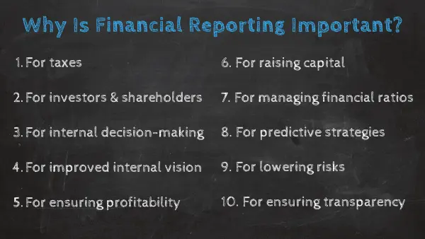
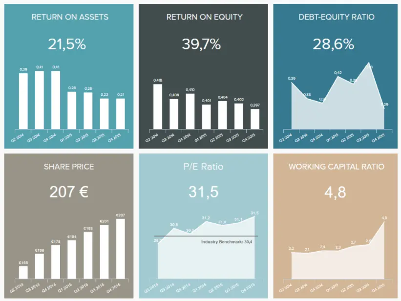
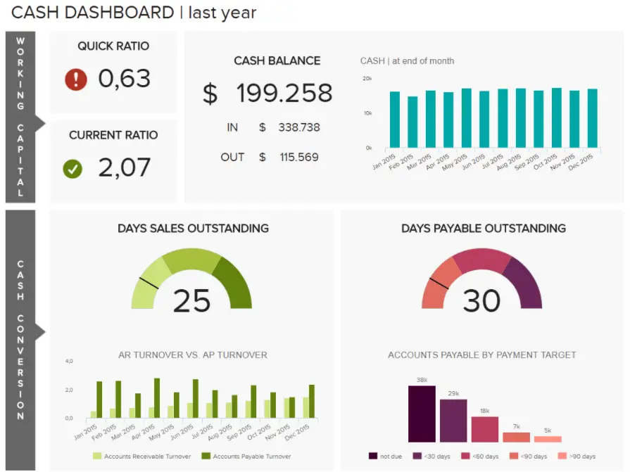

虽然您可能已经知道详细的财务报告流程很重要（主要是因为它是大多数国家/地区的法律要求），但您可能不了解其尚未开发的力量和潜力。事实上，财务分析是现代企业的基石之一。财务分析和报告提供了一定程度的洞察力，可帮助企业保持合规性，同时全面简化以收入或支出为中心的计划。

借助[在线数据分析](https://www.datafocus.ai/infos/data-analysis-tools)，利用财务数据，您不仅可以在内部和外部共享重要信息，还可以利用指标或见解对允许您的业务流动的领域进行重大改进。

为了帮助您释放财务分析和报告的潜力，我们制作了本指南，告诉您有关该主题的所有信息。让我们一拍即合，了解详细的财务报告定义。

您的机会：[想免费测试财务报告软件吗？](https://www.datafocus.ai/console/)探索我们的 14 天试用版，将您的财务报告提升到一个新的水平！

## 什么是财务报告？

财务报告是指为利益相关者提供公司财务状况（包括其收入、支出、利润、资本和现金流）的准确描述的标准做法，作为提供对财务信息的深入见解的正式记录。

这些[财务 KPI](https://www.datafocus.ai/infos/kpi-examples-and-templates-finance)中的每一个都非常重要，因为它们展示了公司的整体“健康状况”——至少在涉及金钱这一小问题时是这样。这些类型的[KPI 报告](https://www.datafocus.ai/infos/what-are-kpi-reports-examples)并不能提供对公司文化或管理结构的太多见解，但它们对成功至关重要。

随着我们的继续，我们将探索财务分析和报告的用例，但就目前而言，值得注意的是，这些“财务健康报告”对于任何希望对其业务做出明智决策的人来说都至关重要。财务报告软件和[BI 报告工具](https://www.datafocus.ai/infos/bi-reporting)提供有关投资、信用扩展、现金流等要素的宝贵信息。出于税收目的，法律要求财务报告和分析。

也就是说，有各种类型的财务报告可以服务于不同的目的。一些最常见的包括：

- 损益表：也称为损益表，损益表是一份财务分析报告，显示公司在给定时间段内的收入和支出，重点关注四个关键要素：收入、支出、收益和损失。该声明的主要目的是了解企业是否赚钱。它通过汇总会计期间的关键销售活动、生产成本和任何其他运营费用来实现这一点。该报告将收入与所有费用减去，以了解业务的利润（或亏损）。
- 资产负债表：这种类型的财务报表提供了公司资产、负债和股东权益的详细概述。从本质上讲，资产负债表提供了企业在给定时间点（通常是一个月或季度）的财务状况摘要，可用于内部或外部目的。一方面，它可以由任何利益相关者（如经理或员工）进行内部审查，以了解公司是否朝着正确的方向发展。另一方面，任何有兴趣投资公司的人都可以在外部使用资产负债表，因为该报告提供了有关可用资源及其融资方式的有用信息。
- 现金流量表：简单来说，现金流量表显示了公司产生的现金数量以及现金支出的成本。它包含损益表和资产负债表的要素，对企业的成功管理至关重要。现金流量表通常分为 3 个不同的区域，对所有收到和支付的现金进行分类。首先，我们看到显示收入、支出、收益和损失的经营现金流，然后我们看到显示债务和股权购买和销售现金的投资现金流。最后，我们有财务报告，它报告长期负债，如贷款支付和股权项目，如出售公司股票。

无论您公司的财务目标是什么，通过正确的分析方法，您都可以显着加速业务的增长。在这篇文章中，我们将详细了解财务分析和报告的力量，查看现实世界的财务报告示例，并讨论为什么这种方法应该是每个现代商业战略的重要组成部分。

既然我们已经探讨了我们认为良好的财务报告含义，让我们来看看这类报告的好处。

## 财务报告的好处

我们思考了“为什么财务报告很重要？”这个问题，研究了现实世界的用例，并分享了我们认为的财务报告意义。为了继续我们的旅程，让我们考虑一下基于财务的报告和分析的主要优势。

- 改善债务管理：如您所知，债务可以削弱任何公司的进步，无论行业如何。虽然可能有许多不同类型的财务报告关于目的或软件，但几乎所有解决方案都将帮助您跟踪您的流动资产除以资产负债表上的流动负债，以帮助衡量您的流动性并相应地管理您的债务。
- 趋势识别：无论您要跟踪哪个金融活动领域，这种报告都将帮助您识别过去和现在的趋势，这将使您能够解决任何潜在的弱点，同时帮助您进行改进，这将有利于您的业务的整体健康。
- 实时跟踪：通过访问集中的实时见解，您将能够迅速做出准确、明智的决策，从而避免任何潜在的障碍，同时始终保持您的财务流动性。
- 负债：管理负债是公司持续财务状况的重要组成部分。商业贷款、信用额度、信用卡和供应商提供的信贷都是需要管理的不可或缺的责任。通过使用[财务报表模板](https://www.datafocus.ai/infos/daily-weekly-monthly-financial-report-examples)，如果您计划申请业务扩展贷款，您可以在正式申请之前浏览财务报表数据并确定是否需要减少现有负债。
- 进展和合规性：由于财务报告软件提供的信息既准确又可靠，因此访问此级别的[分析报告](https://www.datafocus.ai/infos/analytical-report-example-and-template)不仅提供了随着时间的推移提高财务效率的机会，而且还将确保您保持 100% 合规——如果您希望您的业务保持活跃，这一点至关重要。
- 现金流：无论大小，组织的现金流对其持续的财务状况至关重要。使用详细指标和 KPI 的组合，可以深入了解与预期利润和负债相关的现金流，从而确保您的货币流动安全流畅。
- 通信和数据访问：任何有价值的现代财务分析报告都可以访问并针对多种设备进行优化。通过无限制地访问重要的财务见解和数据，您可以快速应对挑战，同时全面改善内部沟通。如果每个人都了解新兴趋势并可以共享重要的财务数据，您的组织将变得更高效、更具创新性，并防范潜在的合规性问题或错误。

您的机会：[想免费测试财务报告软件吗？](https://www.datafocus.ai/console/)探索我们的 14 天试用版，将您的财务报告提升到一个新的水平！

## 为什么财务报告很重要？

麦肯锡的一份报告表明，利用数据创建更熟练的营销报告并做出更明智的决策可以将营销效率提高15%至20%，根据每年[平均1万亿美元](https://www.mckinsey.com/business-functions/marketing-and-sales/our-insights/digitizing-the-consumer-decision-journey)的全球[营销](https://www.datafocus.ai/infos/daily-weekly-monthly-marketing-report-examples)支出，这意味着高达2000亿美元。

如果您将相同的逻辑应用于财务部门或财务部门，很明显，财务[报告工具](https://www.datafocus.ai/infos/online-reporting)可以通过为您提供更明智的活动快照来使您的企业受益。

财务报告提供了丰富的见解，可以简化您企业的财务活动。但是，在我们更详细地了解好处之前，让我们先来看看黄铜钉——财务数据分析和报告的意义和作用是什么？

嗯，有三个主要因素：

- 出于税收目的，法律要求这样做。
- 财务报告和分析使投资者、债权人和其他企业了解贵公司的财务完整性和信誉。
- 财务报告软件提供了可用于做出更好业务决策的关键信息，例如，您是否应该开设新分支机构。

为了进一步说明财务报表分析的重要性，让我们更详细地分解财务报告的这三个主要原因。

### 1） 对于税收

你可能听说过这句话：这个世界上只有两个确定性是死亡和税收（或类似的东西）。

也就是说，税收可以说是财务报表分析重要性的最大原因——基本上，你必须这样做！政府利用此类报告来确保您支付公平的税款份额。如果法律要求财务报告，大多数公司可能会使用[管理仪表板](https://www.datafocus.ai/infos/dashboard-examples-and-templates-management)（至少出于内部决策目的）。

政府对这些文件的要求创造了一个完整的审计公司行业（如毕马威，安永，德勤和普华永道的[“四大”](https://www.accountingverse.com/articles/big-4-accounting-firms.html)），这些公司的存在是为了独立审查公司的财务报告。此审核过程也是法律要求。

### 2） 其他公司、投资者、股东等

如果您正在考虑向一家公司投资，那么根据标准化的试金石测试，您想知道该公司的表现如何才有意义;不是公司为了让自己看起来不错而捏造的测量。

这就是财务报表对投资者的重要性所在。这也适用于正在考虑向公司贷款的信贷供应商和银行。在这些情况下，您需要准确了解您获得偿还的可能性，以便您可以相应地收取利息。

为此，手头有一个[投资者关系仪表板](https://www.datafocus.ai/infos/dashboard-examples-and-templates-management#investor-relations-dashboard)真是太好了。通过资产回报率、股本回报率、债务权益比率等指标，下面显示的投资者仪表板提供了一段时间内跟踪的公司财务业绩的详细概述。该工具的价值在于它的交互性，如果您想更深入地了解其中一些指标，您只需单击它，整个报告将根据所选数据进行过滤。

\*\*点击放大\*\*

财务分析和报表的重要性也适用于利益相关者。如果您拥有一家公司的股权，或者是拥有主要股权头寸的激进投资者，那么充分披露所有资产、负债、现金使用、收入和相关公司成本至关重要。您还需要了解公司是否正在做不应该做的事情（例如安然公司的情况）。

由于一系列被称为[萨班斯-奥克斯利法案](https://www.soxlaw.com)的法律，在金融数据分析和报告领域有更多的标准化/法律合作。这些法律旨在防止另一种情况发生，我们将再次说 - 安然 - 发生。

### 3） 用于内部决策

如前所述，财务报告并不是做出所有内部业务决策的最佳工具。但是，它们可以作为其他报告（例如管理报告）的“基石”，这些[报告](https://www.datafocus.ai/infos/management-reporting-best-practices-and-examples)可以并且应该用于做出决策。

财务报告必须尽可能准确，否则，任何基于它们的管理报告（以及随后的决策）都将建立在不稳定的基础上。这就是公司可能遇到麻烦的地方，使用传统方法（例如多个用户可以访问的大量电子表格），而不是通过使用财务仪表板来获得[财务](https://www.datafocus.ai/infos/dashboard-examples-and-templates-finance)报告的好处。

事实上，德勤（Deloitte）为提高人们对良好财务分析和报告价值的认识而进行的一项[调查](https://www2.deloitte.com/content/dam/Deloitte/al/Documents/about-deloitte/Deloitte%20-%20User%20Survey-20-Shtator-PRINT%20VERSION.pdf)指出，大多数受访者认为“细节水平不足”是财务报告的主要问题。这是因为所使用的技术和模板太旧了。现代[在线仪表板](https://www.datafocus.ai/infos/online-dashboard)通过以直观和详细的方式为您自己和他人提供有关您公司财务状况的概览信息，从而将这些问题置于过去。

请记住：政府（和外部投资者）并不关心为什么你的财务报告不准确。他们只会因为你的错误而惩罚你——这就是那种切割和干燥。

### 4） 改善内部视力

财务分析和报告是在整个组织内共享关键财务信息的准确、有凝聚力且可广泛访问的方法。如果您的财务见解或数据支离破碎，事情很快就会分崩离析。简而言之，仅此一项就回答了这个问题，什么是财务报告和分析？

财务分析和报告有助于回答有关公司财务活动各个方面的一系列重要问题，为内部和外部利益相关者提供准确、全面的战略和[运营指标](https://www.datafocus.ai/infos/operational-metrics-and-kpi-examples)快照，以做出决策并采取明智的行动。

### 5） 用于制定战略和确保盈利能力

遵循上一点，财务分析和报告对于制定明智的战略和确保业务保持盈利至关重要。事实上，回到我们之前提到的德勤调查，67%的受访者认为，财务报表中包含的数据是“确定降低成本和消除潜在损失以保持盈利能力的有效方法”的关键。

也就是说，这些[类型的报告](https://www.datafocus.ai/infos/types-of-reports-examples)对企业的财务状况至关重要。它允许经理和任何其他利益相关者制定明智的战略，使公司更有利可图，同时使每个关键参与者能够依靠数据进行决策过程。借助现代[在线报告软件](https://www.datafocus.ai/infos/online-reporting)，公司可以实时发现趋势和模式，并监控其收入和支出以智能分配资源。

### 6） 用于筹集资金和进行审计

对于“为什么财务报告很重要？”这个问题，我们的下一个答案是双重的：更准确地筹集资金和更合规地管理您的资金。

财务报告和分析可帮助组织（无论行业如何）以管理良好、[流畅的方式](https://opentextbc.ca/principlesofeconomics/chapter/17-1-how-businesses-raise-financial-capital)在国内和海外筹集资金——这是在当今竞争激烈的数字世界中持续取得商业成功的重要组成部分。

此外，财务分析和报告有助于法定审计。法定审计师必须审计组织的财务报表以表达其意见。报告工具或软件将为这些官方提供简洁、准确和合规的信息——这当然至关重要。

您的机会：[想免费测试财务报告软件吗？](https://www.datafocus.ai/console/)探索我们的 14 天试用版，将您的财务报告提升到一个新的水平！

### 7） 用于管理财务比率

比率对于企业的财政管理计划至关重要 - 有许多需要考虑。在这种情况下，比率代表了企业为确保整个运营以最高效率运行而必须执行的精细杂耍行为。

财务比率还有助于投资者分解企业累积的大量财务数据。比率为您的数据形式和方向提供，便于在不同报告期间进行有价值的比较。

现代[财务图表](https://www.datafocus.ai/infos/financial-graphs-and-charts-examples)和仪表板以可视化方式显示，一目了然地提供了大量宝贵的基于绩效的信息，为准确的基准测试和实时决策提供了必要的工具。

关键财务报告比率包括营运资本比率、速动比率、股本回报率 （ROE） 和 Berry 比率。有了这些丰富的洞察力，就可以保持公司的财务健康，同时制定有利于您的财政平衡的举措，在此过程中提高您的底线。下图是跟踪速动比率的财务 KPI 的可视化示例。

速动比率由专业的财务[KPI 工具](https://www.datafocus.ai/infos/kpi-reporting)生成，是跟踪可以快速转化为现金的短期流动性或近现金资产的指标。这个KPI的要点，也称为酸性测试比率，是只包括可以很容易地转换为现金的资产，通常在90天左右，例如应收账款。

### 8）用于准确的预测和预测策略

在考虑财务报表对利益相关者的重要性时，值得一提的是财务分析的预测能力。

我们已经探讨了财务仪表板如何通过趋势发现和实时决策提供动态数据可视化。更深入地挖掘，财务报告工具还可以提供对一系列财务绩效和流程的全面见解。历史、实时和预测数据相结合，提供了指标的平衡快照，帮助用户根据过去或新兴趋势做出令人难以置信的准确预测。

通过基于具体的视觉数据进行预测，可以制定有益于财务健康的策略，同时将任何潜在问题扼杀在萌芽状态。

例如，个人财务管理提供商 Mint.com 使用预测分析来扩大其用户群并提高其底线。通过分析消费者数据和关键财务绩效指标的组合，该公司能够简化其流程，同时为客户提供最终目标，并向后工作。

通过提供预测目标或愿望，企业反向工作（内部和外部），开发准确的解决方案或策略，在此过程中提供最佳的投资回报率 （ROI）。这种预测策略不仅有助于简化Mint的内部流程，而且该公司在相对较短的时间内从[零增长到100万订户](https://bigdata-madesimple.com/6-of-my-favorite-case-studies-in-data-science)。

在谈到公司的财务胜利时，高级管理人员诺亚·卡根（Noah Kagan）解释说：

“把它想象成一次公路旅行。您首先要记住一个设定的目的地，然后在那里计划路线。你不会上车开始开车，没有希望你神奇地到达你想去的地方。

### 9） 降低风险，防止欺诈活动

扩展我们之前的观点，财务[BI 仪表板软件](https://www.datafocus.ai/infos/bi-dashboard-tools)提供的数据深度和预测功能可以显着降低财务风险。

使用正确的指标组合，您将开始直观地看到性能的任何潜在下降或负面模式，这意味着您可以采取关键措施来防止潜在的破坏性货币灾难。

有了动态、可视化和交互式的 KPI，您不仅可以降低财务风险并保护您的公司免受明显的低效率影响，而且您将能够做出更明智的投资和决策。以下是您应该关注的一些 KPI 以保护财务和增长：

- 毛利率
- 净利润率
- 营运资金
- 营业费用率
- 资产回报率
- 股本回报率
- 现金转换周期
- 供应商付款错误率

除了全面降低财务风险外，数据分析仪表板还可以保护您的企业免受欺诈性财务活动的侵害。而且，考虑到过去两年中各行各业[有46%的公司](https://www.pwc.com/gx/en/services/forensics/economic-crime-survey.html)成为金融欺诈的受害者，现在比以往任何时候都更能保护自己免受内部或外部网络相关犯罪的影响。

通过频繁的基准测试和分析，您将增加识别任何异常并立即调查问题的机会。这种快速响应方法将使您能够找到问题的根源，解决问题，同时减少进一步的经济损失。

### 10） 确保全面透明度

正如我们在这篇文章中一次又一次地提到的那样，财务报告是企业内部运作的关键。但不仅如此，财务报表也被证明对确保透明度非常有用。例如，在公共部门工作的企业可能由纳税人或捐助者资助，因此，他们需要对他们花钱的方式负责。为此，财务报告发挥着根本性的作用，因为它们不仅确保公共实体透明和合规，而且确保人们与这些实体保持信任关系。

另一个例子是，对于大型企业，客户对当今公司做出业务决策的方式越来越挑剔。通过公开和透明地发布财务数据，大企业可以与客户建立更牢固的关系。例如，通过展示他们的慈善行动或可持续发展支出。另一方面，如果您提供长期服务，提供有关您公司财务业绩的信息可以向潜在客户保证您可以与他们长期保持业务往来。

总之，财务分析和报告可以帮助各种规模的企业与投资者、股东、员工甚至客户建立信任关系。能够清楚地传达公司在财务上表现良好可以带来一些好处。

## 财务报告的 5 个基本用例

到目前为止，我们一直从大局的角度看待事物。现在，让我们通过探索财务报告（以及基于它们的报告）可以帮助您回答的一些有价值的问题，变得更加具体和更接地气。

### 1\. 购买这只股票是个好主意吗？

如果您真的在对一家您正在考虑以个人或代表您当前组织投资的公司进行尽职调查，财务数据分析和报告可以为您提供一些（相对）“硬”数据，帮助您做出决定。

这也是您可以深入了解一家公司在股票市场上是否可能定价过低或过高的一种方式。

### 2\. 我们盈利吗？我们未来会吗？

如果不了解财务报表的重要性，就很难判断您的公司在支付了所有费用和工资单后赚了多少钱。由于公司存在的主要原因之一是为自己和股东赚取利润，因此至关重要的信息 - 不妥协。

### 3\. 我们目前拥有多少现金“跑道”？

如果您曾经是初创公司管理团队的一员，您可能会知道不知道自己是否能够在未来几个月内“发工资单”的压力有多大。

这就是财务报表的重要性所在。

现金是企业的氧气，财务报告分析可以帮助您了解您的企业在保持财务偿付能力的同时可以发放多少个月的工资（假设收入数字保持不变）。

这是一个很好的“最坏情况”练习，可以定期进行 - 如果您假设与最佳猜测预测相比，您的收入将在未来几个月内下降，那就更加坚固了。

### 4\. 我们是否有资金投资于新的业务线？

一些公司，[比如苹果](https://www.cnbc.com/2017/01/31/apples-cash-hoard-swells-to-record-24609-billion.html)，喜欢坐拥巨额现金。他们的策略是积累这笔钱，这样即使经济发生一些非常灾难性的事情，他们也能保持财务偿付能力。

然而，如果其他公司可以这样做，同时保持财务健康，他们更愿意投资他们的钱。例如，像英特尔这样的计算机芯片组制造商会定期升级他们的工厂和设备。

这些升级非常昂贵，虽然它们是一项很好的长期投资，但相关公司必须确保他们有短期现金流来支持这些举措。

### 5\. 我的供应商关系是否像应有的那样健康？

在考虑“为什么财务分析很重要？”时，总是值得考虑你的供应商。无论您是基于服务还是基于产品的企业，您的供应商或供应商关系都与您公司的持续财务状况密切相关。

如果您的供应商或供应商关系紧张、效率低下或充满问题，您将阻碍组织的生产力，损害您的品牌声誉，并最终（经常）赔钱。

通常，您的供应商或供应商将具有单独的付款流程和信用规则。简化的财务分析可确保支付和交易始终保持流畅，尤其是在与现代[客户仪表板](https://www.datafocus.ai/infos/client-dashboard-report-examples)一起使用时。

此外，通过使用供应商付款错误率等指标，可以跟踪供应商付款，同时识别在设定的时间范围内任何付款不足或多付的情况。获得这种级别的洞察力将优化您的供应商或供应商流程，从而节省流程中的时间和金钱。

您的机会：[想免费测试财务报告软件吗？](https://www.datafocus.ai/console/)探索我们的 14 天试用版，将您的财务报告提升到一个新的水平！

## 谁使用财务报告和分析？

我们已经在整个帖子中说明了财务分析和报告的重要性，以及它们如何作为沟通工具，让内部和外部利益相关者了解情况并建立联系。财务报告是各种规模的企业用来审查其数据、保持合规并确保盈利能力和健康财务业绩的多功能分析工具。也就是说，有各种各样的团体可以从不同目的的财务分析和报告中受益，其中一些包括：

- 投资者、股东和贷方：投资者和股东使用财务报告来评估其投资状况以及公司如何产生利润。另一方面，贷方使用它们来了解公司偿还贷款和相关利息费用的能力。
- 业务经理：可能比这份名单上的任何其他利益相关者都更能从财务报告中受益。拥有高效的财务报告系统使他们能够更深入地跟踪绩效，并制定明智的战略，以确保健康稳定的财务发展。
- 监管机构：税务代理人和各种政府实体也收集财务数据，以监控企业是否遵守税收法规。无论企业规模大小，纳税都是无法逃避的义务。现代财务分析允许对公司数字进行有组织的查看，以确保遵循所有标准程序。稍后会详细介绍这一点！
- 消费者或客户：在客户关系方面，透明度是关键。公司和企业使用财务报告与客户就收益、投资活动或慈善捐赠进行公开沟通。另一方面，客户在考虑选择哪个供应商签订合同时，也可以从财务报表中受益，因为他们可以判断供应商长期经营的能力。
- 员工：现代财务报告使所有部门和知识水平的员工能够使用财务数据来增强自己的能力。通过使用现代仪表板技术，员工可以可视化重要的财务信息，以衡量其活动绩效并做出明智的决策。

## 3种不同的财务报告和分析方式

“在一个完美的世界里，投资者、董事会成员和高管会对公司的财务报表充满信心......不幸的是，由于几个原因，这不是现实世界中发生的事情。 - 财务报告仍然不足的地方，[哈佛商业评论文章](https://hbr.org/2016/07/where-financial-reporting-still-falls-short)

在这一点上，我们不会太深入地进入“财务报告兔子洞”，但我们可以肯定地说，这种报告有很多很多陷阱。其中一些是技术陷阱，而另一些则是道德的（[安然](https://www.investopedia.com/updates/enron-scandal-summary)，有人吗？

现在，只需了解财务报告标准化有三种主要方式，以及在处理任何类型的基于欧盟的数据时需要考虑的一个关键因素就足够了：

- 公认会计原则（公认会计原则）。这是美国使用的系统，几乎没有其他人使用（就像英制测量系统一样！
- 国际财务报告准则（IFRS）。全球有110多个国家使用该系统，包括加拿大、澳大利亚、印度和中国（尽管中国和印度以自己的方式“定制”了国际财务报告准则）。
- GDPR：（通用数据保护条例）：[GDPR](https://www.gdprexplained.eu)于 2018 年 5 月 25 日生效，旨在使保护个人个人信息的法律现代化，这意味着如果您正在处理任何类型的敏感财务数据、见解或指标（涉及您的投资者、客户或合作伙伴），您必须确保您的报告合规。

标准化中的这些差异会产生现实世界的后果。正如《哈佛商业评论》的文章所述：

“吉百利基于GAAP的股本回报率为9%，比IFRS（14%）低了整整五个百分点。这种差异足以改变收购决策。

## 5种常见的财务报告

财务数据并不容易理解，将所有内容放在无限的 Excel 工作表中使得从中提取有价值的信息变得更加困难。考虑到这个问题，已经开发了交互式财务报告软件，以帮助企业可视化和分析其最重要的财务数据。借助预测分析、[自动报告](https://www.datafocus.ai/infos/automated-reporting-system-and-tools)和直观仪表板等技术，企业可以在现实生活中提取见解，以做出重要的财务决策。

我们已经在文章开头讨论了一些常见的财务报告类型。现在，我们将介绍这些类型报表的一些直观示例，以正确看待它们的价值。这 5 个示例是使用专业的财务[仪表板生成器](https://www.datafocus.ai/infos/dashboard-creator)生成的。

### 1） 损益表

此特定报告告诉您公司在给定时间段（通常是财政年度）内赚了多少钱（或亏损了多少钱）。它通过显示赚取的收入和支付的费用来做到这一点，最终目标是显示公司的利润数字。

\*\*点击放大\*\*

主要关键绩效指标：

- 毛利率百分比
- 营业利润率百分比
- 营业费用率
- 净利润率百分比

### 2） 资产负债表

这款财务报告软件提供了您在给定时刻的资产和负债（又名债务）的快照。在拥有健康的资产负债表的同时，绝对有可能陷入您的盈利能力和现金流状况的困扰（特别是如果您有大量资金被实物库存捆绑），这份报告将帮助您更深入地挖掘，帮助您做出战略决策。

\*\*点击放大\*\*

主要关键绩效指标：

- 资产回报率
- 股本回报率
- 营运资金

### 3） 现金流量表

此报告显示一段时间内流入和流出您的业务的资金量。现金流量表对于确保您有足够的钱来支付工资至关重要。

\*\*点击放大\*\*

主要关键绩效指标：

- 流动比率
- 应付账款周转率
- 应收账款周转率

我们接下来的两个财务分析报告示例是完整的仪表板，其中包含可视化指标和 KPI，提供公司财务活动的完整图片。一起来看看吧。

### 4） 财务关键绩效指标仪表板

强大的财务[KPI 仪表板](https://www.datafocus.ai/infos/best-kpi-dashboard-examples)提供重要财务绩效数据的重要快照，提供旨在维持财政健康的表格、图形和图表的有凝聚力的组合。使用营运资本、现金转换周期、预算差异等 KPI，这个动态财务报告系统将使您能够减少效率低下、做出准确的预测并保持现金流有效地流经组织。

\*\*点击放大\*\*

主要关键绩效指标：

- 营运资金
- 速溶比率/酸性测试
- 现金转换周期
- 供应商付款错误率
- 预算差异

### 5） 首席财务官仪表板

这个功能强大的首席财务[官仪表板也被称为“首席财务](https://www.datafocus.ai/infos/cfo-dashboard-kpis-report-template)官驾驶舱”，可让您轻松了解高级财政指标和基本经济趋势。通过对员工满意度和 Berry 比率等的详细见解，您将在这里找到作为高级决策者所需的一切，以识别新兴趋势、做出明智的组织决策，并始终如一地达到（甚至超过）您的利润目标。

\*\*点击放大\*\*

主要关键绩效指标：

- 薪资员工人数比率
- 经济增加值
- 浆果比例
- 员工满意度

您的机会：[想免费测试财务报告软件吗？](https://www.datafocus.ai/console/)探索我们的 14 天试用版，将您的财务报告提升到一个新的水平！

## 那么，财务报告的目的是什么？

重申：财务报告的重要性是什么？撇开想法或感受不谈，只要企业在交易，财务报告就会存在。

为什么？政府永远不会停止征税和命令遵守。在各个行业，企业始终需要精确地跟踪其财政活动，而财务报告是实现这一目标的最佳方式。

除了纳税和在法律眼中保持合规外，财务报告工具还使企业能够使其财政活动更具战略性、精简性和前瞻性。从这个意义上说，财务报告工具既实用又先进，使用户能够通过掌控自己的财务状况来加速业务增长。

虽然您可能无法选择是否或如何准备财务报告，但您至少可以控制如何呈现它们。通过财务实时[仪表板](https://www.datafocus.ai/infos/live-dashboards)，您可以一目了然地查看公司的财务完整性，使您能够在应对不断变化的同时做出更好的选择。

要开始使用基于财务的报告，请尝试我们的[财务分析软件](https://www.datafocus.ai/infos/finance-analytics)，免费试用[14 天](https://www.datafocus.ai/console/)。是时候将您的业务提升到一个新的水平了。
