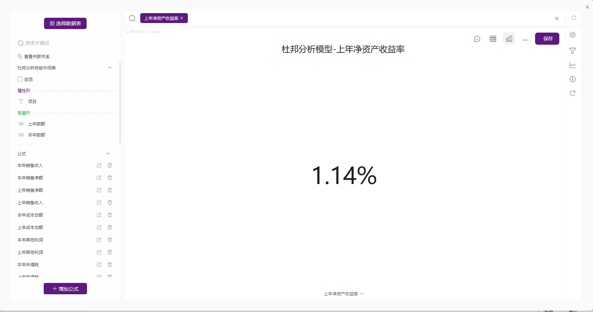

## 模型介绍

在分析上市公司的经营状况时，肯定想知道这个公司的资产状况和盈利能力，这个时候，你可以用杜邦分析法这个工具作为你的思维导图。

杜邦分析法（DuPont Analysis）是在投资研究中非常实用且被广泛应用的企业经营状况分析方法。具体讲，杜邦分析法就是利用几种主要的财务比率之间的关系来综合地分析企业的财务状况。换言之：杜邦分析法是一种用来评价公司赢利能力和股东权益回报水平，从财务角度评价企业绩效的一种经典方法。

杜邦分析法的基本思想是将企业净资产收益率逐级分解为多项财务比率乘积，这样有助于深入分析比较企业经营业绩。

由于这种分析方法最早由美国杜邦公司使用，故名杜邦分析法。

杜邦模型最显著的特点是将若干个用以评价企业经营效率和财务状况的财务指标的比率按其内在联系有机地结合起来，形成一个完整的指标体系，并最终通过净资产收益率来综合反映。

净资产收益率可以分解为三个财务指标的乘积。净资产收益率 = 销售净利率 X 资产周转率 X 权益乘数

分解指标一：销售净利率

反映企业所卖产品利润率的高低，即盈利能力。销售净利率 = 净利润 / 销售收入

分解指标二：资产周转率

反映企业的资产运转效率，一般而言，如果资产周转率高，则说明企业一个完整的经营流程运行得很快，即营运能力强。资产周转率 = 销售收入 / 总资产

分解指标三：权益乘数

反映企业负债率的高低，权益乘数高，说明企业的负债率高，依靠高额负债支持经营。

权益乘数 = 总资产 / 净资产(权益) = 1/(1-资产负债率)

## 计算思路

使用DataFocus完成杜邦分析的步骤如下：

1. 收集财务数据，包括净利润、销售额、总资产等。
2. 将数据导入DataFocus中。在搜索页面中，依次创建计算字段，以便计算销售净利率、资产周转率和财务杠杆率（权益乘数）。
3. 创建报表或仪表板来展示杜邦分析的计算结果。在报表或仪表板中，需要将ROE、销售净利率、资产周转率和财务杠杆率（权益乘数）等指标按逻辑进行排布。
4. 对报表或仪表板进行分析，了解公司的财务状况，并根据分析结果做出更明智的投资决策。

## 构建计算字段

数据表中包含了项目、上年数额、本年数额3个字段，我们依次添加公式计算需要的字段。计算公式汇总在以下表格中（以上年数额为例，计算本年数额时只需要把上年数额替换成本年数额）。

<table style="display: none;"><tbody><tr><td>度量名称</td><td>表达式</td></tr><tr><td>流动负债</td><td>sum_if (项目="流动负债合计",上年数额)</td></tr><tr><td>长期负债</td><td>sum_if (项目="长期负债合计",上年数额)</td></tr><tr><td>流动资产</td><td>sum_if (项目="流动资产合计",上年数额)</td></tr><tr><td>非流动资产</td><td>sum_if (项目="资产总计",上年数额)-sum_if (项目="流动资产合计",上年数额)</td></tr><tr><td>负债总额</td><td>sum_if (项目="负债合计",上年数额)</td></tr><tr><td>资产总额</td><td>sum_if (项目="资产总计",上年数额)</td></tr><tr><td>资产负债率</td><td>if上年资产总额=0 then 0 else上年负债总额/上年资产总额</td></tr><tr><td>销售净额</td><td>sum_if (项目="一、主营业务收入",上年数额)</td></tr><tr><td>成本总额</td><td>sum_if (项目="减：营业费用",上年数额)+sum_if (项目="管理费用",上年数额)+sum_if (项目="财务费用", 上年数额)+sum_if (项目="减：主营业务成本",上年数额)+sum_if (项目="主营业务税金及附加",上年数额)</td></tr><tr><td>其它利润</td><td>sum_if (项目="加：其他业务利润",上年数额)+sum_if (项目="加：投资收益",上年数额)+sum_if (项目="补贴收入",上年数额)+sum_if (项目="营业外收入",上年数额)-sum_if (项目="减：营业外支出",上年数额)</td></tr><tr><td>所得税</td><td>sum_if (项目="减：所得税",上年数额)</td></tr><tr><td>营业收入</td><td>sum_if (项目="一、主营业务收入",上年数额)</td></tr><tr><td>净利润</td><td>上年销售净额-上年成本总额+上年其他利润-上年所得税</td></tr><tr><td>销售净利率</td><td>上年净利润/上年销售收入</td></tr><tr><td>资产周转率</td><td>上年销售收入/上年平均资产总额</td></tr><tr><td>资产净利率</td><td>上年销售净利率*上年资产周转率</td></tr><tr><td>权益乘数</td><td>1/(1-上年资产负债率)</td></tr><tr><td>净资产收益率</td><td>上年资产净利率*上年权益乘数</td></tr></tbody></table>

## 创建KPI指标

将创建好的计算字段直接双击添加到搜索框中，并保存为历史问答，即可达到各指标的数值（用KPI指标图展示）。

重复上述步骤，逐个创建上述表格中的所有KPI指标。

## 效果查看

全部KPI指标创建完成后，按照杜邦模型图排列各KPI指标，并用线条连接（加减乘除符号用图片代替），最终可得到如下效果图：

详情仪表板请参见：[杜邦分析](https://cloud001.datafocus.ai/df/s/xe6hog7Gp2aY2Wu0TpvAqE6?name=杜邦分析模型数据看板) 。或者[点击链接下载模板](https://bbs.datafocus.ai/article/73.html)，注册后上传模板即可使用。
