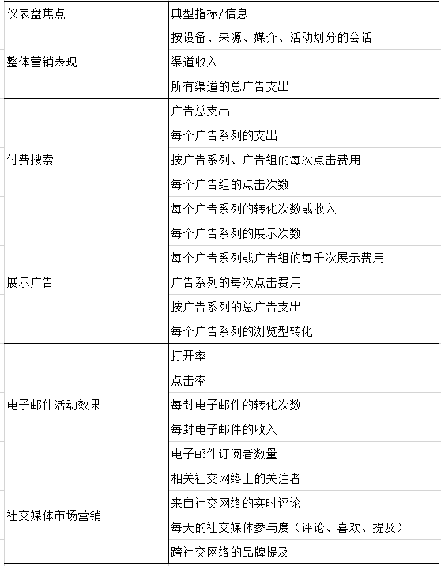

经营一家成功的在线商店，有很多指标需要跟踪。从收入或订单数量等高级指标，到客户反馈等更详细的信息，作为店铺的老板，您可能需要花费大量的时间从数据堆中找出每次需要的不同数据。

现找需要的数据，不仅耗时费力，还需要清楚记得数据所在的位置和关系，因此**为您的店铺搭建一个完善的可视化大屏体系才是最理想的解决方案**。在电子商务大屏中添加定期关注的核心指标和其他数据，帮助您发现趋势或商店的任何可能需要进行干预的问题。

在本文中，我们将简单介绍什么是电子商务大屏，展示一些不同风格的仪表板，以及它们是如何帮助企业和业务的。

## **什么是电子商务大屏？**

就其最纯粹的形式而言，电子商务仪表板是一组精心设计的指标、KPI和其他数据图表的汇总，旨在以最清晰的方式突出显示与在线商店相关的趋势、异常情况和信息。

许多小型企业依靠嵌入云端SaaS BI工具，诸如DataFocus等制作数据看板开始他们的可视化之旅。这类工具的特点是可以快速上手，且可以根据业务的特定要求进行定制，联立来自多个数据源的数据。

## **电子商务大屏如何帮助企业业务？**

正如我们所了解的，大屏并非用于呈现大量信息或揭示长期见解，它们的作用主要是为您和您企业中的其他人提供足够的信息，以便在一天中采取适当的行动。

数据大屏涵盖的最常见用例类型之一是确保快速检测到任何重大问题，以便修复它们。例如，数据大屏可以提醒您注意的一些事项包括：

- 网站停机时间
- 建立支持查询
- 订单履行问题
- 低库存
- 广告效果下降
- 负面公关或社交媒体反弹

不过，数据大屏不仅有助于实时监控您的操作。还可以帮助节省公司中的每个人的时间和精力。

这才是专用电子商务大屏的用武之地……

## **一些电子商务大屏示例**

企业需要什么样的大屏，应该展示哪些指标，这些内容都因企业而异。但一个有效的可视化大屏应该始终反映企业当前的业务需求。

可能会影响企业构建的数据看板的一些因素，包括但不限于：

- 销售的产品类型，是一次性购买还是经常购买
- 是向企业(B2B)还是消费者(B2C)销售产品
- 服务于本地、国家还是国际市场
- 季节性影响
- 商店有多少单独的产品库存
- 订单量
- 对交货时间的期望

这些因素因企业而异，各企业之间的业务也存在较大差异，但我们仍然可以从一些别人制作好的数据看板中学到一些内容，供企业参考。下面是一些整理的DataFocus的示例数据看板，是整理了比较具有代表性的几家使用DataFocus软件的电子商务公司中整理出来的一些常见用例和模式。

### **店铺营业监测大屏**

订单是否顺利完成？网页上的某些功能是否存在bug或已经损坏？店铺营业监测大屏这种数据看板的存在是为了回答这些问题，让您高枕无忧，确保操作的关键部分运行顺利，如果出现问题也可以及时预警，快速定位，以便解决问题。

 

截图来源：DataFocus看板示例（数据已脱敏）

### **业务问题监测大屏**

除了上述重点领域外，业务问题监测大屏的亮点在突出了业务和运营指标，可以快速查明业务存在的问题。

 

截图来源：DataFocus看板示例（数据已脱敏）

### **（每周或每月）商店绩效大屏**

上面的仪表板类别侧重于展示店铺生存的关键指标。绩效大屏则专注于店铺的成长指标。“是否有望实现本月的目标？，”销售额是否在上升？，“哪些产品的表现最好？”。经常回答这些问题，可以帮助确保电子商务运营朝着正确的方向发展并且保持财务状况良好。

 

截图来源：DataFocus看板示例（数据已脱敏）

### **营销绩效大屏**

有数百种方法可以为您的线上店铺带来流量，任何小事情都会可能对您的营销成绩产生重大影响。因此，即便无法直接控制正在发生的事情，了解正在发生的事情也是有意义的，这样可以帮助减轻负面后果。

## **结论**

上述的数据看板示例绝不是一个完整的列表（您可以在DataFocus官网浏览更多更全面的数据看板示例），但如果您是一家电子商务企业，并且正在考虑构建可视化大屏，它们应该可以帮助您探索一些方向的电子商务业务。
