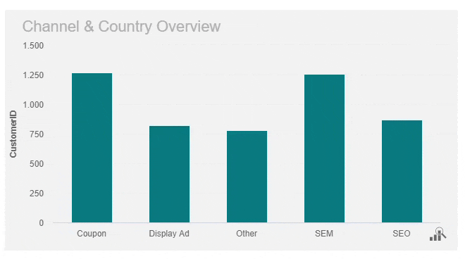
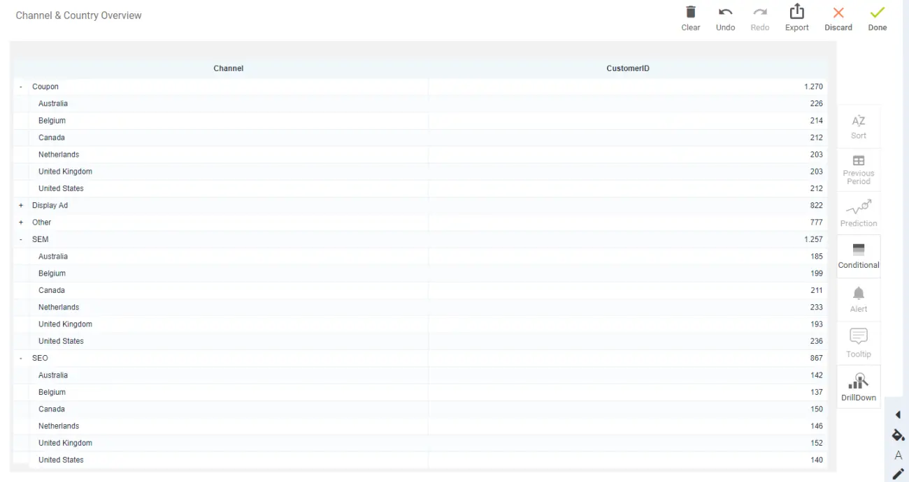
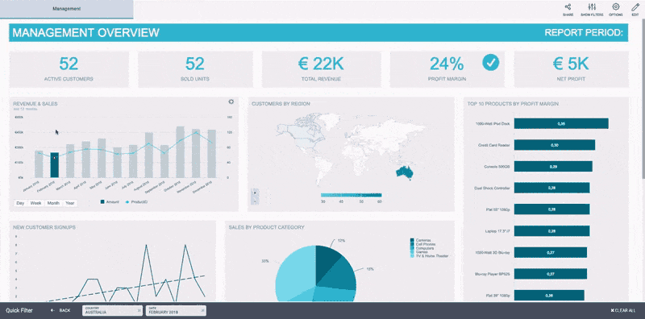
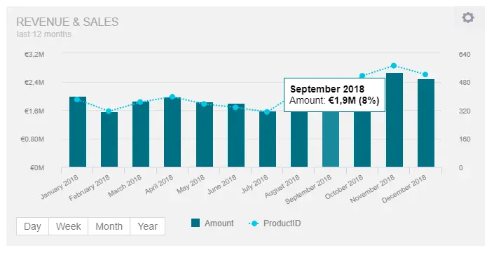
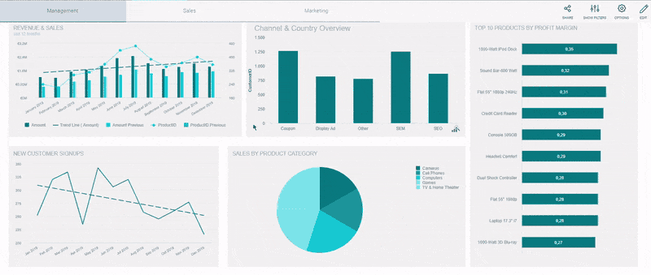
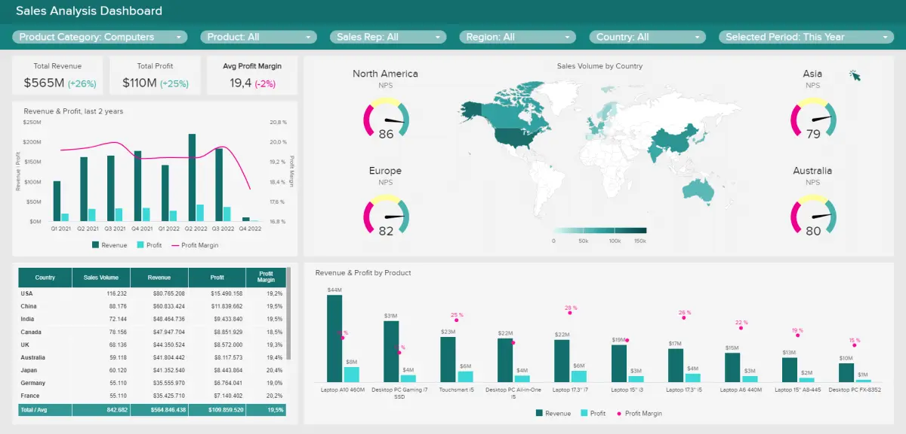
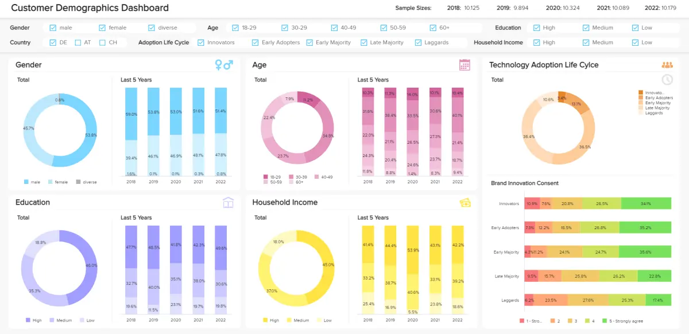

很快，各种规模的企业都将拥有如此多的信息，[以至于仪表板软件](https://www.datafocus.ai/infos/best-dashboard-software-features)将成为公司可以拥有的最宝贵的资源。在单个屏幕上可视化数据和交互不再是奢侈品，而是业务必需品。这就是我们欢迎您进入高度交互式仪表板世界的原因。坐个舒适的座位，享受引人入胜[的业务](https://www.datafocus.ai/infos/dashboard-examples-and-templates)仪表板的力量，抛弃电子表格，并利用交互式仪表板设计的优势及其功能。

但在我们深入研究主题的点点滴滴之前，让我们回答一些基本问题：什么是交互式仪表板，为什么需要交互式仪表板？从本质上讲，在这篇文章中，我们将解释仪表板报告和创建所需的所有细节，比较交互式报告与静态[报告](https://www.datafocus.ai/infos/dashboard-reporting)，并提供提示和技巧，使您的公司表现得更好。让我们开始吧。

## 什么是交互式仪表板？

交互式仪表板是一种数据管理工具，可集中跟踪和监控关键业务指标。借助各种交互功能，用户可以更深入地探索数据，并做出明智的数据驱动型业务决策。

仪表板在 BI 环境中使用，在经理和公司战略之间建立联系，使部门能够更有效地协作，并使员工能够以更高的生产力水平执行任务。

这种仪表板的目的是简化工作环境和分析流程，因为每天都会收集大量数据，公司需要能够在正确的时刻为他们提供正确答案的解决方案。现在我们已经解释了交互式仪表板的含义，我们继续下一个重要方面。

## 交互式仪表板与静态报告

毫无疑问：交互式仪表板为企业提供了前所未有的见解。专业的[仪表板制作器](https://www.datafocus.ai/infos/dashboard-creator)使您能够在单个屏幕上访问数据、轻松共享结果、节省时间并提高生产力。静态演示、停滞不前的报告以及等待分析师提取报告然后拥有过时数据的日子已经一去不复返了。值得庆幸的是，这也是从电子表格和幻灯片中退后一步的时刻。虽然Excel和PowerPoint以及其他各种电子表格和演示应用程序仍然是许多人的重要工具，但它们的交互选项是有限的。

与传统的静态报告相比，以下是交互式仪表板提供的一些主要优势：

- 决策者的敏捷性：分析过程中的交互性使用户能够使用最新数据按需回答关键问题。此外，只需单击几下即可从不同的角度和角度查看数据。放大和缩小、详细说明时间间隔、过滤国家/地区或显示和隐藏不需要的特定参数，使您能够以前所未有的最全面的方式查看数据。
- 避免冗余报告：您只需要一个具有最先进交互功能的工具即可快速调整显示的数据，而不是创建 10 张静态 PowerPoint 幻灯片。报告使用实时数据，并实施智能[数据警报](https://www.datafocus.ai/infos/business-intelligence-data-alerts)，使用户能够完全消除电子表格和演示文稿。当异常发生时，警报将通知用户，而神经网络将确保智能检测和未来预测。
- 减少 IT 参与：通过授权用户执行自己的[临时数据分析](https://www.datafocus.ai/infos/ad-hoc-reporting-analysis-meaning-benefits-examples/)，公司可以节省宝贵的 IT 资源，因为数据库查询或自定义请求的数量将显着减少。然后，IT 部门可以专注于其他紧急或有价值的任务，而用户可以快速获得重要业务问题的答案。
- 速度：毫无疑问，对于任何试图在我们残酷的数字时代生存的公司来说，今天的敏捷性都是至关重要的因素。使用传统电子表格或 PowerPoint 演示文稿时，数据插入一次并手动更新。使用现代[报告工具](https://www.datafocus.ai/infos/online-reporting)，无需这样做。[实时仪表板](https://www.datafocus.ai/infos/live-dashboards)支持实时数据，这就是 BI 的核心之美和力量。
- 生产力：虽然静态报告一直是提高生产力的有用工具，但在当今的现代经济中，这还远远不够。收集和需要分析的数据量不断增加，大量的静态或纸质纸张或数百万行和列无法像以前那样提供帮助。[自助式 BI 工具](https://www.datafocus.ai/infos/self-service-bi-tools)的兴起使用户能够自行修改数据，并使用可提高其生产力水平的现代技术。

从本质上讲，为什么需要强大的交互式仪表板报告？他们以广泛的技术理解快速吸引最终用户，并提供直观的体验和易于消化的见解。它们通过快速突出显示趋势并[挖掘违规行为](https://entrepreneurshandbook.co/how-to-spot-business-trends-before-they-happen-and-capitalize-on-them-85634a6d9f66)来提供投资回报率。

业务仪表板不仅用于管理，还可以被公司中的所有团队轻松利用。它们使您能够轻松可视化数据、按需筛选以及切片和切块数据以进行更深入的挖掘。它们也可能很有趣，在这里您可以查看一些最好的[数据可视化示例](https://www.datafocus.ai/infos/best-data-visualizations/)，其中大多数由令人惊叹的交互式仪表板模板制成。

您是否对这些类型的仪表板的强大功能感兴趣？在急于购买软件或向权力索取软件之前，您应该寻找几个重要功能。我们已经写过仪表板软件必须具备的 18 个必要属性，所以现在我们必须确定我们必备的交互式[仪表板](https://www.datafocus.ai/infos/best-dashboard-software-features)功能。

您的机会：[想免费测试交互式仪表板软件吗？](https://www.datafocus.ai/console/)我们提供 14 天免费试用。受益于惊人的交互式仪表板！

## 我们的 14 大交互式仪表板功能

要将您的数据和见解提升到一个新的水平并大幅提高易用性，请继续阅读！如果您想体验其中一些功能的强大功能，您还可以查看此简短视频：

 

### 1） 仪表板图表过滤器/点击过滤器

构建良好的交互式数据仪表板提供了多种剖析数据的方法。您应该能够轻松浏览数据以发现广泛的见解。进一步实现交互性的一个重要功能是点击过滤器选项。这允许用户利用仪表板图表和图形的维度作为临时筛选器值。这就像单击图表中的任何数据集一样简单。此操作可无缝创建应用于数据的快速筛选器，并立即提供新的见解，无论是在[执行](https://www.datafocus.ai/infos/executive-dashboards-and-reports/)仪表板还是[操作仪表板](https://www.datafocus.ai/infos/strategic-operational-analytical-tactical-dashboards/)上使用。

让我们更详细地进一步探讨此功能。地图是重要的数据可视化，在DataFocus，我们喜欢在仪表板中使用它们。当地图与点击过滤器一起使用时，地图会变得更好。

假设您想按国家/地区可视化您的收入数据。使用点击过滤器，您只需单击仪表板地图上的特定国家/地区！然后，将其激活为整个仪表板的筛选器。仪表板上可视化的数据现在仅针对所选国家/地区。您可以轻松地单击退出以返回到未筛选的视图，或单击到另一个国家/地区以访问该数据。只需快速单击几下，用户就可以轻松地与数据进行交互，找到与他们相关的内容。现在，无需像在 Excel 中那样为每个国家/地区构建数据可视化！

此示例使用点击筛选功能筛选澳大利亚和 2 月的仪表板。

我们上面刚刚解释的全局过滤器的另一个有价值的特性是表达式。从本质上讲，表达式使用户能够通过提供轻松生成自定义计算的选项，在分析方面更进一步。这可以通过合并多个预定义函数（如 UMIF、NPS、CONCAT 或 IIF）来实现，这些函数也可以用作全局仪表板过滤器。一方面，这有助于随意操作可视化数据，另一方面，它为合并来自不同数据源的多个过滤器以回答分析过程中可能出现的任何问题提供了新的可能性。

### 2） 钻取

钻取是一种交互式仪表板软件功能，可显示有关特定元素、变量或 KPI 的其他、更具体和详细的信息，而不会使仪表板过度拥挤。假设您想可视化管理策略的确切净利润或销售单位。只需单击特定的 KPI（在本例中为净利润），钻取即可让您以清晰的方式可视化此数据，而无需显示在主屏幕上。虽然您可以专门为您的组织选择许多[KPI 示例](https://www.datafocus.ai/infos/kpi-examples-and-templates)，但这只是显示交互性力量的冰山一角。

此示例显示净利润的其他信息：使用钻取的前 5 个产品类别。

例如，如果要显示有关活跃客户、已售单位或净利润的详细信息，则钻取选项肯定是您希望添加的一项功能，以便更深入地了解所选图表的各种详细信息。您想了解去年最畅销的产品是什么，或者您的客户在哪里？钻取将帮助您单击几下即可回答这些问题。

### 3） 深入分析

如果要创建交互式分析仪表板，向下钻取是您应该查找和熟悉的属性之一。此选项使您能够向图表添加更多级别，这意味着只需单击可视化效果，即可钻取到 X 轴的较低级别。向下钻取使您可以将其他变量“嵌套”到图表中，只需单击它，您就可以根据您的参数更改图表。

按渠道和国家/地区显示客户数量的向下钻取功能示例。

正如您在我们的示例中所看到的，我们想按渠道查看选定国家/地区的客户数量表现。当我们向下钻取时，图表本身发生了变化，我们可以可视化各个国家/地区（在本例中为奥地利、比利时、加拿大、荷兰、英国和美国）的每个渠道的结果。

通常，向下[钻取](https://www.datafocus.ai/infos/drill-down-drill-through-reports/)可以添加到任何类型的图表中。它们有时称为嵌套图表，在表格中特别有用，您可以在其中访问其他向下钻取选项，例如类别/细分的汇总数据（例如按渠道或国家/地区）以及更改聚合类型（总和、平均值、中位数等）。因此，与在其他类型的图表中使用向下钻取相比，嵌套表提供了更压缩的信息，如下图所示：

与钻取类似，当我们不想用多个图表过度拥挤视觉对象，而只是在触手可及的地方更深入地挖掘数据并为可能出现的问题提供其他信息时，此功能用于交互式数据仪表板。借助现代[数据科学工具](https://www.datafocus.ai/infos/data-science-tools-and-software/)，此类分析易于创建和演示。

### 4） 交叉表过滤器

最好的交互式仪表板将使您能够通过不同的选项卡应用过滤器，以节省宝贵的时间并加快分析过程。从本质上讲，交叉表筛选器将使您有机会在不同的仪表板选项卡上动态同步和应用筛选器。实际上，假设您创建了一个包含 4 个不同选项卡的仪表板，并且您希望能够将一个筛选器应用于您正在处理的所有选项卡。通过使用交叉表筛选器，所有其他选项卡将更改 4 次不同的时间，而无需单独创建它们。

如前所述，此筛选器将使您能够节省时间并提高生产力水平，因为您无需在每个选项卡上手动应用筛选器并浪费一些工作时间。此外，这些智能[数据分析技术](https://www.datafocus.ai/infos/data-analysis-methods-and-techniques/)用于轻松连接仪表板不同部分的信息，使您的分析更加轻松快捷。

### 5） 时间间隔小部件

您应该寻找的另一个内置功能是时间间隔小部件。这些小部件允许您使用向下钻取功能增强仪表板上不同图表上的各个时间刻度。

使用时间间隔微件，您可以通过单击鼠标，使用 X 轴上的日期或时间字段来选择图表上显示的数据的时间间隔。使用此功能可将数据的年度视图移动到每月、每周或每天视图，而无需更改整个在线仪表板上显示的时间段。如果您想在不影响仪表板上的其他数据可视化效果的情况下快速更改单个图表的时间间隔，这将特别有用。

借助时间间隔小部件，轻松查看日、周、月和年时间间隔的收入和销售额。

### 6） 图表缩放

虽然您应该能够打开精心设计的仪表板并立即收集故事，但强大的交互式仪表板提供了多层知识，使您可以获得 30，000 英尺的数据视图或放大分钟。图表缩放功能可帮助您执行此操作。

虽然时间间隔小部件可帮助您选择所需的间隔，但您可能需要更深入地挖掘。这是您需要图表缩放的时候。此函数允许您使用 X 轴上的任何日期或时间字段向下钻取到图表的最小时间单位。

DataFocus 的图表缩放选项允许您简单地将鼠标拖动到您希望在更精细的基础上查看的视觉对象部分上，并根据选择缩小显示的时间段。在下面的视频中，我们选择了二月份。选择后，您可以获得整个月中发生的事情的每日概览，并更深入地挖掘您的数据：

缩放筛选器的实际操作：显示收入和销售额从每月概览更改为每日概览。

虽然我们都希望一直获得完美的数据，但这并不切实际。数据可视化是揭示数据不规则性的最简单方法。

浮出这些违规行为提供了[商业智能软件](https://www.datafocus.ai/infos/best-bi-tools-software-review-list)的一些最大投资回报率。图表缩放功能是在发现这些异常情况后向下钻取和调查数据的一种特别有用的方法。

例如，在使用时间间隔小组件查看过去一周后，您可以确定每日收入减少 50% 的一天。使用图表缩放，您可以按小时分析当天的收入并查找不一致之处。也许您的网上商店上周五关闭了几个小时。现在，您可以轻松地将停机时间与收入不足联系起来。

您甚至可以使用这些见解来证明投资更好的故障安全是合理的！通过放大图表来节省资金是交互式仪表板的强大功能。

### 7） 自定义图表工具提示

有许多交互式仪表板示例根据其复杂程度提供自定义级别。可以调整以显示特定元素详细信息的一个突出功能是自定义图表工具提示。此选项使您能够在将鼠标悬停在显示的信息上时调整显示的信息，并提供一个小片段。假设您有一个包含各种类别的堆叠条形图。您可以在以下位置调整悬停信息：

- 只有一个类别
- 所有类别
- 将自定义文本添加到类别（例如，用于其他说明）
- 另外添加总和、平均值、百分比等。

下图显示了我们添加了百分比，此外还显示了每月的绝对收入：

在自定义图表工具提示的帮助下创建了一个显示性能其他详细信息的小片段。

### 8） 高级数据选项

当您专注于交互式报告时，您可能希望确保能够即时访问您正在探索的图表的原始数据。这就是高级数据选项派上用场的地方，尤其是当出现其他问题并且您想查看原始数据本身时。这样，您就可以以原始形式轻松浏览图表的每个部分，并在需要时将其导出。此外，您将有机会滑动浏览每个元素，这些元素将准确显示可视化由哪种数据组成。借助现代商业[智能解决方案](https://www.datafocus.ai/infos/business-intelligence-bi-solutions)，修补和探索商业信息从未如此简单。让我们通过一个例子来了解这一点。

数据选项将显示图表后面的原始数据。

在此示例中，我们显示了收入和销售图表的数据选项，我们希望以原始形式查看数据，在本例中，是一个包含列和行的表，其中填充了我们的信息，例如日期、金额、产品 ID 和以前的期间。只需单击显示数据的选项，将打开另一个弹出窗口，您将立即看到原始形式的收入和销售信息。向左或向右滑动将使您能够浏览其他图表，例如按地区划分的客户、按利润率排名前 10 的产品、新客户注册等。这样，您可以立即访问原始表，您可以在其中查看存在的信息类型，并根据需要进行调整。

### 9） 显示或隐藏图表值

企业通常有许多数据集和来源。您的数据很可能不在一个地方。更复杂的是，数据也可以是多种“语言”。例如，您可能在CSV中具有不同的SQL数据库，Google Analytics和销售数据。它们都为您的业务托管了宝贵的数据。在商业智能和仪表板软件出现之前，很难将这些数据源组合在一起，甚至更难将它们分析在一起。借助先进的交互式仪表板工具，您只需单击几下即可在一个仪表板中组合和可视化多个数据集。

但是，在合并数据集时，必须将苹果与苹果进行比较，并且可以轻松地在组合数据中进行筛选。构建不当的过滤器会导致与您的业务相关的数据被误解和[错误决策](https://www.americanexpress.com/en-us/business/trends-and-insights/articles/10-most-crucial-business-questions/)。

“显示或隐藏图表值”功能是更好地管理混合数据的众多方法之一。使用显示或隐藏图表值功能，包含多个数据集的图表将在底部显示动态图例。只需单击数据集变量，数据点就会从图表中排除。这包括图表中总计或累积的所有计算中忽略的选定数据。

例如，假设您的交互式仪表板设计包含五个不同销售类别的图表，而您只想深入研究其中两个。下面的示例显示了所有类别;您只需取消选择图例中您不想查看的类别，该数据将从所有相关数据可视化中消失：

显示或隐藏图表值的示例，在本例中为按类别列出的销售业绩。

### 10） 仪表板小部件链接

您的业务不是生活在真空中，您的仪表板也不应该。您创建的每个快照都应该是您业务的实时快照。组合和连接这些快照可将 BI 提升到一个新的水平。

小组件链接有助于进一步统一仪表板。它使您能够添加指向仪表板上任何小组件的链接，无论是图表、文本框还是图像，并将用户和查看者重定向到其他相关内容。您可以链接到另一个仪表板选项卡，甚至可以链接到外部网站或资源。

假设您的某个仪表板包含一个高级关键绩效指标 （KPI） 选项卡，该选项卡提供所有部门的快照。然后，您将为每个单独的部门提供后续更详细的选项卡。如果您没有此资源，这是仪表板最佳实践，我们强烈建议您像这样对数据进行分层！

通过使用小部件链接，您可以轻松地从概览图表（例如，在 KPI 选项卡上的销售）移动到相关的销售仪表板选项卡，您可以在其中找到许多其他更详细的图表和以[销售](https://www.datafocus.ai/infos/kpi-examples-and-templates-sales)为中心的 KPI，如下面的视频所示：

小组件链接选项使你有机会链接其他图表和仪表板。

您的机会：[想免费测试交互式仪表板软件吗？](https://www.datafocus.ai/console/)我们提供 14 天免费试用。受益于惊人的交互式仪表板！

### 11） 分层过滤器

功能分层筛选器深入概述了一个筛选器如何影响另一个筛选器的选择。假设您想深入了解产品类别和特定产品。通过选择特定产品类别，产品名称筛选器将自动更新，取消选择不属于所选产品类别的所有产品，如下例所示：

分层筛选器在产品类别上表示。

通过将此筛选器添加到仪表板，您可以消除与当前分析无关的所有产品。例如，您只对相机感兴趣，因此您可以取消选择仪表板中的所有其他产品（如计算机或游戏），并观察它如何自动选择您产品组合中的相机。除了具有标准的全局仪表板筛选器（只需单击几下即可筛选整个仪表板中的选定变量）之外，分层筛选器还可以帮助您有效地管理相关筛选器。简单，无需手动操作。

### 12） 忽略过滤器选项

通过继续我们的筛选器系列，我们需要强调交互式[BI 仪表板](https://www.datafocus.ai/infos/bi-dashboard-best-practices)需要根据需要提供忽略筛选器的选项。如果您无法应用各种过滤选项，您的数据修补和分析将不完整，但也会忽略其中一些选项，具体取决于您的用例。

此功能使你有机会忽略仪表板上应用的所有筛选，或从同一筛选器中排除图表。换句话说，您可能希望一个图表不受影响并显示静态值。我们来看一个例子：

忽略筛选器选项功能应用于活跃客户。

在本例中，我们有一个管理概述，我们应用了多个筛选选项，例如时间、产品类别和产品名称，但您可能还应用了其他快速筛选器。我们可以看到活跃客户的数量，但我们希望看到没有任何过滤器干扰的客户总数。通过简单地应用现代[在线BI工具](https://www.datafocus.ai/infos/online-bi-tools)的功能，我们可以编辑图表并显示数字的静态值。

在另一种情况下，例如，如果您想将总收入与所选市场进行比较，或者在显示的数据已被过滤的情况下将其用作比较值，则此功能非常有用。因此，在不同的情况下，您可以忽略过滤器，以便快速显示原始数字，并轻松地将所选图表与仪表板的其余部分进行比较。

与能够忽略特定图表上的仪表板筛选器相结合，单个图表筛选器使您能够执行相反的操作，并仅向仪表板上的特定图表添加筛选器。这意味着可以在单个视觉对象上浏览数据，而无需更改所有其他视觉对象。在多种用例中，这是有意义的，例如，当您希望按时间过滤动态基准但希望忽略所有其他过滤器时。

### 13） 动态文本框/图像

如今，企业面临着每天监控其绩效的问题。手动导出报告或编写无休止的文档需要付出巨大的努力。当您需要了解业务趋势是否表现良好或需要其他调整时，这会增加忽略有价值信息的风险。这可以通过动态文本框或图像轻松解决，如下图所示：

一个复选标记，表示利润率表现良好，而感叹号表示我们仍未达到既定目标。

如果您的已实现值或条件低于指定的基准，则清晰的感叹号将向您显示此 KPI 表现不佳，需要注意。另一方面，复选标记将提供一个明确的信号，表明 KPI 表现良好，并且查看者将对整体指标的功能有一个明显的提示。然后，可以在仪表板中的各种 KPI 上实施此筛选器，并为所需的每个数据提供额外的见解。它非常有用，因为仪表板本身会在发生任何差异时提醒您，因此不再需要手动计算。

### 14） 信息工具提示

您必须向听众展示和解释大量信息，无论是[财务报告](https://www.datafocus.ai/infos/daily-weekly-monthly-financial-report-examples/)还是管理演示。交互式仪表板软件还将具有一项功能，使用户能够向文本框和图像添加特定说明或其他信息，类似于自定义图表工具提示功能，如下图所示：

借助信息工具提示，附加信息在利润率上表示。

一旦您将鼠标悬停在它上面，它就会触发，例如，您可以查看特定 KPI 的定义或有关您需要或在会议上演示的数据的注释。这在交互式仪表板设计中很有用，因为只需悬停即可获得定义和特定解释，因此用户不一定需要记住他/她想说或解释的每一个小细节。

## 交互式仪表板示例

为了继续正确看待这些交互式功能和过滤器的价值，我们现在将分析三个示例，它们涵盖了一些可以从交互式分析过程真正受益的各种业务领域。需要注意的是，下面介绍的示例是静态的，仅用于表示目的。如果您想了解这些功能的实际应用，可以观看帖子开头介绍的视频，或者，如果您想亲自体验它们并构建自己的仪表板，那么我们建议您订阅 DataFocus 仪表板软件以获得[14 天免费试用](https://www.datafocus.ai/console/)。

### 1\. 销售分析仪表板

我们的第一个示例提供了对重要[销售 KPI](https://www.datafocus.ai/infos/kpi-examples-and-templates-sales)的见解，例如来自不同国家/地区和产品的收入和利润。顶部的一系列过滤器使该模板具有高度交互性，用户可以提取更深入的结论，而无需迁移到另一个仪表板或用大量信息过度拥挤当前仪表板。这在举行协作会议时特别有用，因为由于可用的各种过滤选项，可以支持不同的讨论。

与您可以在顶部看到的过滤器配对，还可以通过直接与不同的图表和图形交互来探索模板。点击过滤功能可让您单击地图上的特定区域，整个仪表板将适应显示该数据。这是一种简单且互动的方式，可以更深入地挖掘每个国家/地区的绩效，并根据其需求和改进潜力对其进行优化。

同样，如果您想继续深入挖掘特定国家/地区的绩效，您还可以使用向下钻取过滤器来查看较低级别的数据。例如，如果您正在查看来自澳大利亚的数据，则向下钻取收入和利润图表允许您单击特定季度并查看每个月的发展情况。这些信息可以通过查看哪些产品在特定月份的利润最高或最低来补充，并获得更深刻的结论，即您应该将精力集中在何处以确保持续增长。同样的情况也适用于仪表板的其他区域，您还可以按销售代表进行筛选，以查看他们的每个绩效如何影响最终结果。

### 2\. 采购质量仪表板

接下来，我们有一个交互式[采购KPI仪表板](https://www.datafocus.ai/infos/dashboard-examples-and-templates-procurement)，跟踪相关质量指标。获得此详细概述可以帮助企业做出更明智的购买决策，并确保供应商关系和合同按预期进行。让我们看看过滤器如何使这个模板更有效。

传统报告要求其用户从一个文档迁移到另一个文档，以查看不同供应商的绩效。我们的模板使用户可以在一个中心位置可视化特定供应商、类别、项目和月份的所有这些指标。更轻松地执行高级分析并比较用于评估采购质量的不同变量。通过能够浏览退货成本、供应商拒绝率、紧急采购率等指标，用户能够最大化来自不同采购策略的业务价值。

此外，我们的自定义图表工具提示功能允许您将鼠标悬停在图表的值上以获取特定数据。例如，查看上面采购模板上的项目分析图表，如果用户想查看 273 年 2021 月项目 LA-2021 的确切值，他或她需要做的就是将鼠标悬停在上面以查看确切的百分比，在这种情况下为 66%。由于这是 2021 年全年三个项目中最低的百分比，因此绝对需要研究以找到原因。

### 3\. 客户人口统计仪表板

最后但并非最不重要的一点是，我们有一个[市场研究仪表板](https://www.datafocus.ai/infos/dashboard-examples-and-templates-market-research)，跟踪由技术制造商进行的为期五年的客户人口统计调查的结果。了解客户的人口统计数据是任何想要成功交付产品或服务的公司都应该执行的关键过程。我们的交互式仪表板通过提供一组过滤器使分析更容易、更易于访问，使用户能够浏览仪表板的不同部分。

上面的模板提供了对 5 个关键人口统计指标的见解：性别、年龄、教育、家庭收入和技术采用。这些指标使公司能够建立买方角色并推广有针对性的活动以增加销售额，并开发适合其目标兴趣的产品。例如，在上图中，我们可以看到女性客户份额在过去 5 年中有所增长。仅根据女性受访者过滤整个仪表板可以帮助用户全面了解女性客户资料并据此做出决策。相同的过程可以应用于比较不同的年龄、教育水平、收入等。通过这种方式，研究人员可以在一个地方对所有需要的数据进行高级分析。

您的机会：[想免费测试交互式仪表板软件吗？](https://www.datafocus.ai/console/)我们提供 14 天免费试用。受益于惊人的交互式仪表板！

## 交互式仪表板软件：附加功能

如果您选择投资的[仪表板创建者](https://www.datafocus.ai/infos/dashboard-creator)不提供补充功能以使分析体验尽可能高效和易于访问，则无法从上述所有功能中提取最大潜力。为了帮助您全面了解这些工具应该得到什么，在这里我们向您展示了在投资之前应该寻找的 5 种功能。

- 可自定义的仪表板：作为实现完全交互性的一部分，仪表板应该是可自定义的。这意味着能够以有利于您的数据故事的方式定位图形和图表，并能够添加业务的颜色、徽标和字体以获得额外的专业外观。随着时间的推移，这将使您的仪表板更易于访问和集中。
- 移动友好性：在仪表板方面，可访问性是关键。考虑到我们生活的快节奏世界，专业人士从办公室搬到家中和其他地方，移动友好性是必须的。数据松等 BI 工具提供了从任何具有互联网连接的设备访问仪表板的可能性。如果您想从手机访问数据，仪表板将自动适应屏幕尺寸。
- 用户友好性：由于成功的分析需要每个相关利益相关者的参与，无论他们的技术知识如何，因此生成交互式仪表板的用户友好界面是需要考虑的关键点。例如，拖放功能允许用户只需单击几下即可轻松地将最重要的 KPI 放入仪表板。无需编码或任何其他高级任务。通过这种方式，您可以为公司中的每个人打开分析之门，数据驱动的文化将在整个组织中形成。
- 多个可视化选项：在传统表格或条形图中可视化所有内容不一定是呈现数据的最有效方式。根据分析的目的和呈现的数据，将有不同类型的视觉效果可以更好地达到目的。因此，包括多个可视化选项是要考虑的另一个重要方面。这使您可以灵活地借助交互式图形以您认为最适合的方式讲述您的数据故事。
- 实时数据访问：掌握数据发生的任何新发展是成功的另一个重要方面。提供实时数据访问的仪表板使用户能够在发生好事或坏事时立即做出重要决策。这样，他们就可以避免在不成功的策略上浪费资源，并且可以实时发现任何潜在的机会。

## 交互式仪表板功能：摘要

我们已经回答了什么是交互式仪表板的问题，提供了示例、交互式仪表板功能、有关如何在实际使用它们的提示和技巧，以及在选择解决方案时要寻找的内容。总结一下我们的文章，以下是前 14 个功能：

- 仪表板图表筛选器/单击以筛选
- 钻取
- 向下钻取
- 交叉表筛选器
- 时间间隔小部件
- 图表缩放
- 自定义图表工具提示
- 高级数据选项
- 显示或隐藏图表值
- 仪表板小组件链接
- 分层筛选器
- 忽略筛选器选项
- 动态文本框/图像
- 信息工具提示

像DataFocus这样的现代软件正在通过实时交互式仪表板帮助推动业务发展。这种工具比电子表格程序更易于使用，并提供更广泛的选项和可能性。借助提供这 14 种功能的创新仪表板软件，您可以准备业务数据的令人惊叹的交互式数据可视化。通过简单地利用交互式商业智能仪表板，您就有机会在单个屏幕上检查无数数据源，而无需深入的技术细节。更好的是，您只需单击几下即可轻松完成，而无需高级 IT 技能。

不相信我们？开始[免费试用](https://www.datafocus.ai/console/)并自行检查。您可以在几分钟内创建您的第一个图表和仪表板。
