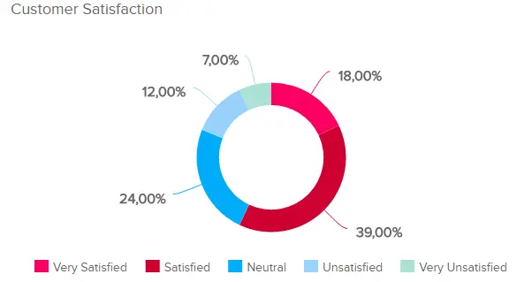
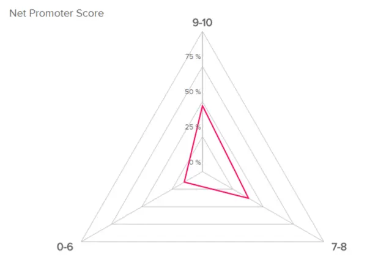
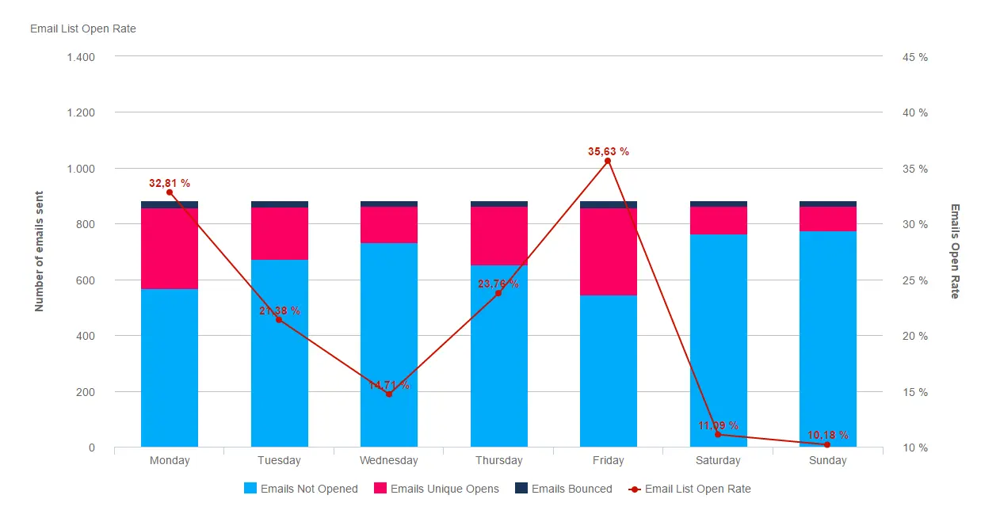
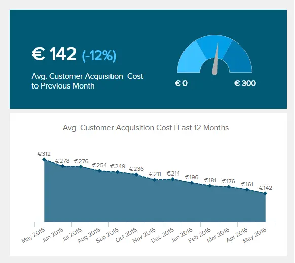
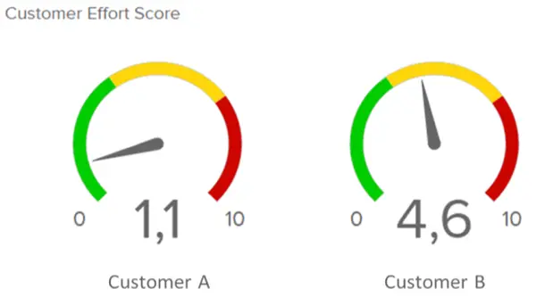

“每家公司最大的资产都是客户，因为没有客户就没有公司。”

您的客户是您业务的命脉。无论您是 B2B 还是 B2C，始终如一地满足客户的需求和期望将使一家具有上升轨迹的坚如磐石的公司与另一家失败的企业有所不同。有很多很多书籍和资源致力于如何改善您与客户的关系。然而，实际上衡量你与客户的关系并没有被谈论得那么多。我们决定需要为此做点什么，因为如果你能衡量你与客户的关系，那么改善它就会容易得多。在[DataFocus](https://www.datafocus.ai)，我们为使数据具有可操作性和易于理解而感到自豪。这就是为什么在本文中，我们将介绍与您的客户与您的业务关系相关的 7 个客户 KPI，帮助您制定定制的[KPI 仪表板](https://www.datafocus.ai/infos/best-kpi-dashboard-examples)。这些客户指标将提高您为客户提供服务的能力 - 但您应该选择哪些指标？

## 如何选择合适的客户指标

您应该选择最能准确反映您在核心业务模型上的执行情况的[KPI](https://www.datafocus.ai/infos/kpi-examples-and-templates)。

因此，如果您主要是一家通过冷电子邮件和推荐获得业务的 B2B SaaS 公司，那么使用推荐评级 （KPI #2）、终身客户价值 （KPI #4） 和客户获取成本 （KPI #5） 将很有意义。

或者，如果您是一家销售消费品的实体店，您可能希望关注整体客户满意度 （KPI #1） 和客户努力得分 （KPI #7）。

最后，如果您是一家电子商务商店，除了向电子邮件列表销售之外，还使用大量Google AdWords和Facebook广告来增加流量，那么您的结帐放弃率（KPI #6），客户获取成本（KPI #5）和电子邮件打开率（KPI #3）将是非常有用的KPI。

如果您当前没有跟踪任何这些 KPI，只需从跟踪 2-3 开始。这样你就不会被信息淹没 - 但你仍然可以做出更有效和数据驱动的决策。

## 1）客户满意度

这可能是有史以来最知名的客户 KPI - 即使是没有商业经验的消费者也是如此。几乎每个人都在客户支持电话或聊天结束时被问到：“您对自己的体验有多满意？

甚至应用程序现在也在这样做 - 他们会询问用户在使用应用程序时如何评价应用程序，然后将该评级转移到iOS或Google Play商店。客户满意度作为一个指标非常有用，因为非常简单。你实际上是在问这样一个问题：“你觉得和我们打交道怎么样？以下是您可以根据业务了解此 KPI 的几种方法：

- Asa 实体店，您可以在收据上放置指向网络调查的链接。
- 如果您是 SaaS 企业，则可以在用户浏览您的网站时弹出一个问题调查。
- 您只需通过电子邮件将调查发送给您的客户即可。

无论您选择什么，请确保通过忠诚度积分、折扣代码或参加抽奖活动来激励客户 - 否则几乎没有人会填写调查。给予奖励还可以使您的数据更加准确，否则只有真正愤怒或绝对欣喜若狂的客户才会回答您的问题，从而导致结果出现偏差。

## 2） 净推荐值

推荐是几乎任何企业中最好的营销形式之一。推荐不花钱，带来很多信任和信誉，并且是您的产品或服务真正为客户服务的标志。

那么，您如何确定客户向其他人推荐您的频率呢？您使用所谓的净推荐值。《哈佛商业评论》发现，随着净推荐值的提高，此客户 KPI 与更高的公司收入相关。

来源：sketchbubble.com

以下是计算净推荐值的方法，正如这篇有用的调查猴子文章所解释的那样。你通过最有效的机制问你的客户这个问题：“你向朋友或同事推荐我们的可能性有多大？您将响应分为 3 组：

- 0 – 6：批评者
- 7 – 8：被动
- 9-10： 发起人

然后你做这个等式：

（发起人数目——批评者数目）/（受访者数目）×100。

以下是查看此等式的其他一些方法：

净推荐值 = 推荐值百分比 - 占批评者百分比净推荐值 = （#Promoters/总回复者） - （#Detractors/回复者总数）

## 3）电子邮件列表打开率

\*\* 点击放大 \*\*

这个客户 KPI 很容易量化，因为它只是您打开的电子邮件除以您发送的总金额的比率。如果您在网上开展大量业务，您的电子邮件列表是您公司最大的资产之一。但是，即使您在实体零售店进行所有销售，电子邮件列表也可能是向客户推销的令人难以置信的方式。

话虽如此，如果您的客户都没有打开您的电子邮件，电子邮件营销效果不佳。考虑电子邮件打开率随时间的变化趋势比将公司的打开率与行业的一些通用“平均打开率”进行比较要好。如果您的电子邮件打开率一年前明显高于现在，那么这是一个值得关注的问题。是因为：

- 你的电子邮件主题和标题不好？
- 您没有使用可靠的电子邮件发件人？
- 您的电子邮件是否被电子邮件提供商视为垃圾邮件？
- 您没有在电子邮件本身中向客户提供有价值的内容/优惠，因此他们停下来打开它们？

这不是一个小问题。根据您的公司规模和电子邮件列表，打开率的小幅下降可能会对您的底线产生重大影响。

## 4）客户终身价值

此客户指标与 SaaS 公司特别相关，但它对任何类型的业务都很有用（尽管对于没有奖励计划的 B2C 实体公司来说可能很难跟踪）。我们将[客户终身价值](https://www.datafocus.ai/infos/kpi-examples-and-templates-sales#customer-lifetime-value) （CLV） 定义为“您希望在关系生命周期内从客户那里赚到的钱。

如果您是一家 SaaS 公司，逻辑很简单：一旦您获得了客户，您可以让他们付款的时间越长，您获得的利润就越多。但是，任何基于电子邮件营销的企业也可以充分利用 CLV 指标。

正如真正的电子邮件渠道专业人士所知，您将大部分利润来自购买漏斗中所有追加销售的铁杆粉丝。因此，找到更多方法来增加最佳客户的 CLV 可以直接转化为更好的利润率。

## 5） 获客成本

虽然此指标可能并不适用于所有实体店，但对于 B2B 企业和 SaaS 公司来说，[客户获取成本](https://www.datafocus.ai/infos/kpi-examples-and-templates-management#customer-acquisition-cost) （CAC） 是一个至关重要的客户指标。它表示您为登录新客户而投资的所有成本。

CAC和CLV也密切相关。假设您是一家SaaS公司，通过付费流量获得大量新潜在客户。由于在大多数付费流量平台上，您都在“竞标”点击，如果您的 CLV 高于竞争对手，您可以“负担得起”拥有比竞争对手更高的客户获取成本，同时仍然保持盈利。

但是，如果您处于业务的早期阶段，并且您的 CLV 还没有您希望的那么高，您可能需要寻找其他更便宜的流量来源，以降低您的 CAC 并保持您的现金流健康。

## 6）结账放弃率

\*\* 点击放大 \*\*

虽然此客户 KPI 对于任何具有在线销售流程的企业都很有用，但它主要适用于电子商务公司。当人们在没有结账（和付款）的情况下将商品放入购物车时，您将钱留在桌子上。平均结帐购物车放弃率相当高 - 根据专注于电子商务研究的Baymard研究所的数据，为69.23%。为什么客户会放弃购物车？

好吧，很多人只是在做在线版的“橱窗购物”。正如贝马尔德研究所所说：“......购物车放弃的很大一部分只是用户浏览电子商务网站的自然结果——许多用户将进行橱窗购物、价格比较、保存商品以备后用、探索礼品选择等。这些在很大程度上是不可避免的购物车和结账放弃。

但是，许多剩余的原因都在您的控制范围内，并在Baymard研究所的这张有用的图表中显示：

\*\* 点击放大 \*\*

## 7） 客户努力得分

对于SaaS公司和实体店来说，这是一个非常有用的指标。基本上，客户努力分数会询问您的客户从您的公司获得他们想要的东西有多容易。

如果你是一家SaaS公司，你需要有一个较低的客户努力分数 - 否则，用户会抱怨你的产品太难使用，他们会取消。如果您有一家零售店，您希望确保客户不会四处寻找合适的商品时感到沮丧。这里有一个问题要问：“在 1-10 的范围内，您在使用我们的产品时需要花费多少精力？或者对于零售店，“在 1-10 的范围内，今天找到你想要的东西有多难？

## 您应该跟踪的 7 个客户指标

- 客户稳定
- 净推荐值 （NPS）
- 电子邮件列表打开率
- 客户终身价值
- 客户获取成本

客户 KPI 对您的业务非常重要。如果您没有定期跟踪上述 7 个客户指标中的任何一个，现在是时候这样做了。您不需要跟踪所有这些 KPI，也可能不应该跟踪，因为随着时间的推移您可能会不知所措。因为这些 KPI 的真正价值不是来自一次性的“快照”，而是来自检查每个季度的趋势。要自动化此过程，利用专业的[CRM仪表板](https://www.datafocus.ai/infos/best-crm-dashboard-report-examples/)是有意义的。

归根结底，确保检查不同的 KPI 示例并选择与您的核心业务模型最相关的[示例](https://www.datafocus.ai/infos/kpi-examples-and-templates)，并使用这些数据来改善您的客户体验。
