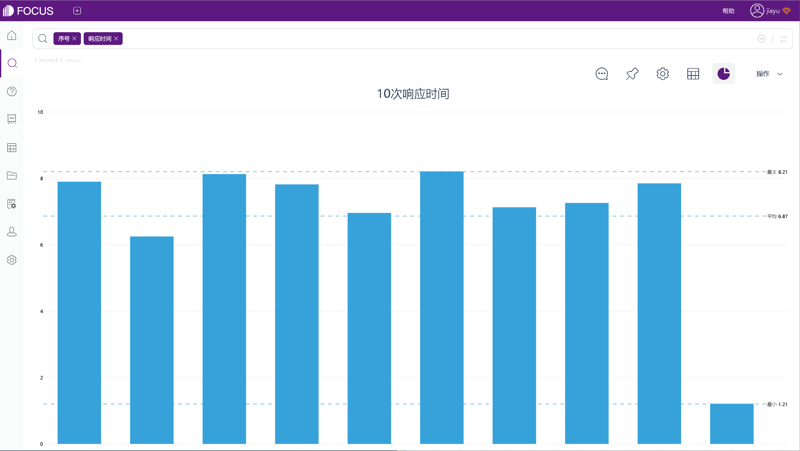
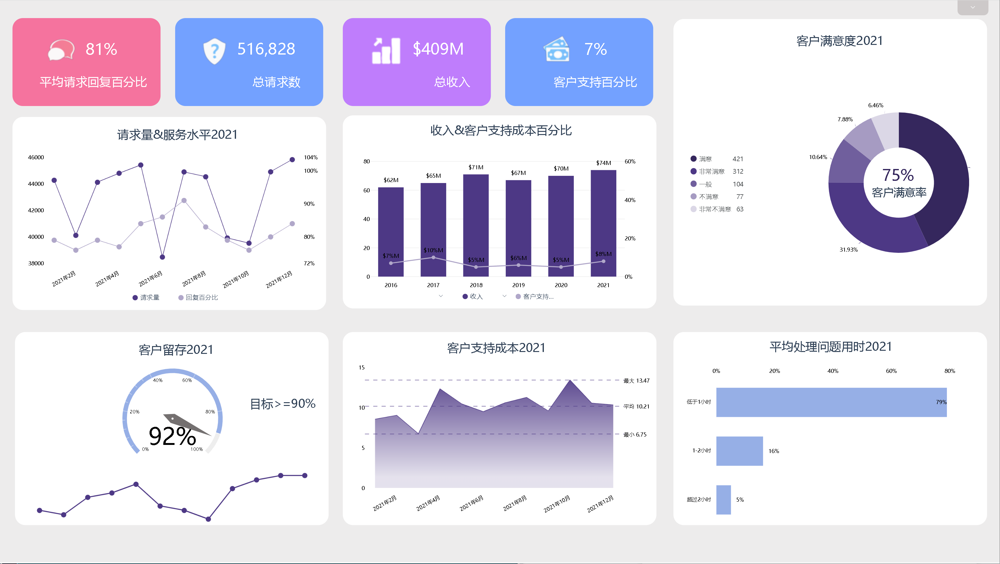

衡量客户服务指标的传统方法是跟踪平均值，例如使用平均回复时间或平均解决时间。但也有一些公司将首次响应时间作为服务水平协议 (SLA) 指标而非平均值来衡量。

本篇文章中，我们将了解服务团队如何选择 SLA 指标，并使用它们，来让整个团队提供更高质量的客户服务。

## **选择以持续时间为中心的客户支持指标**

有几种不同类型的客户支持 KPI，一些关注服务质量，一些强调支持量，而另一些则关注支持交互的持续时间。

**以持续时间为重点的客户支持 KPI 是作为 SLA 指标进行跟踪的最佳类型。**因为异常数据可能会让持续时间指标的平均值出现偏差，从而使你对客户所获得的服务质量产生错误印象。

为了说明这一现象，我们以一个包含 10 个响应时间的小数据集为例（数据来源：DataFocus）：

来源：DataFocus

该数据集的平均响应时间为**6.87小时**，而图中前九项的平均响应时间为**7.50小时**。最后一项严重影响了数据，将平均响应时间减少了**0.63小时**。

如果你的目标响应时间为7 小时，查看平均值时，你会认为你的支持团队已经实现了目标，但实际上 70% 的客户等待响应时间高于目标值，甚至有 20% 的客户等待时间超过 8 小时。

**跟踪平均值的另一个问题是可以人为地改进它们，而不会真正改善你的整体服务体验。**

例如，最后一个工单，如果你在1小时内回复了，而不是1.21小时，则你的平均响应时间会降至6.66小时。这种改进来自于对已快速处理的工单的加快响应，而不是通过改善你的整体工单体验。

**为了解决这类问题，一些支持团队可能会跟踪中位数。**

中位数较少受到异常值的影响，但它仍然隐藏了很多细节。例如，如果等待时间最长（超过8小时）的两位客户每人又额外等待6分钟，则平均响应时间增加到7.0小时，但中位数是不变的。

所以SLA 是一个能更清晰地表明客户是否得到了较差的服务的指标。为你的整体服务水平设定一个基线，并尽可能为更多的客户提供该水平的服务。就响应时间而言，这意味着你可以最大限度地减少等待时间过长的客户的数量。

## **定义你想要提供的服务级别**

一旦你选择了作为 SLA 跟踪的支持指标，你需要查看当前提供的服务级别，并确定你想要达到的级别。

由于数据中的异常值可能会使平均值有偏差，因此你必须仔细查看你的数据以了解当前的客户体验。

从数据中，你可以决定想要关注什么。例如，对于你的支持团队来说，是应该消除最慢的响应，减少等待响应时间超过 8 小时的客户数量；还是应该改善大多数客户的整体体验，增加在 7 小时内收到回复的客户比例。

使用当前的数据为你的响应时间设置基线目标。上文的数据中，有30% 的客户在 7 小时内收到回复，50% 的客户在 7.5 小时内收到回复。因此，若选择这两个时间范围作为目标，显然是不切实际的。

而80% 的客户在 8 小时内收到了回复。这个时间显然是一个更现实的目标，因为大多数客户已经受到了服务，但你仍有很大的改进空间。

## **跟踪获得该级别服务的客户百分比**

确定你希望有多少比例的客户获得你的基准服务水平。此目标可以帮助你为所有客户提供较一致的服务体验，而不是通过再次加快已经很快的响应来人为地提高平均水平。

你应该致力于为绝大多数客户提供该级别的服务，比如90%及以上的客户。通过为相同的指标设置不同的 SLA 来帮助你的团队不断改进，例如：

- 基准服务水平：在 8 小时内回复 95% 的客户
- 卓越的客户服务：在 7 小时内回复 50% 的客户

跟踪同一支持指标的多个 SLA 将帮助你更好地了解你所提供的客户服务水平，并帮助你不断改进目标。拥有基线 SLA 指标可以最大限度地减少从你那里获得低质量客户服务的客户数量。这意味着你的整个团队将专注于对所有客户实现该目标，而不是为少数客户优化支持体验。

第二层“卓越”服务，可以让你的团队朝着一个更大的目标努力，以更快的响应取悦客户。

我们建议不要针对 100% 的客户，因为总会有你无法控制的因素阻碍服务，例如工单的意外激增。

如果你百分之百实现了目标，那么最好设置一个更雄心勃勃的响应时间作为目标。

## **随着你的进步提高目标**

如果你一直在实现SLA目标，可以考虑提高基准。例如，你可以调整团队应提供的服务水平，调整接受此服务的客户比例，或同时调整这两点。

虽然当你的团队表现出色时，再显著提高 SLA 目标可能会很有诱惑力。例如，将基线响应时间目标从 小于8小时 缩短到 小于7小时。

但是，我们建议**从小的幅度开始调整，以便你的支持团队可以实现这些新目标。**

虽然你的最终目标是将响应时间缩短到 7 小时以内，但将其分解并进行较小的增量改进，而不是一次性实现大幅提升，通常更有效。

**在设定新目标时，请记住考虑可能影响团队工作量和绩效的其他因素，例如季节性需求、团队可用性的增加或减少以及新产品的发布。**

### **平均值与 SLA 指标：衡量支持绩效的最佳方法是什么？**

虽然SLA有助于确保服务的一致性，但平均值对于某些支持指标仍然很有帮助。像客户满意度得分这样的 KPI都有预定义的响应范围，因此它不会像基于持续时间的指标那样容易发生偏差。因此，虽然你不想将每个支持指标都作为 SLA 进行跟踪，但它们非常适合以持续时间为重点的KPI，相较于平均值，它们可以帮助你为更多客户提供更高质量的服务。

来源：DataFocus
