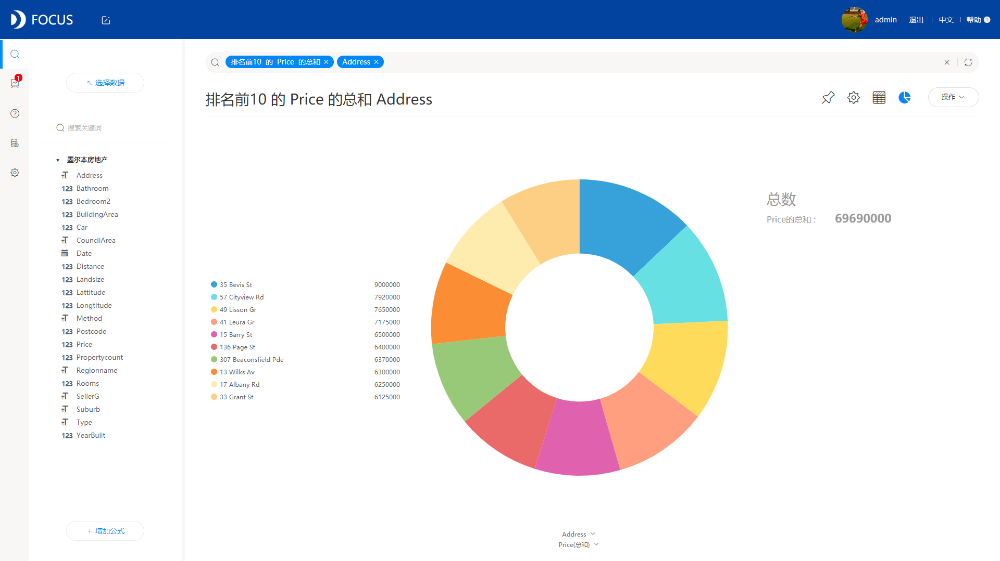
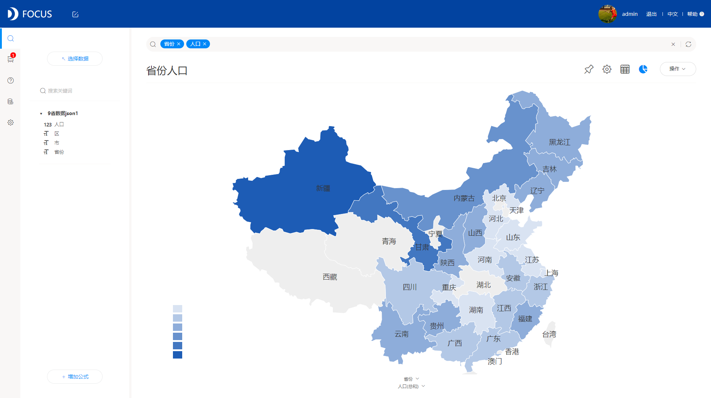

**玩转数据分析**

数据分析是什么？数据分析，就是使用大量数据、统计和定量分析、解释和预测以及基于事实的管理来推动决策过程与实现价值增长。现在的企业越来越重视数据分析，渴望从自身积累的海量数据中挖掘出潜在价值，推动业务增长，提高企业效益。

如何进行数据分析？如何玩转数据分析？这是大部分企业在实行数据分析时遇到的最大难关。这时候，很多企业都会考虑借助于数据分析工具，但是市场上数据分析工具多种多样，在选择时要注意选择实用的。作为过来人，我可以推荐一些我自己在工作中常用的，觉得还不错的数据分析工具，DataFocus就是我要推荐的一款分析工具。

为什么推荐DataFocus呢？它有什么突出的优势吗？DataFocus的优势还是挺大的，相比于其他采用拖拽的交互方式，DataFocus采用的是自创的搜索式，你没听错，就是像百度搜索一样的方式，用户搜索提问，系统图表回答，这种方式非常高效而且简单。另外DataFocus的实操性非常好，普通的业务人员学习数分钟后，也能独自快速地进行数据分析，这种优势会使企业在内部推广工具使用的时候会变得容易的多，数据分析成功率会变高。

而且其数据分析后的可视化展示，图表类型非常丰富，有柱状图、折线图、饼图这样的基础图形，也有组合图、桑基图、弦图、词云图等高级图形，基本满足企业的数据可视化展示需求。

弦图

位置图

数据分析，其实包含数据分析过程以及数据分析结果展示部分，DataFocus在这两方面做得都挺好，而要玩转数据分析，关键就是要找到一款好用的数据分析工具。
