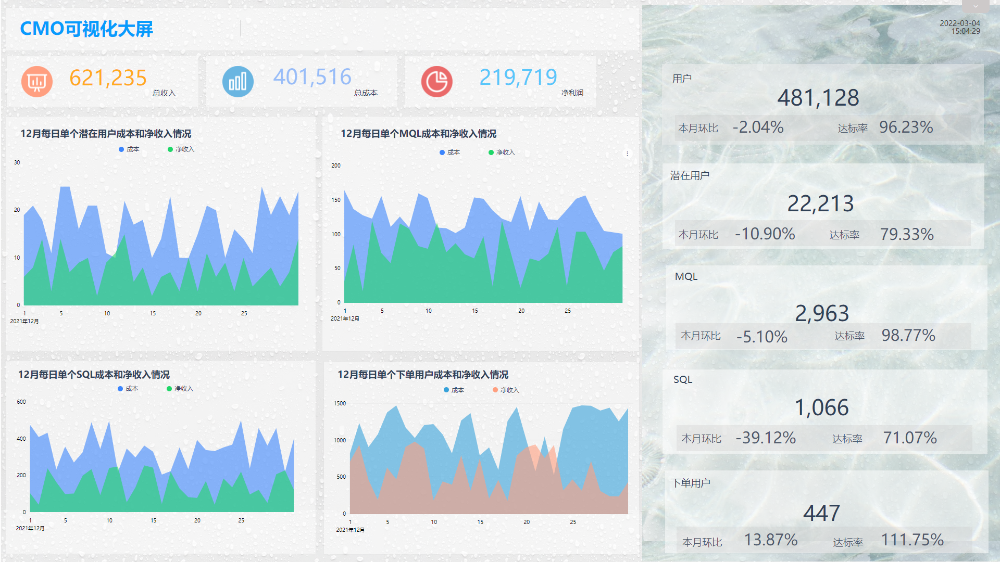

在当今时代，营销机构和部门必须通过电子表格和静态报告来管理大量数据，这些数据通常会导致信息混乱，甚至丢失有价值的信息。借助[在线数据分析](https://www.datafocus.ai/infos/40180.html)，您可以轻松创建最佳的营销仪表板，通过将所有营销绩效数据放入单个访问点，您能够与每个营销指标进行交互，并将有价值的见解转化为行动和结果。在[营销分析软件](https://www.datafocus.ai/infos/38171.html)的帮助下，您将能够最大限度地提高营销结果，并将所有数据清晰有效地呈现。

接下来将介绍3个专业的营销仪表板示例。

## **CMO可视化大屏示例**

点击此处查看大屏

[https://cloud001.datafocus.ai/1820110885/#/outside/pinboard/1820110885\_1y1WWUl2NHtxeq8jGt7n?name=CMO仪表盘](https://cloud001.datafocus.ai/1820110885/#/outside/pinboard/1820110885_1y1WWUl2NHtxeq8jGt7n?name=CMO仪表盘)

我们的第一个营销仪表板模板强调了为首席营销官 （CMO） 创建的高级指标的强大功能。营销主管通常没有时间进行研究，查看每个细节或监控低级KPI，例如展示广告系列的点击率。他们需要掌握所需的营销见解，以确保稳定的进展。这就是CMO仪表板创造机会的地方，我们将详细解释这一点。

我们创建的 CMO 仪表板模板旨在为营销主管提供一个概述，首先是否达到本月的目标。在顶部，您可以看到4个数字图表，显示本月的当前收入、成本和净收入。此外，您还可以通过显示当前数量的用户、潜在顾客、MQL（营销合格潜在顾客）、SQL（销售合格潜在顾客）和下单客户来获得营销漏斗的详细状态。对于每个[关键绩效指标示例](https://www.datafocus.ai/infos/37394.html)，您可以看到与上个月以及设定的每月目标相比的绩效。

之后，我们将这些指标描述得更详细，表示一段时间内各阶段单个用户的成本和净收入。每个指标都向我们显示了与上个月的比较。我们可以看到成本和净收入的视觉效果，在面积图中显示每日趋势。

这是C级管理的最佳营销仪表板之一，需要监视高级营销指标的战略成果，控制客户成本，并查看其生成的潜在客户的质量是否与其销售目标相对应。通过利用可交互、可自动更新的CMO仪表板，公司和代理商可以轻松提升其营销绩效。

## **营销绩效仪表板**

点击此处查看大屏

[https://cloud001.datafocus.ai/1820110885/#/outside/pinboard/1820110885\_xSZzBqK84hwHGJK9LpON?name=营销绩效仪表盘示例](https://cloud001.datafocus.ai/1820110885/#/outside/pinboard/1820110885_xSZzBqK84hwHGJK9LpON?name=营销绩效仪表盘示例)

此营销仪表板模板提供了所有不同营销渠道和广告系列中所有营销绩效数据的完美概述。这张大屏中重要的问题是：我们花了多少钱，我们为这次营销计划了什么？这就是为什么我们的营销报告仪表板首先衡量您的总成本与计划成本，以比较您的成本目标是否实际符合可行性。您可以一目了然地看到您是否达到了每个营销活动的营销预算。点击次数、转化次数和费用的总数提供了营销绩效数据的更详细概述，使您能够与此营销报告仪表板的每个部分进行交互并生成有价值的见解。

其次，营销活动效果信息中心会查看付费搜索广告系列的点击率 （CTR）。这是让客户注意到您并实际点击您的广告之间的连接步骤。比较每个广告系列或广告组的点击率并跟踪您投放广告的每个国家/地区的费率是有意义的，即使在相似的国家/地区，您也可以看到哪些有效，哪些无效。

接下来，我们将查看每次点击费用，这些费用也可以通过广告系列进行监控（请打开全屏链接以查看所有 KPI）。这对于同时处理多个帐户和广告系列的营销和广告代理商也非常有用，他们需要知道他们的钱花在哪里以及产生了什么样的结果。以易于理解的方式获得可操作的数据对于业务成功至关重要。这正是我们的营销活动仪表板所关注的。

最后，营销绩效仪表板中的每次转化成本 （CPA），通常被认为是此仪表板中最重要的 KPI。要回答"我们为新客户花了多少钱？"这个问题，取决于以简单且可定制的方式向您呈现此 KPI。此营销仪表板模板显示您需要的所有数据，以战略性地决定将宝贵的营销资金投入何处，以便能够最大化所有结果。

## **营销 KPI 仪表板**

点击此处查看大屏

[https://cloud001.datafocus.ai/1820110885/#/outside/pinboard/1820110885\_YbuWY8IGzbQtVOjrAcdg?name=营销KPI大屏](https://cloud001.datafocus.ai/1820110885/#/outside/pinboard/1820110885_YbuWY8IGzbQtVOjrAcdg?name=营销KPI大屏)

我们的营销KPI仪表板为您提供了最重要的营销KPI的概述，成本和收入统计数据。我们知道这些是对您的底线最重要的指标，因此将受到很多关注。请注意，虽然提高会话数量和提高点击率是件好事，但这些变化并不总是能带来更多的利润或更高的投资回报率（ROI）。因此，虽然营销KPI仪表板提供了成本和收入统计数据，但有时深入研究一下是值得的。

通常，您的首席执行官和投资者对推动业务发展的大局，底线和战略决策感兴趣。因此您需要将营销结果呈现给您的首席执行官或投资者，这正是我们的营销KPI仪表板为您所做的。它将所有相关的成本和收入统计信息汇总到一个位置，因此您可以轻松地从单个访问点将收入与营销工作相关联。

仪表板首先查看每次获取的成本，即获得新客户的成本。当然，您想知道哪些广告系列以最低价格获得了最多的客户，因此查看所有广告系列和渠道中的每次转化费用，了解如何以尽可能低的成本吸引最多的客户会很有用。这些数据也可以按一年中的每月进行分析，因此，如果您的用户在一年中的特定时段执行所需的操作，则可以轻松发现是否必须调整到季节性峰值。

我们还汇总了每次获取的收入和利润，以准确衡量您为每个客户赚了多少钱。同样，当您比较不同的渠道或广告系列以确定您的营销资金将来应该去哪里时，这些KPI是最有用的。这是您的首席执行官或投资者正在寻找的那种全局分析，此营销KPI仪表板将为您提供超越预期所需的必要数据和见解。

想要了解营销仪表板应该包括什么以及如何创建精心设计的视觉效果？不用担心！DataFocus提供了预置仪表板，您可以在两分钟内轻松设置自己想要的大屏效果。如果您想在所有营销流程中利用这些可视化大屏，您可以试用我们的软件进行14天试用，完全免费！
