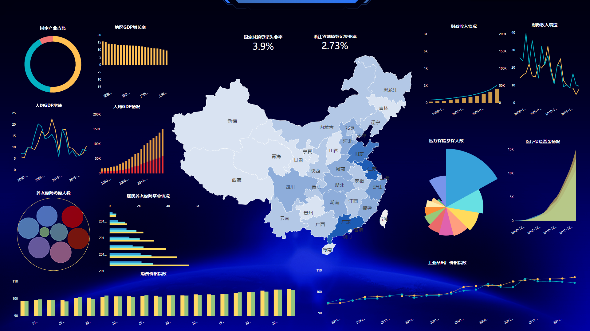

现如今信息化发展非常迅速，可视化大屏已经变得非常常见，在各个地方都可以看到，一般的可视化大屏，怎么酷炫怎么来，不太考虑大屏的布局排版，但我们要清楚，我们做大屏是为什么？是为了更好地将数据信息传递给看大屏的人，怎么样才能更好地传递，这其中就涉及到了布局排版，所以一个大屏，它的布局排版不能忽视。

如上图，怎么样的布局排版才算是合理的呢？以DataFocus中创建的可视化大屏为主。

1、分主题创建大屏。可视化大屏主要展示是企业的各项信息以及关键性指标，但是我们都知道，企业的数据信息不会很单一，比如企业的财务数据、销售业务数据、生产数据、人力资源数据等，这些都是不同方面的数据，所以首先，我们要创建不同主题的可视化大屏，例如销售大屏，财务大屏，人事大屏等。

2、布局要分主次。一个可视化大屏中一般都有主要信息和次要信息两个层次，主要信息反映核心业务，次要信息用于进一步阐述。所以在制作大屏时应给予不一样的侧重。主要信息相关图表一般放在更中心的位置，而次要信息一般围绕着其相关的主要信息，如下图。

3、大屏图表样式不要过多。图表样式过多，会显的大屏杂乱无章，一般在整个大屏中，柱状图所占的比例应该要大一点。

4、大屏的主题配色。大屏的整个背景建议用深色系，文字内容改成浅色、图表则选用稍微明亮一点的颜色，这样搭配可以有效避免视觉刺激。

按照这个套路，可以帮助你创建更合理的可视化大屏，不信你可以试试。
