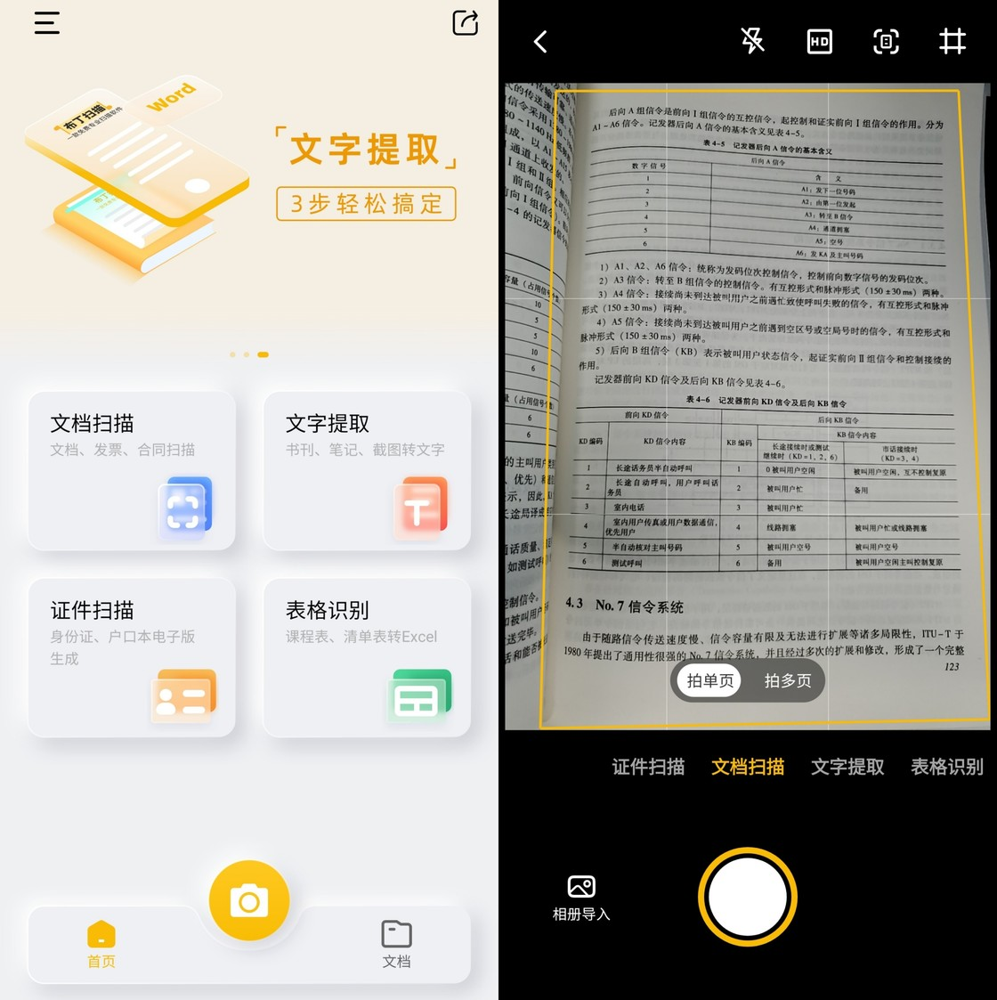
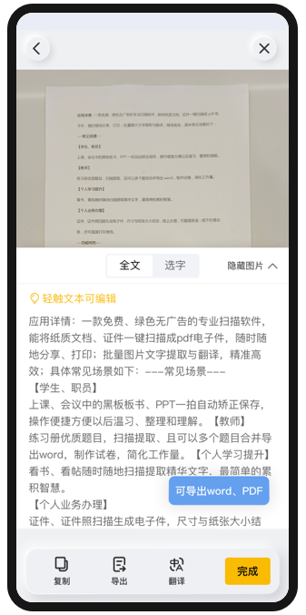

现在的国产软件其实已经比国外软件要好太多了，只是很少有人注意到。

今天分享的四款软件个个都是宝藏，能给你带来不少工作效率的提升。

### 1.布丁扫描

**免费无广告的扫描和OCR工具**

工作中常常需要扫描证件、文档等，将图片转换为文档。或者查找资料时，只看到了图片，需要提取其中的文字。如果亲手打字记录下来，效率就太低下了。这时候就需要用到文字扫描提取工具了。

现在市面上有很多这样的工具，要么是付费、有广告、分享有水印，要么就被放置到某工具集合软件里。而布丁扫描是一款免费又专业的文字扫描与识别软件，使用起来又轻巧又简易。

生活中有需要记录文字时，直接拍照保存即可。随后将保存好的图片导入布丁扫描中，快速识别文字，就能记录下来了。如果有错别字需要修改，则直接在编辑区域内修改。最后再导出为Word、PDF格式就完成了。

如果只是图片留存时，但凡拍的是电脑、电视屏幕，图片中一般都会有摩尔纹，非常影响图片美观。那么这款软件还可以一键消除摩尔纹，让图片增亮，提升图片画质。

总之，这款工具算得上是非常强大的国产工具了。如果有需要的话，可以至应用商店下载。

### 2.mysc.

**收集你记录的一切**

生活或者工作中常常需要记录下某些想法或者事情，但一般都会分散在各个软件应用里，就显得杂乱琐碎。集中收集在一个App里，不失为一种好办法。

mysc.就是一款可以帮助你记录下当下琐碎的灵感，并且汇集在这款app里。而灵感可以是一段文字、一段录音、一张图片，也可以是一个链接、一个地址。

使用起来就像发微博一样，记录下来的内容就成为了一张卡片。只不过这里面的内容只有你自己看得到，没有“猜你喜欢”的大数据推荐，这就是属于你自己的个人空间。

如果你觉得卡片和卡片之间是有关联的，你还可以按住卡片右侧的竖线，拖拽到另一张卡片上，组合成一张新的卡片。这样，你就可以轻松完成卡片内容的合并整合。

当然，如果觉得太多太乱，还可以创建类别，将这些卡片归类。比如建立”工作”类别，将工作相关的卡片都可以挪到这一类别中。

这个软件可以很好地帮助你养成记录的习惯，时不时有想法了就可以打开来记录。如果你本身就有发微博的习惯，那么这款软件相信你也会很快上手。

### 3.DataFocus

**集数据仓库和数据可视化于一身的搜索式BI平台**

工作中经常会需要和数据打交道，比如销售数据、项目数据等等。这些数据常常是数量多而且杂乱，一般分散在不同的地方。这时候就需要有一个“数据仓库”集中存储并统一管理这些工作中产生的大量数据。

DataFocus是一款搜索式数据分析可视化云BI平台，架构着云数仓，支持亿级数据存储管理。如果想进一步整理数据，你可以创建”项目”将数据按照不同类别进行分类，并且利用标签作以区分。

此外，其实大多数人处理数据还停留在Excel阶段，处理简单、少量的数据还行，但是数据一多，Excel往往就容易卡顿且操作繁琐，根本应付不过来。

这款软件则更快更轻松，不需要学习Sql、Python等代码知识，只需要像谷歌一样搜索关键词，系统就会在几秒内以可视化图表回应。

将制作好的图表放置于一张大屏中，还可以实现非常炫酷的效果。工作汇报、工作目标跟进，通通不在话下。

总的来说，DataFocus是一款良心的优质国产数据分析软件，由于软件学习门槛低、易使用，也很适合新手使用。这款软件企业协作版是付费的，但个人版是免费的，有需要的话可以马上使用起来。

### 4.章鱼快传

**跨平台文件传输工具**

工作中常常使用微信、QQ来传输文件，但是微信限制文件大小，而且还会自动帮你压缩文件。如果是图片或者视频，还影响到画质。

章鱼快传，就是一款跨平台文件传输工具，支持多个平台，不限制平台类型、不限制文件类型和大小，你甚至还能在Switch上接受文件。

可以说是非常强大的一款国产工具了，美中不足的是要收费，但好在费用不高。

### 小结

以上这四款软件都是国产的高质量软件，个个都很强大。

其实工具的使用也是个人能力的一部分。相信经常使用这些工具，对你的工作能力提升大有裨益。那么，你还有哪些软件也想要分享呢？欢迎评论区评论。
