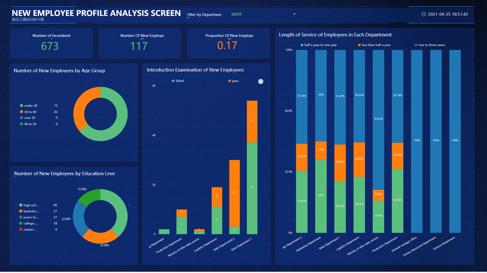

信息时代，什么都讲究效率。自助式BI的出现，轻易解决了企业困惑多年的难题，这是传统BI久久无法解决的。

传统BI与自助式BI，无论在前期建模，数据采集，数据分析，分析结果展示等各个方面，都有所不同，自助式BI能够加速企业的业务流程，很大程度上摆脱了对于IT部门的依赖，减轻了IT部门的负担压力，自助式BI的出现，意味着商业智能分析正在从“IT主导的开发报表模式”向“业务主导的自助分析模式”转变。

下图通过传统BI与自助式BI产品DataFocus的对比，我们可以了解到：

1、时效性。对于传统BI来说，其从最开始的数据准备、数据获取，都要花费超长的准备时间，但有时候业务部门的需求具有时效性，需要当下立刻做出分析，并给与业务部门分析结果，对于这点，传统BI无法做到。而自助式BI的出现，业务部门可以根据自己的需求，迅速的完成分析，并根据分析结果制定相应的措施或者策略，在这点上，自助式BI的时效性完胜传统BI。

2、操作性。传统BI其操作复杂，需要很多IT技术的支持，所以一般只面向IT部门的技术人员使用，这也造成了其时效性差的因素之一，因为IT技术人员在收到业务分析需求时，往往需要先花时间理解需求，理解了需求，才能进一步正确分析数据。自助式BI，此处以DataFocus为例，其操作非常简单，独有的搜索式分析，大大降低了BI工具的操作难度，就如谷歌搜索一样，在搜索框提问，系统会以图表的形式回答，而且能实时返回结果，快速高效且简单，这是传统BI无法做到的。

3、结果展示。传统BI的数据分析结果一般都以表格的形式展示，有时候数字繁多，无法从中迅速获取重点。DataFocus自助式BI，其拥有丰富的图形用来展示分析结果，每种不同的图形适用于不同的数据，从图形中我们可以直观的获取数据之间的规律以及所要突出的重点。

随着科技的发展，自助式BI会发展的越来越智能，操作越来越简单，功能越来越强大，到时候不管是数据处理、数据分析还是可视化，都将又是一翻新的局面。
